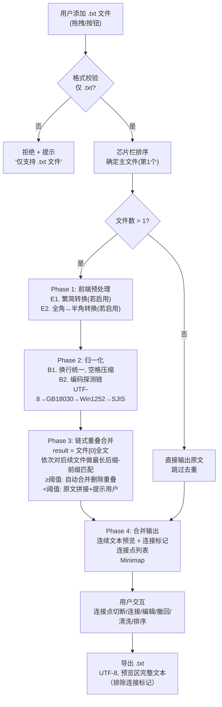
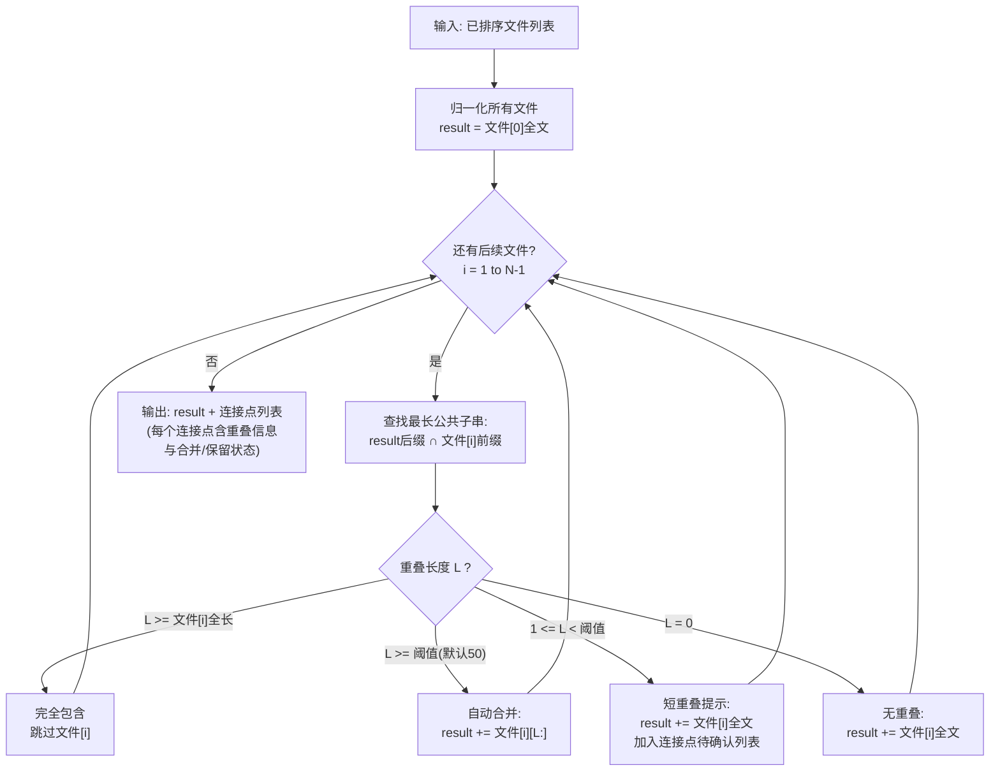
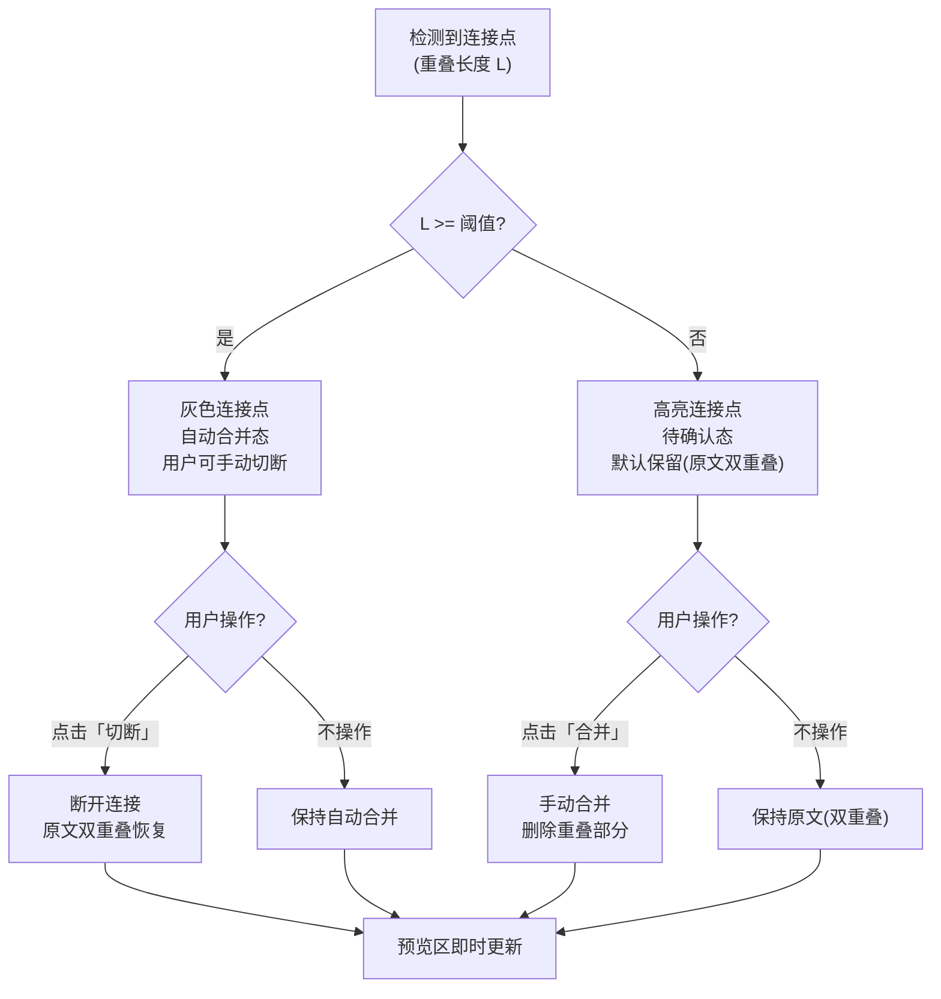
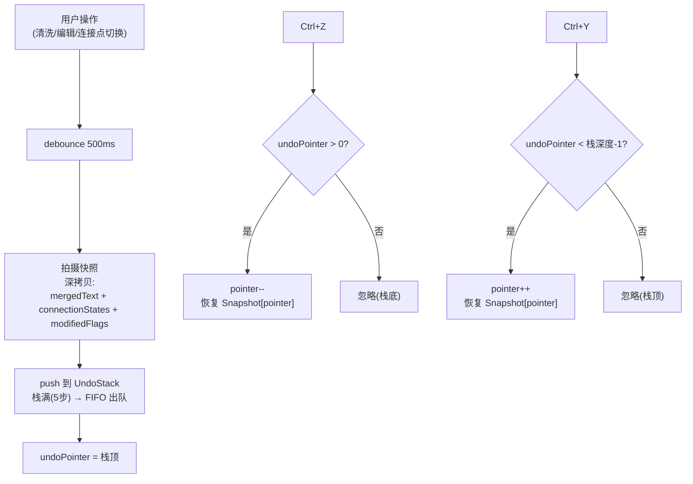
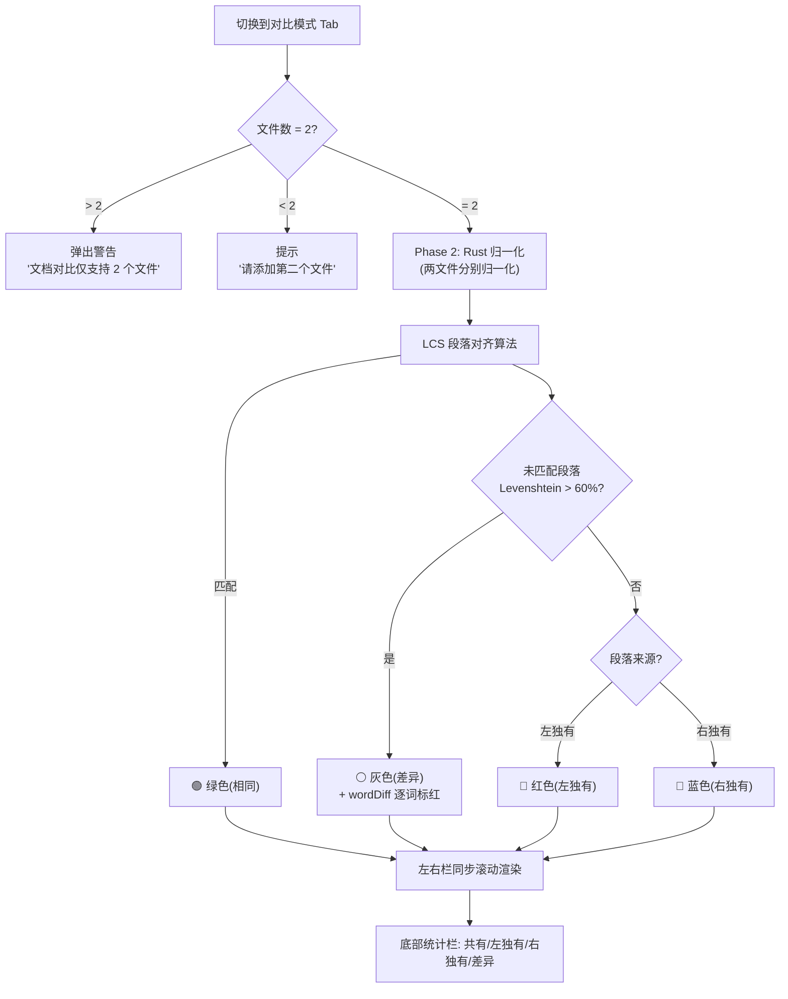

# 产品需求文档（PRD）— 文档终版确定器 Text Unifier V4.0

> **版本**: V4.0（项目重构版，基于 V1.0~V3.3 全量需求整合）
> **文档类型**: 标准化 PRD（6 章格式，适配架构设计 AI 输入）
> **目标平台**: Windows 10 / 11 / macOS 12+ / Linux
> **重构说明**: 删除章节工具模块（F）、排版增强模块（G）；内容清洗精简为繁简转换 + 全角半角转换

---

## 一、项目概述

### 1.1 核心目标

Text Unifier V4.0 是一款**完全离线的桌面工具**，基于 V1.0~V3.3 六代迭代重构。核心定位为：**多 TXT 文件合并去重、内容清洗、预览编辑、文档对比、一键导出**。

### 1.2 目标用户

| 用户角色 | 典型场景 | 核心需求 |
| :--- | :--- | :--- |
| 网文读者/整理者 | 多源 TXT 小说合并，去除重复章节 | 文件间去重、主文件完整保留、导出纯净 TXT |
| 文档编辑/校对 | 多版本文档对比差异 | 双栏对比、差异高亮、同步滚动 |
| 文本处理者 | TXT 文件繁简转换、全半角转换 | 双向切换、批量处理、离线操作 |

### 1.3 核心价值

- **100% 离线**：不上传任何数据，所有处理在本地完成
- **智能合并**：字符级链式重叠合并，自动拼接文件衔接处的重复内容，内部重复完整保留
- **可视化操作**：可编辑预览、拖拽排序、悬停溯源、Minimap 缩略图
- **完全可控**：连接点切断/连接、撤回/重做、文档对比，每一步都可审查可回退
- **跨平台兼容**：支持 Windows 10+、macOS 12+、Linux 主流发行版

---

## 二、核心功能清单

### 2.1 功能模块总览

| 模块 | 编号 | 功能点 | 功能说明 | 来源 |
| :--- | :--- | :--- | :--- | :---: |
| **A. 文件输入与排序** | A1 | 拖拽上传 | 从 OS 拖拽 .txt 文件到窗口，全窗口蓝色半透明遮罩提示 | V3.2 |
| | A2 | 按钮上传 | 点击 `+` 按钮打开文件选择对话框，支持多选 .txt | V3.2 |
| | A3 | 格式过滤 | 仅接受 `.txt` 扩展名，非 .txt 文件拒绝并提示「仅支持 .txt 文件」 | V3.2 |
| | A4 | 拖拽遮罩 | 拖入窗口 → 蓝色遮罩 + 「释放到此添加 TXT 文件」；非 .txt → 红色遮罩 + 「仅支持 .txt 文件」；拖出 → 遮罩消失 | V3.2 |
| | A5 | 芯片展示 | 文件以横向浮动芯片标签展示，芯片栏 40px 高，可横向滚动 | V3.2 |
| | A6 | 芯片信息 | 文件名（截断 20 字）+ 大小标签（自动格式化 B/KB/MB）+ 删除 × 按钮 | V3.2 |
| | A7 | 主文件标记 | 第 1 个芯片显示 ★ 主文件徽章（蓝色星标） | V3.2 |
| | A8 | 横向拖拽排序 | 芯片支持横向拖拽调整顺序，排序后自动触发重新分析 | V3.2 |
| | A9 | 芯片 Tooltip | 悬停文件名 300ms → Tooltip 显示完整文件名 | V3.2 |
| | A10 | 按钮布局 | `+` 按钮 36×36px 方形，置于芯片栏末尾，不折行不撑高 | V3.2 |
| **B. 合并引擎** | B1 | 文本归一化 | 统一换行符 → `\n`、连续空白符 → 单个空格、过滤控制字符（保留 `\n`）、过滤空行。所有文件在重叠检测前先归一化 | V1.0 |
| | B2 | 编码探测 | 探测链：UTF-8 → GB18030 → Windows-1252 → SHIFT-JIS；去除 BOM；全部失败则兜底 UTF-8 | V3.1 |
| | B3 | 链式重叠合并 | 字符级处理。首个文件完整保留作为起点，后续文件依次与当前合并结果做最长后缀-前缀匹配 | V4.0 |
| | B4 | 最长重叠匹配 | 对当前合并结果（后缀）与下一文件（前缀）查找最长公共子串（字符级） | V4.0 |
| | B5 | 自动合并 | 重叠长度 ≥ 用户设定阈值（默认 50 字符）→ 自动删除重叠部分，拼接后续内容 | V4.0 |
| | B6 | 完全包含跳过 | 重叠长度 ≥ 文件 i 全文长度 → 文件 i 完全被前面内容包含，跳过该文件 | V4.0 |
| | B7 | 短重叠提示 | 重叠长度 ∈ [1, 阈值-1] → 不删除，原文拼接 + 通知用户手动决定（可在连接点面板切换） | V4.0 |
| | B8 | 无重叠拼接 | 重叠长度 = 0 → 直接拼接全文，无删除 | V4.0 |
| | B9 | 主文件完整保留 | 排序后第一个文件内容完整保留（链式合并起点），文件顺序决定合并结果 | V4.0 |
| | B10 | 单文件场景 | 仅 1 个文件时直接输出原文，不触发合并逻辑 | V1.1 |
| **C. 连接点列表** | C1 | 连接点展示 | 左侧面板展示每对相邻文件的重叠信息：重叠文本 snippet + 文件对名称 + 重叠长度 | V4.0 |
| | C2 | 自动合并标识 | 重叠长度 ≥ 阈值 → 灰色底色 + 「已自动合并」标签 | V4.0 |
| | C3 | 待确认标识 | 重叠长度 < 阈值 → 高亮底色 + 「待确认(N字重叠)」标签 + 切换开关 | V4.0 |
| | C4 | 切换合并 | 用户点击待确认项的开关 → 切换该连接点的合并/保留状态，预览区即时更新 | V4.0 |
| | C5 | Tooltip | 悬停连接点 snippet 300ms → Tooltip 显示完整重叠文本 + 前后各 50 字上下文 | V4.0 |
| | C6 | 自动刷新 | 新增/删除/重排文件 → 连接点列表即时更新 | V4.0 |
| | C7 | 面板宽度 | 默认 280px，可拖拽调整（最小 200px，最大 500px） | V3.2 |
| | C8 | 空状态 | 单文件时显示「仅一个文件，无需合并」；无重叠时显示「✨ 所有文件连接处无重叠」 | 补充 |
| | C9 | 搜索覆盖 | 当用户在清洗面板执行搜索时，连接点列表暂时被搜索结果列表覆盖；清空搜索框或点击 × → 恢复连接点列表 | V4.0 |
| **D. 预览区** | D1 | 空间占比 | 预览区 min-width: 55% 窗口宽度，主位化布局 | V3.2 |
| | D2 | 连续文本展示 | 合并结果为连续可编辑文本区，非段落列表。各文件来源内容自然衔接 | V4.0 |
| | D3 | 连接标记 | 每处连接点插入可视标记（如 `┈┈ 连接 ┈┈`），区分自动合并(灰色)与待确认(高亮) | V4.0 |
| | D4 | 区域切断/连接 | 在连接标记处提供「切断」/「连接」按钮，用户可决定该处是否断开 | V4.0 |
| | D5 | Minimap | 右侧 30px 缩略图，2px 色条 + 1px 间距；悬停高亮预览，点击跳转。连接点处显示特殊标记色条 | V3.2 |
| | D6 | 悬停溯源 | 悬停文本任意位置 300ms → Tooltip 显示「来源：文件A」；连接点处显示「重叠区：文件A ↔ 文件B (N字重叠)」 | V3.2 |
| | D7 | Tooltip 跟随 | Tooltip 跟随鼠标 + 8px 偏移，不超出窗口边界 | V3.2 |
| | D8 | 可编辑 | 预览区可编辑，支持手动修改合并后的文本（含连接标记不可编辑） | V3.2 |
| | D9 | 底部状态 | 显示：总字符数 + 连接点数(自动N/待确认M) + 预估导出大小（UTF-8 字节数） | V2.0 |
| | D10 | 空状态 | 无文件时显示「拖拽 .txt 文件到此处或点击 + 按钮添加」 | 补充 |
| **E. 内容清洗** | E1 | 繁简双向转换 | 繁→简 / 简→繁 ToggleButton，引擎懒加载，首次点击提示「正在启动繁简引擎…」 | V3.1 |
| | E2 | 全角半角双向转换 | 全角→半角 / 半角→全角 ToggleButton，点击即转换，再点还原 | V3.1 |
| | E3 | 按钮状态 | 未转换：蓝色 `bg-blue-500` + 箭头 →；已转换：灰色 `bg-gray-500` + 箭头 ← | V3.1 |
| | E4 | 转换范围 | 仅作用于预览区已归一化的段落文本，不修改原始文件 | 补充 |
| | E5 | 搜索 | 输入关键词 → 预览区高亮所有匹配项（黄色底色），同时左侧连接点面板临时切换为搜索结果列表，展示每条匹配的上下文 snippet | V4.0 |
| | E6 | 替换 | 支持逐个替换或全部替换；替换后高亮更新；替换操作入撤回栈 | V4.0 |
| **H. 撤回栈** | H1 | 5 步深度 | UndoStack 最大 5 步，FIFO：第 6 次操作后最早快照出栈 | V3.2 |
| | H2 | Ctrl+Z/Y | Ctrl+Z 撤回 / Ctrl+Y 重做；栈空/栈顶时按键无效（不发错误） | V3.2 |
| | H3 | 深度指示 | 底部按钮显示「↶ 撤回(3/5)」「↷ 重做」，括号内为当前深度 | V3.2 |
| | H4 | 自动入栈 | 触发时机：清洗操作完成、手动编辑 blur、连接点切换（debounced 500ms） | V3.2 |
| | H5 | 导出不清空 | 导出后撤回栈保持，Ctrl+Z 仍可恢复至导出前状态 | V3.2 |
| | H6 | 还原按钮 | 导出按钮旁「↶ 还原」按钮，恢复至最近一次导出前的快照 | V3.2 |
| | H7 | 清空时机 | 仅「重新开始」按钮点击、拖入新文件替换时清空；模式切换不清空 | V3.2 |
| | H8 | 快照策略 | 深拷贝 mergedText + connectionStates + modifiedFlags | 补充 |
| **I. 文档对比** | I1 | 模式切换 | 标题栏下方 Tab：「🔗 合并去重」「📋 文档对比」 | V3.2 |
| | I2 | 2 文件限制 | 对比模式仅允许 2 个 .txt 文件；> 2 时弹出警告「文档对比仅支持 2 个文件」 | V3.2 |
| | I3 | LCS 段落对齐 | 最长公共子序列算法对两文件段落进行对齐 | V3.2 |
| | I4 | 相似度判定 | 未匹配段落用 Levenshtein 距离判定相似度（阈值 > 60%） | V3.2 |
| | I5 | 四色渲染 | 🟢绿色(相同) / 🔴红色(左独有) / 🔵蓝色(右独有) / ⚪灰色(差异) | V3.2 |
| | I6 | 词级差异高亮 | 差异段落内逐词标红（wordDiff 分词算法） | V3.2 |
| | I7 | 同步滚动 | 左右栏同步垂直滚动，滚动任一栏另一栏自动跟随 | V3.2 |
| | I8 | 统计栏 | 底部：「共有 N 段 | 左独有 M 段 | 右独有 K 段 | 差异 D 段」 | V3.2 |
| | I9 | 归一化复用 | 对比前复用 Phase 2 归一化管线（统一换行/空格） | V3.2 |
| | I10 | 单文件提示 | 仅 1 个文件 → 提示「请添加第二个文件以进行对比」 | 补充 |
| **J. 导出** | J1 | 导出格式 | 纯净 `.txt`，UTF-8 编码（带 BOM），`\r\n` 换行 | V1.0 |
| | J2 | 导出内容 | 导出当前预览区显示的完整文本（含用户编辑 + 连接点切断/连接状态），连接标记不导出 | V4.0 |
| | J3 | 预览一致 | 导出内容与预览区显示文本一致（排除连接标记），含清洗/编辑后的文字 | V2.0 |
| | J4 | 空导出保护 | 预览区无内容 → 提示「没有可导出的内容」 | V2.0.1 |
| | J5 | 文件名策略 | 默认文件名：第一个文件名 + `_merged.txt`；保存对话框由用户选择路径 | 补充 |
| | J6 | 快捷键 | Ctrl+S 触发导出 | V3.2 |
| | J7 | 快捷键 | Ctrl+H 唤起搜索替换面板 | V4.0 |
| **K. 平台与兼容性** | K1 | 运行时 | 完全离线运行，零外部依赖 | V3.0 |
| | K2 | 操作系统 | Windows 10 / 11 / macOS 12+ / Linux | V3.0 |
| | K3 | 完全离线 | 不发起任何网络请求，繁简转换字典内嵌打包 | V3.0 |
| | K4 | 安装权限 | 安装时可能需要管理员权限（取决于安装路径） | V3.0 |
| **L. 合并设置** | L1 | 重叠阈值配置 | 用户可设置自动合并的最小重叠字符数，默认 50。范围 10~500 字符，步长 10 | V4.0 |
| | L2 | 阈值持久化 | 用户修改阈值后持久保存，下次启动沿用 | V4.0 |
| | L3 | 阈值入口 | 设置项位于标题栏 [≡] 菜单 → 「合并设置」；或连接点面板顶部齿轮图标 | V4.0 |
| **M. 搜索替换** | M1 | 搜索框 | 清洗面板内嵌搜索输入框 + 搜索按钮（或 Ctrl+H 唤起） | V4.0 |
| | M2 | 高亮显示 | 预览区所有匹配关键词以黄色高亮底色标记；当前焦点匹配项以橙色高亮 | V4.0 |
| | M3 | 结果面板 | 搜索时左侧面板临时切换为搜索结果列表，显示每条匹配的上下文 snippet（前后各 15 字）+ 点击跳转 | V4.0 |
| | M4 | 逐个替换 | 「替换」按钮替换当前焦点匹配项 → 自动跳至下一匹配项 | V4.0 |
| | M5 | 全部替换 | 「全部替换」按钮一次性替换所有匹配项 → 显示「已替换 N 处」Toast | V4.0 |
| | M6 | 搜索统计 | 搜索框右侧显示「第 M/N 个」匹配计数 | V4.0 |
| | M7 | 大小写 | 提供「区分大小写」复选框（默认不区分） | V4.0 |
| | M8 | 替换入栈 | 每次替换操作（逐个/全部）入撤回栈，支持 Ctrl+Z 撤销 | V4.0 |

---

## 三、核心业务流程图

### 3.1 完整处理流水线



### 3.2 链式重叠合并算法（V4.0）



### 3.3 连接点决策流程



### 3.4 撤回/重做流程



### 3.5 文档对比流程



### 3.6 文件拖拽上传交互

```mermaid
flowchart TD
    DRAG["OS 文件拖入窗口"] --> COUNTER["dragEnterCounter++<br/>(防子元素误触发)"]
    COUNTER --> SHOW["DragOverlay 显示"]
    SHOW --> CHECK_EXT{"文件扩展名<br/>均为 .txt?"}
    CHECK_EXT -->|是| BLUE["蓝色遮罩<br/>'释放到此添加 TXT 文件'"]
    CHECK_EXT -->|否| RED_M["红色遮罩<br/>'仅支持 .txt 文件'"]
    BLUE --> WAIT1{"用户操作?"}
    RED_M --> WAIT2{"用户操作?"}
    WAIT1 -->|松开(drop)| PROCESS["处理文件列表<br/>去重已添加文件<br/>触发分析流水线"]
    WAIT1 -->|拖出(dragleave)| COUNTER_DEC["dragEnterCounter--"]
    WAIT2 -->|松开(drop)| REJECT["拒绝非 .txt<br/>+ Toast 提示"]
    WAIT2 -->|拖出(dragleave)| COUNTER_DEC
    COUNTER_DEC --> CHECK_ZERO{"counter === 0?"}
    CHECK_ZERO -->|是| HIDE["隐藏 DragOverlay"]
    CHECK_ZERO -->|否| WAIT1
    PROCESS --> HIDE
    REJECT --> HIDE
```

---

## 四、功能边界

### 4.1 本次实现（V4.0）

| 模块 | 功能范围 |
| :--- | :--- |
| A. 文件输入 | 拖拽/按钮上传 .txt、芯片展示排序、拖拽遮罩、文件格式校验 |
| B. 合并引擎 | 文本归一化、编码探测链、字符级链式重叠合并、最长后缀-前缀匹配、阈值自动合并、短重叠提示 |
| C. 连接点列表 | 连接点展示、自动合并/待确认标识、切换合并/保留、面板拖拽调整 |
| D. 预览区 | 连续文本编辑、连接标记、区域切断/连接、Minimap、悬停溯源 |
| E. 内容清洗 | 繁简双向转换、全角↔半角双向转换、文本搜索与替换（Ctrl+H） |
| H. 撤回栈 | 5 步 FIFO、Ctrl+Z/Y、导出不清空、还原按钮 |
| I. 文档对比 | LCS 段落对齐、四色渲染、词级差异、同步滚动、统计栏 |
| J. 导出 | 纯净 TXT(UTF-8)、预览区完整文本（排除连接标记）、Ctrl+S 快捷键 |
| K. 平台 | Windows 10+ / macOS 12+ / Linux、完全离线 |
| L. 合并设置 | 重叠阈值配置（默认50，范围10~500）、阈值持久化 |
| M. 搜索替换 | Ctrl+H 唤起、关键词高亮、逐个/全部替换、搜索结果面板覆盖连接点列表 |

### 4.2 本次不实现（V4.0）

| 类别 | 不实现内容 | 原因/备注 |
| :--- | :--- | :--- |
| 格式支持 | `.docx` / `.pdf` / `.epub` 等非 TXT 格式 | 定位为纯文本工具 |
| 语义匹配 | 近似语义匹配、NLP 理解、同义词检测 | 严格字符串匹配，不做语义 |
| 段落级去重 | 段落 Hash 比对、重复段落勾选排除 | V4.0 改为字符级重叠合并 |
| 富文本 | 保留字体/颜色/加粗等格式 | 仅处理纯文本 |
| 内容改写 | AI 润色、摘要、翻译 | 仅操作换行符和格式，不改内容 |
| 章节工具 | 章节识别、章节排序、章节提取 | V4.0 删除（原模块 F） |
| 排版增强 | 段落合并/拆分、诗歌检测、列表识别 | V4.0 删除（原模块 G） |
| 对比合并 | 对比模式输出合并结果 | 仅展示差异，不做合并 |
| 行级 diff | 对比模式行级差异（非段落级） | 仅段落级 LCS |
| 持久化 | 撤回栈/应用状态持久化到磁盘 | 刷新后清空 |
| 在线服务 | 云端同步、在线翻译、联网校验 | 完全离线 |
| 多语言 UI | 界面国际化 | 仅中文界面 |

---

## 五、验收标准

### 5.1 模块 A：文件输入与排序

| 编号 | 验收项 | 前置条件 | 操作 | 预期结果 |
| :--- | :--- | :--- | :--- | :--- |
| AC-A01 | 拖拽上传 .txt | 窗口打开 | 从 OS 拖拽 1+ 个 .txt 到窗口 | 蓝色遮罩显示 → 松开后文件添加成功，芯片栏显示 |
| AC-A02 | 拖拽拒绝非 .txt | 窗口打开 | 从 OS 拖拽 .png 到窗口 | 红色遮罩显示 + 「仅支持 .txt 文件」提示 |
| AC-A03 | 按钮上传 | 窗口打开 | 点击 + 按钮，选择 3 个 .txt | 3 个文件添加成功，芯片栏显示 |
| AC-A04 | 拖出取消 | 蓝色遮罩显示中 | 将文件拖出窗口 | 遮罩消失，文件不添加 |
| AC-A05 | 芯片信息 | 已添加 3 个文件 | 查看芯片栏 | 每个芯片显示：图标+文件名(截断20字)+大小+删除× |
| AC-A06 | 主文件标记 | 已添加 2 个文件 | 查看第 1 个芯片 | 显示 ★ 蓝色星标徽章 |
| AC-A07 | 芯片 Tooltip | 已添加长文件名文件 | 悬停文件名 300ms | Tooltip 显示完整文件名 |
| AC-A08 | 拖拽排序 | 已添加 3 个文件 | 横向拖拽第 3 个芯片到第 1 位 | 排序成功 + 自动触发重新分析 |
| AC-A09 | 删除文件 | 已添加 2 个文件 | 点击芯片 × 按钮 | 文件删除，芯片消失，分析结果更新 |
| AC-A10 | 重复文件 | 已添加 A.txt | 再次添加 A.txt | 忽略重复，Toast 提示「文件已存在」 |

### 5.2 模块 B：合并引擎

| 编号 | 验收项 | 前置条件 | 操作 | 预期结果 |
| :--- | :--- | :--- | :--- | :--- |
| AC-B01 | 空格容错 | A="Hello  World" / B="Hello World" | 添加 A + B | 归一化后 A 末尾与 B 开头无重叠，原文拼接 |
| AC-B02 | 换行容错 | A="Line1\nLine2" / B="Line1\r\nLine2" | 添加 A + B | 归一化后边界正确匹配 |
| AC-B03 | 控制字符过滤 | 文本含 `\r`、`\t`、零宽空格、BOM | 添加文件 | 控制字符被过滤/替换，BOM 去除 |
| AC-B04 | 基本重叠合并 | A="ABCDEF" / B="FGHABIJKCDL" | 添加 A + B | 合并为 "ABCDEFGHABIJKCDL"（仅删边界 `F`） |
| AC-B05 | 完全包含跳过 | A="ABCDEFGHI" / B="DEF" | 添加 A + B | B 完全被 A 包含，跳过 B |
| AC-B06 | 无重叠拼接 | A="ABC" / B="XYZ" | 添加 A + B | 合并为 "ABCXYZ"，无删除 |
| AC-B07 | 单文件 | 仅添加 1 个文件 | 查看预览 | 直接输出原文 |
| AC-B08 | 超过阈值自动合并 | A(末尾50字)=B(开头50字)，阈值=50 | 添加 A + B | 自动删除重叠，连接点显示灰色「已自动合并」 |
| AC-B09 | 低于阈值提示 | A(末尾5字)=B(开头5字)，阈值=50 | 添加 A + B | 不删除，连接点显示高亮「待确认(5字重叠)」 |
| AC-B10 | 编码探测 | 添加 GBK 编码文件 | 添加文件 | 正确解码为中文，无乱码 |
| AC-B11 | 全失败兜底 | 添加二进制文件(伪装 .txt) | 添加文件 | 兜底 UTF-8 解码 |
| AC-B12 | 空文件 | 添加 0 字节 .txt | 添加文件 | 正常处理，预览区显示空，不报错 |
| AC-B13 | 多文件链式合并 | A="ABC" / B="BCD" / C="CDE" | 添加 A+B+C | 合并为 "ABCDE"（两次边界重叠） |
| AC-B14 | 最长匹配 | A="ABABA" / B="ABAC" | 添加 A + B | 合并为 "ABABAC"（最长重叠 "ABA"=3字） |

### 5.3 模块 C：连接点列表

| 编号 | 验收项 | 前置条件 | 操作 | 预期结果 |
| :--- | :--- | :--- | :--- | :--- |
| AC-C01 | 连接点展示 | 2 文件有 1 处 50+ 字重叠 | 查看左侧面板 | 显示 1 个连接点，含 snippet + 文件对 + 重叠长度 + 「已自动合并」 |
| AC-C02 | 自动合并标识 | 重叠 ≥ 阈值 | 查看连接点 | 灰色底色 + 「已自动合并」标签 |
| AC-C03 | 待确认标识 | 重叠 < 阈值 | 查看连接点 | 高亮底色 + 「待确认(N字重叠)」标签 + 切换开关 |
| AC-C04 | 切换合并 | 连接点为待确认态 | 点击开关切换为合并 | 预览区从原文双重叠变为合并态，标记更新 |
| AC-C05 | Tooltip | 有连接点 | 悬停 snippet 300ms | 显示完整重叠文本 + 前后各 50 字上下文 |
| AC-C06 | 文件删除刷新 | 有 2 个连接点 | 删除 1 个文件 | 连接点列表更新 |
| AC-C07 | 空状态-单文件 | 仅 1 个文件 | 查看左侧面板 | 「仅一个文件，无需合并」 |
| AC-C08 | 空状态-无重叠 | 2 文件无任何重叠 | 查看左侧面板 | 「✨ 所有文件连接处无重叠」 |
| AC-C09 | 面板拖拽 | 连接点面板 280px | 拖拽右边缘 | 宽度在 200px~500px 间调整 |

### 5.4 模块 D：预览区

| 编号 | 验收项 | 前置条件 | 操作 | 预期结果 |
| :--- | :--- | :--- | :--- | :--- |
| AC-D01 | 空间占比 | 窗口 1400px 宽 | 查看预览区 | 预览区宽度 ≥ 770px（55%） |
| AC-D02 | 连续文本展示 | 已添加 2 个文件 | 查看预览区 | 合并结果为连续文本，非段落列表 |
| AC-D03 | 连接标记 | 合并后有连接点 | 查看预览区 | 连接处显示 `┈┈ 连接 ┈┈` 标记；自动合并=灰色，待确认=高亮 |
| AC-D04 | 切断按钮 | 连接标记处 | 点击「切断」 | 连接处断开，原文双重叠恢复 |
| AC-D05 | 连接按钮 | 已切断的连接点 | 点击「连接」 | 恢复合并态，重叠删除 |
| AC-D06 | Minimap | 有 500+ 字 | 查看右侧 | 30px 宽 Minimap，连接点处显示特殊标记色条 |
| AC-D07 | Minimap 跳转 | Minimap 显示 | 点击 Minimap 某位置 | 预览区滚动到对应位置 |
| AC-D08 | 悬停溯源 | 文本来自 A.txt | 悬停文本 300ms | Tooltip:「来源：A.txt」；连接点处显示「重叠区：A ↔ B (N字重叠)」 |
| AC-D09 | 可编辑 | 预览区显示 | 双击文本修改 | 文字修改成功，blur 后触发入栈 |
| AC-D10 | 连接标记不可编辑 | 连接标记存在 | 尝试编辑标记 | 连接标记不可被编辑或删除 |
| AC-D11 | 底部状态 | 有 2 连接点(1自动1待确认) | 查看底部 | 「总 1,234 字 | 连接点 2 (自动1/待确认1) | 预估 1.2 KB」 |
| AC-D12 | 空状态 | 无文件 | 查看预览区 | 「拖拽 .txt 文件到此处或点击 + 按钮添加」 |

### 5.5 模块 E：内容清洗

| 编号 | 验收项 | 前置条件 | 操作 | 预期结果 |
| :--- | :--- | :--- | :--- | :--- |
| AC-E01 | 繁→简 | 预览含 "繁體中文" | 点击「繁→简」按钮 | 转为 "繁体中文"，按钮变灰色「简→繁」 |
| AC-E02 | 简→繁 | 预览含 "简体中文" | 点击「简→繁」按钮 | 转为 "簡體中文"，按钮变灰色「繁→简」 |
| AC-E03 | 全角→半角 | 预览含 "ＡＢＣ" | 点击「全→半」按钮 | 转为 "ABC"，按钮变灰色「半→全」 |
| AC-E04 | 半角→全角 | 预览含 "abc" | 点击「半→全」按钮 | 转为 "ａｂｃ"，按钮变灰色「全→半」 |
| AC-E05 | 双向可逆 | 转换 2 次 | 点「繁→简」→「简→繁」 | 恢复原文（精确可逆） |
| AC-E06 | 懒加载提示 | 首次点击繁简 | 点击「繁→简」 | Toast「正在启动繁简引擎…」→ 转换完成 |
| AC-E07 | 清洗可撤回 | 转换后 | 按 Ctrl+Z | 恢复至转换前文本 |
| AC-E08 | 关键词搜索 | 预览含 "Hello" 3 处 | 搜索 "Hello" | 预览区 3 处黄色高亮，左侧面板切换为搜索结果列表，显示 3 条上下文 |
| AC-E09 | 逐个替换 | 搜索 "Hello" → 3 处高亮 | 点击「替换」× 2 | 前 2 处替换为 "Hi"，焦点自动跳至第 3 处 |
| AC-E10 | 全部替换 | 搜索 "Hello" → 3 处高亮 | 点击「全部替换」 | 3 处全部替换，Toast「已替换 3 处」 |
| AC-E11 | 替换可撤回 | 全部替换后 | 按 Ctrl+Z | 恢复至替换前文本 |
| AC-E12 | 搜索覆盖面板 | 搜索中，左侧为搜索结果 | 清空搜索框 | 左侧面板恢复为连接点列表 |
| AC-E13 | 大小写敏感 | 预览含 "Hello" 和 "hello" | 勾选「区分大小写」搜 "Hello" | 仅高亮 "Hello"，共 1 处 |

### 5.6 模块 H：撤回栈

| 编号 | 验收项 | 前置条件 | 操作 | 预期结果 |
| :--- | :--- | :--- | :--- | :--- |
| AC-H01 | Ctrl+Z 撤回 | 编辑后 | 按 Ctrl+Z | 恢复至编辑前状态，「撤回(1/5)」 |
| AC-H02 | Ctrl+Y 重做 | Ctrl+Z 后 | 按 Ctrl+Y | 恢复至编辑后状态 |
| AC-H03 | 5 步深度 | 操作 6 次 | 按 Ctrl+Z × 6 | 第 6 次无效(仅保留最近 5 步) |
| AC-H04 | 导出不清空 | 有 3 步历史 | 导出 → Ctrl+Z | 仍可撤回至导出前状态 |
| AC-H05 | 还原按钮 | 导出后 | 点击「↶ 还原」 | 恢复至导出前快照 |
| AC-H06 | 新文件清空 | 有历史栈 | 拖入新文件(替换) | 撤回栈清空，深度归零 |
| AC-H07 | 模式切换 | 合并模式下有历史 | 切换到对比模式 | 撤回栈保留（仅切换显示） |

### 5.7 模块 I：文档对比

| 编号 | 验收项 | 前置条件 | 操作 | 预期结果 |
| :--- | :--- | :--- | :--- | :--- |
| AC-I01 | 模式切换 | 在合并模式 | 点击「📋 文档对比」Tab | 切换成功，显示对比视图 |
| AC-I02 | 2 文件限制 | 已添加 3 个文件 | 切换到对比模式 | 弹出警告「文档对比仅支持 2 个文件」 |
| AC-I03 | 相同段落 | 两文件有相同段 | 查看对比 | 🟢 绿色背景 |
| AC-I04 | 左独有 | 仅左文件有 | 查看对比 | 🔴 红色背景 + 红色左边框 |
| AC-I05 | 右独有 | 仅右文件有 | 查看对比 | 🔵 蓝色背景 + 蓝色左边框 |
| AC-I06 | 差异段落 | 两文件有相似段 | 查看对比 | ⚪ 灰色背景 + 差异词标红 |
| AC-I07 | 同步滚动 | 对比视图 | 滚动左栏 | 右栏同步滚动到相同比例位置 |
| AC-I08 | 统计栏 | 对比完成 | 查看底部 | 「共有 85 段 | 左独有 3 段 | 右独有 5 段 | 差异 2 段」 |
| AC-I09 | 单文件提示 | 仅 1 个文件 | 查看对比 | 「请添加第二个文件以进行对比」 |

### 5.8 模块 J：导出

| 编号 | 验收项 | 前置条件 | 操作 | 预期结果 |
| :--- | :--- | :--- | :--- | :--- |
| AC-J01 | 导出内容 | 2 文件合并（含连接标记） | 导出 | 文件含合并后全文，UTF-8 编码，连接标记不导出 |
| AC-J02 | 预览一致 | 编辑 + 清洗后 | 导出 | 导出内容与预览区显示文本一致（排除连接标记） |
| AC-J03 | 空导出 | 预览区无内容 | 导出 | Toast「没有可导出的内容」 |
| AC-J04 | Ctrl+S | 预览有内容 | 按 Ctrl+S | 触发导出保存对话框 |

### 5.9 模块 K：平台

| 编号 | 验收项 | 前置条件 | 操作 | 预期结果 |
| :--- | :--- | :--- | :--- | :--- |
| AC-K01 | Win10 启动 | Windows 10 | 双击 .exe | 启动成功，功能正常 |
| AC-K02 | macOS 启动 | macOS 12+ | 双击 .app | 启动成功，功能正常 |
| AC-K03 | Linux 启动 | Linux（AppImage/deb） | 双击启动 | 启动成功，功能正常 |
| AC-K04 | 离线功能 | 断网状态 | 所有功能操作 | 全部正常，无网络错误 |

### 5.10 模块 L：合并设置

| 编号 | 验收项 | 前置条件 | 操作 | 预期结果 |
| :--- | :--- | :--- | :--- | :--- |
| AC-L01 | 默认阈值 | 首次启动 | 查看设置 | 重叠阈值为 50 |
| AC-L02 | 阈值修改生效 | 阈值为 50 | 改为 30 → 重新合并 | 5 字重叠原来为「待确认」变为「已自动合并」 |
| AC-L03 | 阈值持久化 | 阈值为 30 | 重启应用 | 阈值仍为 30 |
| AC-L04 | 阈值范围 | 设置页面 | 输入 5 或 600 | 拒绝并提示「阈值范围 10~500」 |

### 5.11 模块 M：搜索替换

| 编号 | 验收项 | 前置条件 | 操作 | 预期结果 |
| :--- | :--- | :--- | :--- | :--- |
| AC-M01 | Ctrl+H 唤起 | 预览有内容 | 按 Ctrl+H | 清洗面板搜索框获得焦点，左侧面板切换为搜索结果 |
| AC-M02 | 搜索高亮 | 预览含 "text" 5 处 | 搜索 "text" | 预览区 5 处黄色高亮，当前焦点项橙色高亮 |
| AC-M03 | 结果面板 | 搜索 "text" → 5 处 | 查看左侧面板 | 显示 5 条搜索结果，每条含上下文 snippet + 点击跳转 |
| AC-M04 | 结果跳转 | 搜索结果面板显示 | 点击第 3 条结果 | 预览区滚动并聚焦第 3 处匹配项 |
| AC-M05 | 搜索统计 | 搜索 "text" → 5 处 | 查看搜索框右侧 | 显示「第 1/5 个」 |
| AC-M06 | 全部替换 | 搜索 "text" → 5 处 | 点击「全部替换」 | 5 处替换 + Toast「已替换 5 处」+ 高亮消失 |
| AC-M07 | 逐个替换 | 搜索 "text" → 3 处 | 点击「替换」× 3 | 逐处替换，统计更新「第 N/3 个」→「已全部替换」 |
| AC-M08 | 替换入栈 | 替换后 | 按 Ctrl+Z | 恢复至替换前文本 |
| AC-M09 | 面板恢复 | 搜索结果显示中 | 清空搜索框或点击 × | 左侧面板恢复为连接点列表 |
| AC-M10 | 大小写 | 预览含 "Text" 和 "text" | 勾选区分大小写搜 "Text" | 仅高亮 "Text"，共 1 处 |
| AC-M11 | 无匹配 | 预览无 "xyz" | 搜索 "xyz" | 预览区无高亮，结果面板显示「未找到匹配项」 |

---

## 六、非功能需求

### 6.1 性能需求

| 指标 | 要求 | 说明 |
| :--- | :--- | :--- |
| 单文件大小上限 | ≤ 200MB | 超过时 Toast 警告「文件过大(>200MB)，可能导致性能下降」，仍允许添加 |
| 最大文件数 | ≤ 50 个 | 超过时拒绝并提示「最多支持 50 个文件」 |
| 合并处理时间 | ≤ 30s（10 文件 × 10MB） | 处理期间显示进度 Spinner + 「正在合并…」 |
| 预览渲染 | ≤ 5000 段落流畅滚动 | 超过时启用虚拟滚动降级策略 |
| 首屏加载 | ≤ 3s | 应用启动到可交互 |
| 内存占用 | ≤ 500MB（常规使用） | 10 文件 × 10MB 场景 |

### 6.2 安全需求

| 指标 | 要求 |
| :--- | :--- |
| 数据隐私 | 100% 离线，不发起任何网络请求；所有文本处理在本地完成 |
| 文件访问 | 仅读取用户主动添加的 .txt 文件；不访问其他路径或文件类型 |
| 依赖审计 | 繁简转换字典内嵌打包，无运行时外部下载；仅加载本地资源 |
| 内容安全 | 不修改原始文件，仅写入用户指定的导出路径 |
| 进程隔离 | 渲染进程沙箱隔离，无系统级权限 |

### 6.3 兼容性需求

| 指标 | 要求 |
| :--- | :--- |
| Windows | 10 / 11（x64） |
| macOS | 12+（x64 / arm64） |
| Linux | 主流发行版（x64，AppImage / deb） |
| 编码支持 | UTF-8、UTF-16 LE/BE、GB18030/GBK/GB2312、Windows-1252、SHIFT-JIS |
| 文件扩展名 | 仅 `.txt`（大小写不敏感：.txt / .TXT） |

### 6.4 可靠性需求

| 指标 | 要求 |
| :--- | :--- |
| 错误处理 | 文件读取失败 → Toast 提示 + 跳过该文件，不影响其他文件 |
| 核心引擎 | 核心引擎加载失败 → 启动时弹窗「核心引擎加载失败，请重新安装」，阻止进入主界面 |
| 磁盘空间 | 导出路径磁盘不足 → Toast「磁盘空间不足，无法导出」 |
| 崩溃恢复 | 应用崩溃 → 下次启动不自动恢复状态（无持久化设计） |

### 6.5 可用性需求

| 指标 | 要求 |
| :--- | :--- |
| 界面语言 | 简体中文 |
| 快捷键 | Ctrl+Z(撤回)、Ctrl+Y(重做)、Ctrl+S(导出)、Ctrl+A(全选)、Shift+Click(多选) |
| Tooltip 延迟 | 300ms（悬停触发） |
| 响应式 | ≥1400px 三栏 / 1024-1399px 两栏 / <1024px 单栏 |

---

*本文档为 Text Unifier V4.0 标准化 PRD。所有补充内容（标注「补充」的条目）基于 V4.0 原版 PRD 审查补全。*
