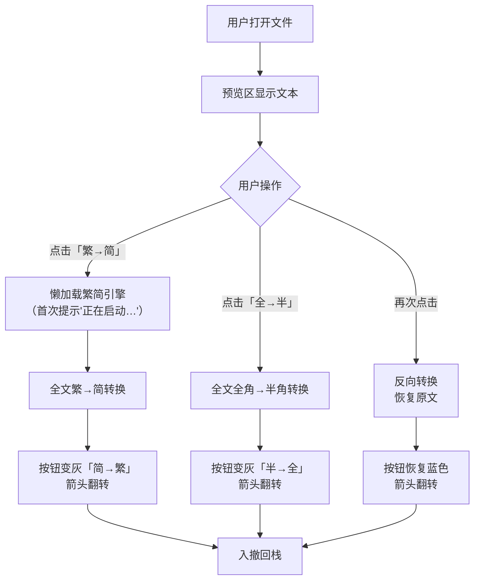
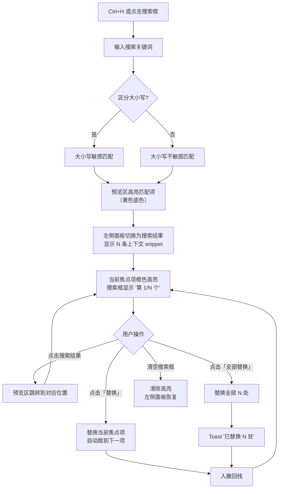
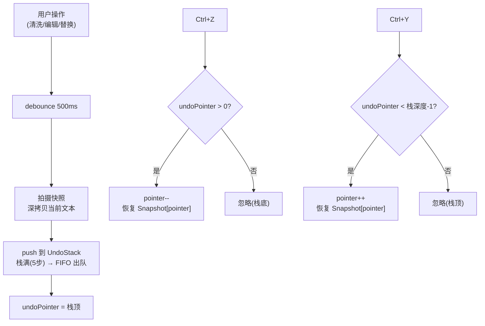

# 产品需求文档（PRD 草稿）— Text Unifier 内容工具 V0.1.0

> **项目**: Text Unifier 内容工具（独立子项目，从 Text Unifier V4.0 中拆分）
> **来源**: `PRD_V4.0_产品需求文档.md` 模块 E（内容清洗）、M（搜索替换）、H（撤回栈）
> **版本**: V0.1.0（初稿，待细化）
> **目标平台**: Windows 10 / 11 / macOS 12+ / Linux

---

## 一、项目概述

### 1.1 核心目标

Text Unifier 内容工具是 Text Unifier V4.0 的独立配套工具，专注于**纯文本的内容处理**：繁简转换、全半角转换、搜索替换、可编辑文本、撤回/重做、导出。

### 1.2 与主项目的关系

```
Text Unifier V4.0（主项目）          Text Unifier 内容工具（本子项目）
├── A. 文件输入与排序                ├── A. 文件输入
├── B. 合并引擎（重叠合并）           ├── E. 内容清洗（繁简/全角）
├── C. 连接点列表                    ├── M. 搜索替换（Ctrl+H）
├── D. 预览区（只读）                ├── H. 撤回栈（5 步 FIFO）
├── I. 文档对比                      ├── J. 导出
├── J. 导出                         └── （其他辅助功能）
├── K. 平台
└── L. 合并设置
```

本子项目从主项目中独立出来，可单独作为文本处理工具使用，也可与主项目配合。

---

## 二、核心功能清单

### 2.1 功能模块总览

| 模块 | 编号 | 功能点 | 功能说明 |
| :--- | :--- | :--- | :--- |
| **A. 文件输入** | A1 | 拖拽上传 | 从 OS 拖拽 .txt 文件到窗口 |
| | A2 | 按钮上传 | 点击按钮打开文件选择对话框，支持多选 .txt |
| | A3 | 格式过滤 | 仅接受 `.txt` 扩展名，非 .txt 文件拒绝 |
| **E. 内容清洗** | E1 | 繁简双向转换 | 繁→简 / 简→繁 ToggleButton，引擎懒加载，首次点击提示「正在启动繁简引擎…」 |
| | E2 | 全角半角双向转换 | 全角→半角 / 半角→全角 ToggleButton，点击即转换，再点还原 |
| | E3 | 按钮状态 | 未转换：蓝色 + 箭头 →；已转换：灰色 + 箭头 ← |
| | E4 | 转换范围 | 仅作用于预览区文本，不修改原始文件 |
| **M. 搜索替换** | M1 | 搜索框 | 清洗面板内嵌搜索输入框 + 搜索按钮（Ctrl+H 唤起） |
| | M2 | 高亮显示 | 预览区所有匹配关键词以黄色高亮底色标记；当前焦点匹配项以橙色高亮 |
| | M3 | 结果面板 | 搜索时左侧面板临时切换为搜索结果列表，显示每条匹配的上下文 snippet（前后各 15 字）+ 点击跳转 |
| | M4 | 逐个替换 | 「替换」按钮替换当前焦点匹配项 → 自动跳至下一匹配项 |
| | M5 | 全部替换 | 「全部替换」按钮一次性替换所有匹配项 → 显示「已替换 N 处」Toast |
| | M6 | 搜索统计 | 搜索框右侧显示「第 M/N 个」匹配计数 |
| | M7 | 大小写 | 提供「区分大小写」复选框（默认不区分） |
| | M8 | 替换入栈 | 每次替换操作（逐个/全部）入撤回栈，支持 Ctrl+Z 撤销 |
| **H. 撤回栈** | H1 | 5 步深度 | UndoStack 最大 5 步，FIFO：第 6 次操作后最早快照出栈 |
| | H2 | Ctrl+Z/Y | Ctrl+Z 撤回 / Ctrl+Y 重做；栈空/栈顶时按键无效（不发错误） |
| | H3 | 深度指示 | 底部按钮显示「↶ 撤回(3/5)」「↷ 重做」，括号内为当前深度 |
| | H4 | 自动入栈 | 触发时机：清洗操作完成、手动编辑 blur、替换执行（debounced 500ms） |
| | H5 | 导出不清空 | 导出后撤回栈保持，Ctrl+Z 仍可恢复至导出前状态 |
| | H6 | 还原按钮 | 导出按钮旁「↶ 还原」按钮，恢复至最近一次导出前的快照 |
| | H7 | 清空时机 | 仅「重新开始」按钮点击、拖入新文件替换时清空 |
| | H8 | 快照策略 | 深拷贝当前文本 + 清洗状态 |
| **J. 导出** | J1 | 导出格式 | 纯净 `.txt`，UTF-8 编码，`\r\n` 换行 |
| | J2 | 导出内容 | 导出当前预览区显示的完整文本 |
| | J3 | 预览一致 | 导出内容与预览区显示文本一致 |
| | J4 | 空导出保护 | 预览区无内容 → 提示「没有可导出的内容」 |
| | J5 | 快捷键 | Ctrl+S 触发导出 |

---

## 三、核心业务流程图

### 3.1 清洗转换流程



### 3.2 搜索替换流程



### 3.3 撤回/重做流程



---

## 四、功能边界

### 4.1 本次实现（V0.1.0）

| 模块 | 功能范围 |
| :--- | :--- |
| A. 文件输入 | 拖拽/按钮上传 .txt、文件格式校验 |
| E. 内容清洗 | 繁简双向转换、全角↔半角双向转换 |
| M. 搜索替换 | Ctrl+H 唤起、关键词高亮、逐个/全部替换、搜索结果面板 |
| H. 撤回栈 | 5 步 FIFO、Ctrl+Z/Y、导出不清空、还原按钮 |
| J. 导出 | 纯净 TXT(UTF-8)、Ctrl+S 快捷键 |

### 4.2 本次不实现

| 不实现内容 | 原因 |
| :--- | :--- |
| 合并去重 | 属于主项目 Text Unifier V4.0 |
| 文档对比 | 属于主项目 Text Unifier V4.0 |
| 非 TXT 格式 | 定位为纯文本工具 |
| 在线服务 | 完全离线 |
| 多语言 UI | 仅中文界面 |

---

## 五、验收标准

### 5.1 模块 E：内容清洗

| 编号 | 验收项 | 前置条件 | 操作 | 预期结果 |
| :--- | :--- | :--- | :--- | :--- |
| AC-E01 | 繁→简 | 预览含 "繁體中文" | 点击「繁→简」按钮 | 转为 "繁体中文"，按钮变灰色「简→繁」 |
| AC-E02 | 简→繁 | 预览含 "简体中文" | 点击「简→繁」按钮 | 转为 "簡體中文"，按钮变灰色「繁→简」 |
| AC-E03 | 全角→半角 | 预览含 "ＡＢＣ" | 点击「全→半」按钮 | 转为 "ABC"，按钮变灰色「半→全」 |
| AC-E04 | 半角→全角 | 预览含 "abc" | 点击「半→全」按钮 | 转为 "ａｂｃ"，按钮变灰色「全→半」 |
| AC-E05 | 双向可逆 | 转换 2 次 | 点「繁→简」→「简→繁」 | 恢复原文（精确可逆） |
| AC-E06 | 懒加载提示 | 首次点击繁简 | 点击「繁→简」 | Toast「正在启动繁简引擎…」→ 转换完成 |
| AC-E07 | 清洗可撤回 | 转换后 | 按 Ctrl+Z | 恢复至转换前文本 |

### 5.2 模块 M：搜索替换

| 编号 | 验收项 | 前置条件 | 操作 | 预期结果 |
| :--- | :--- | :--- | :--- | :--- |
| AC-M01 | Ctrl+H 唤起 | 预览有内容 | 按 Ctrl+H | 搜索框获得焦点 |
| AC-M02 | 搜索高亮 | 预览含 "text" 5 处 | 搜索 "text" | 预览区 5 处黄色高亮，当前焦点项橙色高亮 |
| AC-M03 | 结果面板 | 搜索 "text" → 5 处 | 查看搜索结果 | 显示 5 条，每条含上下文 snippet + 点击跳转 |
| AC-M04 | 结果跳转 | 搜索结果面板显示 | 点击第 3 条结果 | 预览区滚动并聚焦第 3 处匹配项 |
| AC-M05 | 搜索统计 | 搜索 "text" → 5 处 | 查看搜索框右侧 | 显示「第 1/5 个」 |
| AC-M06 | 全部替换 | 搜索 "text" → 5 处 | 点击「全部替换」 | 5 处替换 + Toast「已替换 5 处」+ 高亮消失 |
| AC-M07 | 逐个替换 | 搜索 "text" → 3 处 | 点击「替换」× 3 | 逐处替换，统计更新「第 N/3 个」→「已全部替换」 |
| AC-M08 | 替换入栈 | 替换后 | 按 Ctrl+Z | 恢复至替换前文本 |
| AC-M09 | 区分大小写 | 预览含 "Text" 和 "text" | 勾选区分大小写搜 "Text" | 仅高亮 "Text"，共 1 处 |
| AC-M10 | 无匹配 | 预览无 "xyz" | 搜索 "xyz" | 预览区无高亮，结果面板显示「未找到匹配项」 |

### 5.3 模块 H：撤回栈

| 编号 | 验收项 | 前置条件 | 操作 | 预期结果 |
| :--- | :--- | :--- | :--- | :--- |
| AC-H01 | Ctrl+Z 撤回 | 编辑后 | 按 Ctrl+Z | 恢复至编辑前状态，「撤回(1/5)」 |
| AC-H02 | Ctrl+Y 重做 | Ctrl+Z 后 | 按 Ctrl+Y | 恢复至编辑后状态 |
| AC-H03 | 5 步深度 | 操作 6 次 | 按 Ctrl+Z × 6 | 第 6 次无效(仅保留最近 5 步) |
| AC-H04 | 导出不清空 | 有 3 步历史 | 导出 → Ctrl+Z | 仍可撤回至导出前状态 |
| AC-H05 | 还原按钮 | 导出后 | 点击「↶ 还原」 | 恢复至导出前快照 |
| AC-H06 | 新文件清空 | 有历史栈 | 拖入新文件(替换) | 撤回栈清空，深度归零 |

### 5.4 模块 J：导出

| 编号 | 验收项 | 前置条件 | 操作 | 预期结果 |
| :--- | :--- | :--- | :--- | :--- |
| AC-J01 | 导出内容 | 预览有内容 | 导出 | 文件含全文，UTF-8 编码 |
| AC-J02 | 预览一致 | 编辑 + 清洗后 | 导出 | 导出内容与预览区显示文本一致 |
| AC-J03 | 空导出 | 预览区无内容 | 导出 | Toast「没有可导出的内容」 |
| AC-J04 | Ctrl+S | 预览有内容 | 按 Ctrl+S | 触发导出保存对话框 |

---

## 六、非功能需求

| 类别 | 要求 |
| :--- | :--- |
| 性能 | 搜索 ≤ 0.5s（100KB 文本）；首屏加载 ≤ 3s |
| 安全 | 100% 离线；仅读取 .txt 文件；繁简字典内嵌 |
| 兼容性 | Windows 10/11、macOS 12+、Linux 主流发行版 |
| 可用性 | 简体中文界面；Ctrl+Z/Y/S/H 快捷键 |

---

## 七、界面布局（草稿）

```text
+------------------------------------------------------------------+
|  [≡] Text Unifier 内容工具 v0.1                        [ _ ][ □ ][ X ] |
+------------------------------------------------------------------+
|  📄 文件.txt                                          [+] 36×36  |
+------------------------------------------------------------------+
|  ┌─ 搜索结果 (0) ──┐  ┌─ 文本预览（可编辑）──────────────────────┐  |
|  │                   │  │                                         │  |
|  │                   │  │                                         │  |
|  │                   │  │                                         │  |
|  └───────────────────┘  └─────────────────────────────────────────┘  |
|                                                                      |
|  ┌─ 内容清洗 ──────────────────────────────────────────────────────┐ |
|  │ [全→半] ⇄      [繁→简] ⇄                                       │ |
|  ├─ 搜索替换 ──────────────────────────────────────────────────────┤ |
|  │ [____________搜索_] [____________替换_] ☐区分大小写 [替换][全换]│ |
|  │ 第 1/5 个                                                        │ |
|  └──────────────────────────────────────────────────────────────────┘ |
+------------------------------------------------------------------+
|  ↶撤回(3/5) ↷重做  |  总 1,234 字  |  ↶还原  ⏎导出              |
+------------------------------------------------------------------+
```

---

## 八、快捷键

| 快捷键 | 功能 |
| :--- | :--- |
| `Ctrl+Z` | 撤回 |
| `Ctrl+Y` | 重做 |
| `Ctrl+S` | 导出 |
| `Ctrl+H` | 唤起搜索替换 |

---

## 九、与原主项目的关系

| 维度 | 说明 |
| :--- | :--- |
| 依赖 | 本子项目独立运行，不依赖主项目 |
| 数据互通 | 本子项目导出的 .txt 可直接拖入主项目进行合并去重或文档对比 |
| 代码复用 | 模块 E/M/H 的 store action 和组件可从主项目 `03-code/src/` 直接移动 |
| 架构 | 与主项目共享相同的平台架构 |

---

*本文档为草稿，待细化后正式作为「Text Unifier 内容工具」的 PRD V0.1.0。*
