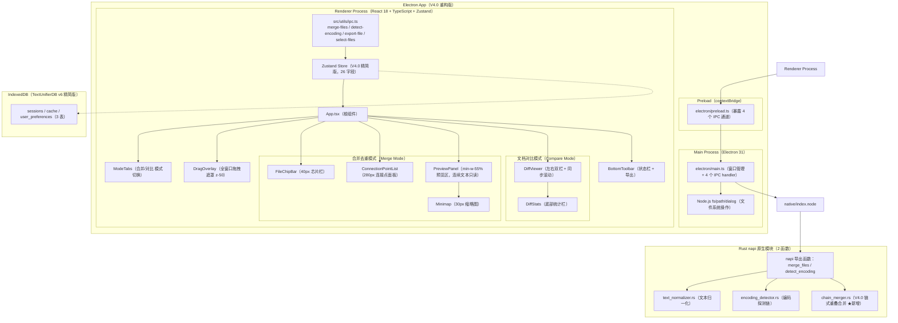
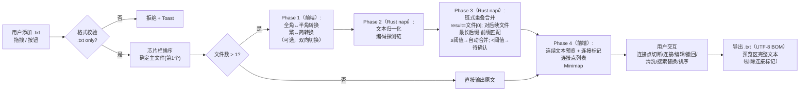
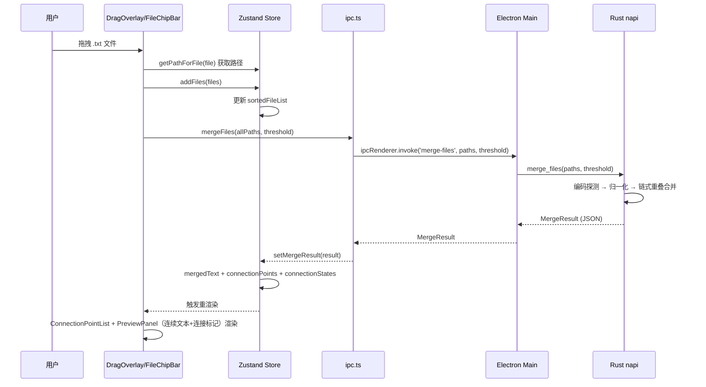
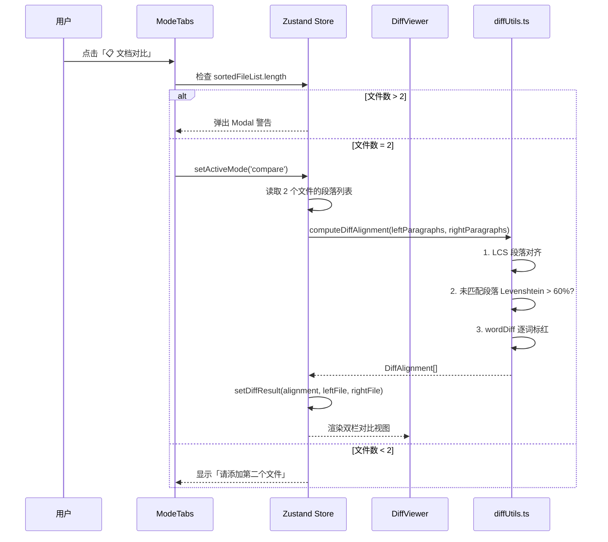
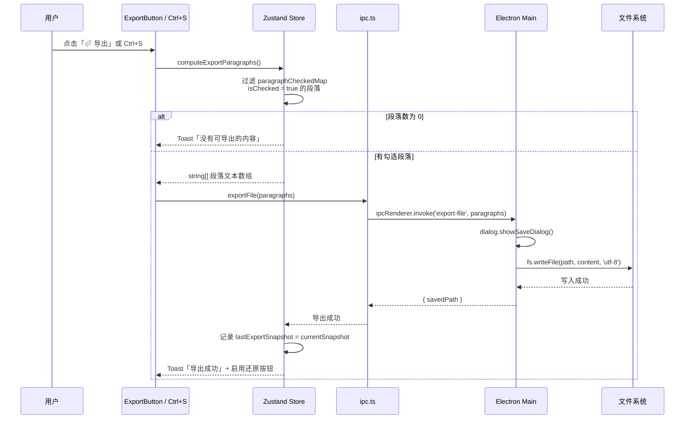

# 文档终版确定器（Text Unifier）V4.0 系统架构设计文档

| 项目名称 | 文档终版确定器（Text Unifier） |
| :--- | :--- |
| **版本号** | V4.0（项目重构版） |
| **文档类型** | 系统架构设计文档（技术选型、模块划分、交互流程） |
| **基线版本** | V3.3 |
| **关联文档** | `PRD_V4.0_产品需求文档.md` / `PRD_V4.0_交互原型.md` |

---

## 重要声明

V4.0 是对 V3.3 的**项目重构**——删除章节工具模块（F）和排版增强模块（G）；模块 E(内容清洗)、M(搜索替换)、H(撤回栈) 移至独立项目「Text Unifier 内容工具」。预览区改为只读。**桌面框架最终确定为 Electron 31**（经 Tauri 2.x Demo 实证评估，详见 `tech-decision-report-v4.0.0.md`）。

去重引擎（B）、预览区（D）、连接点列表（C）、文档对比（I）、导出（J）模块保留并重构。

---

## 第一部分：技术选型

### 1. 技术选型总览

| 类别 | V3.3 方案 | V4.0 变更 | 选型理由 |
| :--- | :--- | :--- | :--- |
| **桌面框架** | Electron v31 | **不变** | Tauri Demo 实证：开发体验不可接受（8 个问题，核心痛点：静默崩溃）；Electron 零迁移成本 |
| **前端框架** | React 18 + TypeScript 5 | **不变** | 组件化、严格类型、100% 复用 |
| **构建工具** | Vite 5 | **不变** | 极速 HMR、Tree Shaking |
| **状态管理** | Zustand 4 | **瘦身**（移除 12 字段 + 7 Actions） | V4.0 精简至 26 字段 |
| **样式方案** | Tailwind CSS 3 | **不变** | 原子化、响应式断点内置 |
| **拖拽排序** | `@dnd-kit` v6 | **不变** | 横向芯片拖拽排序 |
| **后端语言** | Rust（napi-rs） | **裁减**（移除 `document_formatter.rs`；新增 `chain_merger.rs`） | 移除废弃的排版增强引擎；新增 V4.0 链式重叠合并 |
| **数据持久化** | IndexedDB | **简化**（移除 `format_options`/`clean_options`） | 最小化会话持久化 |
| **IPC 通信** | `ipcMain`/`ipcRenderer` + `contextBridge` | **不变**（移除 `format-document` 通道） | 成熟稳定 |
| **打包分发** | electron-builder 25 | **不变** | 启用 compression: maximum 缓解包体积 |

---

## 第二部分：系统整体架构

### 2.1 V4.0 分层架构图（Electron 31 + napi-rs）



### 2.2 V4.0 处理流水线



---

## 第三部分：模块详细设计

### 3.1 模块清单总览

| 模块编号 | 模块名称 | V4.0 状态 | 说明 |
| :--- | :--- | :---: | :--- |
| A | 文件输入与排序 | ✅ 保留 | 无变更 |
| B | 去重合并引擎 | ✂️ 裁减+新增 | 移除 `format_document` napi；新增链式重叠合并 |
| C | 连接点列表 | ⭐ 重构 | V3.3"重复段落列表"重构为"连接点列表"，展示文件间重叠信息 + ToggleSwitch |
| D | 预览区 | ⭐ 重构 | 从段落列表改为连续文本 + 连接标记；保留 Minimap/溯源 |
| I | 文档对比 | ✅ 保留 | 无变更 |
| J | 导出 | ✅ 保留 | 导出内容改为预览区完整文本（排除连接标记） |
| K | 平台与兼容性 | ✅ 保留 | 无变更 |
| L | 合并设置 | ⭐ 新增 | 重叠阈值配置（默认50，范围10~500）+ 持久化 |
| ~~E~~ | ~~内容清洗~~ | ❌ 移除 | 繁简/全角转换 → 移至独立项目「Text Unifier 内容工具」 |
| ~~F~~ | ~~章节工具~~ | ❌ 删除 | 章节识别/排序/提取 |
| ~~G~~ | ~~排版增强~~ | ❌ 删除 | 段落合并/拆分/诗歌检测/列表识别 |
| ~~H~~ | ~~撤回栈~~ | ❌ 移除 | 5步撤回/Ctrl+Z/Y → 移至独立项目「Text Unifier 内容工具」 |
| ~~M~~ | ~~搜索替换~~ | ❌ 移除 | Ctrl+H/高亮/替换 → 移至独立项目「Text Unifier 内容工具」 |

### 3.2 模块 A：文件输入与排序（100% 保留）

| 属性 | 说明 |
| :--- | :--- |
| **职责** | 拖拽/按钮上传 .txt 文件，芯片栏展示排序，拖拽遮罩反馈 |
| **源文件** | `DragOverlay.tsx`, `FileChipBar.tsx`, `SortableChip.tsx`, `ModeTabs.tsx` |
| **依赖模块** | Store（`addFiles`, `reorderFiles`, `removeFile`, `setDragOverlay`）, IPC（`getFilePath`, `selectTxtFiles`） |
| **对外接口** | `handleFilesSelected(files)` 触发分析流水线 |
| **V4.0 变更** | **无** |

### 3.3 模块 B：去重合并引擎（裁减 format_document）

| 属性 | 说明 |
| :--- | :--- |
| **职责** | 文本归一化、编码探测、SHA-256 哈希、文件间去重 |
| **源文件（Rust）** | `text_normalizer.rs`, `encoding_detector.rs`, `chain_merger.rs`, `lib.rs` |
| **源文件（TS）** | `src/utils/ipc.ts`（`mergeFiles`, `detectEncoding`） |
| **依赖模块** | Electron Main Process（IPC handler） |
| **对外接口** | `mergeFiles(paths, threshold) → MergeResult`, `detectEncoding(path) → string` |
| **V4.0 变更** | ✂️ 移除 `format_document` napi + `scan_files`/`scan_preprocessed_texts`（被 `merge_files` 统一替代）；⭐ 新增 `chain_merger.rs`（链式重叠合并引擎） |

#### 3.3.1 Rust napi 模块结构（V4.0）

```
native/src/
├── lib.rs                  # napi 入口，导出 merge_files + detect_encoding
├── text_normalizer.rs      # 文本归一化（换行统一、空格压缩、控制字符过滤）
├── encoding_detector.rs    # 编码探测链（UTF-8→GB18030→Win1252→SJIS）
└── chain_merger.rs         # ★ V4.0 新增：链式重叠合并（最长后缀-前缀匹配）
```

### 3.4 模块 C：连接点列表（V4.0 重构）

| 属性 | 说明 |
| :--- | :--- |
| **职责** | 左侧面板展示每对相邻文件的重叠信息：重叠文本 snippet + 文件对名称 + 重叠长度。自动合并/待确认状态标识，切换开关控制合并/保留 |
| **源文件** | `ConnectionPointList.tsx`, `ConnectionPointItem.tsx`（V4.0 新建） |
| **依赖模块** | Store（`connectionPoints`, `toggleConnectionMerge`, `overlapThreshold`） |
| **对外接口** | `ConnectionPoint[]` 驱动渲染；`toggleConnectionMerge(cpId)` 切换合并/保留 |
| **V4.0 变更** | ⭐ 从 V3.3 的"重复段落列表"重构为"连接点列表"；面板从段落级 Checkbox 模式切换为连接点级 ToggleSwitch 模式；面板宽度可拖拽调整（200px~500px）；搜索时面板被搜索结果列表覆盖（PRD C9） |

### 3.5 模块 D：预览区（V4.0 重构）

| 属性 | 说明 |
| :--- | :--- |
| **职责** | 连续文本**只读**展示区 + 连接标记 + **Minimap 缩略图**（30px 宽，色条数 N ≈ 容器高度/3 动态计算，等比例压缩全文高度，点击跳转 `scrollTop = 全文高度 × (i/N)`）+ 悬停溯源 Tooltip |
| **源文件** | `PreviewPanel.tsx`, `ConnectionMarker.tsx`, `Minimap.tsx`, `Tooltip.tsx` |
| **依赖模块** | Store（`mergedText`, `connectionPoints`, `connectionStates`） |
| **对外接口** | 连接标记处「切断」/「连接」按钮、Minimap 点击跳转、SourceTooltip 悬停 |
| **V4.0 变更** | ⭐ 从段落列表展示改为**连续文本只读**展示；连接标记（灰色虚线=自动合并，蓝色虚线=待确认）替代段落指示器；连接标记处提供切断/连接交互；连接标记不可编辑、导出时不写入 |

### 3.6 模块 I：文档对比（100% 保留）

| 属性 | 说明 |
| :--- | :--- |
| **职责** | 双栏段落对比、LCS 对齐、四色渲染、词级差异高亮、同步滚动、统计栏 |
| **源文件** | `DiffViewer.tsx`, `src/utils/diffUtils.ts` |
| **依赖模块** | Store（`diffAlignment`, `activeMode`） |
| **对外接口** | 模式切换 Tab 触发对比计算，仅支持 2 文件 |
| **V4.0 变更** | **无** |

### 3.7 模块 J：导出（V4.0 适配）

| 属性 | 说明 |
| :--- | :--- |
| **职责** | 导出纯净 .txt（UTF-8, CRLF），预览区完整文本（排除连接标记），Ctrl+S 快捷键 |
| **源文件** | `ExportButton.tsx`, IPC（`exportFile`） |
| **依赖模块** | Store（`mergedText`, `connectionPoints`）, Electron Main Process（dialog + fs） |
| **对外接口** | `exportMergedText()` → 排除连接标记 → IPC `export-file` |
| **V4.0 变更** | ✂️ 入参从段落数组改为连续文本字符串；导出内容从"仅已勾选段落"改为"完整文本排除连接标记"（PRD J2） |

### 3.8 模块 L：合并设置（V4.0 新增）

| 属性 | 说明 |
| :--- | :--- |
| **职责** | 重叠阈值配置（默认 50，范围 10~500，步长 10）；阈值持久化到 IndexedDB |
| **源文件** | `MergeSettings.tsx`（V4.0 新建） |
| **依赖模块** | Store（`overlapThreshold`, `setOverlapThreshold`）, IndexedDB |
| **对外接口** | `setOverlapThreshold(t)` → 更新阈值 → 触发重新合并 |
| **V4.0 变更** | ⭐ 新增。入口：标题栏 [≡] 菜单 →「合并设置」；或连接点面板顶部齿轮图标 ⚙ |

### 3.9 已移除模块（E/H/M）

| 模块 | 原功能 | 移除原因 |
|:---|:---|:---|
| E. 内容清洗 | 繁简/全角转换、搜索替换 | 移至独立项目「Text Unifier 内容工具」 |
| H. 撤回栈 | 5步撤回、Ctrl+Z/Y | 同上（预览区改为只读，无需撤回） |
| M. 搜索替换 | Ctrl+H、高亮、替换 | 同上（与 E 合并移至内容工具） | |

---

## 第四部分：模块间交互流程

### 4.1 文件添加 → 合并 → 渲染（核心数据流）



### 4.2 撤回/重做交互流（已移除）

> 模块 H（撤回栈）已移至独立项目「Text Unifier 内容工具」。V4.0 预览区为只读，不涉及编辑操作，因此无撤回/重做交互。

### 4.3 文档对比交互流（保留）



### 4.4 导出交互流



---

## 第五部分：组件树（V4.0 精简版）

```text
App
├── TitleBar
├── ModeTabs
│   └── UploadButton (+ 36×36)
├── DragOverlay (fixed overlay, z-50)
├── FileChipBar (horizontal scroll, 40px)
│   ├── FileChip × N (@dnd-kit 可拖拽)
│   │   ├── FileIcon (📄)
│   │   ├── FileName (truncated 20字 + Tooltip)
│   │   ├── FileSize (B/KB/MB 标签)
│   │   ├── MainBadge (★, 仅第1个)
│   │   └── RemoveButton (×)
│   └── AddButton (+ 36×36)
│
├── [Merge Mode] MainContent
│   ├── ConnectionPointList (w-280, resizable 200~500px)
│   │   ├── Header "连接点 (N)" + ⚙ 齿轮图标
│   │   ├── ConnectionPointItem × N
│   │   │   ├── StatusBadge (已自动合并 / 待确认)
│   │   │   ├── Snippet (截断15字 + Tooltip 上下文)
│   │   │   ├── FilePair (文件A ↔ 文件B)
│   │   │   ├── OverlapLength (N字重叠)
│   │   │   └── ToggleSwitch (合并/保留)
│   │   ├── EmptyState "仅一个文件，无需合并" / "✨ 无重叠"
│   │   └── [搜索时覆盖] SearchResultList
│   │       └── SearchResultItem × N (上下文 snippet + 点击跳转)
│   │
│   ├── PreviewPanel (flex-1 min-w-[55%])
│   │   ├── TextEditor (连续文本, 可编辑)
│   │   │   └── ConnectionMarker × N (不可编辑)
│   │   │       ├── MarkerText "┈┈ 连接 (A↔B, N字) ┈┈"
│   │   │       └── ActionButton (切断/连接)
│   │   ├── Minimap (30px right, sticky)
│   │   │   └── MinimapItem × N (2px色条+1px间距, N≈容器高/3, 等比例压缩, 连接点=黄/蓝)
│   │   ├── SourceTooltip (hover 300ms, 跟随鼠标+8px)
│   │   │   └── "来源: A.txt" / "重叠区: A ↔ B (N字)"
│   │   └── EmptyState "拖拽 .txt 文件到此处或点击 + 按钮添加"
│   └── （CleanPanel/SearchReplace 已移除 —— E/M 模块移至独立项目「内容工具」）
│
├── [Compare Mode] DiffViewer
│   ├── DiffLeftPanel (50%)
│   │   └── DiffParagraph × N (🟢/🔴/⚪)
│   ├── Divider (1px)
│   ├── DiffRightPanel (50%)
│   │   └── DiffParagraph × N (🟢/🔵/⚪)
│   └── DiffStats (底部统计栏)
│
├── BottomToolbar
│   ├── StatusBar "总 N 字 | 连接点 M (自动A/待确认B) | 预估 X KB"
│   ├── Spacer
│   └── ExportButton "⏎ 导出"
│
└── ToastContainer (fixed top-right, z-60)
    └── Toast × N (自动消失 3s)
```

---

## 第六部分：V4.0 变更汇总

### 6.1 删除清单

| 层级 | 删除项 | 类型 | 原因 |
| :--- | :--- | :--- | :--- |
| **Rust** | `native/src/document_formatter.rs` | 源文件 | 排版增强模块（G）移除 |
| **Rust** | `format_document` napi 导出 | 函数 | 同上 |
| **IPC** | `format-document` IPC 通道 | 通道 | 同上 |
| **组件** | `ChapterPanel.tsx` | 源文件 | 章节工具模块（F）移除 |
| **组件** | `FormatPanel.tsx` | 源文件 | 排版增强模块（G）移除 |
| **组件** | `KeywordSearchBar.tsx` | 源文件 | V3.3 旧版关键词搜索（搜后删除行），V4.0 以全新 `SearchReplace` 替代 |
| **组件** | `DuplicateList.tsx` / `DuplicateItem.tsx` / `TriStateCheckbox.tsx` | 源文件 | V3.3 段落勾选模式重构为 V4.0 连接点 ToggleSwitch 模式 |
| **组件** | `PreviewParagraph.tsx` / `ParagraphIndicator.tsx` | 源文件 | V3.3 段落列表模式重构为 V4.0 连续文本 + 连接标记 |
| **Store** | `formatOptions` + `setFormatOptions` | 字段+Action | 排版增强移除 |
| **Store** | `chapterList` + `splitChapters` + `reorderChapters` | 字段+Action | 章节工具移除 |
| **Store** | `keywordSearchIndex` + `highlightedLineIndex` + `searchNextKeyword` + `deleteAllKeywordMatches` | 字段+Action | V3.3 旧版搜索，V4.0 以新搜索字段替代 |
| **Store** | `duplicateGroups` + `toggleGroupCheckV2` + `paragraphCheckedMap` | 字段+Action | V3.3 段落勾选，V4.0 以 `connectionPoints` + `connectionStates` 替代 |
| **Store** | `previewParagraphs` + `toggleParagraphCheck` + `modifiedParagraphIds` | 字段+Action | V3.3 段落列表，V4.0 以 `mergedText`(string) + `modifiedFlags`(Set) 替代 |
| **Store** | `applyProcessing` | Action | 处理流水线简化 |
| **Store** | `formatSnapshot` + `revertFormatting` + `canRevert` | 字段+Action | 无排版可撤销 |
| **Store** | `cleanOptions.stripArtifacts` / `filterKeywords` / `filterMaxLength` | 子字段 | 移除废弃清洗选项 |
| **Utils** | `novelProcessor.ts` 中 `filterLines`/`stripNovelArtifacts` | 函数 | 无需再调用 |
| **Types** | `FormatOptions` / `ChapterInfo` / `DuplicateGroup` / `PreviewParagraph` | 类型 | 废弃接口，V4.0 以 `ConnectionPoint` / `SearchResult` 等替代 |

### 6.2 保留 + 新增清单

| 模块 | 状态 | 关键组件/Store字段 |
| :--- | :---: | :--- |
| A. 文件输入 | ✅ 保留 | DragOverlay, FileChipBar, FileChip, sortableFileList |
| B. 合并引擎 | ✂️ 裁减+新增 | Rust: text_normalizer, encoding_detector, chain_merger（★新增） |
| C. 连接点列表 | ⭐ 重构 | ConnectionPointList, ConnectionPointItem, connectionPoints, connectionStates |
| D. 预览区 | ⭐ 重构 | PreviewPanel, ConnectionMarker（★新增）, Minimap, Tooltip, mergedText, SourceTooltip |
| E. 内容清洗 | ✂️ 精简+新增 | CleanPanel, ToggleButton, **SearchReplace（★新增）**, cjkConv.ts |
| H. 撤回栈 | ✅ 保留 | undoStack, undoPointer, pushSnapshot, undo, redo |
| I. 文档对比 | ✅ 保留 | DiffViewer, diffUtils.ts, DiffStats |
| J. 导出 | ✅ 保留 | ExportButton, exportFile IPC |
| L. 合并设置 | ⭐ 新增 | MergeSettings, overlapThreshold, setOverlapThreshold |
| M. 搜索替换 | ⭐ 新增 | SearchReplace（内嵌于 CleanPanel）, searchResults, performSearch, replaceOne, replaceAll |

### 6.3 V4.0 净变更统计

| 指标 | V3.3 | V4.0 | 变化 |
| :--- | :--- | :--- | :--- |
| Store 状态字段 | 38 | ~28 | 净减 10 + 新增搜索相关 6 字段 |
| Store Actions | 34 | ~30 | 删除 12 + 新增搜索相关 5 |
| 组件数 | 20 | 18 | 删除 8 + 新增 6（ConnectionPointList/Item, ConnectionMarker, SearchReplace, MergeSettings, SearchResultList） |
| Rust 源文件 | 6 | 5 | 删除 1（document_formatter）+ 新增 1（chain_merger） |
| napi 导出函数 | 4 | 3 | 删除 1（format_document）+ 新增 1（merge_files） |
| IPC 通道 | 6 | 5 | 删除 1（format-document）+ 新增 1（merge-files） |

---

*本文档应与 `PRD_V4.0_产品需求文档.md` 配合阅读，为 V4.0 重构的完整架构规范。*
