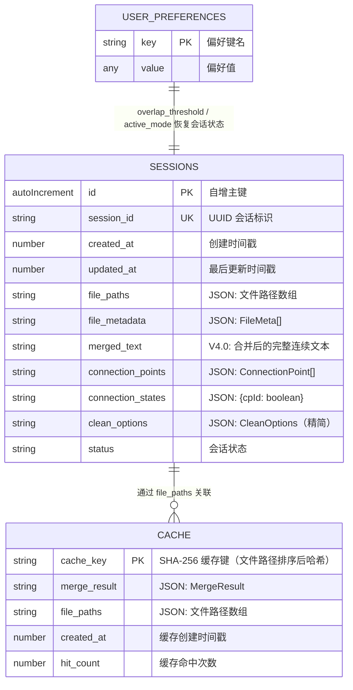
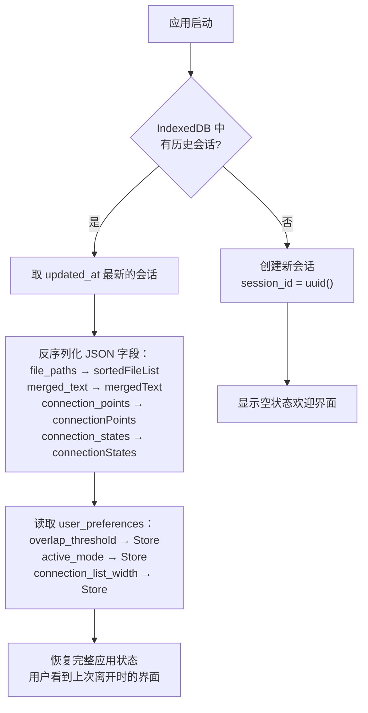
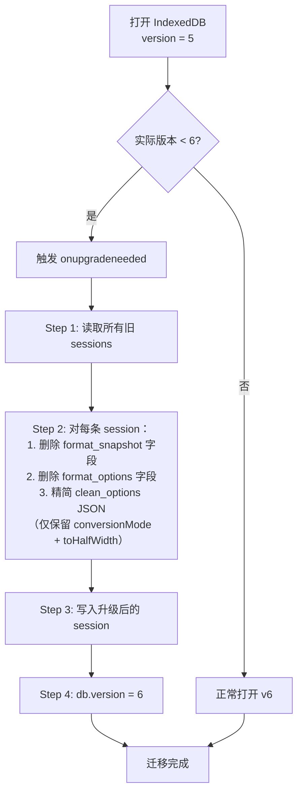

# 文档终版确定器（Text Unifier）V4.0 数据库设计文档

| 项目名称 | 文档终版确定器（Text Unifier） |
| :--- | :--- |
| **版本号** | V4.0（项目重构版） |
| **文档类型** | 数据库设计文档（IndexedDB 表结构、字段、索引、关联关系） |
| **基线版本** | V3.3 数据库设计文档 |
| **关联文档** | `系统架构设计文档_V4.0.md` / `接口规范文档_V4.0.md` |

---

## 前言

V4.0 核心数据模型从 V3.3 的**段落列表 + 勾选**改为**连续文本 + 连接点**。对应 IndexedDB 层重构：删除 `duplicate_groups`、`preview_paragraphs`、`paragraph_checked_state` 三个 V3.3 字段；新增 `merged_text`（连续文本字符串）、`connection_points`（连接点列表 JSON）、`connection_states`（连接点合并/保留状态）。删除 `format_options`、`format_snapshot`。`clean_options` 精简（移除 `stripArtifacts`/`filterKeywords`/`filterMaxLength`）。数据库版本从 v5 升级至 **v6**。

---

## 第一部分：数据库 ER 图



---

## 第二部分：数据表详细设计

### 2.1 `sessions` — 工作会话表

> **用途**：持久化当前工作状态，支持应用重启后恢复会话。保留最近 5 个会话，超过 30 天自动清理。

| 字段名 | 类型 | 必填 | 默认值 | 说明 | V4.0 变更 |
| :--- | :--- | :--- | :--- | :--- | :--- |
| `id` | `autoIncrement` | 是 | 自增 | 主键 | 不变 |
| `session_id` | `string` | 是 | `uuid` | 会话唯一标识 | 不变 |
| `created_at` | `number` | 是 | `Date.now()` | 创建时间戳（毫秒） | 不变 |
| `updated_at` | `number` | 是 | `Date.now()` | 最后更新时间戳（毫秒） | 不变 |
| `file_paths` | `Array<string>` | 是 | `[]` | 文件绝对路径数组 | 不变 |
| `file_metadata` | `string`（JSON） | 否 | `null` | 序列化的 `FileMeta[]` | 不变 |
| `merged_text` | `string` | 否 | `null` | 合并后的完整连续文本 | ⭐ 新增（替代 preview_paragraphs） |
| `connection_points` | `string`（JSON） | 否 | `null` | 序列化的 `ConnectionPoint[]` | ⭐ 新增（替代 duplicate_groups） |
| `connection_states` | `string`（JSON） | 否 | `null` | `Record<cpId, boolean>`（true=合并，false=保留） | ⭐ 新增（替代 paragraph_checked_state） |
| `clean_options` | `string`（JSON） | 否 | `null` | 序列化的 `CleanOptions`（精简版） | ✂️ 精简字段 |
| `status` | `string` | 是 | `'idle'` | 会话状态：`idle`/`loading`/`ready`/`error` | 不变 |
| ~~`duplicate_groups`~~ | — | — | — | ~~V3.3 重复段落组~~ | ❌ 删除 |
| ~~`preview_paragraphs`~~ | — | — | — | ~~V3.3 段落列表~~ | ❌ 删除 |
| ~~`paragraph_checked_state`~~ | — | — | — | ~~V3.3 段落勾选状态~~ | ❌ 删除 |
| ~~`format_snapshot`~~ | — | — | — | ~~排版前快照~~ | ❌ 删除 |
| ~~`format_options`~~ | — | — | — | ~~序列化的 FormatOptions~~ | ❌ 删除 |

#### 2.1.1 V4.0 `clean_options` JSON 结构

```typescript
// V4.0 新结构（精简为仅双向切换布尔值）
interface CleanOptionsV4 {
  isFullWidthConverted: boolean;    // 全角→半角已转换？
  isTraditionalConverted: boolean;  // 繁→简已转换？
}
```

**V4.0 迁移策略**：读取旧版 `clean_options` 时，若含 `conversionMode` 字段则映射为 `isTraditionalConverted = (conversionMode !== 'none')`；若含 `toHalfWidth` 字段则映射为 `isFullWidthConverted`。写入时使用新结构。

### 2.2 `cache` — 分析结果缓存表

> **用途**：缓存分析结果，避免相同文件组合重复计算。

| 字段名 | 类型 | 必填 | 默认值 | 说明 | V4.0 变更 |
| :--- | :--- | :--- | :--- | :--- | :--- |
| `cache_key` | `string` | 是 | — | **主键**。基于文件路径数组（排序后）的 SHA-256 | 不变 |
| `merge_result` | `string`（JSON） | 是 | — | 序列化的 `MergeResult`（含 mergedText + connectionPoints） | ⭐ 字段名变更 |
| `file_paths` | `Array<string>` | 是 | — | 参与分析的文件路径（有序） | 不变 |
| `created_at` | `number` | 是 | — | 缓存创建时间戳（毫秒） | 不变 |
| `hit_count` | `number` | 是 | 0 | 缓存命中次数（用于 LRU 淘汰） | 不变 |

**缓存键生成规则（V4.0 简化）**：

```typescript
// V4.0：仅需 file_paths（清洗选项不再影响 Rust 分析结果，因为清洗在前端完成）
async function computeCacheKey(filePaths: string[]): Promise<string> {
  const input = filePaths.sort().join('|');  // 排序确保相同组合命中
  const hashBuffer = await crypto.subtle.digest('SHA-256', new TextEncoder().encode(input));
  return Array.from(new Uint8Array(hashBuffer)).map(b => b.toString(16).padStart(2, '0')).join('');
}
```

> V3.3 旧缓存键包含 `clean_options`，V4.0 清洗选项不再影响 Rust 产出，因此简化缓存键计算。

### 2.3 `user_preferences` — 用户偏好表

> **用途**：存储用户操作偏好，用于跨会话状态恢复。

| 字段名 | 类型 | 必填 | 默认值 | 说明 | V4.0 变更 |
| :--- | :--- | :--- | :--- | :--- | :--- |
| `key` | `string` | 是 | — | **主键**。偏好键名 | 不变 |
| `value` | `any` | 是 | — | 偏好值（任意可序列化类型） | 不变 |

**V4.0 预定义偏好项：**

| key | 类型 | 默认值 | 说明 | V4.0 变更 |
| :--- | :--- | :--- | :--- | :--- |
| `overlap_threshold` | `number` | `50` | 重叠阈值（范围 10~500） | ⭐ 新增（PRD L2） |
| `connection_list_width` | `number` | `280` | 连接点列表面板宽度（px） | ✂️ 重命名 |
| `active_mode` | `string` | `'merge'` | 上次使用的模式（`'merge'`/`'compare'`） | 保留 |
| ~~`is_fullwidth_converted`~~ | — | — | ~~V3.3 全角转换状态~~ | ❌ E 模块移除 |
| ~~`is_traditional_converted`~~ | — | — | ~~V3.3 繁简转换状态~~ | ❌ E 模块移除 |
| ~~`duplicate_list_width`~~ | — | — | ~~V3.3 重复列表面板宽度~~ | ❌ 删除 |

---

## 第三部分：索引设计

### 3.1 索引清单

| 表名 | 索引名 | 类型 | 字段 | 作用 |
| :--- | :--- | :--- | :--- | :--- |
| `sessions` | `idx_session_id` | **唯一索引** | `session_id` | 按 UUID 快速查找会话 |
| `sessions` | `idx_updated_at` | **普通索引** | `updated_at` | 按更新时间排序，支持自动清理（最近 5 个） |
| `cache` | — | **主键索引** | `cache_key` | 按缓存键精确查找 |
| `cache` | `idx_cache_created_at` | **普通索引** | `created_at` | 支持 LRU 缓存淘汰（最旧优先淘汰） |
| `user_preferences` | — | **主键索引** | `key` | 按键名精确查找偏好 |

### 3.2 索引创建 DDL（IndexedDB 语义）

```typescript
// sessions 表
objectStore.createIndex('idx_session_id', 'session_id', { unique: true });
objectStore.createIndex('idx_updated_at', 'updated_at', { unique: false });

// cache 表
// cache_key 即主键，无需额外索引
objectStore.createIndex('idx_cache_created_at', 'created_at', { unique: false });

// user_preferences 表
// key 即主键，无需额外索引
```

---

## 第四部分：表间关联关系

### 4.1 关联概述

| 关联 | 类型 | 说明 |
| :--- | :--- | :--- |
| `sessions` → `cache` | 逻辑关联（通过 `file_paths`） | 同一文件组合的分析结果可被不同会话复用 |
| `user_preferences` → `sessions` | 逻辑关联（通过 `key` 语义） | `is_fullwidth_converted`/`is_traditional_converted` 用于恢复会话的清洗状态 |

### 4.2 会话恢复流程



### 4.3 自动清理策略

| 策略 | 阈值 | 触发时机 | 操作 |
| :--- | :--- | :--- | :--- |
| 会话数量限制 | 最多 5 个 | 每次保存新会话时 | 按 `updated_at` 升序删除最早的会话（保留最新 5 个） |
| 会话过期清理 | 30 天 | 应用启动时 | 删除 `updated_at < Date.now() - 30天` 的会话 |
| 缓存过期清理 | 7 天 | 应用启动时 | 删除 `created_at < Date.now() - 7天` 的缓存 |

---

## 第五部分：数据迁移（V3.3 → V4.0）

### 5.1 数据库版本升级

| 项目 | 值 |
| :--- | :--- |
| 数据库名 | `TextUnifierDB` |
| 旧版本 | 5（V3.3） |
| 新版本 | **6**（V4.0） |
| 升级类型 | `versionchange` 事务 |

### 5.2 迁移步骤



### 5.3 迁移伪代码

```typescript
// IndexedDB v5 → v6 升级处理
function upgradeV5toV6(db: IDBDatabase, oldVersion: number): void {
  if (oldVersion < 6) {
    // sessions 表：删除废弃字段（IndexedDB 不支持删除列，需重建对象）
    // 策略：读取所有数据 → 清理字段 → 写回
    const transaction = (db as any).currentTransaction; // onupgradeneeded 事务

    const sessionStore = transaction.objectStore('sessions');
    const cursorReq = sessionStore.openCursor();

    cursorReq.onsuccess = (event: any) => {
      const cursor = event.target.result;
      if (cursor) {
        const record = cursor.value;

        // 1. 删除废弃字段
        delete record.format_snapshot;
        delete record.format_options;

        // 2. 精简 clean_options
        if (record.clean_options) {
          try {
            const opts = JSON.parse(record.clean_options);
            record.clean_options = JSON.stringify({
              conversionMode: opts.conversionMode || 'none',
              toHalfWidth: opts.toHalfWidth || false,
            });
          } catch {
            record.clean_options = JSON.stringify({
              conversionMode: 'none',
              toHalfWidth: false,
            });
          }
        }

        cursor.update(record);
        cursor.continue();
      }
    };
  }
}
```

---

## 第六部分：V4.0 变更汇总（数据库层）

| 变更类型 | 对象 | 说明 |
| :--- | :--- | :--- |
| ❌ 删除列 | `sessions.format_snapshot` | 排版快照（排版增强模块移除） |
| ❌ 删除列 | `sessions.format_options` | 排版选项（排版增强模块移除） |
| ✂️ 精简列 | `sessions.clean_options`（JSON 内容） | 移除 `stripArtifacts`/`filterKeywords`/`filterMaxLength` |
| 🔄 简化逻辑 | `cache.cache_key`（生成规则） | 不再纳入 `clean_options`，仅基于 `file_paths` |
| 🔼 版本升级 | 数据库版本 5 → 6 | 自动迁移旧数据 |
| ✅ 保留 | `sessions` 其余 9 列 | 无变更 |
| ✅ 保留 | `cache` 全部 5 列 | 无变更 |
| ✅ 保留 | `user_preferences` 全部 2 列 | 无变更 |
| ✅ 保留 | 所有索引 | 无变更 |

---

*本文档应与 `architecture-v4.0.0.md` 配合阅读，为 V4.0 重构的完整数据库规范。*
