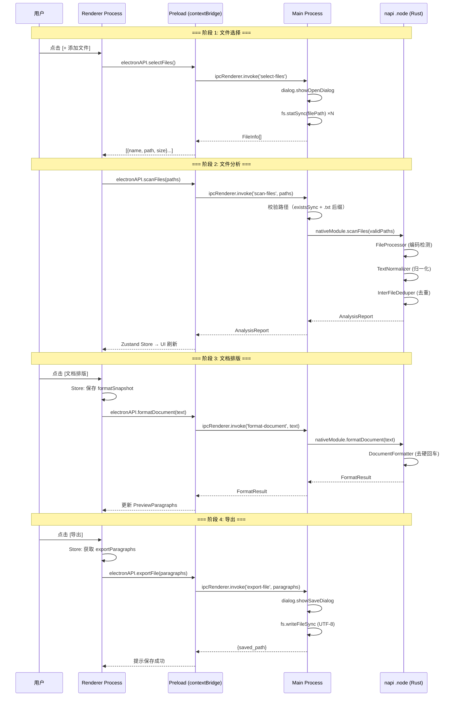

# 文档终版确定器（Text Unifier）V3.0 接口规范文档

| 项目名称 | 文档终版确定器（Text Unifier） |
| :--- | :--- |
| **版本号** | V3.0 |
| **文档类型** | 接口规范文档（接口定义、入参/出参、调用规则） |
| **基线版本** | V2.0.2 接口规范文档 |
| **关联文档** | `系统架构设计文档_V3.0.md` / `数据库设计文档_V3.0.md` / `迁移方案_V3.0_Electron.md` |

---

## 概述

V3.0 将 IPC 通信层从 **Tauri IPC**（`@tauri-apps/api/core` `invoke()`）全面替换为 **Electron contextBridge IPC**（`ipcMain.handle()` + `ipcRenderer.invoke()`）。Rust 核心引擎通过 **napi-rs** 编译为 `.node` 原生模块，运行于 Electron Main Process。

```
通信模型:  Renderer Process  ── electronAPI.xxx() ──→  contextBridge  ──→  ipcMain.handle
           Renderer Process  ←── Promise<T> ───────  contextBridge  ←──  ipcMain.handle 返回
                                                      (部分 handler 调用 napi .node 模块)
```

### 架构层次

```text
┌──────────────────────────────────────────────────────────────────┐
│                    Electron IPC 调用链路                           │
│                                                                   │
│  ┌─ Renderer Process ─┐    ┌─ Preload ─┐    ┌─ Main Process ──┐  │
│  │                    │    │            │    │                  │  │
│  │ src/utils/ipc.ts   │───→│ contextBridge │──→│ ipcMain.handle  │──→ napi .node
│  │ scanFiles()        │    │ .scanFiles()  │  │ 'scan-files'    │   (Rust)
│  │ formatDocument()   │    │ .formatDoc()  │  │ 'format-document'│──→ napi .node
│  │ exportFile()       │    │ .exportFile() │  │ 'export-file'   │   (dialog+fs)
│  │ selectTxtFiles()   │    │ .selectFiles()│  │ 'select-files'  │   (dialog+fs)
│  └────────────────────┘    └──────────────┘  └─────────────────┘  │
└──────────────────────────────────────────────────────────────────┘
```

### V3.0 接口清单

| 接口名称 | 方向 | vs V2.0 | 底层实现 | 功能 |
| :--- | :--- | :--- | :--- | :--- |
| `scanFiles` | Renderer → Main → napi | 等价替换 `scan_files` | napi `scan_files()` | 扫描文件，执行归一化与去重分析 |
| `formatDocument` | Renderer → Main → napi | 等价替换 `format_document` | napi `format_document()` | 文档排版：去除段落内硬回车 |
| `exportFile` 🆕 | Renderer → Main | 替代 `export_text` | Electron `dialog.showSaveDialog` + `fs.writeFileSync` | 弹出保存对话框并导出 .txt |
| `selectTxtFiles` 🆕 | Renderer → Main | **新增** | Electron `dialog.showOpenDialog` + `fs.statSync` | 弹出文件选择对话框，返回文件信息 |

---

## 第一部分：Renderer → Preload 层（前端调用）

### 1. `src/utils/ipc.ts` — IPC 工具函数（V3.0 重写版）

```typescript
/**
 * IPC 通信层（V3.0：Electron contextBridge）
 *
 * 所有 IPC 调用通过 window.electronAPI 桥接，
 * 由 electron/preload.ts 注入。
 * 保留指数退避重试逻辑与超时控制。
 */

import type { AnalysisReport, FormatResult } from '../types';

// ═══════════════════════════════════════════════
// 通用配置
// ═══════════════════════════════════════════════

const MAX_RETRIES = 3;
const RETRY_BASE_MS = 500;

/** 获取 electronAPI 引用 */
function getAPI() {
    const api = (window as any).electronAPI;
    if (!api) {
        throw new Error(
            'electronAPI 未初始化 — 请确保通过 Electron 启动应用'
        );
    }
    return api;
}

/** 带指数退避重试的包装器 */
async function withRetry<T>(
    fn: () => Promise<T>,
    retries = MAX_RETRIES
): Promise<T> {
    for (let attempt = 0; attempt <= retries; attempt++) {
        try {
            return await fn();
        } catch (error) {
            if (attempt === retries) throw error;
            const delay = RETRY_BASE_MS * Math.pow(2, attempt);
            console.warn(
                `IPC 调用失败，${delay}ms 后重试 (${attempt + 1}/${retries}):`,
                error
            );
            await new Promise((resolve) => setTimeout(resolve, delay));
        }
    }
    throw new Error('IPC 调用失败: 重试次数耗尽');
}

// ═══════════════════════════════════════════════
// 接口 1: scanFiles — 扫描并分析文件
// ═══════════════════════════════════════════════

/**
 * 调用 Electron Main Process 的 scan-files handler，
 * 底层由 napi scan_files() 执行。
 *
 * @param paths 文件绝对路径数组（用户排序后的顺序，第1个为主文件）
 * @returns 分析报告（duplicate_groups + preview_paragraphs）
 */
export async function scanFiles(paths: string[]): Promise<AnalysisReport> {
    return withRetry(() => getAPI().scanFiles(paths));
}

// ═══════════════════════════════════════════════
// 接口 2: formatDocument — 文档排版
// ═══════════════════════════════════════════════

/**
 * 调用 Electron Main Process 的 format-document handler，
 * 底层由 napi format_document() 执行。
 *
 * @param text 待排版的全文（已勾选段落拼接，\n\n 分隔）
 * @returns 排版结果（formatted_text + 元数据）
 */
export async function formatDocument(text: string): Promise<FormatResult> {
    return withRetry(() => getAPI().formatDocument(text));
}

// ═══════════════════════════════════════════════
// 接口 3: exportFile — 导出合并文档
// ═══════════════════════════════════════════════

/**
 * 调用 Electron Main Process 的 export-file handler，
 * 弹出系统原生保存对话框，写入 .txt 文件。
 *
 * @param paragraphs 要导出的段落文本数组（仅已勾选段落）
 * @returns 保存结果（含绝对路径）
 */
export async function exportFile(
    paragraphs: string[]
): Promise<{ saved_path: string }> {
    return withRetry(() => getAPI().exportFile(paragraphs));
}

// ═══════════════════════════════════════════════
// 接口 4: selectTxtFiles — 选择文件
// ═══════════════════════════════════════════════

/**
 * 调用 Electron Main Process 的 select-files handler，
 * 弹出系统原生文件多选对话框。
 *
 * @returns 文件信息数组（name, path, size）
 */
export async function selectTxtFiles(): Promise<
    { name: string; path: string; size: number }[]
> {
    return withRetry(() => getAPI().selectFiles());
}
```

---

## 第二部分：Preload → Main Process 层（contextBridge 定义）

### 2. `electron/preload.ts` — 安全桥定义

```typescript
import { contextBridge, ipcRenderer } from 'electron';

contextBridge.exposeInMainWorld('electronAPI', {
    scanFiles:      (paths: string[]) =>
                        ipcRenderer.invoke('scan-files', paths),
    formatDocument: (text: string) =>
                        ipcRenderer.invoke('format-document', text),
    exportFile:     (paragraphs: string[]) =>
                        ipcRenderer.invoke('export-file', paragraphs),
    selectFiles:    () =>
                        ipcRenderer.invoke('select-files'),
});
```

### 3. `electron/preload.d.ts` — TypeScript 类型声明

```typescript
export interface ElectronAPI {
    scanFiles(paths: string[]): Promise<AnalysisReport>;
    formatDocument(text: string): Promise<FormatResult>;
    exportFile(paragraphs: string[]): Promise<{ saved_path: string }>;
    selectFiles(): Promise<
        { name: string; path: string; size: number }[]
    >;
}

declare global {
    interface Window {
        electronAPI: ElectronAPI;
    }
}
```

---

## 第三部分：Main Process IPC Handler 定义

### 3.1 `ipcMain.handle('scan-files')` — 扫描分析文件

| 项目 | 内容 |
| :--- | :--- |
| **IPC 通道名** | `scan-files` |
| **处理器位置** | `electron/main.ts` |
| **底层实现** | `nativeModule.scanFiles(paths)` → Rust napi |
| **功能描述** | 对文件路径数组执行编码检测 → 文本归一化 → 文件间去重。第 1 个文件为主文件（内容完整保留）。 |
| **幂等性** | ✅ 是（相同输入 → 相同输出） |

#### 请求参数

```typescript
// ipcRenderer.invoke('scan-files', paths)
paths: string[]  // 非空字符串数组，每个元素为 .txt 文件的绝对路径
```

| 字段 | 类型 | 必填 | 约束 | 说明 |
| :--- | :--- | :--- | :--- | :--- |
| `paths` | `Array<string>` | 是 | 长度 ≥ 1；仅 `.txt` 后缀 | 文件绝对路径数组。顺序敏感。路径存在性由 handler 校验。 |

#### 响应数据

**成功响应：**

```json
{
  "duplicate_groups": [
    {
      "id": "grp_1",
      "content_hash": "a1b2c3d4e5f6...",
      "snippet": "项目启动会议纪要...",
      "sources": [
        { "file_name": "A.txt", "start_line": 10 },
        { "file_name": "B.txt", "start_line": 5 }
      ],
      "occurrence_count": 2
    }
  ],
  "preview_paragraphs": [
    {
      "id": "pre_0001",
      "text": "这是第一段独有的内容。",
      "content_hash": "e5f6a1b2c3d4...",
      "source_files": ["A.txt"],
      "is_original": true
    }
  ],
  "total_files": 3,
  "files_metadata": [
    { "file_name": "A.txt", "file_size": 263168, "modified": 1715000000 },
    { "file_name": "B.txt", "file_size": 12595, "modified": 1715000001 }
  ]
}
```

| 字段 | 类型 | 说明 |
| :--- | :--- | :--- |
| `duplicate_groups` | `object[]` | 跨文件重复组（≥2 个不同文件中出现的段落） |
| `duplicate_groups[].id` | `string` | 组唯一标识 `grp_{N}` |
| `duplicate_groups[].content_hash` | `string` | SHA256 哈希（64 字符 hex） |
| `duplicate_groups[].snippet` | `string` | 段落内容前 10 字符 + "..." |
| `duplicate_groups[].sources` | `object[]` | 来源文件名 + 起行行号 |
| `duplicate_groups[].occurrence_count` | `number` | 涉及的不同文件数 |
| `preview_paragraphs` | `object[]` | 合并去重后的预览段落 |
| `preview_paragraphs[].id` | `string` | 段落唯一标识 `pre_{NNNN}` |
| `preview_paragraphs[].text` | `string` | 归一化后的段落文本 |
| `preview_paragraphs[].content_hash` | `string` | SHA256 哈希 |
| `preview_paragraphs[].source_files` | `string[]` | 来源文件名列表 |
| `preview_paragraphs[].is_original` | `boolean` | 是否首次出现（V1.1 算法中始终为 `true`） |
| `total_files` | `number` | 成功处理的文件数 |
| `files_metadata` | `object[]` | 文件元数据 |

**错误响应（通过 Promise reject 抛出）：**

```typescript
// 无有效文件
throw new Error('没有有效的 .txt 文件');

// 文件处理失败（napi 内部错误）
throw new Error('文件处理失败: 文件 \'B.txt\' 读取失败: 权限不足');

// napi 模块未加载
throw new Error('核心引擎未初始化');
```

#### Handler 校验逻辑

```typescript
ipcMain.handle('scan-files', async (_event, paths: string[]) => {
    // 1. 路径存在性 + .txt 后缀校验
    const validPaths = paths.filter(p => {
        try {
            return fs.existsSync(p) && p.toLowerCase().endsWith('.txt');
        } catch { return false; }
    });

    if (validPaths.length === 0) {
        throw new Error('没有有效的 .txt 文件');
    }

    // 2. 调用 napi 原生模块
    return nativeModule.scanFiles(validPaths);
});
```

#### 调用规则

| 规则编号 | 规则内容 |
| :--- | :--- |
| **R-01** | **并发互斥**：前端通过 `loadingRef` 标志位确保同一时间仅一个 `scanFiles` 调用进行中。 |
| **R-02** | **超时控制**：前端 60 秒超时（`Promise.race`）。 |
| **R-03** | **路径校验在 Main Process**：`fs.existsSync` + `.txt` 后缀检查，无效路径被静默过滤。 |
| **R-04** | **重试策略**：IPC 层 3 次指数退避（500ms / 1000ms / 2000ms）。仅重试 IPC 传输错误，不重试业务错误。 |
| **R-05** | **编码降级在 napi**：UTF-8 → GB18030 → Windows-1252 → Shift-JIS，全部失败后 UTF-8 替换字符降级。 |
| **R-06** | **文件顺序语义**：`paths[0]` 为主文件。前端拖拽排序后重新调用。 |

---

### 3.2 `ipcMain.handle('format-document')` — 文档排版

| 项目 | 内容 |
| :--- | :--- |
| **IPC 通道名** | `format-document` |
| **处理器位置** | `electron/main.ts` |
| **底层实现** | `nativeModule.formatDocument(text)` → Rust napi |
| **功能描述** | 对文本执行"去硬回车"排版：识别自然段落边界，将段落内单换行替换为空格，保留段落间空行，保护列表格式。 |
| **幂等性** | ✅ 近似幂等 |

#### 请求参数

```typescript
// ipcRenderer.invoke('format-document', text)
text: string  // 非空字符串，最大 100MB
```

| 字段 | 类型 | 必填 | 约束 | 说明 |
| :--- | :--- | :--- | :--- | :--- |
| `text` | `string` | 是 | 非空；≤ 100MB | 待排版的全文。前端负责仅拼接已勾选段落，用 `\n\n` 分隔。 |

#### 响应数据

**成功响应：**

```json
{
  "formatted_text": "这是第一段内容第一行 这是第一段内容第二行\n\n这是第二段内容",
  "paragraph_count": 2,
  "protected_blocks": 0,
  "merged_blocks": 2
}
```

| 字段 | 类型 | 说明 |
| :--- | :--- | :--- |
| `formatted_text` | `string` | 排版后的全文。段落间以 `\n\n` 分隔。 |
| `paragraph_count` | `number` | 排版后的段落总数 |
| `protected_blocks` | `number` | 被识别为受保护块（列表/诗歌）而未合并的块数 |
| `merged_blocks` | `number` | 被执行合并操作的段落块数 |

**错误响应：**

| 错误场景 | Error message |
| :--- | :--- |
| 输入为空 | `排版处理失败: 输入文本为空` |
| 文本超过 100MB | `排版处理失败: 文本大小超过限制` |

#### 排版算法规格（与 V2.0 一致）

| 步骤 | 操作 | 说明 |
| :---: | :--- | :--- |
| 1 | 按 `\n\s*\n` 分割段落块 | 识别空行分隔 |
| 2 | 混合策略细粒度分段 | 检测首行缩进、尾句标点作为段落边界 |
| 3 | 受保护块检测 | 列表（>50%行为列表标记）→ 保留原样；诗歌（均值<20字 & >70%行无句尾标点）→ 保留原样 |
| 4 | 非保护块合并 | trim 各行 → 空格连接 → 压缩多余空格 |
| 5 | 后处理 | `\n\n` 拼接 → 连续 3+ 换行归一为 `\n\n` |

#### 调用规则

| 规则编号 | 规则内容 |
| :--- | :--- |
| **R-07** | **纯函数**：排版仅操作换行符和空格，不改写任何文字、标点、语气。 |
| **R-08** | **保守策略**：列表检测阈值 0.5；宁可漏判（合并列表）也不误判（保留多余换行）。 |
| **R-09** | **前端预处理**：仅已勾选段落参与排版。 |
| **R-10** | **非阻塞**：napi 调用为 async，排版期间 UI 显示 Loading 动画。 |

---

### 3.3 `ipcMain.handle('export-file')` — 导出合并文档

| 项目 | 内容 |
| :--- | :--- |
| **IPC 通道名** | `export-file` |
| **处理器位置** | `electron/main.ts` |
| **底层实现** | `dialog.showSaveDialog()` + `fs.writeFileSync()` |
| **功能描述** | 弹出系统原生保存对话框，将段落数组以 `\n\n` 连接写入 UTF-8 文件。 |
| **vs V2.0** | 替代 `export_text`——对话框与写入均移至 Main Process |

#### 请求参数

```typescript
// ipcRenderer.invoke('export-file', paragraphs)
paragraphs: string[]
```

| 字段 | 类型 | 必填 | 说明 |
| :--- | :--- | :--- | :--- |
| `paragraphs` | `Array<string>` | 是 | 前端 `exportParagraphs` 派生状态（仅已勾选段落）。 |

#### 响应数据

**成功响应：**

```json
{
  "saved_path": "C:\\Users\\...\\Merged_Document.txt"
}
```

| 字段 | 类型 | 说明 |
| :--- | :--- | :--- |
| `saved_path` | `string` | 保存成功的文件绝对路径 |

**错误响应：**

| 错误场景 | Error message | 处理方式 |
| :--- | :--- | :--- |
| 用户取消保存 | `用户取消了保存` | 前端静默忽略 |
| 窗口未初始化 | `窗口未初始化` | 前端展示错误提示 |
| 写入失败 | Node.js `fs.writeFileSync` 抛出的异常 | 前端展示错误提示 |

#### 调用规则

| 规则编号 | 规则内容 |
| :--- | :--- |
| **R-11** | **系统原生对话框**：`dialog.showSaveDialog` 弹出原生保存对话框。 |
| **R-12** | **段落拼接**：`paragraphs.join('\n\n')`。 |
| **R-13** | **UTF-8 编码**：`fs.writeFileSync(path, content, 'utf-8')`，无 BOM。 |
| **R-14** | **前端过滤**：前端通过 `exportParagraphs` 已过滤未勾选段落，后端不做二次过滤。 |
| **R-15** | **对话框参数**：默认文件名 `Merged_Document.txt`，过滤器 `Text Files (*.txt)`。 |

---

### 3.4 `ipcMain.handle('select-files')` — 选择文件对话框

| 项目 | 内容 |
| :--- | :--- |
| **IPC 通道名** | `select-files` |
| **处理器位置** | `electron/main.ts` |
| **底层实现** | `dialog.showOpenDialog()` + `fs.statSync()` |
| **功能描述** | 弹出系统原生文件多选对话框（仅 `.txt`），返回文件信息数组。 |
| **vs V2.0** | 🆕 V3.0 新增（V2.0 依赖 `<input type="file">` + Tauri fs plugin path 读取） |

#### 请求参数

无（对话框选择由用户交互驱动）。

#### 响应数据

**成功响应：**

```json
[
  { "name": "A.txt", "path": "C:\\...\\A.txt", "size": 263168 },
  { "name": "B.txt", "path": "D:\\...\\B.txt", "size": 12595 }
]
```

| 字段 | 类型 | 说明 |
| :--- | :--- | :--- |
| `[].name` | `string` | 文件名（含扩展名） |
| `[].path` | `string` | 文件绝对路径 |
| `[].size` | `number` | 文件大小（字节） |

**取消选择时：** 返回 `[]`（空数组）

**错误响应：**

| 错误场景 | Error message |
| :--- | :--- |
| 窗口未初始化 | `窗口未初始化` |

#### 调用规则

| 规则编号 | 规则内容 |
| :--- | :--- |
| **R-16** | **仅 .txt**：对话框过滤器 `[{ name: 'Text Files', extensions: ['txt'] }]`。 |
| **R-17** | **多选**：`properties: ['openFile', 'multiSelections']`。 |
| **R-18** | **取消不报错**：用户取消对话框时返回空数组 `[]`，不抛出异常。 |
| **R-19** | **文件信息收集**：通过 `fs.statSync` 获取文件大小，错误时跳过该文件（不阻塞）。 |

---

## 第四部分：Rust napi 内部接口（Trait 约束）

### 4.1 模块依赖关系（V3.0）

```text
native/src/
├── lib.rs                      ← #[napi] 入口：scan_files / format_document
│   ├── file_processor.rs       ← 文件 IO + 编码
│   ├── text_normalizer.rs      ← 文本归一化（regex）
│   ├── paragraph_index.rs      ← InterFileDeduper + SHA256
│   ├── document_formatter.rs   ← 去硬回车引擎
│   └── duplicate_resolver.rs   ← 数据结构 + #[napi(object)]
```

### 4.2 Trait 定义（继承 V2.0）

```rust
// ═══════════════════════════════════════════════
// TextNormalizer — 文本归一化器
// ═══════════════════════════════════════════════

pub trait TextNormalizerTrait {
    fn normalize(&self, raw: &str) -> Vec<String>;
    fn normalize_for_display(&self, text: &str) -> String;
}

// ═══════════════════════════════════════════════
// ParagraphIndexer — 段落索引构建器
// ═══════════════════════════════════════════════

pub trait ParagraphIndexer {
    fn build_index(&mut self, file_name: &str, normalized_paragraphs: &[String]);
    fn analyze(self) -> (Vec<DuplicateGroup>, Vec<PreviewParagraph>);
}

// ═══════════════════════════════════════════════
// DocumentFormatter — 文档排版器
// ═══════════════════════════════════════════════

pub trait DocumentFormatterTrait {
    fn format(&self, text: &str) -> FormatResult;
    fn is_protected_block(&self, lines: &[&str]) -> bool;
    fn merge_lines(&self, lines: &[&str]) -> String;
}
```

### 4.3 napi 导出函数签名

```rust
// native/src/lib.rs

/// 扫描并分析 TXT 文件
#[napi]
pub fn scan_files(paths: Vec<String>) -> Result<AnalysisReport>

/// 文档排版（去硬回车）
#[napi]
pub fn format_document(text: String) -> Result<FormatResult>
```

### 4.4 模块职责与错误传播

| 模块 | 错误处理策略 | 错误传播方式 |
| :--- | :--- | :--- |
| `FileProcessor` | 编码失败降级（不报错）；IO 错误向上传播 | `anyhow::Result<T>` → `napi::Error` |
| `TextNormalizer` | 无错误（纯文本变换） | — |
| `InterFileDeduper` | 无错误（纯内存操作） | — |
| `DocumentFormatter` | 空输入返回错误；超大文本返回错误 | `napi::Error` |
| `lib.rs` | 所有错误统一转为 `napi::Error` → JS Error | `Result<T, napi::Error>` |

---

## 第五部分：V2.0 → V3.0 接口映射对照

### 5.1 完整映射表

| V2.0 (Tauri) | V3.0 (Electron) | 变更类型 | 说明 |
| :--- | :--- | :--- | :--- |
| `invoke('scan_files', {paths})` | `electronAPI.scanFiles(paths)` | 等价替换 | 函数签名一致，返回值结构一致 |
| `invoke('format_document', {text})` | `electronAPI.formatDocument(text)` | 等价替换 | 函数签名一致，返回值结构一致 |
| `invoke('export_text', {paragraphs, defaultName})` | `electronAPI.exportFile(paragraphs)` | 重构 | `defaultName` 移除（对话框决定）；返回值 `saved_path` 保留 |
| （无） | `electronAPI.selectFiles()` | **新增** | V2.0 使用 `<input type="file">` + Tauri fs plugin，V3.0 统一为对话框 |
| `@tauri-apps/api/core` `invoke` | `window.electronAPI.*` | 替换 | 依赖包替换 |
| `@tauri-apps/plugin-dialog` | `dialog.showOpenDialog()` / `showSaveDialog()` | 替换 | Electron 原生 API |
| `@tauri-apps/plugin-fs` | `fs.existsSync()` / `fs.statSync()` | 替换 | Node.js 内置模块 |
| `#[tauri::command]` | `#[napi]` | 替换 | Rust 属性宏变更 |
| `tauri::AppHandle` | （无） | 移除 | napi 不需要窗口句柄 |

### 5.2 签名差异详解

#### `scan_files` → `scanFiles`

```
V2.0: invoke<AnalysisReport>('scan_files', { paths: string[] })
V3.0: scanFiles(paths: string[]): Promise<AnalysisReport>

差异：无。参数和返回值结构相同。
```

#### `format_document` → `formatDocument`

```
V2.0: invoke<FormatResult>('format_document', { text: string })
V3.0: formatDocument(text: string): Promise<FormatResult>

差异：无。参数和返回值结构相同。
```

#### `export_text` → `exportFile`

```
V2.0: invoke<ExportResult>('export_text', {
          paragraphs: string[],
          defaultName: string | null
      })
V3.0: exportFile(paragraphs: string[]): Promise<{ saved_path: string }>

差异：移除 defaultName 参数（对话框决定文件名）。返回值 {saved_path} 保留。
```

#### （新增）`selectTxtFiles`

```
V2.0: 无等效接口（使用 HTML <input type="file" webkitdirectory> + Tauri fs plugin）
V3.0: selectTxtFiles(): Promise<{ name: string; path: string; size: number }[]>

新增：统一文件选择入口，通过 Electron 原生对话框完成。
```

---

## 第六部分：调用时序图



---

## 第七部分：设计合理性自检

### 7.1 接口完整性

| 检查项 | 结论 | 说明 |
| :--- | :--- | :--- |
| **所有 PRD 功能有对应接口** | ✅ | RQ-01/02 纯前端（无接口变更）；RQ-03 → `formatDocument`；去重 → `scanFiles`；导出 → `exportFile`；文件选择 → `selectFiles` |
| **V2.0 接口全部有 V3.0 等价物** | ✅ | 4 个 V2.0 调用点全部映射到 V3.0 IPC handler |
| **必填/可选字段明确** | ✅ | 所有接口参数均标注必填性和默认值 |
| **错误场景覆盖** | ✅ | 文件不存在、权限不足、用户取消、超时、空输入、napi 加载失败 |

### 7.2 性能

| 检查项 | 结论 | 说明 |
| :--- | :--- | :--- |
| **napi vs Tauri IPC 延迟** | ✅ napi 更快 | napi 为直接函数调用（跨 FFI 边界），无 JSON 序列化中间层。Tauri IPC 需 JSON 序列化/反序列化。 |
| **Electron IPC 延迟** | ✅ <1ms | `ipcRenderer.invoke` 内部使用 `MessagePort`，延迟极低。 |
| **文件对话框** | ✅ 原生速度 | `dialog.showOpenDialog` 为系统原生调用。 |
| **传输数据量** | ✅ 可控 | 文本数据通过 napi `String` 直传（零拷贝），无 JSON 序列化膨胀。 |

### 7.3 安全性

| 检查项 | 结论 | 说明 |
| :--- | :--- | :--- |
| **contextIsolation** | ✅ 强制启用 | 渲染进程无法直接访问 Node.js API。 |
| **nodeIntegration** | ✅ 强制禁用 | 前端代码无法 `require('fs')`。 |
| **路径校验** | ✅ Main Process 侧 | `scan-files` handler 中调用 `fs.existsSync` + `.txt` 后缀检查。 |
| **参数类型安全** | ✅ 双层校验 | TypeScript 编译时 + Electron IPC 运行时 + napi 反序列化时。 |
| **注入攻击** | ✅ 无风险 | 无 SQL/命令拼接，文本内容仅作为纯文本处理。 |

### 7.4 幂等性 & 可测试性

| 检查项 | 结论 | 说明 |
| :--- | :--- | :--- |
| **scanFiles 幂等** | ✅ | 相同文件 → 相同哈希 → 相同结果。 |
| **formatDocument 近似幂等** | ✅ | 已排版文本再次执行不变。 |
| **exportFile 非幂等** | ⚠️ | 符合预期（每次弹出对话框）。 |
| **selectFiles 非幂等** | ⚠️ | 符合预期（用户交互驱动）。 |
| **Rust 单元测试** | ✅ 完整保留 | `cargo test` 在 `native/` 目录运行，25 个测试不变。 |

### 7.5 V2.0 → V3.0 迁移兼容

| 检查项 | 结论 | 说明 |
| :--- | :--- | :--- |
| **前端组件零改动** | ✅ | IPC 抽象在 `utils/ipc.ts`，组件透明。 |
| **Store 零改动** | ✅ | 所有 IPC 调用通过 `utils/ipc.ts` 间接发生。 |
| **数据类型兼容** | ✅ | `AnalysisReport`、`FormatResult` 结构不变。 |
| **u32 类型安全** | ✅ | 100MB 硬限制下所有字段不溢出。 |

---

> **文档版本**: V3.0 | **编写日期**: 2026-05-11
