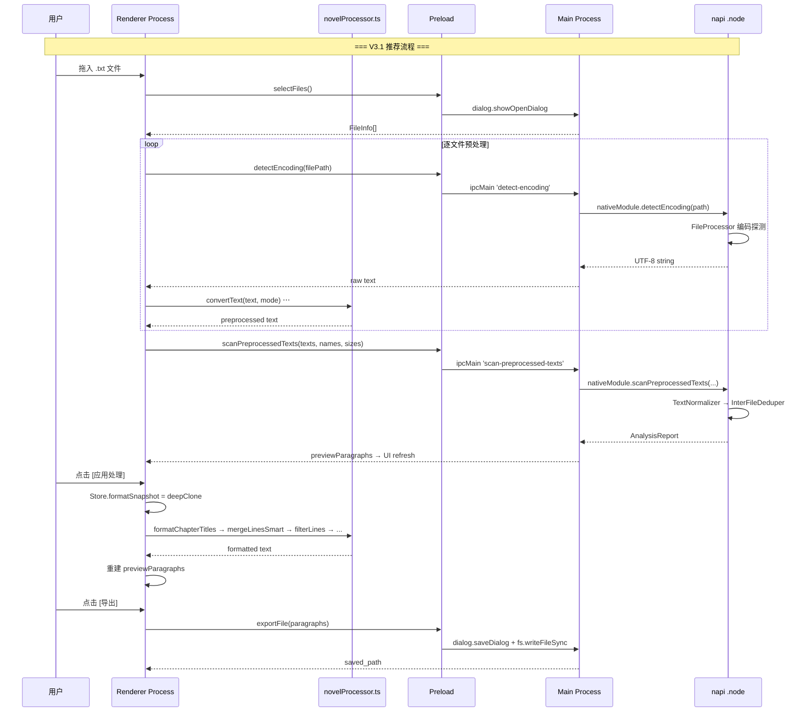

# 文档终版确定器（Text Unifier）V3.1 接口规范文档

| 项目名称 | 文档终版确定器（Text Unifier） |
| :--- | :--- |
| **版本号** | V3.1 |
| **文档类型** | 接口规范文档（接口定义、入参/出参、调用规则） |
| **基线版本** | V3.0 接口规范文档 |
| **关联文档** | `系统架构设计文档_V3.1.md` / `数据库设计文档_V3.1.md` / `功能集成分析_NovelProcessor.md` |

---

## 概述

V3.1 在 V3.0 Electron contextBridge IPC 架构基础上，新增 **2 个 IPC handler** 和 **2 个 napi 函数**，以支持 Phase 1 预处理流水线（繁简转换、垃圾过滤等在前端执行，但需 Rust 提供编码探测和文本直传入口）。

```
通信模型:  Renderer Process  ── electronAPI.xxx() ──→  contextBridge  ──→  ipcMain.handle
           Renderer Process  ←── Promise<T> ───────  contextBridge  ←──  ipcMain.handle 返回
                                                      (部分 handler 调用 napi .node 模块)
```

### 接口清单

| 接口名称 | vs V3.0 | 方向 | 底层实现 | 功能 |
| :--- | :--- | :--- | :--- | :--- |
| `scanFiles` | 不变 | R→M→N | napi `scan_files()` | 扫描分析（兼容旧调用路径） |
| `detectEncoding` 🆕 | **新增** | R→M→N | napi `detect_encoding()` | 编码探测并返回解码文本 |
| `scanPreprocessedTexts` 🆕 | **新增** | R→M→N | napi `scan_preprocessed_texts()` | 预处理文本的归一化+去重 |
| `formatDocument` | 不变 | R→M→N | napi `format_document()` | 文档排版（保留兼容） |
| `exportFile` | 不变 | R→M | dialog + fs | 导出 |
| `selectFiles` | 不变 | R→M | dialog + fs | 文件选择 |

---

## 第一部分：Renderer → Preload 层（前端调用）

### 1. `src/utils/ipc.ts` — V3.1 更新版

```typescript
/**
 * IPC 通信层（V3.1：Electron contextBridge + novelProcessor）
 */

import type { AnalysisReport, FormatResult } from '../types';

const MAX_RETRIES = 3;
const RETRY_BASE_MS = 500;

function getAPI() {
    const api = (window as any).electronAPI;
    if (!api) throw new Error('electronAPI 未初始化');
    return api;
}

async function withRetry<T>(fn: () => Promise<T>, retries = MAX_RETRIES): Promise<T> {
    for (let attempt = 0; attempt <= retries; attempt++) {
        try { return await fn(); }
        catch (error) {
            if (attempt === retries) throw error;
            const delay = RETRY_BASE_MS * Math.pow(2, attempt);
            console.warn(`IPC 重试 (${attempt + 1}/${retries}):`, error);
            await new Promise(r => setTimeout(r, delay));
        }
    }
    throw new Error('IPC 重试耗尽');
}

// ═══════════════════════════════════════════════
// 接口 1: scanFiles — 扫描分析（兼容旧路径）
// ═══════════════════════════════════════════════

/** @deprecated V3.1 推荐使用 scanPreprocessedTexts */
export async function scanFiles(paths: string[]): Promise<AnalysisReport> {
    return withRetry(() => getAPI().scanFiles(paths));
}

// ═══════════════════════════════════════════════
// 接口 2: detectEncoding — 编码探测 ← 🆕 V3.1
// ═══════════════════════════════════════════════

/**
 * 调用 Rust 编码探测链，返回解码后的 UTF-8 文本。
 * 用于 Phase 1 预处理前获取原始文本。
 *
 * @param filePath 文件绝对路径
 * @returns 解码后的 UTF-8 文本
 */
export async function detectEncoding(filePath: string): Promise<string> {
    return withRetry(() => getAPI().detectEncoding(filePath));
}

// ═══════════════════════════════════════════════
// 接口 3: scanPreprocessedTexts — 预处理文本分析 ← 🆕 V3.1
// ═══════════════════════════════════════════════

/**
 * 对前端已预处理（繁简转换、垃圾过滤等）的文本执行归一化和去重。
 *
 * @param texts 预处理后的各文件文本内容
 * @param fileNames 对应文件名
 * @param fileSizes 对应文件大小（字节）
 * @returns 分析报告
 */
export async function scanPreprocessedTexts(
    texts: string[],
    fileNames: string[],
    fileSizes: number[]
): Promise<AnalysisReport> {
    return withRetry(() =>
        getAPI().scanPreprocessedTexts(texts, fileNames, fileSizes)
    );
}

// ═══════════════════════════════════════════════
// 接口 4: formatDocument — 文档排版（保留兼容）
// ═══════════════════════════════════════════════

export async function formatDocument(text: string): Promise<FormatResult> {
    return withRetry(() => getAPI().formatDocument(text));
}

// ═══════════════════════════════════════════════
// 接口 5: exportFile — 导出
// ═══════════════════════════════════════════════

export async function exportFile(
    paragraphs: string[]
): Promise<{ saved_path: string }> {
    return withRetry(() => getAPI().exportFile(paragraphs));
}

// ═══════════════════════════════════════════════
// 接口 6: selectFiles — 文件选择
// ═══════════════════════════════════════════════

export async function selectTxtFiles(): Promise<
    { name: string; path: string; size: number }[]
> {
    return withRetry(() => getAPI().selectFiles());
}
```

---

## 第二部分：Preload → Main Process 层

### 2. `electron/preload.ts` — V3.1 更新版

```typescript
import { contextBridge, ipcRenderer } from 'electron';

contextBridge.exposeInMainWorld('electronAPI', {
    // V3.0 已有
    scanFiles:      (paths: string[]) =>
                        ipcRenderer.invoke('scan-files', paths),

    // V3.1 新增
    detectEncoding: (filePath: string) =>
                        ipcRenderer.invoke('detect-encoding', filePath),
    scanPreprocessedTexts: (texts: string[], fileNames: string[], fileSizes: number[]) =>
                        ipcRenderer.invoke('scan-preprocessed-texts', texts, fileNames, fileSizes),

    // V3.0 已有
    formatDocument: (text: string) =>
                        ipcRenderer.invoke('format-document', text),
    exportFile:     (paragraphs: string[]) =>
                        ipcRenderer.invoke('export-file', paragraphs),
    selectFiles:    () =>
                        ipcRenderer.invoke('select-files'),
});
```

### 3. `electron/preload.d.ts` — V3.1 更新版

```typescript
export interface ElectronAPI {
    scanFiles(paths: string[]): Promise<AnalysisReport>;
    detectEncoding(filePath: string): Promise<string>;                          // 🆕
    scanPreprocessedTexts(texts: string[], fileNames: string[], fileSizes: number[]): Promise<AnalysisReport>; // 🆕
    formatDocument(text: string): Promise<FormatResult>;
    exportFile(paragraphs: string[]): Promise<{ saved_path: string }>;
    selectFiles(): Promise<{ name: string; path: string; size: number }[]>;
}

declare global {
    interface Window {
        electronAPI: ElectronAPI;
    }
}
```

---

## 第三部分：Main Process IPC Handler 定义

### 3.1 新增 Handler

#### `ipcMain.handle('detect-encoding')` — 编码探测 🆕

| 项目 | 内容 |
| :--- | :--- |
| **IPC 通道名** | `detect-encoding` |
| **处理器位置** | `electron/main.ts` |
| **底层实现** | `nativeModule.detectEncoding(filePath)` → Rust napi |
| **功能描述** | 对指定文件执行编码探测（UTF-8 → GB18030 → Windows-1252 → Shift-JIS），返回解码后的 UTF-8 文本。供 Phase 1 预处理使用。 |

#### 请求参数

```typescript
// ipcRenderer.invoke('detect-encoding', filePath)
filePath: string  // .txt 文件的绝对路径
```

| 字段 | 类型 | 必填 | 约束 | 说明 |
| :--- | :--- | :--- | :--- | :--- |
| `filePath` | `string` | 是 | 非空字符串 | 文件绝对路径 |

#### 响应数据

**成功响应：** `string` — 解码后的 UTF-8 文本

**错误响应：**

| 错误场景 | Error message |
| :--- | :--- |
| 文件不存在 | `无法访问文件: {path}` |
| 权限不足 | `无法读取文件: {path}` |
| 文件过大 | `文件大小超过 100MB 限制（当前: {size}MB）` |

#### 调用规则

| 规则编号 | 规则内容 |
| :--- | :--- |
| **R-01** | **编码降级**：UTF-8 → GB18030 → Windows-1252 → Shift-JIS 依次尝试，全部失败后 UTF-8 替换字符降级。不中断流程。 |
| **R-02** | **100MB 硬限制**：同 `scan_files`。 |
| **R-03** | **无归一化**：返回的是原始解码文本，未经任何文本归一化处理。Phase 1 预处理后由 `scan_preprocessed_texts` 进行归一化。 |

---

#### `ipcMain.handle('scan-preprocessed-texts')` — 预处理文本分析 🆕

| 项目 | 内容 |
| :--- | :--- |
| **IPC 通道名** | `scan-preprocessed-texts` |
| **处理器位置** | `electron/main.ts` |
| **底层实现** | `nativeModule.scanPreprocessedTexts(texts, fileNames, fileSizes)` → Rust napi |
| **功能描述** | 对已完成 Phase 1 预处理（繁简转换、垃圾过滤等）的文本数组执行归一化（TextNormalizer）和文件间去重（InterFileDeduper），返回 AnalysisReport。 |

#### 请求参数

```typescript
// ipcRenderer.invoke('scan-preprocessed-texts', texts, fileNames, fileSizes)
texts: string[]       // 预处理后的各文件文本
fileNames: string[]   // 文件名数组（与 texts 一一对应）
fileSizes: number[]   // 文件大小数组（与 texts 一一对应）
```

| 字段 | 类型 | 必填 | 约束 | 说明 |
| :--- | :--- | :--- | :--- | :--- |
| `texts` | `Array<string>` | 是 | 长度 ≥ 1；与 `fileNames`、`fileSizes` 等长 | 各文件预处理后的文本。顺序敏感（第 1 个为主文件）。 |
| `fileNames` | `Array<string>` | 是 | 与 texts 等长 | 文件名数组，用于来源溯源。 |
| `fileSizes` | `Array<number>` | 是 | 与 texts 等长 | 文件大小（字节），用于元数据显示。 |

#### 响应数据

与 `scanFiles` 完全一致的 `AnalysisReport` 结构：

```json
{
  "duplicate_groups": [ /* ... */ ],
  "preview_paragraphs": [ /* ... */ ],
  "total_files": 3,
  "files_metadata": [ /* ... */ ]
}
```

#### 调用规则

| 规则编号 | 规则内容 |
| :--- | :--- |
| **R-04** | **跳过文件 IO**：此函数不执行文件读取和编码探测，直接对传入文本操作。 |
| **R-05** | **V1.1 去重逻辑不变**：`texts[0]` 为主文件，内容完整保留；后续文件仅补充新段落。 |
| **R-06** | **顺序敏感**：同 `scan_files`，数组顺序决定合并结果的段落排列。 |

---

### 3.2 已有 Handler（V3.0 继承）

#### `ipcMain.handle('scan-files')` — 兼容保留

> 与 V3.0 行为完全一致。V3.1 中作为向后兼容路径保留，新代码推荐使用 `detect-encoding` + `scan-preprocessed-texts` 组合。

#### `ipcMain.handle('format-document')` — 兼容保留

> 与 V3.0 行为完全一致。V3.1 中排版功能由前端 `novelProcessor.ts` 替代，此 handler 保留用于向后兼容。

#### `ipcMain.handle('export-file')` — 不变

> 与 V3.0 行为完全一致。

#### `ipcMain.handle('select-files')` — 不变

> 与 V3.0 行为完全一致。

---

## 第四部分：Rust napi 内部接口

### 4.1 新增 napi 函数签名

```rust
// native/src/lib.rs — V3.1 新增

/// 编码探测：读取文件并返回解码后的 UTF-8 文本
///
/// 复用 FileProcessor::read_file_content() 的编码探测链，
/// 但不执行归一化操作。
#[napi]
pub fn detect_encoding(file_path: String) -> Result<String> {
    let path = Path::new(&file_path);
    FileProcessor::read_file_content(path)
        .map_err(|e| napi::Error::from_reason(format!("编码探测失败: {}", e)))
}

/// 预处理文本的归一化 + 去重
///
/// 跳过文件 IO 和编码探测，直接对传入文本执行：
///   TextNormalizer::normalize() → InterFileDeduper::process_file()
///
/// 前提：texts 已由前端完成 Phase 1 预处理（繁简转换、垃圾过滤等）。
#[napi]
pub fn scan_preprocessed_texts(
    texts: Vec<String>,
    file_names: Vec<String>,
    file_sizes: Vec<u32>,
) -> Result<AnalysisReport> {
    if texts.is_empty() {
        return Err(napi::Error::from_reason("文本数组不能为空"));
    }

    let normalizer = TextNormalizer::new();
    let mut engine = InterFileDeduper::new();
    let mut files_metadata: Vec<FileMeta> = Vec::with_capacity(texts.len());

    for i in 0..texts.len() {
        let normalized = normalizer.normalize(&texts[i]);
        let file_name = file_names.get(i)
            .cloned()
            .unwrap_or_else(|| format!("file_{}.txt", i + 1));
        let file_size = file_sizes.get(i).copied().unwrap_or(0);

        files_metadata.push(FileMeta {
            file_name: file_name.clone(),
            file_size,
            modified: 0,  // 预处理文本无修改时间
        });

        engine.process_file(&file_name, &normalized);
    }

    let (duplicate_groups, preview_paragraphs) = engine.finalize();
    let total_files = texts.len();

    Ok(DuplicateResolver::build_report(
        duplicate_groups,
        preview_paragraphs,
        total_files,
        files_metadata,
    ))
}
```

### 4.2 已有 napi 函数（不变）

| 函数 | 说明 |
| :--- | :--- |
| `scan_files(paths)` | 完整路径扫描（向后兼容保留） |
| `format_document(text)` | 文档排版（向后兼容保留） |

### 4.3 模块依赖关系（V3.1）

```text
native/src/
├── lib.rs                      ← #[napi] 入口：+2 新函数
│   ├── file_processor.rs       ← detect_encoding 复用其编码探测
│   ├── text_normalizer.rs      ← 零改动
│   ├── paragraph_index.rs      ← 零改动
│   ├── document_formatter.rs   ← 零改动
│   └── duplicate_resolver.rs   ← 零改动
```

---

## 第五部分：V3.0 → V3.1 接口映射对照

### 5.1 完整映射表

| V3.0 接口 | V3.1 接口 | 变更类型 | 说明 |
| :--- | :--- | :--- | :--- |
| `electronAPI.scanFiles(paths)` | `electronAPI.scanFiles(paths)` | ✅ 保留兼容 | 旧路径可用 |
| — | `electronAPI.detectEncoding(path)` 🆕 | **新增** | Phase 1 编码探测 |
| — | `electronAPI.scanPreprocessedTexts(texts, names, sizes)` 🆕 | **新增** | Phase 2+3 归一化+去重 |
| `electronAPI.formatDocument(text)` | `electronAPI.formatDocument(text)` | ✅ 保留兼容 | 已被前端 novelProcessor.ts 替代 |
| `electronAPI.exportFile(paragraphs)` | `electronAPI.exportFile(paragraphs)` | ✅ 不变 | — |
| `electronAPI.selectFiles()` | `electronAPI.selectFiles()` | ✅ 不变 | — |

### 5.2 推荐调用路径对比

```text
V3.0 文件处理调用路径：
  scanFiles(paths) → AnalysisReport → 手动 formatDocument → 预览

V3.1 文件处理调用路径（推荐）：
  selectFiles() → 获取文件列表
       ↓
  for each file: detectEncoding(path) → raw text
       ↓
  Phase 1 前端预处理: novelProcessor.ts (繁简转换、垃圾过滤...)
       ↓
  scanPreprocessedTexts(texts, names, sizes) → AnalysisReport
       ↓
  Phase 4 前端排版增强: novelProcessor.ts (章节识别、智能换行...)
       ↓
  预览 + exportFile
```

---

## 第六部分：纯前端接口（novelProcessor.ts 内部 API）

> 以下函数运行在 Renderer Process，不经过 IPC。

### 6.1 Phase 1：预处理函数

| 函数 | 入参 | 出参 | 说明 |
| :--- | :--- | :--- | :--- |
| `convertText(text, mode)` | `text: string, mode: ConversionMode` | `string` | 繁简双向转换 |
| `toHalfWidth(text)` | `text: string` | `string` | 全角数字/字母 → 半角 |
| `stripNovelArtifacts(text)` | `text: string` | `string` | 清除广告水印/分隔符 |
| `removeLineEndNumbers(text, minLen)` | `text: string, minLen: number` | `string` | 清除行尾页码数字 |

### 6.2 Phase 4：排版增强函数

| 函数 | 入参 | 出参 | 说明 |
| :--- | :--- | :--- | :--- |
| `formatChapterTitles(text)` | `text: string` | `string` | 识别并格式化章节标题 |
| `splitInlineChapterTitles(text)` | `text: string` | `string` | 拆分内联章节标题 |
| `reorderChaptersByTitle(text)` | `text: string` | `string` | 按章节序号重排全书 |
| `mergeLinesSmart(text, options)` | `text: string, options: MergeOptions` | `string` | 标点感知合并（章节感知） |
| `filterLines(text, keywords, maxLen)` | `text: string, keywords: string[], maxLen: number` | `string` | 关键词过滤 |
| `removeAdjacentDuplicateLines(lines)` | `lines: string[]` | `string[]` | 去除相邻完全重复行 |
| `addParagraphIndent(text)` | `text: string` | `string` | 段首添加两个全角空格 |
| `splitCNParagraph(text)` | `text: string` | `string` | 长段落智能拆分 |

### 6.3 辅助函数

| 函数 | 入参 | 出参 | 说明 |
| :--- | :--- | :--- | :--- |
| `extractChapterOrder(title)` | `title: string` | `number \| null` | 提取章节序号 |
| `isChapterTitle(line)` | `line: string` | `boolean` | 判断是否为章节标题行 |
| `chineseNumeralToNumber(cn)` | `cn: string` | `number` | 中文数字 → 阿拉伯数字 |
| `romanToInt(roman)` | `roman: string` | `number` | 罗马数字 → 阿拉伯数字 |

---

## 第七部分：调用时序图



---

## 第八部分：设计合理性自检

### 8.1 接口完整性

| 检查项 | 结论 | 说明 |
| :--- | :--- | :--- |
| **Phase 1 需求覆盖** | ✅ | `detectEncoding` 提供编码探测；`novelProcessor.ts` 提供 繁简转换/垃圾过滤/全角转换/行尾去噪 |
| **Phase 4 需求覆盖** | ✅ | `novelProcessor.ts` 提供 章节识别/重排/分割/智能换行/筛选/去重/缩进/拆分 |
| **Phase 2+3 兼容** | ✅ | `scanPreprocessedTexts` 完美替代 `scanFiles`，复用 Rust 引擎 |
| **V3.0 向后兼容** | ✅ | `scanFiles` 和 `formatDocument` 保留，旧调用路径仍然可用 |

### 8.2 性能

| 检查项 | 结论 | 说明 |
| :--- | :--- | :--- |
| **IPC 调用次数增量** | ⚠️ 可接受 | V3.0 每批文件 1 次 IPC。V3.1 每文件 +1 次（detectEncoding）+ 全批 +1 次（scanPreprocessedTexts）。5 个文件 = 6 次 IPC。每次 IPC <1ms。 |
| **Phase 1 前端开销** | ✅ O(n) | 10MB 文件 <200ms。 |
| **Phase 4 前端开销** | ✅ O(n) | 10MB 合并后文本 <300ms。 |
| **js-opencc 懒加载** | ✅ | 首次使用时异步加载字典（~5MB），后续调用瞬时。 |

### 8.3 安全性

| 检查项 | 结论 | 说明 |
| :--- | :--- | :--- |
| **contextIsolation** | ✅ 不变 | 强制启用。 |
| **路径校验** | ✅ | `detect-encoding` handler 中 Rust 侧校验文件存在性和大小。 |
| **文本大小限制** | ✅ | `scan_preprocessed_texts` 在各 napi 函数中做 100MB 检查。 |
| **注入攻击** | ✅ | 无风险（全部纯文本处理，无 SQL/HTML 拼接）。 |

### 8.4 幂等性 & 可测试性

| 检查项 | 结论 | 说明 |
| :--- | :--- | :--- |
| **detectEncoding 幂等** | ✅ | 相同文件 → 相同输出。 |
| **scanPreprocessedTexts 幂等** | ✅ | 相同输入 → 相同 AnalysisReport。 |
| **novelProcessor 纯函数** | ✅ | 全部导出函数为纯函数，输入相同则输出相同。 |
| **Rust 单元测试** | ✅ | 25 个测试完整保留。Phase 1/4 前端纯函数可独立 Jest 测试。 |

---

> **文档版本**: V3.1 | **编写日期**: 2026-05-11
