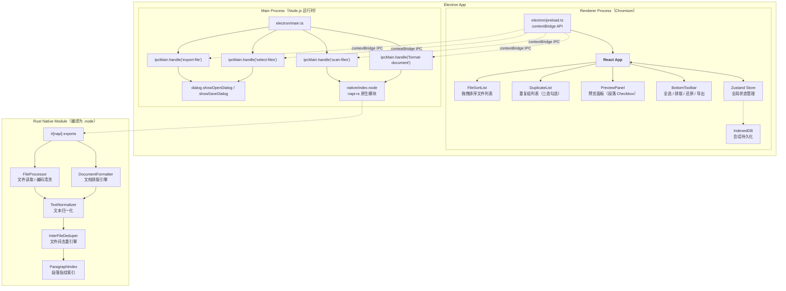
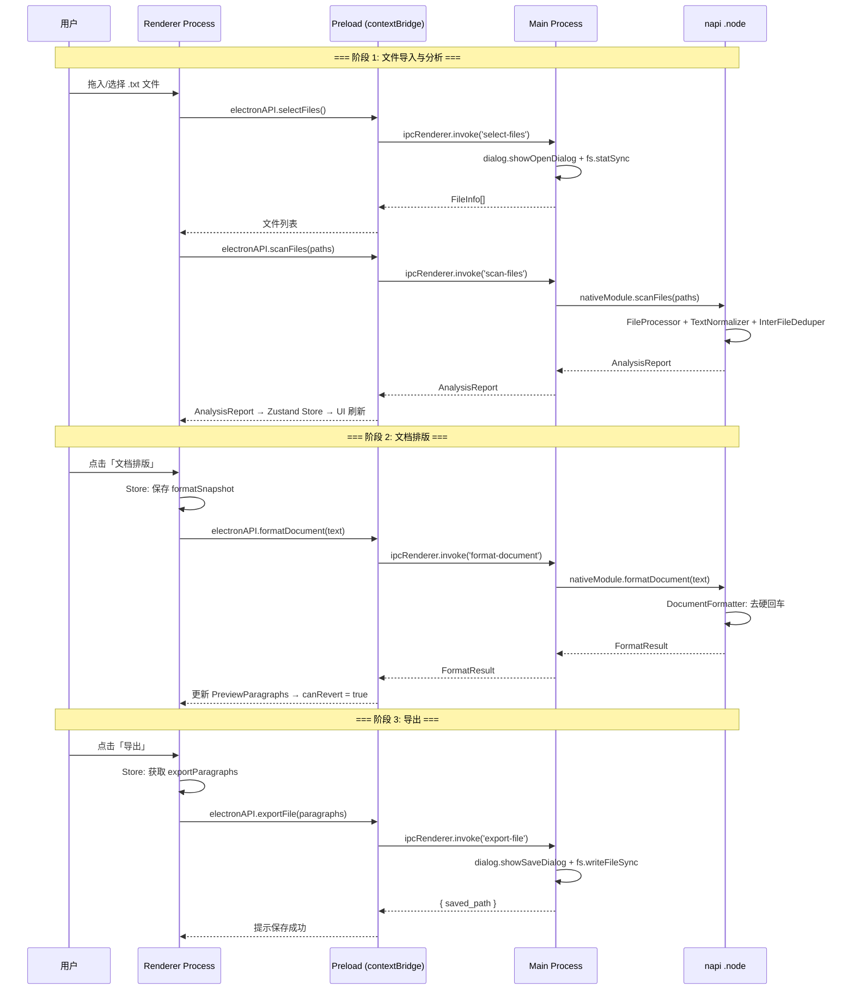

# 文档终版确定器（Text Unifier）V3.0 系统架构设计文档

| 项目名称 | 文档终版确定器（Text Unifier） |
| :--- | :--- |
| **版本号** | V3.0 |
| **文档类型** | 系统架构设计文档（含技术选型、模块划分、交互流程） |
| **基线版本** | V2.0.2（Tauri v2 + Rust 后端） |
| **关联文档** | `PRD_V3.0_产品需求文档.md` / `PRD_V3.0_交互原型.md` / `迁移方案_V3.0_Electron.md` |

---

## 重要声明

V3.0 是 **纯技术架构升级**，不涉及任何功能变更。原有 RQ-01（文件拖拽排序）、RQ-02（段落级勾选删除）、RQ-03（文档排版）、V1.1（文件间去重）全部继承，行为与 V2.0.2 完全一致。本次唯一变更为底层框架从 **Tauri v2** 迁移至 **Electron v31 + napi-rs**，以解除 Windows WebView2 依赖，覆盖 Windows 7 SP1 ~ Windows 11。

---

## 第一部分：技术选型

### 1. 技术选型总览

| 类别 | V2.0.2 方案 | V3.0 方案 | 变更理由 |
| :--- | :--- | :--- | :--- |
| **桌面框架** | Tauri v2（Rust 后端 + 系统 WebView2） | **Electron v31**（内嵌 Chromium） | 解除 WebView2 运行时依赖，Win7 SP1 ~ Win11 全覆盖 |
| **原生桥接** | Tauri IPC（`#[tauri::command]`） | **napi-rs v2**（`#[napi]`） | 将 Rust 模块编译为 `.node` 原生插件，运行于 Electron Main Process |
| **前端框架** | React 18 + TypeScript | **不变** | 100% 复用，零改动 |
| **状态管理** | Zustand 4 | **不变** | Store schema、actions、派生逻辑全部复用 |
| **样式方案** | Tailwind CSS 3.x | **不变** | 原子化 CSS，全部复用 |
| **拖拽排序** | `@dnd-kit/core` + `@dnd-kit/sortable` | **不变** | 全部复用 |
| **后端语言** | Rust（Tauri 内置） | **Rust**（napi-rs 编译为 `.node`） | 核心算法（TextNormalizer / InterFileDeduper / DocumentFormatter）零改动 |
| **并行处理** | Rayon | **不变** | `scan_files` 中并行文件读取完全保留 |
| **数据持久化** | IndexedDB（浏览器端） | **不变** | Chromium 内嵌 IndexedDB 完全兼容 |
| **构建工具** | Vite + Tauri CLI | **Vite + electron-builder + napi-rs CLI** | 分别负责前端构建、打包、Rust 编译 |
| **渲染引擎** | 系统 WebView2 | **内嵌 Chromium** | 零外部运行时依赖 |

### 2. 技术选型对比分析

#### 2.1 框架选型：Electron vs Tauri（V3.0 语境）

| 维度 | Tauri v2（V2.0.2） | Electron v31（V3.0） | 结论 |
| :--- | :--- | :--- | :--- |
| Windows 兼容性 | Win10 1803+（需预装 WebView2） | **Win7 SP1+ ~ Win11** | ✅ Electron 胜出（迁移主因） |
| 包体大小 | ~6 MB | ~68 MB（含 Chromium ~55MB） | ⚠️ 可接受的代价 |
| Rust 集成方式 | Tauri Command（内置 IPC） | napi-rs 编译 `.node`（Main Process 加载） | 等价，算法零改动 |
| 前端兼容性 | WebView2（Edge 内核） | Chromium（同版本 Blink） | ✅ CSS/JS 完全兼容 |
| macOS 支持 | ✅ | ✅ | 均可 |
| 社区生态 | 快速成长 | 成熟（插件、工具链） | ✅ Electron 更丰富 |
| 热更新 | 不支持 | 可通过 asar 实现 | ℹ️ V3.0 暂不需要 |

#### 2.2 napi-rs vs 其他 Rust-to-Node 方案

| 维度 | napi-rs（选用） | neon | wasm-pack |
| :--- | :--- | :--- | :--- |
| 编译产物 | 原生 `.node`（动态库） | 原生 `.node` | `.wasm` |
| 性能 | ✅ 原生速度，零序列化开销 | ✅ 原生速度 | ⚠️ WASM 沙箱开销 |
| 文件系统访问 | ✅ 直接调用 OS API | ✅ 直接调用 OS API | ❌ 沙箱受限 |
| 多线程（Rayon） | ✅ 原生线程 | ⚠️ 受限 | ❌ 不支持 |
| TypeScript 类型生成 | ✅ 自动生成 `.d.ts` | ❌ 手动编写 | ✅ wasm-bindgen |
| **结论** | **✅ 选用** | ❌ 类型支持不足 | ❌ 无法访问文件系统 |

---

## 第二部分：系统架构图

### 1. Electron + napi-rs 进程模型架构



### 2. ASCII 架构图（兼容纯文本查看）

```text
+-------------------------------------------------------------------------------+
|                           Electron App                                          |
|  +-----------------------------+  +------------------------------------------+ |
|  |  Main Process (Node.js)     |  |  Renderer Process (Chromium)             | |
|  |                             |  |                                          | |
|  |  electron/main.ts           |  |  electron/preload.ts                     | |
|  |  ├─ ipcMain.handle() ×4     |  |  └─ contextBridge API → window.electronAPI| |
|  |  │                          |  |                                          | |
|  |  ├─ scan-files    → napi ───┼──→  native/index.node (Rust .node)         | |
|  |  ├─ format-document → napi ─┼──→     ├─ scan_files()                      | |
|  |  ├─ export-file   → dialog  |  |     └─ format_document()                 | |
|  |  └─ select-files  → dialog  |  |                                          | |
|  +-----------------------------+  |  React App (src/)          ← 100% 复用   | |
|                                   |  ├─ FileSortList / PreviewPanel           | |
|                                   |  ├─ DuplicateList / BottomToolbar          | |
|                                   |  ├─ Zustand Store          ← 零改动       | |
|                                   |  ├─ IndexedDB              ← 零改动       | |
|                                   |  └─ src/utils/ipc.ts       ← 重写 IPC 层  | |
|  +-----------------------------+  +------------------------------------------+ |
|  |  构建产物                    |                                              |
|  |  native/index.node (~3 MB)  |  dist/（Vite 打包）                           |
|  +-----------------------------+  +------------------------------------------+ |
+-------------------------------------------------------------------------------+
```

### 3. V2.0 → V3.0 架构映射

```text
V2.0.2 (Tauri)                          V3.0 (Electron)                        变更说明
──────────────────────────────────────  ──────────────────────────────────      ──────────────────────
#[tauri::command]                       #[napi]                                 属性宏替换
fn scan_files(paths) -> Result          fn scan_files(paths) -> Result          函数签名一致
invoke('scan_files', {paths})           electronAPI.scanFiles(paths)            调用方式替换
invoke('format_document', {text})       electronAPI.formatDocument(text)        调用方式替换
invoke('export_text', {paragraphs})     electronAPI.exportFile(paragraphs)      名称修改 + 对话框移到主进程
@tauri-apps/plugin-dialog               dialog.showOpenDialog/SaveDialog        Electron 原生对话框
Tauri IPC (invoke/event)                Electron IPC (ipcMain/ipcRenderer)      底层通信替换
src-tauri/Cargo.toml                    native/Cargo.toml                       重命名 + napi 依赖
src-tauri/src/                          native/src/                             重命名目录
src-tauri/tauri.conf.json               electron-builder.yml                    配置文件替换
```

---

## 第三部分：模块详细设计

### 3.1 模块总览

| 模块名称 | 所属层级 | V3.0 变更 | 核心职责 |
| :--- | :--- | :--- | :--- |
| **FileProcessor** | Rust (napi) | ⚠️ 微调（`u64→u32`） | 文件字节流读取、BOM 去除、编码探测链 |
| **TextNormalizer** | Rust (napi) | ✅ 零改动 | 统一换行符、压缩空白、过滤控制字符 |
| **ParagraphIndex** | Rust (napi) | ⚠️ 微调（`usize→u32`） | SHA256 哈希计算、跨文件段落指纹索引 |
| **InterFileDeduper** | Rust (napi) | ✅ 算法零改动 | V1.1 文件间去重算法 |
| **DocumentFormatter** | Rust (napi) | ✅ 零改动 | RQ-03 段落边界检测 + 受保护块识别 + 合并 |
| **DuplicateResolver** | Rust (napi) | ⚠️ 添加 `#[napi(object)]` | 组装 AnalysisReport 返回前端 |
| **electron/main.ts** 🆕 | Node.js | **新增** | Electron 主进程入口：IPC 注册、窗口管理、对话框 |
| **electron/preload.ts** 🆕 | Chromium | **新增** | contextBridge 安全暴露 API |
| **src/utils/ipc.ts** | React | **重写** | Tauri `invoke()` → Electron `contextBridge` |
| **FileSortList** | React | ✅ 零改动 | 文件拖拽排序列表 |
| **DuplicateList** | React | ✅ 零改动 | 重复组三态勾选联动 |
| **PreviewPanel** | React | ✅ 零改动 | 段落 Checkbox + 淡化渲染 |
| **Zustand Store** | React | ✅ 零改动 | 全局状态管理 |

### 3.2 新增模块详细设计

#### 3.2.1 `electron/main.ts` — Electron 主进程

```
文件路径: electron/main.ts
运行时: Node.js（Electron Main Process）
依赖: electron, native/index.node, fs, path
```

**核心职责：**

| 职责 | 实现方式 |
| :--- | :--- |
| 窗口生命周期 | `BrowserWindow` 创建、`ready-to-show` 事件、`window-all-closed` 退出 |
| IPC 路由注册 | `ipcMain.handle()` 注册 4 个 handler |
| napi 模块加载 | `require('../native/index.node')` |
| 文件对话框 | `dialog.showOpenDialog()` / `dialog.showSaveDialog()` |
| 文件写入 | `fs.writeFileSync()`（UTF-8） |
| 路径校验 | `fs.existsSync()` + `.txt` 后缀检查 |

**IPC Handler 设计：**

```text
┌──────────────────────────────────────────────────────────────────┐
│               electron/main.ts IPC Handler 注册                    │
│                                                                   │
│  ipcMain.handle('scan-files', async (event, paths) => {          │
│     1. 过滤无效路径（fs.existsSync + .txt 后缀检查）               │
│     2. return nativeModule.scanFiles(validPaths)                 │
│  })                                                               │
│                                                                   │
│  ipcMain.handle('format-document', async (event, text) => {      │
│     1. return nativeModule.formatDocument(text)                   │
│  })                                                               │
│                                                                   │
│  ipcMain.handle('export-file', async (event, paragraphs) => {    │
│     1. dialog.showSaveDialog() → 用户选择保存路径                 │
│     2. fs.writeFileSync(filePath, paragraphs.join('\n\n'))       │
│     3. return { saved_path }                                      │
│  })                                                               │
│                                                                   │
│  ipcMain.handle('select-files', async () => {                    │
│     1. dialog.showOpenDialog() → 用户选择 .txt 文件               │
│     2. fs.statSync 收集文件信息                                   │
│     3. return FileInfo[]                                          │
│  })                                                               │
└──────────────────────────────────────────────────────────────────┘
```

#### 3.2.2 `electron/preload.ts` — contextBridge 安全桥

```
文件路径: electron/preload.ts
运行时: Chromium Renderer Process（沙箱环境）
```

**暴露的 API 清单：**

```typescript
// electron/preload.ts
import { contextBridge, ipcRenderer } from 'electron';

contextBridge.exposeInMainWorld('electronAPI', {
    scanFiles:      (paths: string[])          => ipcRenderer.invoke('scan-files', paths),
    formatDocument: (text: string)             => ipcRenderer.invoke('format-document', text),
    exportFile:     (paragraphs: string[])     => ipcRenderer.invoke('export-file', paragraphs),
    selectFiles:    ()                         => ipcRenderer.invoke('select-files'),
});
```

**安全设计：**
- `contextIsolation: true` — 渲染进程与主进程隔离
- `nodeIntegration: false` — 渲染进程无法直接访问 Node.js API
- API 通过 `contextBridge.exposeInMainWorld` 白名单暴露
- 前端只能调用 `window.electronAPI.*`，无法访问底层 ipcRenderer

#### 3.2.3 `native/src/lib.rs` — napi-rs 入口（重写）

```
文件路径: native/src/lib.rs
编译目标: cdylib → .node
变更: #[tauri::command] → #[napi]
```

**导出的 napi 函数：**

| napi 函数 | 对应 Tauri Command | 变更说明 |
| :--- | :--- | :--- |
| `scan_files(paths: Vec<String>) -> Result<AnalysisReport>` | `scan_files` | `#[tauri::command]` → `#[napi]`；错误类型 `String` → `napi::Error` |
| `format_document(text: String) -> Result<FormatResult>` | `format_document` | 同上；新增空输入校验 |
| ~~`export_text`~~ | 已删除 | 文件对话框由 Electron 主进程处理，仅保留写入逻辑 |

**关键代码结构：**

```rust
#[macro_use]
extern crate napi_derive;

mod document_formatter;
mod duplicate_resolver;
mod file_processor;
mod paragraph_index;
mod text_normalizer;

use napi::bindgen_prelude::*;

#[napi]
pub fn scan_files(paths: Vec<String>) -> Result<AnalysisReport> {
    // ... 与 V2.0.2 完全相同的去重逻辑 ...
}

#[napi]
pub fn format_document(text: String) -> Result<FormatResult> {
    if text.trim().is_empty() {
        return Err(napi::Error::from_reason("排版处理失败: 输入文本为空"));
    }
    let formatter = DocumentFormatter::new();
    Ok(formatter.format(&text))
}
```

#### 3.2.4 `native/src/duplicate_resolver.rs` — 数据结构适配

**变更：添加 `#[napi(object)]` 宏 + 类型适配**

| 结构体 | V2.0.2 类型 | V3.0 类型 | 变更原因 |
| :--- | :--- | :--- | :--- |
| `SourceInfo.start_line` | `usize` | `u32` | napi-rs 不支持平台依赖整数 |
| `DuplicateGroup.occurrence_count` | `usize` | `u32` | 同上 |
| `FileMeta.file_size` | `u64` | `u32` | napi-rs 限制；100MB 硬限制下安全 |
| `FileMeta.modified` | `u64` | `u32` | 同上 |
| `AnalysisReport.total_files` | `usize` | `u32` | 同上 |

> **安全性分析**：V2.0 已有 100MB 文件大小硬限制，`u32::MAX ≈ 4.29GB`，所有字段均不会溢出。

### 3.3 零改动模块（100% 复用）

以下模块在 V3.0 中 **一字不改**：

| 模块 | 文件 | 原因 |
| :--- | :--- | :--- |
| 文本归一化 | `text_normalizer.rs` | 纯文本变换，与调用方无关 |
| 文档排版 | `document_formatter.rs` | 同上 |
| 去重引擎算法 | `paragraph_index.rs`（算法核心） | 仅类型赋值处加 `as u32`，算法逻辑不变 |
| 全部 React 组件 | `src/components/*.tsx` | IPC 已抽象到 `utils/ipc.ts`，组件透明 |
| Zustand Store | `src/store/useStore.ts` | 仅 IPC 调用通过 `utils/ipc.ts` 间接发生 |
| TypeScript 类型 | `src/types/index.ts` | 类型定义与框架无关 |
| CSS | `src/index.css` | 样式零依赖框架 |

---

## 第四部分：交互流程设计（数据流）

### 4.1 V2.0 → V3.0 数据流对比

```text
╔══════════════════════════════════════════════════════════════════════╗
║               V2.0.2 (Tauri)              →       V3.0 (Electron)    ║
╠══════════════════════════════════════════════════════════════════════╣
║                                                                      ║
║  React Component                    React Component                  ║
║       │                                  │                           ║
║       ▼ invoke('scan_files',             ▼ electronAPI.scanFiles()   ║
║       │       {paths})                   │                           ║
║       ▼                                  ▼                           ║
║  Tauri Rust Command                 ipcRenderer.invoke('scan-files') ║
║       │                                  │                           ║
║       ▼                                  ▼                           ║
║  Rust fn scan_files()              ipcMain.handle('scan-files')      ║
║       │                                  │                           ║
║       ▼                                  ▼                           ║
║  AnalysisReport (JSON)             nativeModule.scanFiles()          ║
║       │                                  │                           ║
║       ▼                                  ▼                           ║
║  Zustand Store                     AnalysisReport (JS Object)        ║
║                                           │                           ║
║                                           ▼                           ║
║                                    Zustand Store                     ║
╚══════════════════════════════════════════════════════════════════════╝
```

### 4.2 完整工作流（V3.0）



### 4.3 V3.0 新增交互流程：应用启动

```text
                      ┌─ 用户双击 .exe ─┐
                      │                  │
                      v                  v
              [Chromium 冷启动]    [Chromium 热启动]
              (~2~3s)              (~0.5s)
                      │                  │
                      v                  v
              [Splash 窗口]         [直接显示主窗口]
              400×300 无边框
              "正在启动…"
                      │
                      v
              [加载 native/index.node]
                      │
              ┌───────┴────────┐
              │                │
              v                v
        [模块加载成功]    [模块加载失败]
              │                │
              v                v
        [显示主窗口]    [错误对话框]
        [正常使用]       "核心引擎加载失败
                         请重新安装应用"
```

---

## 第五部分：组件树（V3.0 技术视角）

```text
Electron Main Process
├── electron/main.ts                     ← 🆕 主进程入口
│   ├── ipcMain.handle('scan-files')     ← 调用 napi scanFiles
│   ├── ipcMain.handle('format-document') ← 调用 napi formatDocument
│   ├── ipcMain.handle('export-file')    ← dialog.saveDialog + fs.writeFile
│   └── ipcMain.handle('select-files')   ← dialog.openDialog + fs.statSync
├── electron/preload.ts                  ← 🆕 contextBridge
│   └── contextBridge.exposeInMainWorld('electronAPI', { ... })
│
Electron Renderer Process (Chromium)
├── React App (src/)                     ← 100% 复用
│   ├── TitleBar
│   ├── FileSortList                     ← 调用 electronAPI.selectFiles()
│   │   └── SortableFileItem (×N)
│   ├── MainContent
│   │   ├── DuplicateList
│   │   │   └── DuplicateItem (×N)      ← 三态勾选联动
│   │   └── PreviewPanel
│   │       └── PreviewParagraph (×N)   ← Checkbox + 淡化
│   ├── BottomToolbar
│   │   ├── SelectAllButton
│   │   ├── FormatButton                 ← 调用 electronAPI.formatDocument()
│   │   ├── RevertButton
│   │   └── ExportButton                 ← 调用 electronAPI.exportFile()
│   └── StatusBar
│
Native Module (.node)
├── native/src/lib.rs                    ← #[napi] scan_files / format_document
├── native/src/file_processor.rs         ← 零改动（除类型微调）
├── native/src/text_normalizer.rs        ← 零改动
├── native/src/paragraph_index.rs        ← 零改动（除类型微调）
├── native/src/document_formatter.rs     ← 零改动
└── native/src/duplicate_resolver.rs     ← 添加 #[napi(object)]
```

---

## 第六部分：设计合理性自检

### 6.1 算法效率

| 检查项 | 结论 | 说明 |
| :--- | :--- | :--- |
| **napi 调用开销** | ✅ 可忽略 | napi-rs 使用零拷贝 `Buffer`/`String` 传递，无 JSON 序列化中间层。对比 Tauri IPC 的 JSON 序列化，napi 直传更快。 |
| **Rayon 并行保留** | ✅ 通过 | napi 模块运行在 Node.js 主线程，但 Rust 内部 Rayon 线程池独立运行，不受 Node.js event loop 影响。 |
| **regex 引擎** | ✅ 通过 | `regex` crate 的 DFA 引擎不受 napi 环境影响，性能与 Tauri 一致。 |
| **文件 IO** | ✅ 通过 | `std::fs::read` 在 napi 中行为与 Tauri 中一致。 |

### 6.2 内存占用

| 场景 | V2.0.2 峰值 | V3.0 峰值 | 增量 |
| :--- | :--- | :--- | :--- |
| 应用空闲 | ~50MB（WebView2 实例） | **~120MB**（Chromium 实例） | +70MB |
| 10MB × 5 文件分析 | ~120MB | ~190MB | +70MB |
| 100MB × 1 文件分析 | ~180MB | ~250MB | +70MB |

> 增量完全来自 Chromium 运行时（~70MB），Rust 引擎本身内存消耗无变化。对于现代桌面环境（8GB+ RAM），250MB 峰值可接受。

### 6.3 用户体验

| 检查项 | 结论 | 说明 |
| :--- | :--- | :--- |
| **首次启动时间** | ⚠️ 可接受 | Chromium 冷启动约 2~3s，Splash 窗口覆盖等待时间。热启动 <0.5s。 |
| **勾选实时响应** | ✅ 通过 | 纯前端计算，IPC 零参与，<16ms（60fps）。 |
| **排版非阻塞** | ✅ 通过 | napi 调用为 async，不阻塞 Node.js event loop。 |
| **拖拽流畅度** | ✅ 通过 | `@dnd-kit` 使用 GPU 加速 `translate3d()`。 |

### 6.4 类型安全性

| 检查项 | 结论 | 说明 |
| :--- | :--- | :--- |
| **napi-rs 自动生成 .d.ts** | ✅ 通过 | `#[napi]` 宏自动生成 `index.d.ts`，类型与 Rust 定义同步。 |
| **u64→u32 截断** | ✅ 安全 | 文件大小限制 100MB < u32::MAX (4.29GB)。`modified` 时间戳（秒级 u32）可用到 2106 年。 |
| **contextBridge 类型** | ✅ 通过 | `electron/preload.d.ts` 声明 `Window.electronAPI` 类型。 |

### 6.5 安全性

| 检查项 | 结论 | 说明 |
| :--- | :--- | :--- |
| **contextIsolation** | ✅ 强制启用 | 渲染进程沙箱隔离，无法直接访问 Node.js/OS。 |
| **nodeIntegration** | ✅ 强制禁用 | 前端代码无 require/fs 权限。 |
| **路径遍历攻击** | ✅ 通过 | `select-files` handler 中已做 `fs.existsSync` 校验 + `.txt` 后缀过滤。 |
| **napi 模块完整性** | ⚠️ 无签名验证 | 桌面端可接受。如需增强，可在 electron-builder 中添加 asar 完整性校验。 |
| **XSS** | ✅ 通过 | 段落文本仅作为纯文本渲染，不解析 HTML。 |

### 6.6 编码兼容

| 检查项 | 结论 | 说明 |
| :--- | :--- | :--- |
| **编码探测链** | ✅ 通过 | UTF-8 → GB18030 → Windows-1252 → Shift-JIS，Rust 侧零改动。 |
| **BOM 处理** | ✅ 通过 | UTF-8 BOM 主动去除。 |
| **导出编码** | ✅ UTF-8 | `fs.writeFileSync(filePath, content, 'utf-8')` 默认无 BOM。 |

### 6.7 平台兼容性

| 系统 | V2.0.2 (Tauri) | V3.0 (Electron) |
| :--- | :---: | :---: |
| Windows 11 | ✅ | ✅ |
| Windows 10 (1803+) | ✅ | ✅ |
| Windows 10 LTSC | ❌ (无 WebView2) | ✅ |
| Windows 8.1 | ❌ (无 WebView2) | ✅ |
| Windows 7 SP1 | ❌ (无 WebView2) | ✅ |
| macOS 12+ | ✅ | ✅ |

---

## 附录：文件结构变更（完整版）

### 新增文件
```
electron/
    main.ts                         ← Electron 主进程
    preload.ts                      ← contextBridge 安全桥
    preload.d.ts                    ← Window.electronAPI 类型声明
electron-builder.yml                ← 打包配置
native/
    Cargo.toml                      ← napi-rs crate 配置
    build.rs                        ← napi_build::setup()
    src/lib.rs                      ← #[napi] 入口
    src/duplicate_resolver.rs       ← 添加 #[napi(object)]
    index.d.ts                      ← napi 自动生成
    index.js                        ← napi 自动生成
```

### 修改文件
```
src/utils/ipc.ts                    ← Tauri invoke → Electron contextBridge
package.json                        ← 移除 Tauri 依赖，新增 Electron + napi-rs 依赖
vite.config.ts                      ← 移除 Tauri 特定配置，添加 base: './'
tsconfig.json                       ← 移除 @tauri-apps 类型引用
native/src/paragraph_index.rs      ← usize → u32 类型转换
native/src/file_processor.rs       ← u64 → u32 类型转换
```

### 删除文件/目录
```
src-tauri/tauri.conf.json           ← Tauri 配置
src-tauri/capabilities/             ← Tauri v2 权限
src-tauri/gen/                      ← Tauri 自动生成
src-tauri/src/main.rs               ← Tauri 入口
```

### 零改动文件（100% 复用）
```
src/App.tsx
src/main.tsx
src/store/useStore.ts
src/components/ 全部
src/types/index.ts
src/index.css
index.html
tailwind.config.js
postcss.config.js
native/src/text_normalizer.rs      ← 核心算法
native/src/document_formatter.rs   ← 核心算法
```

---

> **文档版本**: V3.0 | **编写日期**: 2026-05-11 | **下一步**: 参见《数据库设计文档_V3.0.md》与《接口规范文档_V3.0.md》
