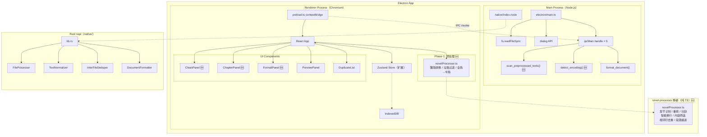
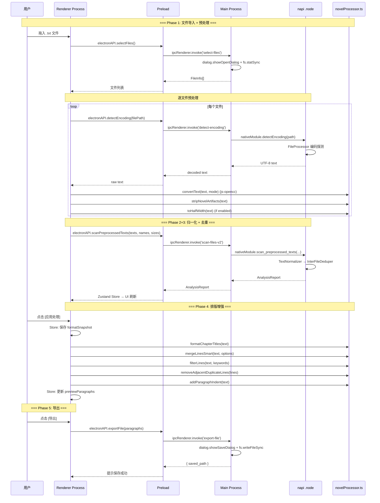

# 文档终版确定器（Text Unifier）V3.1 系统架构设计文档

| 项目名称 | 文档终版确定器（Text Unifier） |
| :--- | :--- |
| **版本号** | V3.1 |
| **文档类型** | 系统架构设计文档（含技术选型、模块划分、交互流程） |
| **基线版本** | V3.0（Electron + napi-rs） |
| **关联文档** | `PRD_V3.1_产品需求文档.md` / `PRD_V3.1_交互原型.md` / `功能集成分析_NovelProcessor.md` |

---

## 重要声明

V3.1 在 V3.0 Electron 架构之上，集成 [novel-processor](https://github.com/rockbenben/novel-processor)（MIT）的**小说文本清洗引擎**。新增 **5 大功能模块**（繁简转换 / 章节识别重排 / 垃圾过滤 / 内容筛选 / 排版增强），形成「清洗 → 归一化 → 去重合并 → 排版增强 → 导出」的完整处理流水线。V3.0 所有既有功能 100% 保留。

---

## 第一部分：技术选型

### 1. 技术选型总览

| 类别 | V3.0 方案 | V3.1 变更 | 选型理由 |
| :--- | :--- | :--- | :--- |
| **桌面框架** | Electron v31 + napi-rs | **不变** | Win7+ 全覆盖，Rust 引擎复用 |
| **前端框架** | React 18 + TypeScript | **不变** | 100% 复用 |
| **状态管理** | Zustand 4 | **扩展**（+3 面板状态 + 2 Actions） | 新增清洗/排版/章节选项状态 |
| **样式方案** | Tailwind CSS 3.x | **不变** | 新增面板组件复用它 |
| **拖拽排序** | `@dnd-kit` | **不变** | 复用 |
| **繁简转换** | — | **新增：`js-opencc`**（MIT，~15KB + ~5MB 字典） | OpenCC 标准，纯 JS 实现，无需原生编译 |
| **后端语言** | Rust（napi-rs） | ⚠️ **微调**（新增 1 个 napi 函数） | 核心算法零改动，仅暴露文本直传入口 |
| **小说清洗算法** | — | **移植 novel-processor**（MIT） | `novelUtils.ts` → `src/utils/novelProcessor.ts`，纯 TS 实现 |
| **数据持久化** | IndexedDB（Chromium） | **扩展 Schema** | 新增清洗/排版选项持久化 |
| **并行处理** | Rayon | **不变** | Rust 引擎不变 |

### 2. 技术选型对比分析

#### 2.1 繁简转换方案：`js-opencc` vs `opencc-rs` (Rust napi)

| 维度 | js-opencc（选用） | opencc-rs (napi) |
| :--- | :--- | :--- |
| 集成难度 | ✅ npm install，纯 JS | ⚠️ 需交叉编译 OpenCC C++ 库 |
| 字典大小 | ~5MB（懒加载） | ~5MB（需打包进 .node） |
| 性能 | 中（JS 字符串遍历） | 高（原生 C++） |
| 跨平台 | ✅ 自动 | ⚠️ 需为 Win/Mac 分别编译 |
| 维护成本 | ✅ 低 | ⚠️ 高（C++ 编译链） |
| **结论** | **✅ 选用** | ❌ 维护成本过高 |

#### 2.2 处理流水线架构：Phase 1 前端 vs Rust

| 维度 | Phase 1 前端（选用） | Phase 1 并入 Rust |
| :--- | :--- | :--- |
| 实现方式 | TS 纯函数，Electron 主进程读取文件 | Rust 新增模块 |
| 开发效率 | ✅ 直接移植 novel-processor TS 源码 | ⚠️ TS→Rust 重写（~200 行逻辑） |
| 维护性 | ✅ 算法与上游同步 | ⚠️ 分叉维护 |
| 性能 | 可接受（JS 字符串操作） | 更优（Rust 原生） |
| `native/` 改动 | ✅ 最小（仅 1 个新 napi 函数） | ❌ 大 |
| **结论** | **✅ 选用** | ❌ 开发成本过高 |

---

## 第二部分：处理流水线架构（V3.1 核心设计）

### 1. 五阶段处理流水线

```text
┌─────────────────────────────────────────────────────────────────────────┐
│                    V3.1 完整处理流水线（5 Phases）                        │
│                                                                          │
│  [用户拖入 .txt 文件]                                                      │
│         │                                                                │
│  ┌──────▼───────────────────────────────────────────────────────────┐  │
│  │ Phase 1: 预处理（前端 TypeScript）                    ← 🆕 V3.1   │  │
│  │                                                                    │  │
│  │  每文件独立执行：                                                    │  │
│  │   1. Electron Main Process: fs.readFileSync → 原始字节              │  │
│  │   2. napi detect_encoding() → 解码为 UTF-8 字符串     ← 🆕 新函数  │  │
│  │   3. js-opencc: 繁→简 / 简→繁 (RQ-04)                             │  │
│  │   4. toHalfWidth: 全角→半角 (RQ-12)                                │  │
│  │   5. stripNovelArtifacts: 广告/水印过滤 (RQ-07)                    │  │
│  │   6. removeLineEndNumbers: 行尾数字清除 (RQ-11)                    │  │
│  └──────┬────────────────────────────────────────────────────────────┘  │
│         │ 每文件 → Vec<String> (预处理后的文本)                           │
│  ┌──────▼───────────────────────────────────────────────────────────┐  │
│  │ Phase 2 + 3: 归一化 + 去重合并（Rust napi）          ← 不变      │  │
│  │                                                                    │  │
│  │   napi scan_preprocessed_texts(texts[], fileNames[])               │  │
│  │     → TextNormalizer: 换行/空格/控制符归一化                         │  │
│  │     → InterFileDeduper: V1.1 文件间去重                             │  │
│  │     → 返回 AnalysisReport                                          │  │
│  └──────┬────────────────────────────────────────────────────────────┘  │
│         │ AnalysisReport                                                │
│  ┌──────▼───────────────────────────────────────────────────────────┐  │
│  │ Phase 4: 排版增强（前端 TypeScript）                  ← 🆕 V3.1   │  │
│  │                                                                    │  │
│  │  对合并后文本执行：                                                  │  │
│  │   7. 章节识别与格式化 (RQ-05): formatChapterTitles()               │  │
│  │   8. 章节分割: splitInlineChapterTitles() (独立操作)                │  │
│  │   9. 章节重排 (RQ-06): reorderChaptersByTitle() (独立操作)         │  │
│  │  10. 智能换行增强: mergeLinesSmart() — 章节感知合并                 │  │
│  │  11. 内容筛选 (RQ-08): filterLines(keywords, maxLen)               │  │
│  │  12. 相邻行去重 (RQ-10): removeAdjacentDuplicateLines()            │  │
│  │  13. 段落缩进 (RQ-09): addParagraphIndent()                        │  │
│  │  14. 长段落拆分 (RQ-13): splitCNParagraph()                        │  │
│  └──────┬────────────────────────────────────────────────────────────┘  │
│         │ 排版后的 PreviewParagraph[]                                    │
│  ┌──────▼───────────────────────────────────────────────────────────┐  │
│  │ Phase 5: 输出（不变）                                               │  │
│  │                                                                    │  │
│  │   预览 + 段落勾选 + 导出纯净 TXT                                     │  │
│  └───────────────────────────────────────────────────────────────────┘  │
└─────────────────────────────────────────────────────────────────────────┘
```

### 2. 处理流水线触发策略

| 触发条件 | 执行范围 | 说明 |
| :--- | :--- | :--- |
| 用户拖入/添加新文件 | **Phase 1→3 自动**，Phase 4→5 等待手动触发 | Phase 1→3 耗时最长，自动执行 |
| 用户拖拽排序文件列表 | **Phase 1→3 自动** | 重新分析 |
| 用户点击「应用处理」 | **Phase 1→5 全流水线** | 含所有预处理和排版增强 |
| 用户点击「章节分割」 | **仅 Phase 4，步骤 8** | 一次性操作 |
| 用户点击「章节重排」 | **仅 Phase 4，步骤 9** | 一次性操作 |
| 用户点击「还原排版」 | **恢复快照** | 不执行任何流水线 |

---

## 第三部分：系统架构图

### 1. Electron + napi-rs 进程模型（V3.1）



### 2. ASCII 架构图（兼容纯文本查看）

```text
+-------------------------------------------------------------------------------+
|                         Electron App (V3.1)                                     |
|                                                                                |
|  +-- Main Process (Node.js) --------------------+  +-- Renderer (Chromium) --+ |
|  |                                               |  |                          | |
|  |  electron/main.ts                             |  |  Phase 1 预处理 🆕       | |
|  |  ├─ fs.readFileSync (文件读取)                |  |  ├─ js-opencc 繁简转换   | |
|  |  ├─ ipcMain.handle('detect-encoding') → napi  |  |  ├─ stripNovelArtifacts  | |
|  |  ├─ ipcMain.handle('scan-files') → napi       |  |  ├─ toHalfWidth          | |
|  |  ├─ ipcMain.handle('format-document') → napi  |  |  └─ removeLineEndNumbers | |
|  |  ├─ ipcMain.handle('export-file') → dialog    |  |                          | |
|  |  └─ ipcMain.handle('select-files') → dialog   |  |  Phase 4 排版增强 🆕     | |
|  |                                               |  |  ├─ 章节识别/重排/分割   | |
|  |  native/index.node (napi-rs)                   |  |  ├─ 智能换行（章节感知） | |
|  |  ├─ detect_encoding()        ← 🆕              |  |  ├─ 内容筛选             | |
|  |  ├─ scan_preprocessed_texts() ← 🆕             |  |  ├─ 相邻行去重           | |
|  |  ├─ scan_files()             ← 保留兼容        |  |  ├─ 段落缩进             | |
|  |  └─ format_document()        ← 不变            |  |  └─ 长段落拆分           | |
|  |                                               |  |                          | |
|  +-----------------------------------------------+  |  UI（扩展）              | |
|                                                      |  ├─ SidePanel 🆕        | |
|  +-- Rust Core (native/src/) --------------------+   |  │  ├─ CleanPanel 🆕    | |
|  |                                               |   |  │  ├─ ChapterPanel 🆕  | |
|  |  lib.rs       ← 新增 2 个 #[napi] 函数        |   |  │  └─ FormatPanel 🆕   | |
|  |  file_processor.rs      ← 零改动              |   |  ├─ PreviewPanel        | |
|  |  text_normalizer.rs     ← 零改动              |   |  ├─ DuplicateList       | |
|  |  paragraph_index.rs     ← 零改动              |   |  ├─ FileSortList        | |
|  |  document_formatter.rs  ← 零改动              |   |  ├─ BottomToolbar       | |
|  |  duplicate_resolver.rs  ← 零改动              |   |  └─ StatusBar（+章节数） | |
|  +-----------------------------------------------+   |                          | |
|                                                      |  Zustand Store（扩展）   | |
|                                                      |  IndexedDB（扩展）       | |
|                                                      +--------------------------+ |
+-------------------------------------------------------------------------------+
```

---

## 第四部分：模块详细设计

### 4.1 新增模块

#### 4.1.1 `novelProcessor.ts` — 小说文本清洗引擎（核心新增）

```
文件路径: src/utils/novelProcessor.ts
来源: 移植 novel-processor 的 novelUtils.ts + utils/textUtils.ts
语言: 纯 TypeScript（无原生依赖）
行数: ~200 行
```

**导出函数清单：**

| 函数 | 对应 RQ | 功能 | 来源 |
| :--- | :---: | :--- | :--- |
| `convertText(text, mode)` | RQ-04 | 繁简双向转换 | js-opencc 封装 |
| `toHalfWidth(text)` | RQ-12 | 全角数字/字母 → 半角 | textUtils.ts |
| `stripNovelArtifacts(text)` | RQ-07 | 清除广告水印/分隔符 | novelUtils.ts |
| `removeLineEndNumbers(text, minLen)` | RQ-11 | 清除行尾页码数字 | novelUtils.ts |
| `formatChapterTitles(text)` | RQ-05 | 识别并格式化章节标题行 | novelUtils.ts |
| `splitInlineChapterTitles(text)` | RQ-05 | 将内联章节标题拆分为独立行 | novelUtils.ts |
| `reorderChaptersByTitle(text)` | RQ-06 | 按章节序号重排全书 | novelUtils.ts |
| `extractChapterOrder(title)` | RQ-06 | 提取章节序号（中/英/罗马→阿拉伯） | novelUtils.ts |
| `mergeLinesSmart(text, options)` | RQ-03增强 | 标点感知合并（章节标题感知，替代旧去硬回车） | textUtils.ts |
| `filterLines(text, keywords, maxLen)` | RQ-08 | 关键词过滤 + 长度豁免 | textUtils.ts |
| `removeAdjacentDuplicateLines(lines)` | RQ-10 | 去除相邻重复行 | textUtils.ts |
| `addParagraphIndent(text)` | RQ-09 | 段首添加两个全角空格 | textUtils.ts |
| `splitCNParagraph(text)` | RQ-13 | 长段落智能拆分（中文标点感知） | textUtils.ts |

#### 4.1.2 `regexPatterns.ts` — 共享正则常量

```
文件路径: src/utils/regexPatterns.ts
语言: TypeScript
行数: ~30 行
```

```typescript
// 章节标题正则（中/英/罗马数字）
export const CHAPTER_PATTERNS = {
  chinese: /^第[〇零一二三四五六七八九十百千万\d]+[章节回卷部]/,
  arabic: /^第\d+[章节回卷部]/,
  english: /^Chapter\s+\d+/i,
  roman: /^Chapter\s+[IVXLCDM]+/i,
  generic: /^[第Chapter]/,  // fallback
};

// 句尾标点（用于智能换行标点感知）
export const SENTENCE_END_PUNCTUATION = /[。！？」）〗》』"']$/;

// 列表标记
export const LIST_MARKERS = /^[-*•·]|^\d+[.、]|^[①②③④⑤⑥⑦⑧⑨⑩]/;

// 广告水印关键词
export const AD_PATTERNS = [
  /本文是使用怠惰小说下载器下载的/,
  /刺猬猫.*飞卢.*点娘.*少年梦/,
  /本书由.*整理/,
  /请在下载后\d+小时内删除/,
  /分卷阅读\d*/,
  /^={5,}$/,
];

// 行尾数字（页码）
export const LINE_END_NUMBERS = /\d{2,}$/;
```

#### 4.1.3 `CleanPanel` — 内容清洗面板（React 组件）

```
文件路径: src/components/CleanPanel.tsx
行数: ~150 行
```

**子控件与默认值：**

| 控件 | 类型 | 默认值 | 说明 |
| :--- | :--- | :--- | :--- |
| 繁简转换 | `Segmented`（3 选项） | `'none'` | 不变 / 繁→简 / 简→繁 |
| 全角→半角 | `Switch` | `false` | 全角数字字母转半角 |
| 垃圾过滤 | `Switch` | `true` | `stripNovelArtifacts` |
| 行尾数字清除 | `Switch` | `false` | 清除行尾页码 |
| 过滤关键词 | `Input` | `''` | 逗号分隔多个关键词 |
| 筛选阈值 | `InputNumber` | `0` | 0=不启用 |

#### 4.1.4 `ChapterPanel` — 章节工具面板（React 组件）

```
文件路径: src/components/ChapterPanel.tsx
行数: ~80 行
```

| 控件 | 类型 | 默认值 | 说明 |
| :--- | :--- | :--- | :--- |
| 章节格式化 | `Switch` | `true` | 随「应用处理」自动执行 |
| 章节分割 | `Button`（outlined） | — | 独立操作，点击即执行 |
| 章节重排 | `Button`（outlined） | — | 独立操作，点击即执行 |
| 章节计数 | `Text` | — | 如「已识别 5 个章节」 |

#### 4.1.5 `FormatPanel` — 排版增强面板（重构原 FormatButton）

```
文件路径: src/components/FormatPanel.tsx
行数: ~100 行
```

| 控件 | 类型 | 默认值 | 说明 |
| :--- | :--- | :--- | :--- |
| 智能换行 | `Switch` | `true` | 章节感知合并（替代旧去硬回车） |
| 段落缩进 | `Switch` | `true` | 段首添加两个全角空格 |
| 相邻行去重 | `Switch` | `true` | 去除相邻重复行 |
| 长段落拆分 | `Switch` | `false` | 中文标点感知拆分 |

#### 4.1.6 `SidePanel` — 右侧工具面板容器（React 组件）

```
文件路径: src/components/SidePanel.tsx
行数: ~60 行
```

> 容纳 CleanPanel、ChapterPanel、FormatPanel 三个子面板。≥1400px 宽度时固定右侧 280px；1024-1399px 时折叠为顶部 dropdown；<1024px 时悬浮按钮触发 drawer。

### 4.2 Rust 新增 napi 函数

#### 4.2.1 `detect_encoding` — 编码探测（新增）

```rust
/// 探测文件编码并返回解码后的 UTF-8 字符串
///
/// 从 FileProcessor 中提取编码探测逻辑为独立函数，
/// 供 Phase 1 前端预处理前使用。
#[napi]
pub fn detect_encoding(file_path: String) -> Result<String>
```

**实现**：复用 `FileProcessor::read_file_content()` 的编码探测链（UTF-8 → GB18030 → Windows-1252 → Shift-JIS），但不做任何归一化处理。

#### 4.2.2 `scan_preprocessed_texts` — 预处理文本的归一化+去重（新增）

```rust
/// 对前端已预处理（繁简转换、垃圾过滤等）的文本执行归一化和去重
///
/// 与 scan_files 的区别：
/// - 输入是已解码的文本字符串（而非文件路径）
/// - 跳过文件读取与编码探测
/// - 直接进入 TextNormalizer → InterFileDeduper 流水线
#[napi]
pub fn scan_preprocessed_texts(
    texts: Vec<String>,
    file_names: Vec<String>,
    file_sizes: Vec<u32>,
) -> Result<AnalysisReport>
```

**实现**：跳过 `FileProcessor::read_file_content()` 步骤，直接对传入文本调用 `TextNormalizer::normalize()` → `InterFileDeduper::process_file()`。

### 4.3 修改的 Rust 文件（最小化）

| 文件 | 变更 | 行数 |
| :--- | :--- | :---: |
| `native/src/lib.rs` | 新增 `detect_encoding` 和 `scan_preprocessed_texts` 两个 `#[napi]` 函数 | +50 |
| `native/src/` 其余文件 | **零改动** | 0 |

### 4.4 修改的前端文件

| 文件 | 变更 | 说明 |
| :--- | :--- | :--- |
| `src/utils/ipc.ts` | 新增 `detectEncoding()` / `scanPreprocessedTexts()` | IPC 封装 |
| `src/store/useStore.ts` | 新增 `cleanOptions`、`formatOptions`、`chapterList`、`applyProcessing()`、`splitChapters()`、`reorderChapters()` | 状态扩展 |
| `src/types/index.ts` | 新增 `CleanOptions`、`FormatOptions`、`ChapterInfo`、`ConversionMode` | 类型扩展 |
| `src/App.tsx` | 集成 SidePanel / 修改 BottomToolbar | UI 集成 |
| `package.json` | 新增 `js-opencc` 依赖 | 依赖 |
| `electron/main.ts` | 新增 `detect-encoding` / `scan-files` handler 适配 | IPC handler |

### 4.5 零改动文件（100% 复用）

```
native/src/file_processor.rs
native/src/text_normalizer.rs
native/src/paragraph_index.rs
native/src/document_formatter.rs
native/src/duplicate_resolver.rs
src/components/FileSortList.tsx
src/components/FileDropZone.tsx
src/components/DuplicateList.tsx
src/components/DuplicateItem.tsx
src/components/PreviewPanel.tsx
src/components/PreviewParagraph.tsx
src/components/PreviewCheckbox.tsx
src/components/Tooltip.tsx
src/components/ExportButton.tsx
src/index.css
tailwind.config.js
```

---

## 第五部分：交互流程设计（数据流）

### 5.1 完整处理流水线时序



### 5.2 独立操作流程

```text
┌─ [章节分割] 按钮 ───────────────────────────────────────┐
│                                                          │
│  点击 → Store.splitChapters()                            │
│       → novelProcessor.splitInlineChapterTitles(text)    │
│       → 更新 previewParagraphs                           │
│       → Toast "章节分割完成"                              │
└──────────────────────────────────────────────────────────┘

┌─ [章节重排] 按钮 ───────────────────────────────────────┐
│                                                          │
│  点击 → Store.reorderChapters()                          │
│       → novelProcessor.extractChapterOrder(title) ×N     │
│       → 按序号排序 → 重组文本                             │
│       ├─ 成功: 更新 previewParagraphs + Toast             │
│       └─ 失败: Toast "未识别到有效章节标题"               │
└──────────────────────────────────────────────────────────┘

┌─ [还原排版] 按钮 ───────────────────────────────────────┐
│                                                          │
│  点击 → Store.revertFormatting()                         │
│       → previewParagraphs = formatSnapshot               │
│       → formatSnapshot = null                            │
│       → canRevert = false                                │
└──────────────────────────────────────────────────────────┘
```

---

## 第六部分：组件树（V3.1 完整版）

```text
App
├── TitleBar
├── FileSortList                          ← 不变
│   ├── SortableFileItem (×N)
│   └── AddFileButton
├── MainContent（三栏布局 ≥1400px）
│   ├── DuplicateList                     ← 不变（左侧 ~250px）
│   │   └── DuplicateItem (×N)
│   ├── PreviewPanel                      ← 不变（中间 flex-1）
│   │   └── PreviewParagraph (×N)
│   │       ├── PreviewCheckbox
│   │       ├── ParagraphText
│   │       └── Tooltip
│   └── SidePanel                         ← 🆕 V3.1（右侧 ~280px）
│       ├── CleanPanel                    ← 🆕
│       │   ├── Segmented（繁简转换）
│       │   ├── Switch（全角→半角）
│       │   ├── Switch（垃圾过滤）
│       │   ├── Switch（行尾数字）
│       │   ├── Input（过滤关键词）
│       │   └── InputNumber（筛选阈值）
│       ├── ChapterPanel                  ← 🆕
│       │   ├── Switch（章节格式化）
│       │   ├── Button（章节分割）
│       │   ├── Button（章节重排）
│       │   └── Text（章节计数）
│       └── FormatPanel                   ← 🆕 重构
│           ├── Switch（智能换行）
│           ├── Switch（段落缩进）
│           ├── Switch（相邻行去重）
│           └── Switch（长段落拆分）
├── BottomToolbar                         ← 增强
│   ├── SelectAllButton
│   ├── SelectionCounter
│   ├── RevertButton
│   ├── ApplyButton                       ← 🆕 替代"文档排版"
│   └── ExportButton
└── StatusBar                             ← 增强
    ├── StatusText
    ├── ParagraphCount
    ├── ChapterCount                      ← 🆕
    └── EstimatedSize
```

---

## 第七部分：设计合理性自检

### 7.1 算法效率

| 检查项 | 结论 | 说明 |
| :--- | :--- | :--- |
| **Phase 1 前端预处理** | ✅ O(n) | 每文件单次遍历，纯字符串操作。10MB 文件 <200ms（JS）。 |
| **js-opencc 性能** | ✅ 可接受 | 基于字典查找 + 字符串替换，10MB 文本 <500ms。 |
| **Phase 4 前端排版** | ✅ O(n) | 多次遍历但总复杂度 O(n)，10MB 文本 <300ms。 |
| **Rust 核心不变** | ✅ | TextNormalizer + InterFileDeduper 性能与 V3.0 一致。 |
| **全流水线耗时（10MB × 5 文件）** | ✅ <3s | Phase 1 ~1s + Rust ~1s + Phase 4 ~0.5s + IPC ~0.5s。 |

### 7.2 内存占用

| 场景 | V3.0 峰值 | V3.1 峰值 | 增量 |
| :--- | :--- | :--- | :--- |
| 应用空闲（含 Chromium） | ~120MB | **~130MB**（+ js-opencc 字典 ~5MB + 组件 ~5MB） | +10MB |
| 10MB × 5 文件处理 | ~190MB | **~210MB**（Phase 1 预处理副本 + Phase 4 中间产物） | +20MB |

### 7.3 用户体验

| 检查项 | 结论 | 说明 |
| :--- | :--- | :--- |
| **Phase 1 预处理透明** | ✅ | 非阻塞 async 操作，UI 显示 Loading。 |
| **Phase 4 排版非阻塞** | ✅ | 纯前端计算，不调用 IPC。 |
| **独立操作即时反馈** | ✅ | 章节分割/重排为纯 TS 函数，<100ms 完成。 |
| **面板折叠响应式** | ✅ | ≥1400px 三栏；1024-1399px 顶栏 dropdown；<1024px drawer。 |

### 7.4 Rust 变更最小化

| 检查项 | 结论 | 说明 |
| :--- | :--- | :--- |
| **核心算法文件零改动** | ✅ | 5 个 `.rs` 文件一字不改。 |
| **仅新增 2 个 napi 函数** | ✅ | `detect_encoding` + `scan_preprocessed_texts`，~50 行。 |
| **编码探测逻辑复用** | ✅ | `detect_encoding` 直接复用 `FileProcessor::read_file_content()`。 |
| **归一化+去重逻辑复用** | ✅ | `scan_preprocessed_texts` 跳过文件 IO，直接调用现有引擎。 |

### 7.5 许可合规

| 项目 | 许可证 | 合规操作 |
| :--- | :--- | :--- |
| novel-processor | MIT | README + 「关于」页面添加版权声明 |
| js-opencc | MIT | 同上 |

### 7.6 功能覆盖

| PRD 需求 | 实现模块 | 状态 |
| :--- | :--- | :---: |
| RQ-04 繁简转换 | `novelProcessor.ts` + js-opencc | ✅ |
| RQ-05 章节识别格式化 | `novelProcessor.ts` — `formatChapterTitles()` | ✅ |
| RQ-06 章节重排 | `novelProcessor.ts` — `reorderChaptersByTitle()` | ✅ |
| RQ-07 垃圾内容过滤 | `novelProcessor.ts` — `stripNovelArtifacts()` | ✅ |
| RQ-08 内容筛选 | `novelProcessor.ts` — `filterLines()` | ✅ |
| RQ-09 段落缩进 | `novelProcessor.ts` — `addParagraphIndent()` | ✅ |
| RQ-10 相邻行去重 | `novelProcessor.ts` — `removeAdjacentDuplicateLines()` | ✅ |
| RQ-11 行尾数字清除 | `novelProcessor.ts` — `removeLineEndNumbers()` | ✅ |
| RQ-12 全角转半角 | `novelProcessor.ts` — `toHalfWidth()` | ✅ |
| RQ-13 长段落拆分 | `novelProcessor.ts` — `splitCNParagraph()` | ✅ |

---

> **文档版本**: V3.1 | **编写日期**: 2026-05-11 | **下一步**: 参见《数据库设计文档_V3.1.md》与《接口规范文档_V3.1.md》
