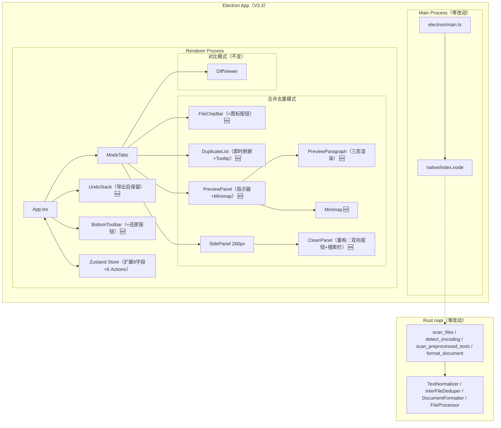

# 文档终版确定器（Text Unifier）V3.3 系统架构设计文档

| 项目名称 | 文档终版确定器（Text Unifier） |
| :--- | :--- |
| **版本号** | V3.3 |
| **文档类型** | 系统架构设计文档（含技术选型、模块划分、交互流程） |
| **基线版本** | V3.2（UI重构 + 对比模式 + 编辑撤回） |
| **关联文档** | `PRD_V3.3_产品需求文档.md` / `PRD_V3.3_交互原型.md` |

---

## 重要声明

V3.3 聚焦 **交互打磨**——解决 V3.2 遗留的 9 项体验缺陷。新增预览条（段落指示器 + Minimap）、双向切换按钮、关键词搜索/删除等交互。**Rust napi 引擎 / Electron Main Process / IPC 层均零改动**。全部变更在 Renderer Process 的纯前端 TypeScript 中完成。

---

## 第一部分：技术选型

### 1. 技术选型总览

| 类别 | V3.2 方案 | V3.3 变更 | 选型理由 |
| :--- | :--- | :--- | :--- |
| **桌面框架** | Electron v31 + napi-rs | **不变** | — |
| **前端框架** | React 18 + TypeScript | **不变** | 复用全部组件 |
| **状态管理** | Zustand 4 | **扩展**（+toggle状态 +minimap数据 +搜索位置 +modifiedParagraphIds） | 轻量扩展 |
| **样式方案** | Tailwind CSS 3.x | **不变** | 新增 border-l 指示器、minimap 原子类 |
| **拖拽排序** | `@dnd-kit` | **不变** | 复用 |
| **双向切换按钮** | — | **纯 CSS Toggle**（`bg-blue-500` ↔ `bg-gray-500`） | 零依赖，状态由 zustand 管理 |
| **Minimap** | — | **纯 DOM + Canvas 可选** | 简单色条用 DOM，大量段落可用 Canvas |
| **Tooltip 统一** | 已有组件 | **复用** `Tooltip` 组件，新增 300ms 延迟 | 防频繁弹出 |
| **搜索高亮** | — | **DOM class 切换**（`bg-yellow-200` + `setTimeout` 3s消退） | 零依赖 |
| **后端语言** | Rust（napi-rs） | **零改动** | — |
| **数据持久化** | IndexedDB | **新增** `isFullWidthConverted` / `isTraditionalConverted` 偏好 | 最小化 |

---

## 第二部分：系统架构图

### 1. V3.3 架构（纯前端变更）



### 2. ASCII 架构图

```text
+-------------------------------------------------------------------------------+
|                         Electron App (V3.3)                                     |
|                                                                                |
|  +-- Main Process（零改动）--+  +-- Renderer Process -------------------------+|
|  | electron/main.ts          |  |                                              ||
|  | native/index.node         |  |  App.tsx                                     ||
|  +---------------------------+  |  ├─ FileChipBar 🆕 (36×36 + 图标按钮)        ||
|                                 |  │   └─ FileChip + Tooltip                   ||
|  +-- Rust napi（零改动）------+  |  ├─ DuplicateList 🆕 (即时刷新/Tooltip)      ||
|  | scan_files                 |  |  │   └─ DuplicateItem + Tooltip             ||
|  | detect_encoding            |  |  ├─ PreviewPanel 🆕 (指示器+Minimap)        ||
|  | scan_preprocessed_texts    |  |  │   ├─ ParagraphIndicator (绿/红/橙 3px)  ||
|  | format_document            |  |  │   ├─ PreviewParagraph (三态渲染)          ||
|  | file_processor.rs（零改动）|  |  │   └─ Minimap (30px 色条列)              ||
|  | text_normalizer.rs（零改动）|  |  ├─ SidePanel (260px)                      ||
|  | paragraph_index.rs（零改动）|  |  │   └─ CleanPanel 🆕 (重构)               ||
|  | document_formatter.rs（零）|  |  │       ├─ ToggleButton ×2                 ||
|  | duplicate_resolver.rs（零）|  |  │       └─ KeywordSearchBar                ||
|  +----------------------------+  |  ├─ BottomToolbar (+还原按钮)                ||
|                                   |  ├─ UndoStack (导出后保留)                  ||
|                                   |  └─ Zustand Store (扩展)                    ||
|                                   +----------------------------------------------+
+-------------------------------------------------------------------------------+
```

---

## 第三部分：模块详细设计

### 3.1 新增模块

#### 3.1.1 `ParagraphIndicator` — 段落状态指示器

```
文件路径: src/components/ParagraphIndicator.tsx
行数: ~20 行
```

**设计**：3px 宽的彩色竖线，纯 CSS 实现（`border-l-[3px]`）。

| 状态 | CSS 类 | 含义 |
| :--- | :--- | :--- |
| `normal` | `border-l-green-500` | 正常段落（勾选 + 未修改） |
| `deleted` | `border-l-red-400` | 已删除（取消勾选 / 重复组排除） |
| `modified` | `border-l-orange-400` | 被工具修改过 |

**优先级**：红色 > 橙色 > 绿色（被删除的段落即使被工具修改也显示红色）。

#### 3.1.2 `Minimap` — 预览缩略图

```
文件路径: src/components/Minimap.tsx
行数: ~80 行
```

**设计**：预览区右侧 30px 宽的细长柱状图，每段对应 2px 高色条 + 1px 间距。

| 属性 | 类型 | 说明 |
| :--- | :--- | :--- |
| `items` | `MinimapItem[]` | 段落色条列表 |
| `onItemClick` | `(index: number) => void` | 点击跳转 |
| `visibleCount` | `number` | 当前可视段落数（用于高亮可见区） |

```typescript
interface MinimapItem {
    color: 'green' | 'red' | 'orange';
    tooltip: string;  // 段落前 20 字
}
```

**交互**：
- 悬停色条 → 色条亮度 +20% + Tooltip 显示段落前 20 字
- 点击色条 → 预览区 `scrollTo` 跳转到对应段落
- 预览区滚动 → Minimap 中可见区域色条高亮

**滚动联动实现**：

```typescript
// PreviewPanel → Minimap
const onPreviewScroll = () => {
    const ratio = previewRef.current.scrollTop / previewRef.current.scrollHeight;
    minimapRef.current.scrollTop = ratio * minimapRef.current.scrollHeight;
};

// Minimap → PreviewPanel
const onMinimapClick = (index: number) => {
    const paragraphEl = document.querySelector(`[data-para-index="${index}"]`);
    paragraphEl?.scrollIntoView({ behavior: 'smooth', block: 'center' });
};
```

#### 3.1.3 `ToggleButton` — 双向切换按钮

```
文件路径: src/components/ToggleButton.tsx
行数: ~40 行
```

**设计**：纯按钮组件，状态由父组件（CleanPanel + Zustand Store）管理。

| 属性 | 类型 | 说明 |
| :--- | :--- | :--- |
| `labelForward` | `string` | 正向标签（如「全角→半角」） |
| `labelBackward` | `string` | 反向标签（如「半角→全角」） |
| `isToggled` | `boolean` | 是否已切换至反向状态 |
| `onToggle` | `() => void` | 点击回调 |

**样式**：
- 未切换：`bg-blue-500 text-white px-3 py-1.5 rounded-lg text-xs font-medium hover:bg-blue-600`
- 已切换：`bg-gray-500 text-white px-3 py-1.5 rounded-lg text-xs font-medium hover:bg-gray-600`

**底层逻辑**：不维护转换历史，仅对当前文本执行方向操作。两次点击 = 来回转换 = 回到原文（OpenCC 无损往返保证）。

#### 3.1.4 `KeywordSearchBar` — 关键词搜索栏

```
文件路径: src/components/KeywordSearchBar.tsx
行数: ~60 行
```

| 属性 | 类型 | 说明 |
| :--- | :--- | :--- |
| `keywords` | `string` | 逗号分隔的关键词 |
| `onSearchNext` | `() => void` | 搜索下一个回调 |
| `onDeleteAll` | `() => void` | 一键删除回调 |
| `hasMatch` | `boolean` | 当前是否有匹配行 |

**搜索逻辑（`searchNextKeyword`）**：

```typescript
function searchNextKeyword(
    text: string,
    keywords: string[],
    currentIndex: number
): number | null {
    const lines = text.split('\n');
    // 从 currentIndex+1 开始搜索
    for (let i = currentIndex + 1; i < lines.length; i++) {
        for (const kw of keywords) {
            if (kw && lines[i].includes(kw)) return i;
        }
    }
    // 未找到，从头循环（wrap-around）
    for (let i = 0; i <= currentIndex; i++) {
        for (const kw of keywords) {
            if (kw && lines[i].includes(kw)) return i;
        }
    }
    return null;
}
```

**高亮消退**：匹配行加 `bg-yellow-200` 类，`setTimeout` 3 秒后移除。

### 3.2 变更模块

#### 3.2.1 `CleanPanel` — 内容清洗面板重构

| 变更项 | V3.2 | V3.3 |
| :--- | :--- | :--- |
| 繁简转换 | `<select>` 下拉三选项 | `ToggleButton`「繁→简」⇄「简→繁」 |
| 全角→半角 | `Switch` 开关 | `ToggleButton`「全角→半角」⇄「半角→全角」 |
| 行尾页码 | `Switch` **存在** | **移除** |
| 过滤关键词 | `Input` | `Input` + `KeywordSearchBar`（🔍 搜索下一条 / 🗑 一键删除） |

**重构后的子控件树**：

```text
CleanPanel
├── ToggleButton (全角↔半角) 🆕
├── ToggleButton (繁↔简) 🆕
├── AdFilterSwitch (广告过滤)       ← 简化
├── FilterKeywordsInput
└── KeywordSearchBar 🆕
    ├── SearchNextButton 🔍
    └── DeleteAllButton 🗑
```

#### 3.2.2 `PreviewParagraph` — 预览段落重构

| 变更项 | V3.2 | V3.3 |
| :--- | :--- | :--- |
| 左侧指示器 | 无 | `ParagraphIndicator` 3px 彩色竖线 |
| 删除段落渲染 | `opacity-30 hidden` | **保留展示**：`line-through text-gray-400 opacity-50` + 红色指示器 |
| 修改标记 | 无 | 底部「已修改」标签（`modifiedByTool = true`） |
| 段落索引 | 无 | `data-para-index` 属性（Minimap 跳转用） |

**三态渲染对照**：

| 状态 | 指示器 | 文字样式 | Checkbox | Minimap 色条 |
| :--- | :--- | :--- | :--- | :--- |
| normal (勾选 + 未修改) | 绿色 | 正常 | ☑ | 绿色 |
| deleted (取消勾选) | 红色 | `line-through text-gray-400 opacity-50` | ☐ | 红色 |
| modified (被工具修改) | 橙色 | 正常 + 「已修改」标签 | ☑ | 橙色 |

#### 3.2.3 `FileChipBar` — 文件芯片栏微调

| 变更项 | V3.2 | V3.3 |
| :--- | :--- | :--- |
| 末尾按钮 | 文字按钮「添加 .txt 文件」 | 36×36px 方形 `+` 图标按钮 |
| 芯片 Tooltip | 无 | 悬停显示完整文件名 |
| Bar 高度 | `h-9`(36px) | `h-10`(40px)（容纳方形按钮边框） |

**`+` 按钮样式**：
```
w-9 h-9 flex items-center justify-center rounded-lg
bg-gray-100 hover:bg-blue-50 hover:text-blue-600
border border-dashed border-gray-300
```

#### 3.2.4 `DuplicateItem` — 重复组列表项微调

| 变更项 | V3.2 | V3.3 |
| :--- | :--- | :--- |
| snippet Tooltip | 无 | 悬停显示完整段落文字（前 200 字 + "..."），300ms 延迟 |

> 复用已有 `Tooltip` 组件，延迟由 `setTimeout` 300ms 实现。

#### 3.2.5 `BottomToolbar` — 底部工具栏增强

| 变更项 | V3.2 | V3.3 |
| :--- | :--- | :--- |
| 撤回按钮 | `↶ 撤回` | `↶ 撤回 (3/5)`（显示深度指示） |
| 导出旁还原 | 无 | `↶ 还原` 按钮（恢复至导出前快照） |

#### 3.2.6 删除文件重复组刷新（RQ-03 核心逻辑）

```
文件路径: src/store/useStore.ts 中 removeFile action 增强
```

```typescript
removeFile: (path: string) =>
    set((state) => {
        const removedName = path.split(/[/\\]/).pop() || path;

        // 1. 更新文件列表
        const newSortedList = state.sortedFileList.filter(f => f.path !== path);

        // 2. 更新重复组：移除该文件的 sources 条目
        const newGroups = state.duplicateGroups
            .map(group => {
                const newSources = group.sources.filter(
                    s => s.file_name !== removedName
                );
                const uniqueFiles = new Set(newSources.map(s => s.file_name));
                return {
                    ...group,
                    sources: newSources,
                    occurrence_count: uniqueFiles.size,
                };
            })
            .filter(g => g.occurrence_count > 1);  // 仅保留跨文件重复

        // 3. 触发重新分析以更新 previewParagraphs
        // （在组件层通过 useEffect 检测 fileList 变更后调用 scanPreprocessedTexts）

        return {
            fileList: state.fileList.filter(f => f.path !== path),
            sortedFileList: newSortedList,
            duplicateGroups: newGroups,
            modifiedParagraphIds: new Set(),  // 清空修改标记
        };
    }),
```

### 3.3 废弃 / 移除项

| 移除项 | 位置 | 原因 |
| :--- | :--- | :--- |
| `removeLineEndNumbers` 函数调用 | `novelProcessor.ts` | RQ-07：实用性低 |
| `removeLineEndNumbers` 字段 | `CleanOptions` 类型 | RQ-07 |
| `removeLineEndNumbers` Checkbox | `CleanPanel` | RQ-07 |
| `conversionMode` select 下拉 | `CleanPanel` | RQ-05：替换为 ToggleButton |

### 3.4 零改动模块（100% 复用）

```
native/src/                     全部 7 个 .rs 文件
electron/main.ts
electron/preload.ts
src/utils/ipc.ts
src/utils/novelProcessor.ts     (仅移除 removeLineEndNumbers 调用)
src/utils/regexPatterns.ts
src/utils/diffUtils.ts
src/components/ModeTabs.tsx
src/components/DragOverlay.tsx
src/components/UploadButton.tsx
src/components/ChapterPanel.tsx
src/components/FormatPanel.tsx
src/components/SidePanel.tsx
src/components/DiffViewer.tsx
src/components/ExportButton.tsx
src/store/undoStack.ts
```

---

## 第四部分：交互流程设计

### 4.1 双向切换按钮流程

```text
[全角→半角] 按钮 (bg-blue-500)
      │
      ▼ 用户点击
Store.toggleFullWidth() ──→ isFullWidthConverted = true
      │
      ├─ 对当前已勾选段落执行 toHalfWidth()
      ├─ 重建 previewParagraphs
      ├─ 标记被修改段落 → modifiedParagraphIds
      ├─ pushSnapshot("全角→半角")
      │
      ▼
按钮变为 [半角→全角] (bg-gray-500)
      │
      ▼ 用户再次点击
Store.toggleFullWidth() ──→ isFullWidthConverted = false
      │
      ├─ 执行 toFullWidth()（恢复）
      ├─ 重建 previewParagraphs
      ├─ pushSnapshot("半角→全角")
      │
      ▼
按钮恢复 [全角→半角] (bg-blue-500)
```

> 繁简转换同理：`Store.toggleTraditional()` 控制 `isTraditionalConverted` 状态。

### 4.2 Minimap 交互流程

```text
┌─ PreviewPanel scroll 事件 ────────────────────────┐
│                                                    │
│  scrollTop → ratio = scrollTop / scrollHeight       │
│           → Minimap.scrollTop = ratio × height      │
│           → 高亮可见区色条                          │
└────────────────────────────────────────────────────┘

┌─ Minimap 点击事件 ─────────────────────────────────┐
│                                                    │
│  点击色条 index N                                   │
│       → document.querySelector([data-para-index=N]) │
│       → scrollIntoView({ behavior: 'smooth' })      │
└────────────────────────────────────────────────────┘
```

### 4.3 搜索下一个 + 高亮消退流程

```text
[用户输入关键词 "群号, QQ"]
      │
      ▼ 点击「🔍 搜索下一个」
[searchNextKeyword(text, keywords, keywordSearchIndex)]
      │
      ├─ 找到匹配行 → 更新 highlightedLineIndex
      │       → 对应 DOM 添加 bg-yellow-200
      │       → 段落 scrollIntoView
      │       → setTimeout 3s → 移除 bg-yellow-200
      │
      └─ 未找到 → Toast "未找到匹配行"
             → keywordSearchIndex 重置为 0（下次从头搜索）

[用户点击「🗑 一键删除」]
      │
      ▼
[filterLines(text, keywords, 0)]  ← 全量移除
      → 重建 previewParagraphs
      → pushSnapshot("关键词删除")
```

### 4.4 导出后保留撤回栈流程

```text
V3.2: exportFile → 清空撤回栈
V3.3: exportFile → 撤回栈保持不变
       │
       ├─ 用户导出后发现错误
       ├─ Ctrl+Z → undo() → 恢复至导出前状态
       ├─ 用户修正 → 再次导出
       │
       └─ 仅「重新开始」或「导入新文件」清空撤回栈
```

---

## 第五部分：组件树（V3.3 完整版）

```text
App
├── TitleBar
├── ModeTabs
│   ├── UploadButton (36×36 + 图标)                 ← RQ-01
│   └── DragOverlay
├── FileChipBar                                      ← RQ-01/02
│   ├── FileChip (×N)                                ← RQ-02 Tooltip
│   │   ├── Tooltip (完整文件名)
│   │   ├── MainBadge
│   │   └── RemoveButton → removeFile 即时刷新       ← RQ-03
│   └── AddChipButton (36×36 + 图标)                 ← RQ-01
├── MainContent
│   ├── DuplicateList                                ← RQ-02/03
│   │   └── DuplicateItem (×N)
│   │       ├── Checkbox (三态)
│   │       ├── Snippet + Tooltip (完整文字)          ← RQ-02
│   │       └── SourceTags
│   ├── PreviewPanel                                 ← RQ-04/08
│   │   ├── PreviewParagraph (×N)                    ← RQ-04 重构
│   │   │   ├── ParagraphIndicator 🆕                 ← 3px 绿/红/橙
│   │   │   ├── Checkbox
│   │   │   ├── Content (含 line-through)             ← RQ-04
│   │   │   └── SourceTooltip
│   │   └── Minimap 🆕                                ← RQ-04
│   │       └── MinimapItem (×N)
│   └── SidePanel (260px)
│       ├── CleanPanel                               ← RQ-05/06/07 重构
│       │   ├── ToggleButton (全角↔半角) 🆕           ← RQ-05
│       │   ├── ToggleButton (繁↔简) 🆕               ← RQ-05
│       │   ├── AdFilterSwitch
│       │   └── KeywordSearchBar 🆕                   ← RQ-06
│       │       ├── SearchNextButton
│       │       └── DeleteAllButton
│       ├── ChapterPanel
│       └── FormatPanel
├── BottomToolbar                                    ← RQ-09
│   ├── SelectAllButton
│   ├── SelectionCounter
│   ├── UndoButton (带深度)
│   ├── RedoButton
│   ├── RevertBeforeExportButton 🆕                   ← RQ-09
│   └── ExportButton
└── StatusBar
```

---

## 第六部分：设计合理性自检

### 6.1 算法效率

| 检查项 | 结论 | 说明 |
| :--- | :--- | :--- |
| **searchNextKeyword** | ✅ O(n) | 单次遍历，10MB 文本 <50ms |
| **Minimap 渲染** | ✅ | 段落数 <1000 用 DOM，>1000 可降级为 Canvas |
| **双向切换性能** | ✅ | `toHalfWidth/toFullWidth` 为 O(n) 字符串操作 |
| **删除文件重复组重算** | ✅ O(g×s) | g=组数 s=每组的sources数，通常 <100×5 |

### 6.2 内存占用

| 场景 | V3.2 峰值 | V3.3 峰值 | 增量 |
| :--- | :--- | :--- | :--- |
| 应用空闲 | ~130MB | ~130MB | 0 |
| Minimap DOM 节点（1000段） | — | ~0.5MB | 新增 |
| 撤回栈（导出后保留） | 最多 5 步 | 同左 | 不变 |

### 6.3 Rust 变更

| 检查项 | 结论 | 说明 |
| :--- | :--- | :--- |
| **napi 模块** | ✅ 零改动 | — |
| **核心算法** | ✅ 零改动 | `native/src/` 全部 7 个 `.rs` 不动 |
| **Electron Main Process** | ✅ 零改动 | — |
| **IPC 层** | ✅ 零改动 | — |

### 6.4 PRD 需求覆盖

| PRD 需求 | 实现模块 | 状态 |
| :---: | :--- | :---: |
| RQ-01 文件芯片栏按钮对齐 | `FileChipBar` AddChipButton 36×36 | ✅ |
| RQ-02 全局 Tooltip 补充 | `DuplicateItem` Tooltip / `FileChip` Tooltip | ✅ |
| RQ-03 文件增删自动刷新 | `removeFile` 增强 / `addFiles` useEffect | ✅ |
| RQ-04 预览条 + 删除段落保留 | `ParagraphIndicator` + `Minimap` + `PreviewParagraph` 三态 | ✅ |
| RQ-05 双向切换按钮 | `ToggleButton` + `CleanPanel` 重构 | ✅ |
| RQ-06 搜索下一个 + 一键删除 | `KeywordSearchBar` + `searchNextKeyword` | ✅ |
| RQ-07 移除行尾页码 | 从 `CleanOptions` / `CleanPanel` / 流水线中移除 | ✅ |
| RQ-08 工具修改橙色标记 | `modifiedParagraphIds` + 橙色指示器 + Minimap | ✅ |
| RQ-09 导出保留撤销栈 | `undoStack` 不清空 + `RevertBeforeExportButton` | ✅ |

---

> **文档版本**: V3.3 | **编写日期**: 2026-05-21 | **下一步**: 参见《数据库设计文档_V3.3.md》与《接口规范文档_V3.3.md》
