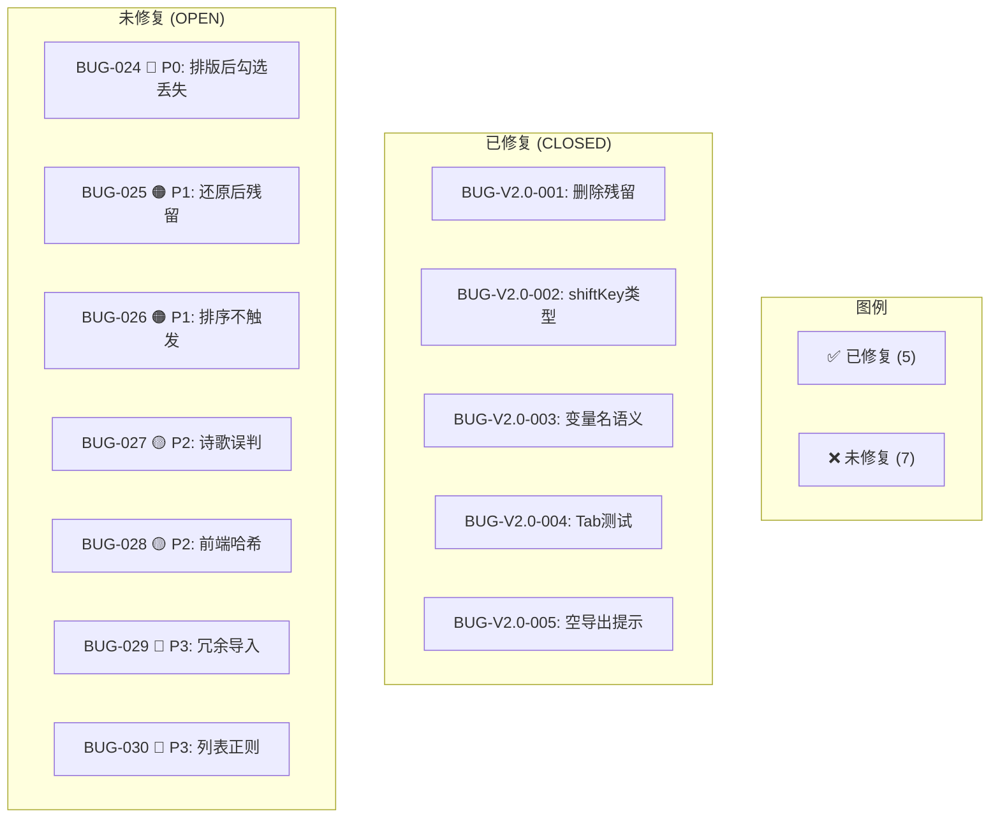

# Text Unifier V2.0.1 回归测试指令

| 项目 | 内容 |
| :--- | :--- |
| **应用名称** | 文档终版确定器（Text Unifier） |
| **版本号** | V2.0.1 |
| **测试阶段** | 修复验证回归 + 第二轮修复建议 |
| **测试日期** | 2026-05-09 |

---

## 一、当前修复状态



---

## 二、修复验证回归（Phase 0）

此阶段验证 5 个已修复 Bug 是否正确关闭，**不引入新问题**。

### 2.1 REG-001: 文件移除后状态重置

| 步骤 | 操作 | 预期结果 | ✅ |
| :--- | :--- | :--- | :--- |
| 1 | 导入 1 个 .txt 文件，等待分析完成 | 状态栏显示「分析完成」 | ☐ |
| 2 | 取消勾选 2 个段落，点击「文档排版」 | 排版完成，canRevert = true | ☐ |
| 3 | 点击文件删除按钮（×） | 文件列表为空 | ☐ |
| 4 | 观察状态栏 | **关键验证**: 显示「就绪 — 请添加 .txt 文件开始分析」 | ☐ |
| 5 | 观察预览区 | **关键验证**: 预览区为空，无残留数据 | ☐ |
| 6 | 观察底部计数 | **关键验证**: 无「已排除」计数显示 | ☐ |
| 7 | 观察「还原」按钮 | **关键验证**: 还原按钮灰色禁用（canRevert=false） | ☐ |
| 8 | 再次导入相同文件 | 正常分析，不报错 | ☐ |

### 2.2 REG-002: shiftKey 类型安全

| 步骤 | 操作 | 预期结果 | ✅ |
| :--- | :--- | :--- | :--- |
| 1 | 导入文件，分析完成，预览有 ≥5 段 | — | ☐ |
| 2 | 鼠标单击段落 1 的 Checkbox | 段落 1 勾选状态切换 | ☐ |
| 3 | Shift + 鼠标单击段落 4 的 Checkbox | 段落 1~4 批量切换 | ☐ |
| 4 | 使用 Tab 键聚焦段落 5 的 Checkbox | Checkbox 获得焦点（出现 focus ring） | ☐ |
| 5 | 按 Space 键 | **关键验证**: 段落 5 勾选状态切换，Console 无报错 | ☐ |
| 6 | 打开浏览器开发者 Console | **关键验证**: 无 `TypeError: ... shiftKey ...` 错误 | ☐ |

### 2.3 REG-003: 变量名重构

| 步骤 | 操作 | 预期结果 | ✅ |
| :--- | :--- | :--- | :--- |
| 1 | 运行 Rust 单元测试 | `cargo test` → 25/25 全部通过 | ☐ |
| 2 | 运行 Clippy | `cargo clippy` → 无 `no_period_end_re` 相关 warning | ☐ |
| 3 | 准备诗歌文本（4 行短句） | — | ☐ |
| 4 | 排版诗歌文本 | **关键验证**: 换行保留，诗歌保护功能正常 | ☐ |
| 5 | 准备句尾标点文本 | — | ☐ |
| 6 | 排版句尾文本 | **关键验证**: 句尾标点后正确分段 | ☐ |

### 2.4 REG-004: Tab 字符处理

| 步骤 | 操作 | 预期结果 | ✅ |
| :--- | :--- | :--- | :--- |
| 1 | 运行 `cargo test` | `test_tab_character_handling` ✅ + `test_mixed_tab_and_space` ✅ | ☐ |
| 2 | 准备含 Tab 的文本 `"列A\t列B\n续行"` | — | ☐ |
| 3 | 排版含 Tab 文本 | **关键验证**: 排版后为 `"列A\t列B 续行"`，Tab 保留不丢失 | ☐ |

### 2.5 REG-005: 空段落导出提示

| 步骤 | 操作 | 预期结果 | ✅ |
| :--- | :--- | :--- | :--- |
| 1 | 导入文件，分析完成 | — | ☐ |
| 2 | 点击「取消全选」 | 所有段落淡化 | ☐ |
| 3 | 观察「导出」按钮 | **关键验证**: 按钮灰色不可点击 | ☐ |
| 4 | 观察「文档排版」按钮 | **关键验证**: 排版按钮也灰色不可点击（无可排版内容） | ☐ |
| 5 | 点击「全选」恢复 | 导出按钮恢复可用 | ☐ |
| 6 | 取消部分段落（非全部） | **关键验证**: 导出按钮仍可用，正常导出 | ☐ |

---

## 三、第二轮修复建议

### 3.1 建议修复优先级

```
第二轮修复建议（按优先级排序）

P0 ─────────────────────────────────────────────────────
  修复 BUG-024: formatDocumentAction 勾选状态丢失
  ├─ 文件: src/store/useStore.ts
  ├─ 修改: rebuiltCheckedMap 使用 paragraphId 匹配
  ├─ 难度: 🟢 极低（修改 2 行代码）
  └─ 预计: 15 分钟

P1 ─────────────────────────────────────────────────────
  修复 BUG-025: revertFormatting 状态残留
  ├─ 文件: src/store/useStore.ts
  ├─ 修改: 基于快照重建 checkedMap
  ├─ 难度: 🟢 极低（修改 3 行代码）
  └─ 预计: 10 分钟

  修复 BUG-026: 拖拽排序触发自动分析
  ├─ 文件: src/store/useStore.ts + src/App.tsx
  ├─ 修改: reorderFiles 完成后调用 scanFiles
  ├─ 难度: 🟡 中等（需处理 async 流程）
  └─ 预计: 2 小时

P2 ─────────────────────────────────────────────────────
  修复 BUG-027: 诗歌检测含标点误判
  ├─ 文件: src-tauri/src/document_formatter.rs
  ├─ 修改: any() → 比例阈值 > 0.5
  ├─ 难度: 🟢 低
  └─ 预计: 30 分钟

  修复 BUG-028: 前端哈希改用 crypto.subtle
  ├─ 文件: src/store/useStore.ts
  ├─ 修改: computeContentHash → Web Crypto API
  ├─ 难度: 🟡 中（需处理异步）
  └─ 预计: 30 分钟

P3 ─────────────────────────────────────────────────────
  修复 BUG-029: FormatButton 冗余导入
  ├─ 文件: src/components/FormatButton.tsx
  ├─ 难度: 🟢 极低
  └─ 预计: 5 分钟

  修复 BUG-030: 列表正则加 ?
  ├─ 文件: src-tauri/src/document_formatter.rs
  ├─ 难度: 🟢 极低
  └─ 预计: 5 分钟
```

### 3.2 时间预估

| 阶段 | 修复项 | 预计时间 |
| :--- | :--- | :---: |
| Phase 1 (P0) | BUG-024 | 15 分钟 |
| Phase 2 (P1) | BUG-025 + BUG-026 | 2.5 小时 |
| Phase 3 (P2) | BUG-027 + BUG-028 | 1 小时 |
| Phase 4 (P3) | BUG-029 + BUG-030 | 10 分钟 |
| **合计** | **7 个 Bug** | **~4 小时** |

### 3.3 修复后回归检查清单

修复 BUG-024 + BUG-025 后，执行以下快速回归：

| # | 检查项 | 步骤 | ✅ |
| :--- | :--- | :--- | :--- |
| R01 | 排版勾选保持 | 取消 3 段 → 排版 → 确认 3 段仍取消 | ☐ |
| R02 | 排版勾选保持（多次） | 反复排版 3 次 → 勾选状态不变 | ☐ |
| R03 | 还原勾选保持 | 排版 → 还原 → 勾选状态与排版前一致 | ☐ |
| R04 | 还原后 Map 清洁 | 还原后检查 Map 无 fmt_* 键 | ☐ |
| R05 | 还原后再次排版 | 还原后立即排版 → 正常 | ☐ |
| R06 | Rust 测试 | `cargo test` 25/25 | ☐ |
| R07 | TypeScript | `npx tsc --noEmit` 零错误 | ☐ |
| R08 | 构建 | `npm run build` 成功 | ☐ |

---

## 四、V2.0.1 发布判定标准

```
V2.0.1 发布判定矩阵
━━━━━━━━━━━━━━━━━━━━━━━━━━━━━━━━━━━━━━━━━━━━━━━━━━━

Phase 0 (当前):
  REG-001 ~ REG-005 全部通过 → ✅ V2.0.1 修复验证 PASS
  但 BUG-024 (P0) 未修复 → ❌ 阻塞发布

Phase 1 (建议):
  修复 BUG-024 + BUG-025:
  ├─ formatDocumentAction 勾选保持  ✅
  ├─ revertFormatting 状态清洁     ✅
  ├─ cargo test 25/25              ✅
  └─ tsc --noEmit 零错误            ✅
  → 可考虑发布 V2.0.1（带已知 P1/P2 限制）

Phase 2 (理想):
  Phase 1 + 修复 BUG-026 + BUG-027 + BUG-028:
  ├─ 排序触发自动分析              ✅
  ├─ 诗歌保护优化                  ✅
  ├─ 前端 SHA256 哈希             ✅
  → 推荐发布 V2.0.1

Phase 3 (完整):
  Phase 2 + BUG-029 + BUG-030:
  → 推荐发布 V2.1.0（含代码清理）
```

---

## 五、测试环境准备

### 5.1 运行验证命令

```bash
# 1. Rust 后端验证
cd src-tauri
cargo test                      # 25 项单元测试
cargo clippy                    # lint 检查
cargo build --release           # 发布构建

# 2. 前端验证
cd ..
npx tsc --noEmit                # TypeScript 类型检查
npm run build                   # Vite 构建

# 3. 开发环境启动
npm run tauri dev               # Tauri 开发模式
```

### 5.2 测试数据

```bash
# 使用已有功能测试场景
cd test_data/functional
# 01_basic_duplicate/  - 基本去重
# 02_whitespace_variation/ - 空白变体
# 08_multi_file_duplicate/ - 多文件
```

---

## 六、回归测试报告模板

```markdown
# V2.0.1 回归测试结果

## 修复验证 (Phase 0)
- REG-001 (删除残留): ___/8 步骤通过 → [PASS/FAIL]
- REG-002 (shiftKey): ___/6 步骤通过 → [PASS/FAIL]
- REG-003 (变量名): ___/6 步骤通过 → [PASS/FAIL]
- REG-004 (Tab): ___/3 步骤通过 → [PASS/FAIL]
- REG-005 (空导出): ___/6 步骤通过 → [PASS/FAIL]

## 第二轮修复 (若执行)
- BUG-024: [已修复/未修复]
- BUG-025: [已修复/未修复]
- BUG-026: [已修复/未修复]
- 快速回归 R01-R08: ___/8 通过

## 最终判定
- [ ] ❌ 不可发布（P0 未修复）
- [ ] 🔄 进入第二轮修复
- [ ] ✅ 条件发布 V2.0.1（Phase 1 完成）
- [ ] ✅ 推荐发布 V2.0.1（Phase 2 完成）

测试人: __________  日期: __________
```

---

## 七、决策流程图

```text
                               ┌─────────────┐
                               │  复测开始    │
                               └──────┬──────┘
                                      │
                                      v
                          ┌───────────────────────┐
                          │ Phase 0: 修复验证回归  │
                          │ REG-001 ~ REG-005      │
                          └───────────┬───────────┘
                                      │
                          ┌───────────┴───────────┐
                          │                       │
                          v                       v
                   ┌─────────────┐       ┌──────────────────┐
                   │ 全部通过?   │       │ 有失败项 → 排查  │
                   └──────┬──────┘       │ 是代码问题还是    │
                          │ YES          │ 测试问题?         │
                          v              └──────────────────┘
              ┌─────────────────────┐
              │ P0 Bug 是否残留?    │
              └──┬──────────────┬──┘
                 │              │
                 v              v
        ┌──────────────┐  ┌──────────────────┐
        │ BUG-024 OPEN │  │ BUG-024 FIXED    │
        │ → 阻塞发布   │  │ → 条件发布       │
        └──────────────┘  └────────┬─────────┘
                                   │
                         ┌─────────┴─────────┐
                         │ 是否继续修复 P1?  │
                         │ (BUG-025, 026)    │
                         └──┬─────────────┬──┘
                            │             │
                            v             v
                   ┌──────────────┐  ┌──────────────┐
                   │ 修复 → Phase │  │ 暂缓 →       │
                   │ 1 回归       │  │ 发布 V2.0.1  │
                   └──────────────┘  │ 附已知问题    │
                                     └──────────────┘
```

---

*指令生成日期：2026-05-09*
*关联文档：01_全维度测试用例_V2.0.1.md / 02_Bug报告_V2.0.1.md / 03_复测测试报告_V2.0.1.md*
