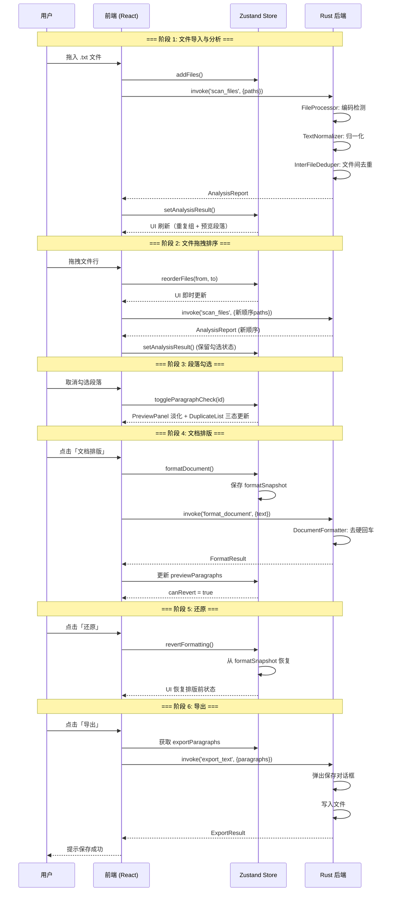

# 文档终版确定器（Text Unifier）V2.0 接口规范文档

| 项目名称 | 文档终版确定器（Text Unifier） |
| :--- | :--- |
| **版本号** | V2.0 |
| **文档类型** | 接口规范文档（接口定义、入参/出参、调用规则） |
| **关联文档** | `系统架构设计文档_V2.0.md` / `数据库设计文档_V2.0.md` |

---

## 概述

本接口规范遵循 **Tauri IPC 调用规范**。前端通过 `@tauri-apps/api/core` 的 `invoke` 方法调用 Rust 后端暴露的 Tauri Commands。

```
通信模型:  前端 (TypeScript)  ── invoke() ──→  Tauri IPC  ──→  Rust Command
           前端 (TypeScript)  ←── Result ──  Tauri IPC  ←──  Rust Command
```

### V2.0 接口清单

| 接口名称 | 方向 | V2.0 变更 | 功能 |
| :--- | :--- | :--- | :--- |
| `scan_files` | 前端 → Rust | 无变更（V1.0 兼容） | 扫描文件，执行归一化与去重分析 |
| `format_document` 🆕 | 前端 → Rust | **新增** | 文档排版：去除段落内硬回车 |
| `export_text` | 前端 → Rust | 无变更 | 导出合并文档为 .txt 文件 |

---

## 第一部分：前端 IPC 调用层

### 1. IPC 工具函数（`src/utils/ipc.ts`）

```typescript
import { invoke } from '@tauri-apps/api/core';
import type { AnalysisReport, ExportResult, FormatResult } from '../types';

// === 通用重试配置 ===
const MAX_RETRIES = 3;
const RETRY_BASE_MS = 500;

async function withRetry<T>(
    fn: () => Promise<T>,
    retries = MAX_RETRIES
): Promise<T> {
    for (let attempt = 0; attempt <= retries; attempt++) {
        try {
            return await fn();
        } catch (error) {
            if (attempt === retries) throw error;
            const delay = RETRY_BASE_MS * Math.pow(2, attempt);
            console.warn(
                `IPC 调用失败，${delay}ms 后重试 (${attempt + 1}/${retries}):`,
                error
            );
            await new Promise((resolve) => setTimeout(resolve, delay));
        }
    }
    throw new Error('IPC 调用失败: 重试次数耗尽');
}

// ═══════════════════════════════════════════
// 接口 1: scan_files
// ═══════════════════════════════════════════

/**
 * 调用 Rust 后端 scan_files 命令
 * @param paths 文件路径数组（用户排序后的顺序，第1个为主文件）
 * @returns 分析报告
 */
export async function scanFiles(paths: string[]): Promise<AnalysisReport> {
    return withRetry(() => invoke<AnalysisReport>('scan_files', { paths }));
}

// ═══════════════════════════════════════════
// 接口 2: format_document ← 🆕 V2.0
// ═══════════════════════════════════════════

/**
 * 调用 Rust 后端 format_document 命令
 * @param text 待排版的全文（已勾选段落拼接，\n\n 分隔）
 * @returns 排版结果
 */
export async function formatDocument(text: string): Promise<FormatResult> {
    return withRetry(() =>
        invoke<FormatResult>('format_document', { text })
    );
}

// ═══════════════════════════════════════════
// 接口 3: export_text
// ═══════════════════════════════════════════

/**
 * 调用 Rust 后端 export_text 命令
 * @param paragraphs 要导出的段落文本数组
 * @param defaultName 默认文件名（可选）
 * @returns 导出结果
 */
export async function exportText(
    paragraphs: string[],
    defaultName?: string
): Promise<ExportResult> {
    return withRetry(() =>
        invoke<ExportResult>('export_text', {
            paragraphs,
            defaultName: defaultName || null,
        })
    );
}
```

---

## 第二部分：Tauri Command 接口定义

### 2.1 `scan_files` — 扫描并分析文件

| 项目 | 内容 |
| :--- | :--- |
| **接口名称** | `scan_files` |
| **调用方向** | 前端 → Rust 后端 |
| **功能描述** | 传入文件绝对路径数组，依次执行：编码检测 → 文本归一化 → 文件间去重 → 生成分析报告。数组的第 1 个文件作为主文件（内容完整保留）。 |
| **幂等性** | ✅ 是（相同输入始终返回相同输出） |
| **并发控制** | 前端通过 `loadingRef` 防止重复调用；后端限制最大并行文件读取数为 10 |

#### 请求参数

```json
{
  "paths": [
    "C:\\Users\\...\\A.txt",
    "D:\\...\\B.txt",
    "E:\\...\\C.txt"
  ]
}
```

| 字段 | 类型 | 必填 | 约束 | 说明 |
| :--- | :--- | :--- | :--- | :--- |
| `paths` | `Array<string>` | 是 | 长度 ≥ 1；每个元素为非空字符串 | 文件绝对路径数组。**顺序敏感**：第 1 个为主文件。前端需确保后缀为 `.txt`。 |

#### 响应数据

**成功响应：**

```json
{
  "duplicate_groups": [
    {
      "id": "grp_1",
      "content_hash": "a1b2c3d4e5f6...",
      "snippet": "项目启动会议纪要...",
      "sources": [
        { "file_name": "A.txt", "start_line": 10 },
        { "file_name": "B.txt", "start_line": 5 }
      ],
      "occurrence_count": 2
    }
  ],
  "preview_paragraphs": [
    {
      "id": "pre_0001",
      "text": "这是第一段独有的内容。",
      "content_hash": "e5f6a1b2c3d4...",
      "source_files": ["A.txt"],
      "is_original": true
    },
    {
      "id": "pre_0002",
      "text": "项目启动会议纪要",
      "content_hash": "a1b2c3d4e5f6...",
      "source_files": ["A.txt"],
      "is_original": true
    }
  ],
  "total_files": 3,
  "files_metadata": [
    { "file_name": "A.txt", "file_size": 263168, "modified": 1715000000 },
    { "file_name": "B.txt", "file_size": 12595, "modified": 1715000001 },
    { "file_name": "C.txt", "file_size": 15462, "modified": 1715000002 }
  ]
}
```

| 字段 | 类型 | 说明 |
| :--- | :--- | :--- |
| `duplicate_groups` | `DuplicateGroup[]` | 跨文件重复组列表。仅当内容出现在 ≥2 个**不同文件**中才生成。 |
| `duplicate_groups[].id` | `string` | 组唯一标识，格式 `grp_{序号}` |
| `duplicate_groups[].content_hash` | `string` | 段落内容的 SHA256 哈希（hex 编码，64 字符） |
| `duplicate_groups[].snippet` | `string` | 段落内容前 10 字符 + "..." |
| `duplicate_groups[].sources` | `SourceInfo[]` | 该段落出现在哪些文件及起行位置 |
| `duplicate_groups[].occurrence_count` | `number` | 涉及的不同文件数 |
| `preview_paragraphs` | `PreviewParagraph[]` | 合并去重后的预览段落列表，按文件顺序排列 |
| `preview_paragraphs[].id` | `string` | 段落唯一标识，格式 `pre_{序号, 4位零填充}` |
| `preview_paragraphs[].text` | `string` | 归一化后的段落文本 |
| `preview_paragraphs[].content_hash` | `string` | SHA256 哈希（用于前端去重匹配和勾选状态匹配） |
| `preview_paragraphs[].source_files` | `string[]` | 来源文件名列表 |
| `preview_paragraphs[].is_original` | `boolean` | 是否为首次出现（母本），在 V1.1 算法中始终为 `true` |
| `total_files` | `number` | 成功处理的文件总数 |
| `files_metadata` | `FileMeta[]` | 文件元数据（修复 BUG-006） |

**错误响应：**

```json
// Tauri 返回 String 类型的 Err
"文件 'B.txt' 读取失败: 权限不足 (os error 5)"
```

| 错误场景 | 错误信息格式 |
| :--- | :--- |
| 文件不存在 | `文件 '{name}' 读取失败: 系统找不到指定的文件` |
| 权限不足 | `文件 '{name}' 读取失败: 权限不足` |
| 文件过大 | `文件 '{name}' 大小超过 100MB 限制（当前: {size}MB）` |
| 编码失败 | （降级为 UTF-8 替换字符，不报错） |
| 路径为空 | Rust 端参数校验失败 |

#### 调用规则

| 规则编号 | 规则内容 |
| :--- | :--- |
| **R-01** | **并发互斥**：前端通过 `loadingRef` 标志位确保同一时间仅一个 `scan_files` 调用进行中。加载中禁止用户再次上传文件。 |
| **R-02** | **超时控制**：前端 60 秒超时（`Promise.race`）。超时后展示错误提示，不自动重试。 |
| **R-03** | **并行限制**：Rust 后端通过 Rayon 并行读取，最大同时打开文件数 10（操作系统默认限制内）。 |
| **R-04** | **重试策略**：IPC 层 3 次指数退避重试（500ms / 1000ms / 2000ms），仅处理网络/IPC 传输错误，不重试业务错误。 |
| **R-05** | **编码降级**：UTF-8 → GB18030 → Windows-1252 → Shift-JIS 依次尝试，全部失败后 UTF-8 替换字符降级。不中断流程。 |
| **R-06** | **文件顺序语义**：`paths[0]` 为主文件（内容完整保留）。前端拖拽排序后重新调用此接口即可改变主文件。 |

---

### 2.2 `format_document` — 文档排版（去硬回车）🆕

| 项目 | 内容 |
| :--- | :--- |
| **接口名称** | `format_document` |
| **调用方向** | 前端 → Rust 后端 |
| **功能描述** | 对文本执行"去硬回车"排版：识别自然段落边界，将段落内单换行替换为空格，保留段落间空行，保护列表/诗歌格式。不修改任何文字内容。 |
| **幂等性** | ✅ 近似幂等（对已排版文本再次执行，结果不变或仅有微小差异） |
| **版本** | V2.0 新增 |

#### 请求参数

```json
{
  "text": "这是第一段内容第一行\n这是第一段内容第二行\n\n这是第二段内容\n这是第二段续行\n\n- 列表项1\n- 列表项2\n- 列表项3"
}
```

| 字段 | 类型 | 必填 | 约束 | 说明 |
| :--- | :--- | :--- | :--- | :--- |
| `text` | `string` | 是 | 长度 ≤ 100MB | 待排版的全文。前端负责仅拼接已勾选的段落，用 `\n\n` 分隔。 |

#### 响应数据

**成功响应：**

```json
{
  "formatted_text": "这是第一段内容第一行 这是第一段内容第二行\n\n这是第二段内容 这是第二段续行\n\n- 列表项1\n- 列表项2\n- 列表项3",
  "paragraph_count": 3,
  "protected_blocks": 1,
  "merged_blocks": 2
}
```

| 字段 | 类型 | 说明 |
| :--- | :--- | :--- |
| `formatted_text` | `string` | 排版后的全文。段落间以 `\n\n` 分隔。 |
| `paragraph_count` | `number` | 排版后的段落总数 |
| `protected_blocks` | `number` | 被识别为受保护块（列表/诗歌）而未合并的段落块数 |
| `merged_blocks` | `number` | 被执行合并操作的段落块数 |

**错误响应：**

```json
// Tauri 返回 String 类型的 Err
"排版处理失败: 输入文本为空"
```

| 错误场景 | 错误信息 |
| :--- | :--- |
| 输入为空字符串 | `排版处理失败: 输入文本为空` |
| 文本超过大小限制（如有） | `排版处理失败: 文本大小超过限制` |

#### 排版算法规格

**Step 1 — 段落分割：**

```
输入: "Line1\nLine2\n\nLine3\nLine4\n\n\nLine5"
分割符: \n\s*\n（至少一个空行）
结果: ["Line1\nLine2", "Line3\nLine4", "Line5"]
```

**Step 2 — 混合策略细粒度分段（对 Step 1 的每个粗分段）：**

| 优先级 | 规则 | 判定条件 | 示例 |
| :---: | :--- | :--- | :--- |
| 1 | 空行分隔 | 上方有至少一个空行 | Step 1 已处理 |
| 2 | 首行缩进 | 行首有 ≥2 个半角空格或 ≥1 个全角空格（`　`） | `　这是新段落` |
| 3 | 尾句标记 | 上一行以 `。！？」）〗》` 结尾且当前行非空 | `上一句结尾。\n这是新段落` |

**Step 3 — 受保护块检测：**

```text
对每个细化分段块执行 is_protected_block(lines):

规则 1（列表检测）：
  列表标记 = ['-', '*', '•', '·'] 或以数字开头的有序列表（如 "1.", "①"）
  list_ratio = 以列表标记开头的非空行数 / 总非空行数
  if list_ratio > 0.5 → 判定为列表，保留原格式

规则 2（诗歌检测）：
  avg_len = 所有非空行的平均字符数
  no_period_ratio = 不以。！？」结尾的行数 / 总行数
  if avg_len < 20 AND no_period_ratio > 0.7 → 判定为诗歌，保留原格式

默认：不保护，执行合并
```

**Step 4 — 段落内合并：**

```
对非保护块执行：
  1. 将每行 trim()
  2. 过滤空行
  3. 用单个空格 ' ' 连接
  4. 将连续 2+ 个空格压缩为 1 个空格（正则: \s{2,} → ' '）
```

**Step 5 — 后处理：**

```
1. 所有段落用 \n\n 拼接
2. 将连续 3+ 个换行符归一为 \n\n（正则: \n{3,} → \n\n）
3. Trim 首尾空白
```

#### 调用规则

| 规则编号 | 规则内容 |
| :--- | :--- |
| **R-07** | **纯函数**：排版仅操作换行符和空格字符，**不修改、不润色、不改写**任何文字、标点符号、语气。 |
| **R-08** | **保守策略**：受保护块检测宁可漏判（将列表合并为一行）也不误判（将正常段落保留多余换行）。`list_ratio` 阈值 0.5 为保守值。 |
| **R-09** | **前端预处理**：前端仅发送已勾选（`isChecked = true`）的段落文本。未勾选段落不参与排版，保持原文不变。 |
| **R-10** | **非阻塞**：Tauri Command 为 async，排版期间前端显示 Loading 动画，UI 不冻结。 |
| **R-11** | **重试策略**：同上 R-04，3 次指数退避。 |

---

### 2.3 `export_text` — 导出合并文档

| 项目 | 内容 |
| :--- | :--- |
| **接口名称** | `export_text` |
| **调用方向** | 前端 → Rust 后端 |
| **功能描述** | 将前端处理好的最终文本段落数组写入本地 `.txt` 文件。弹出系统原生保存对话框。 |
| **版本** | V1.0（V2.0 无变更） |

#### 请求参数

```json
{
  "paragraphs": [
    "段落一内容...",
    "段落二内容..."
  ],
  "defaultName": "Merged_Document.txt"
}
```

| 字段 | 类型 | 必填 | 默认值 | 说明 |
| :--- | :--- | :--- | :--- | :--- |
| `paragraphs` | `Array<string>` | 是 | — | 前端 `exportParagraphs` 派生状态计算得出的文本数组 |
| `defaultName` | `string \| null` | 否 | `"Merged_Document.txt"` | 保存对话框的默认文件名 |

#### 响应数据

**成功响应：**

```json
{
  "saved_path": "C:\\Users\\...\\Merged_Document.txt"
}
```

| 字段 | 类型 | 说明 |
| :--- | :--- | :--- |
| `saved_path` | `string` | 保存成功的文件绝对路径 |

**错误响应：**

| 错误场景 | 错误信息 |
| :--- | :--- |
| 用户取消保存 | `用户取消了保存` |
| 写入临时文件失败 | `写入临时文件失败: {详细错误}` |
| 移动文件失败 | `移动文件失败: {详细错误}` |
| 路径解析失败 | `无法解析文件路径: {详细错误}` |

#### 调用规则

| 规则编号 | 规则内容 |
| :--- | :--- |
| **R-12** | **系统原生对话框**：Rust 后端调用 Tauri Dialog Plugin 弹出系统原生保存对话框，而非前端模拟。 |
| **R-13** | **段落拼接**：后端将 `paragraphs` 数组以 `\n\n`（两个换行符）连接。 |
| **R-14** | **UTF-8 无 BOM**：输出编码固定为 UTF-8 without BOM（与大多数文本编辑器兼容）。 |
| **R-15** | **写入原子性**：先写入 `.tmp` 临时文件，成功后 `rename` 至目标路径。使用 `TempFileGuard` Drop 守卫确保异常时临时文件被清理。 |
| **R-16** | **V2.0 前端过滤**：前端在调用此接口前已通过 `exportParagraphs` 派生状态过滤掉未勾选段落。后端不再做勾选过滤。 |

---

## 第三部分：Rust 内部模块接口（Trait 约束）

### 3.1 模块依赖关系

```text
text_normalizer.rs
      ↑
      ├── file_processor.rs（无需 TextNormalizer）
      ├── paragraph_index.rs（使用 compute_hash）
      ├── duplicate_resolver.rs（纯数据结构）
      │
document_formatter.rs  ← 🆕 V2.0
      ↑ 依赖 text_normalizer（复用空格压缩正则）
      │
lib.rs（Tauri Command 入口）
      ↑ 编排所有模块
```

### 3.2 Trait 定义

```rust
// ═══════════════════════════════════════════════
// TextNormalizer — 文本归一化器
// ═══════════════════════════════════════════════

pub trait TextNormalizerTrait {
    /// 执行完整归一化，返回段落数组
    fn normalize(&self, raw: &str) -> Vec<String>;

    /// 轻量归一化（仅用于显示，不做行分割）
    fn normalize_for_display(&self, text: &str) -> String;
}

// ═══════════════════════════════════════════════
// ParagraphIndexer — 段落索引构建器
// ═══════════════════════════════════════════════

pub trait ParagraphIndexer {
    /// 为一个文件构建段落索引
    fn build_index(&mut self, file_name: &str, normalized_paragraphs: &[String]);

    /// 分析并生成最终报告
    fn analyze(self) -> (Vec<DuplicateGroup>, Vec<PreviewParagraph>);
}

// ═══════════════════════════════════════════════
// DocumentFormatter — 文档排版器 ← 🆕 V2.0
// ═══════════════════════════════════════════════

pub trait DocumentFormatterTrait {
    /// 执行文档排版
    ///
    /// # 参数
    /// - `text`: 待排版的原始文本
    ///
    /// # 返回
    /// - `FormatResult`: 排版结果（含元数据）
    fn format(&self, text: &str) -> FormatResult;

    /// 检测段落块是否应受保护（不合并内部换行）
    ///
    /// # 参数
    /// - `lines`: 段落块内的所有行
    ///
    /// # 返回
    /// - `true`: 受保护（列表/诗歌），保持原样
    /// - `false`: 不受保护，执行合并
    fn is_protected_block(&self, lines: &[&str]) -> bool;

    /// 合并段落块内的多行为单行
    ///
    /// # 处理
    /// 1. 每行 trim()
    /// 2. 过滤空行
    /// 3. 用空格连接
    /// 4. 压缩多余空格
    fn merge_lines(&self, lines: &[&str]) -> String;
}
```

### 3.3 模块职责与错误传播

| 模块 | 错误处理策略 | 错误传播方式 |
| :--- | :--- | :--- |
| `FileProcessor` | 编码失败降级（不报错）；IO 错误向上传播 | `anyhow::Result<T>` → `String` |
| `TextNormalizer` | 无错误（纯文本变换） | — |
| `InterFileDeduper` | 无错误（纯内存操作） | — |
| `DocumentFormatter` 🆕 | 空输入返回空结果；无其他错误 | `Result<FormatResult, String>` |
| `lib.rs` (Commands) | 所有错误统一转为 `Err(String)` 返回前端 | `Result<T, String>` |

---

## 第四部分：调用时序图

### 4.1 完整工作流（V2.0）



---

## 第五部分：设计合理性自检

### 5.1 接口完整性

| 检查项 | 结论 | 说明 |
| :--- | :--- | :--- |
| **所有 PRD 功能有对应接口** | ✅ | RQ-01 纯前端（无新接口）；RQ-02 纯前端（无新接口）；RQ-03 → `format_document` |
| **V1.0 接口向后兼容** | ✅ | `scan_files` 和 `export_text` 入参/出参无变更，V1.0 前端代码可直接调用 |
| **必填/可选字段明确** | ✅ | 所有接口参数均标注必填性和默认值 |
| **错误场景覆盖** | ✅ | 文件不存在、权限不足、用户取消、超时、空输入等场景均有定义 |

### 5.2 性能

| 检查项 | 结论 | 说明 |
| :--- | :--- | :--- |
| **IPC 数据传输量** | ✅ 可控 | `scan_files` 返回 JSON，10MB 文本分析后报告约 12MB（含原文）。对于超大文件，可考虑在 V2.1 引入分页预览。 |
| **format_document 传输量** | ✅ 可控 | 输入/输出均为纯文本，大小与原文相当。 |
| **export_text 段落连接** | ✅ 高效 | Rust 端 `Vec<String>.join("\n\n")` 为 O(n) 操作。 |

### 5.3 安全性

| 检查项 | 结论 | 说明 |
| :--- | :--- | :--- |
| **参数类型安全** | ✅ | Tauri `#[tauri::command]` 宏自动反序列化验证，类型不匹配时返回错误而不崩溃。 |
| **路径遍历攻击** | ✅ | `scan_files` 读取用户指定的文件路径，前端无法绕过文件选择器。`export_text` 使用系统原生保存对话框。 |
| **注入攻击** | ✅ | 无 SQL/命令注入风险（本应用无数据库也无 shell 调用）。文本内容作为纯文本处理。 |
| **DoS 防护** | ✅ | 100MB 文件大小限制；`scan_files` 超时 60s。 |

### 5.4 幂等性 & 可测试性

| 检查项 | 结论 | 说明 |
| :--- | :--- | :--- |
| **scan_files 幂等** | ✅ | 相同输入文件（未修改）始终返回相同哈希和分析结果。 |
| **format_document 近似幂等** | ✅ | 对已排版文本再次执行，结果不变（段落已合并，无需再合并）。 |
| **export_text 非幂等** | ⚠️ | 每次弹出保存对话框，路径可能不同。行为符合预期。 |
| **可自动化测试** | ✅ | 所有 Tauri Commands 均可通过 Rust 单元测试覆盖（参见 `src-tauri/src/*.rs` 中 `#[cfg(test)]` 模块）。 |

### 5.5 V1.0 → V2.0 迁移兼容

| 检查项 | 结论 | 说明 |
| :--- | :--- | :--- |
| **scan_files 无变更** | ✅ | 前端 V1.0 代码可无缝调用 V2.0 后端 |
| **export_text 无变更** | ✅ | 同上 |
| **新增 format_document** | ✅ | 新接口，V1.0 前端不会调用，不影响已有功能 |
| **Store checkedHashes 兼容** | ✅ | 保留旧字段并标记 `@deprecated`，旧逻辑仍可工作 |

---

> **文档版本**: V2.0 | **编写日期**: 2026-05-09 | **下一步**: 进入开发阶段，按《系统架构设计文档_V2.0.md》模块划分进行实现
