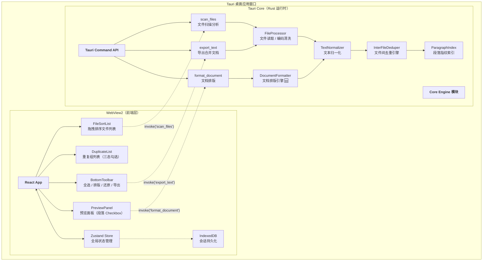

# 文档终版确定器（Text Unifier）V2.0 系统架构设计文档

| 项目名称 | 文档终版确定器（Text Unifier） |
| :--- | :--- |
| **版本号** | V2.0 |
| **文档类型** | 系统架构设计文档（含技术选型、模块划分、交互流程） |
| **基线版本** | V1.0.1（系统架构设计文档 V1.0） |
| **关联文档** | `PRD_V2.0_产品需求文档.md` / `PRD_V2.0_交互原型.md` |

---

## 第一部分：技术选型

### 1. 技术选型总览

| 类别 | V1.0 方案 | V2.0 变更 | 选型理由 |
| :--- | :--- | :--- | :--- |
| **桌面框架** | Tauri 2.x（Rust 后端 + WebView2 前端） | **不变** | 体积小（<10MB）、Rust 文本处理性能优、无内置 Chromium |
| **前端框架** | React 18 + TypeScript | **不变** | 组件化天然匹配 UI 结构，类型安全 |
| **状态管理** | Zustand | **扩展**（新增 ~10 字段 & ~8 actions） | 轻量（<2KB），支持 computed 派生状态，无需引入 Redux 的样板代码 |
| **样式方案** | Tailwind CSS 3.x | **不变** | 原子化 CSS，快速构建交互原型中定义的所有视觉规格 |
| **拖拽排序** | — | **新增：`@dnd-kit/core` + `@dnd-kit/sortable`** | 1. **可访问性**：内置键盘排序支持（WCAG 2.1 AA）<br>2. **视觉反馈**：自定义 DragOverlay、占位动画<br>3. **React 生态**：与 Zustand 无缝集成，支持受控/非受控模式<br>4. **体积可控**：~12KB gzipped，桌面端可接受 |
| **后端语言** | Rust（Tauri 内置） | **新增模块**：`DocumentFormatter` | 1. 正则引擎性能（`regex` crate 使用 DFA，大文本处理 <50ms/MB）<br>2. 零成本抽象，内存安全 |
| **数据持久化** | IndexedDB（前端） | **扩展 Schema** | 新增段落勾选状态缓存、文件排序历史、排版快照 |
| **并行处理** | Rayon | **不变**（仅 `scan_files` 中并行文件读取用到） | 排版功能为线性算法，无需并行 |

### 2. 技术选型对比分析

#### 2.1 拖拽方案对比：`@dnd-kit` vs HTML5 原生 vs `react-beautiful-dnd`

| 维度 | @dnd-kit | HTML5 原生 | react-beautiful-dnd |
| :--- | :--- | :--- | :--- |
| 维护状态 | ✅ 活跃维护 | ✅ 浏览器标准 | ❌ 已停止维护（Atlassian 2023） |
| 键盘可访问 | ✅ 内置 | ❌ 需自行实现 | ✅ 内置 |
| 自定义视觉 | ✅ DragOverlay API | ⚠️ 有限（`DataTransfer`） | ✅ 内置 |
| 体积 | ~12KB gzipped | 0 | ~93KB gzipped |
| 学习曲线 | 中 | 低 | 中 |
| **结论** | **✅ 选用** | ❌ 可访问性不足 | ❌ 已废弃 |

#### 2.2 排版引擎方案对比：Rust 后端 vs 前端 Worker

| 维度 | Rust 后端（选用） | Web Worker（前端） |
| :--- | :--- | :--- |
| 大文件性能（>100MB） | ✅ 原生速度，~50ms/MB | ⚠️ JS 单线程瓶颈 |
| 正则引擎 | ✅ `regex` crate（DFA，无回溯） | ⚠️ V8 RegExp（可能回溯爆炸） |
| 内存占用 | ✅ 零拷贝 `&str` 操作 | ⚠️ 字符串复制开销 |
| 开发复杂度 | 中（需 IPC 通信） | 低（纯前端） |
| **结论** | **✅ 选用** | ❌ 性能不足 |

---

## 第二部分：系统架构图

### 1. 进程模型架构



### 2. ASCII 架构图（兼容纯文本查看）

```text
+-----------------------------------------------------------------------+
|                      Tauri 桌面应用窗口                                  |
|  +-------------------------------------------------------------------+|
|  |                      WebView2（前端层）                              ||
|  |  +------------------+  +------------------+  +------------------+  ||
|  |  |   FileSortList   |  |  DuplicateList   |  |  PreviewPanel    |  ||
|  |  |  (拖拽排序)       |  |  (三态勾选联动)   |  |  (段落 Checkbox)  |  ||
|  |  +--------+---------+  +--------+---------+  +--------+---------+  ||
|  |           |                     |                      |            ||
|  |  +--------v---------------------v----------------------v---------+  ||
|  |  |                    Zustand Store (V2.0 扩展)                    |  ||
|  |  |  · sortedFileList    · paragraphCheckedMap                     |  ||
|  |  |  · duplicateGroups   · formatSnapshot / canRevert              |  ||
|  |  +---------------------------------------------------------------+  ||
|  +-----------|---------------------------------------|-----------------+|
|              | invoke('scan_files')                  | invoke('format_document')
|              | invoke('export_text')                 |
|  +-----------v---------------------------------------v-----------------+|
|  |                       Tauri Core（Rust 运行时）                       ||
|  |  +--------------------------------------------------------------+  ||
|  |  |                    Core Engine 模块                            |  ||
|  |  |                                                               |  ||
|  |  |  1. FileProcessor     文件读取 / BOM处理 / 编码探测             |  ||
|  |  |  2. TextNormalizer    归一化（换行/空格/控制符）                |  ||
|  |  |  3. InterFileDeduper  文件间去重（V1.1算法）                    |  ||
|  |  |  4. DocumentFormatter 文档排版去硬回车  ← 🆕 V2.0               |  ||
|  |  |  5. ParagraphIndex    段落指纹 + SHA256 哈希                     |  ||
|  |  +--------------------------------------------------------------+  ||
|  |                                                                     ||
|  |  [暴露的 Tauri Commands]                                            ||
|  |  · scan_files(paths)          → AnalysisReport                      ||
|  |  · format_document(text)      → FormatResult        ← 🆕            ||
|  |  · export_text(paragraphs)    → ExportResult                        ||
|  +-------------------------------------------------------------------+|
+-----------------------------------------------------------------------+
```

---

## 第三部分：模块详细设计

### 3.1 模块总览

| 模块名称 | 所属层级 | V2.0 变更 | 核心职责 |
| :--- | :--- | :--- | :--- |
| **FileProcessor** | Rust | 不变 | 文件字节流读取、BOM 去除、编码探测链（UTF-8 → GB18030 → Windows-1252 → Shift-JIS） |
| **TextNormalizer** | Rust | 不变 | 统一换行符、压缩空白、过滤控制字符、按行分割为段落数组 |
| **ParagraphIndex** | Rust | 不变 | SHA256 哈希计算、构建跨文件段落指纹索引 |
| **InterFileDeduper** | Rust | 不变 | V1.1 文件间去重算法：每个文件内部完整保留，仅跳过跨文件重复段落 |
| **DocumentFormatter** 🆕 | Rust | **新增** | RQ-03 核心：段落边界检测 + 受保护块识别 + 段落内换行合并 + 多余空行归一 |
| **DuplicateResolver** | Rust | 不变 | 组装 AnalysisReport 返回前端 |
| **FileSortList** 🆕 | React | **新增** | 文件拖拽排序列表，`@dnd-kit` 实现，含拖拽手柄、主文件徽章、编码标签 |
| **PreviewCheckbox** 🆕 | React | **新增** | 段落级 Checkbox，支持单独切换 + Shift 多选 |
| **FormatButton** 🆕 | React | **新增** | 文档排版触发按钮 + 还原按钮 |
| **DuplicateList** | React | **变更** | 重复组 Checkbox 改为三态（☑ 全排除 / ☐ 全保留 / ➖ 部分排除） |
| **PreviewPanel** | React | **变更** | 每段添加 Checkbox、取消勾选淡化渲染、全部排除空状态提示 |
| **BottomToolbar** | React | **变更** | 新增全选/取消全选、已排除计数器、排版/还原按钮 |
| **Zustand Store** | React | **变更** | 新增 10+ 字段 & 8+ actions（详见数据库设计文档） |

### 3.2 新增模块详细设计

#### 3.2.1 DocumentFormatter（Rust — RQ-03 核心引擎）

```
模块路径: src-tauri/src/document_formatter.rs
依赖: regex, crate::text_normalizer::TextNormalizer
```

**数据结构：**

```rust
/// 文档排版请求
pub struct FormatRequest {
    /// 待排版的全文内容（已勾选段落拼接）
    pub text: String,
}

/// 文档排版结果
pub struct FormatResult {
    /// 排版后的全文
    pub formatted_text: String,
    /// 排版后段落数
    pub paragraph_count: usize,
    /// 被保护（未合并）的段落块数
    pub protected_blocks: usize,
    /// 被合并的段落块数
    pub merged_blocks: usize,
}
```

**核心算法流程：**

```text
                    [输入: 原始文本]
                          │
                          v
            ┌─ Step 1: 段落块分割 ────────────┐
            │ 按 \n\s*\n 分割（空行分隔）        │
            │ 过滤空块                          │
            └──────────────────────────────────┘
                          │
                          v
            ┌─ Step 2: 混合策略细粒度分段 ──────┐
            │ 对每个粗分段块，检测以下边界：       │
            │  优先级1: 空行上方                 │
            │  优先级2: 行首缩进（2半角空格/      │
            │            1全角空格）             │
            │  优先级3: 上行以。！？」结尾        │
            └──────────────────────────────────┘
                          │
                          v
            ┌─ Step 3: 遍历每个段落块 ──────────┐
            │                                   │
            │  ┌── is_protected_block()? ──┐    │
            │  │  规则1: >50%行以列表标记开头│    │
            │  │  规则2: 均值<20字 & >70% │    │
            │  │         无句尾标点        │    │
            │  └──────┬──────────┬────────┘    │
            │         │YES       │NO            │
            │         v          v              │
            │    [保留原样]  [合并为单行]         │
            │                · 去首尾空格        │
            │                · 用空格连接各行    │
            │                · 压缩多余空格      │
            └──────────────────────────────────┘
                          │
                          v
            ┌─ Step 4: 后处理 ─────────────────┐
            │ · 用 \n\n 重新拼接所有段落          │
            │ · 将连续3+个换行归一为 \n\n        │
            └──────────────────────────────────┘
                          │
                          v
                    [输出: FormatResult]
```

**Trait 定义：**

```rust
pub trait DocumentFormatterTrait {
    /// 执行文档排版
    fn format(&self, text: &str) -> FormatResult;
    
    /// 检测段落块是否应受保护
    fn is_protected_block(&self, lines: &[&str]) -> bool;
    
    /// 合并段落内各行
    fn merge_lines(&self, lines: &[&str]) -> String;
}
```

**性能预估：**

| 文件大小 | 段落数（估） | 处理耗时（估） | 内存占用（估） |
| :--- | :--- | :--- | :--- |
| 1 MB | ~5,000 | <5ms | ~1.5MB |
| 10 MB | ~50,000 | <50ms | ~12MB |
| 100 MB | ~500,000 | <500ms | ~120MB |

> 注：Rust `regex` crate 使用惰性 DFA，对简单模式（如 `\n\s*\n`）匹配速度为 O(n)。内存占用约为原文 1.2x。

#### 3.2.2 FileSortList（React 组件 — RQ-01）

```
文件路径: src/components/FileSortList.tsx
依赖: @dnd-kit/core, @dnd-kit/sortable, @dnd-kit/utilities
```

**组件树：**

```text
FileSortList
├── DndContext（@dnd-kit 上下文）
│   └── SortableContext（排序上下文）
│       └── SortableFileItem (×N)
│           ├── DragHandle          ≡ 拖拽手柄图标
│           ├── FileIcon            📄 文件图标
│           ├── FileName            文件名
│           ├── FileSize            文件大小（格式化显示）
│           ├── EncodingBadge       编码标签（UTF-8=绿 / GBK=黄 / 其他=灰）
│           └── MainFileBadge       ★ 主文件徽章（仅第1项显示）
└── AddFileButton                   + 添加文件按钮
```

**交互行为表：**

| 用户操作 | 组件行为 | Store 变更 |
| :--- | :--- | :--- |
| 鼠标按住拖拽手柄拖拽 | 文件行跟随鼠标，目标位置显示蓝色虚线 | — |
| 松开鼠标（有效目标） | 列表重排，主文件标记更新 | `reorderFiles(from, to)` → 触发自动重新合并分析 |
| 松开鼠标（列表外部） | 取消拖拽，顺序恢复 | — |
| 仅剩1个文件时拖拽 | 拖拽手柄不可拖拽 | — |
| 点击拖拽手柄（键盘） | Space/Enter 激活拖拽，↑↓ 移动，Space/Enter 放置 | — |

#### 3.2.3 PreviewCheckbox + PreviewPanel（React 组件 — RQ-02）

```
文件路径: src/components/PreviewPanel.tsx（扩展）
          src/components/PreviewCheckbox.tsx（新增）
```

**三种渲染模式：**

| 勾选状态 | CSS 类 | Checkbox 图标 | 导出行为 |
| :--- | :--- | :--- | :--- |
| `isChecked = true`（默认） | `opacity-100` | ☑ 蓝色实心 | ✅ 纳入导出 |
| `isChecked = false`（用户取消） | `opacity-30 grayscale` | ☐ 灰色空心 | ❌ 排除 |
| 关联重复组已勾选 | 同 `isChecked = false` | ☐ 灰色空心（继承组状态） | ❌ 排除 |

**Shift 多选逻辑：**

```text
[用户点击段落 A 的 Checkbox]
  → 记录 lastClickedParagraphId = A.id
  → 切换 A 的勾选状态

[用户 Shift + 点击段落 D 的 Checkbox]
  → 获取 A 到 D 之间的所有段落 ID
  → 将它们全部设为与 A 相同的勾选状态
  → 更新 lastClickedParagraphId = D.id
```

### 3.3 变更模块设计

#### 3.3.1 DuplicateList + DuplicateItem（三态勾选联动）

**V1.0 → V2.0 变更：**

| 维度 | V1.0 | V2.0 |
| :--- | :--- | :--- |
| Checkbox 状态数 | 2 态（☑ 排除 / ☐ 保留） | **3 态**（☑ 全排除 / ➖ 部分排除 / ☐ 全保留） |
| 勾选影响范围 | 仅控制预览显示/隐藏 | **同步更新 PreviewCheckbox 状态** |
| 状态来源 | 独立 `checkedHashes` Set | **派生自 `paragraphCheckedMap`**（双向绑定） |

**三态判定逻辑：**

```typescript
function computeGroupState(
  groupId: string,
  paragraphCheckedMap: Map<string, boolean>
): 'checked' | 'unchecked' | 'indeterminate' {
  const relatedParagraphs = getParagraphsByGroupHash(hash);
  if (relatedParagraphs.length === 0) return 'unchecked';
  
  const checkedCount = relatedParagraphs.filter(p => paragraphCheckedMap.get(p.id)).length;
  if (checkedCount === 0) return 'checked';     // 全部排除
  if (checkedCount === relatedParagraphs.length) return 'unchecked'; // 全部保留
  return 'indeterminate';  // 部分排除
}
```

#### 3.3.2 Zustand Store（状态管理扩展）

详见《数据库设计文档_V2.0.md》第 2 章。

---

## 第四部分：交互流程设计（数据流）

### 4.1 RQ-01：文件拖拽排序 → 重新合并分析

```text
┌─────────── 前端 ───────────┐          ┌─────── IPC ───────┐          ┌────── 后端 ──────┐

[用户拖拽文件行]
      │
      v
[@dnd-kit onDragEnd 事件]
      │
      v
[Store.reorderFiles(from, to)]
      │
      ├─ 1. sortedFileList 即时更新 UI
      │
      ├─ 2. 触发重新分析流程 ──────────────┐
      │                                    │
      v                                    v
[设置 status='loading']          invoke('scan_files', {
[显示 Loading 动画]                paths: sortedFileList.map(f => f.path)
                                 })
                                            │
                                            v
                              ┌── Rust scan_files() ──────────────┐
                              │ 1. FileProcessor 并行读取所有文件    │
                              │ 2. TextNormalizer 逐文件归一化      │
                              │ 3. InterFileDeduper 按新顺序处理    │
                              │    · 第1个文件 → 主文件（全保留）    │
                              │    · 后续文件 → 仅补充新段落         │
                              │ 4. 生成 AnalysisReport              │
                              └────────────────────────────────────┘
                                            │
                              AnalysisReport │
                                            v
[接收 AnalysisReport]
      │
      ├─ 3. 更新 duplicateGroups & previewParagraphs
      │
      ├─ 4. 恢复已勾选状态（按 content_hash 匹配）
      │     遍历新 previewParagraphs:
      │       if paragraphCheckedMap.has(旧 hash):
      │         新段落的 is_checked = 旧值
      │
      ├─ 5. 更新 derived state（全选状态、排除计数）
      │
      v
[status='ready', UI 刷新完成]
```

### 4.2 RQ-02：段落勾选联动流程

```text
                     ┌── 用户操作 ──┐
                     │              │
                     v              v
              [单击 Checkbox]  [Shift+单击 Checkbox]
                     │              │
                     v              v
        Store.toggleParagraphCheck  Store.batchToggleParagraphCheck
              (id)                   (fromId, toId)
                     │              │
                     └──────┬───────┘
                            v
              ┌── 更新 paragraphCheckedMap ──┐
              │                              │
              v                              v
    ┌─ 派生计算 ────────────┐    ┌─ UI 即时更新 ───────────┐
    │                      │    │                        │
    │ selectAllState:      │    │ PreviewPanel:           │
    │   all/partial/none   │    │   已取消 → opacity 30%  │
    │                      │    │   已勾选 → 正常显示      │
    │ excludedCount:       │    │                        │
    │   已排除段落数        │    │ DuplicateList:          │
    │                      │    │   组状态三态联动         │
    │ exportParagraphs:    │    │                        │
    │   最终导出段落列表    │    │ BottomToolbar:          │
    │                      │    │   计数更新 + 全选按钮态  │
    └──────────────────────┘    └────────────────────────┘
```

### 4.3 RQ-03：文档排版 → 还原流程

```text
┌──────────── 前端 ────────────┐        ┌─── IPC ───┐        ┌─────── 后端 ───────┐

[用户点击「文档排版」]
      │
      v
[Store.formatDocument()]
      │
      ├─ 1. 深拷贝当前 previewParagraphs
      │     → formatSnapshot
      │
      ├─ 2. 构建待排版文本
      │    text = previewParagraphs
      │           .filter(p => isChecked)
      │           .map(p => p.text)
      │           .join('\n\n')
      │
      ├─ 3. 调用后端 ──────────────────────┐
      │    set isFormatting = true         │
      │                                   │
      v                                   v
[显示 Loading 动画]          invoke('format_document', { text })
                                           │
                                           v
                              ┌── Rust format_document() ──────┐
                              │ Step 1: 按空行分割段落           │
                              │ Step 2: 混合策略细粒度分段       │
                              │ Step 3: 受保护块检测             │
                              │ Step 4: 非保护块合并行           │
                              │ Step 5: 多余空行归一             │
                              │ 返回 FormatResult               │
                              └─────────────────────────────────┘
                                           │
                              FormatResult │
                                           v
[接收 FormatResult]
      │
      ├─ 4. 拆分排版后文本
      │    formattedParas = formatted_text.split('\n\n')
      │
      ├─ 5. 重建 PreviewParagraph[]
      │    保留未勾选段落原文（位置不变）
      │    替换已勾选段落为排版后文本
      │    为每个段落生成新 content_hash
      │
      ├─ 6. 更新 Store
      │    previewParagraphs = 重建后的列表
      │    paragraphCheckedMap = 保留原有勾选状态
      │    canRevert = true
      │    isFormatting = false
      │
      v
[UI 刷新：预览显示排版后文本]

          ═══════════════════════════════

[用户点击「还原」]
      │
      v
[Store.revertFormatting()]
      │
      ├─ previewParagraphs = formatSnapshot（恢复快照）
      ├─ formatSnapshot = null
      ├─ canRevert = false
      │
      v
[UI 刷新：预览恢复至排版前状态]
```

---

## 第五部分：组件树（V2.0 完整版）

```text
App
├── TitleBar
│   ├── AppTitle（"文档终版确定器 — Text Unifier"）
│   ├── VersionBadge（v2.0）
│   └── WindowControls（_ □ X）
│
├── FileSortList                          ← 🆕 替代原 FileDropZone 简单列表
│   ├── DndContext（@dnd-kit）
│   │   └── SortableContext
│   │       └── SortableFileItem (×N)     ← 🆕 可拖拽文件行
│   │           ├── DragHandle            ← 🆕 ≡ 拖拽手柄
│   │           ├── FileIcon              📄
│   │           ├── FileName
│   │           ├── FileSize              （格式化：KB/MB）
│   │           ├── EncodingBadge         ← 🆕 编码标签
│   │           └── MainFileBadge         ← 🆕 ★ 主文件
│   └── AddFileButton                     + 添加文件
│
├── MainContent（左右两栏）
│   ├── DuplicateList                     ← 左侧（三态联动）
│   │   └── DuplicateItem (×N)
│   │       ├── TriStateCheckbox          ← 🆕 ☑/☐/➖
│   │       ├── GroupInfo（出现次数/来源）
│   │       └── SnippetPreview
│   │
│   └── PreviewPanel                      ← 右侧（勾选扩展）
│       ├── EmptyState                    ← 🆕 全部取消时提示
│       └── PreviewParagraph (×N)
│           ├── PreviewCheckbox           ← 🆕 段落 Checkbox
│           ├── ParagraphText
│           ├── Tooltip（悬停溯源）
│           └── ExcludedBadge             ← 🆕 "已排除"标注
│
├── BottomToolbar                         ← 增强
│   ├── SelectAllButton                   ← 🆕 全选/取消全选
│   ├── SelectionCounter                  ← 🆕 "已排除 n/m 段"
│   ├── FormatButton                      ← 🆕 文档排版
│   ├── RevertButton                      ← 🆕 还原排版
│   └── ExportButton
│
└── StatusBar
    ├── StatusText（就绪 / 分析中 / 排版中）
    ├── ParagraphCount
    └── EstimatedSize
```

---

## 第六部分：设计合理性自检

### 6.1 算法效率

| 检查项 | 自查结论 | 详情 |
| :--- | :--- | :--- |
| **scan_files 时间复杂度** | ✅ 通过 | O(N×M) 其中 N=文件数 M=平均段落数。并行文件读取使用 Rayon，实际瓶颈为磁盘 IO。 |
| **format_document 时间复杂度** | ✅ 通过 | O(n) 线性扫描。`regex` crate 的 DFA 引擎无回溯风险。100MB 文本处理 <500ms。 |
| **段落哈希碰撞风险** | ✅ 通过 | SHA256 碰撞概率 < 2^-128（生日攻击）。即使发生，InterFileDeduper 使用 `HashSet` + `eq` 二次校验，不会误判。 |
| **拖拽排序触发重新分析** | ⚠️ 可接受 | 每次拖拽触发全量重新分析。优化方案：缓存各文件的归一化结果，仅改变 InterFileDeduper 的处理顺序。该优化可在 V2.1 实现。当前 V2.0 使用全量重分析（前端已有 60s 超时保护）。 |
| **排版后段落映射** | ✅ 通过 | 使用 `content_hash` 前后匹配保留勾选状态。如果排版导致段落合并，合并后的段落继承"已勾选"状态（因为是已勾选段落的产物）。 |

### 6.2 内存占用

| 场景 | 峰值内存 | 说明 |
| :--- | :--- | :--- |
| 10MB × 5 文件 | ~72MB | 原文 ~50MB + 归一化副本 ~12MB + 哈希索引 ~10MB |
| 100MB × 1 文件 | ~130MB | 原文 ~100MB + 归一化 ~20MB + 格式化临时 ~10MB |
| 排版快照 | 1x 原文 | 深拷贝 previewParagraphs 文本内容 |
| 前端渲染 | ~30MB（虚拟列表） | 段落数 >1000 时应启用虚拟滚动（建议 V2.1） |

### 6.3 用户体验

| 检查项 | 自查结论 | 详情 |
| :--- | :--- | :--- |
| **勾选实时响应** | ✅ 通过 | 纯前端计算，无 IPC 调用。Zustand 状态更新 → React 重渲染 <16ms（60fps）。 |
| **排版非阻塞** | ✅ 通过 | Tauri Command 本身是 async。前端显示 Loading 动画，排版完成后更新 UI。 |
| **拖拽流畅度** | ✅ 通过 | `@dnd-kit` 使用 `transform: translate3d()`，GPU 加速。 |
| **还原可靠性** | ✅ 通过 | 深拷贝快照存储完整预览状态，不受后续操作影响。 |

### 6.4 编码兼容

| 检查项 | 自查结论 | 详情 |
| :--- | :--- | :--- |
| **编码探测链** | ✅ 通过 | UTF-8 → GB18030 → Windows-1252 → Shift-JIS。已覆盖中文、日文、西欧语系。 |
| **BOM 处理** | ✅ 通过 | UTF-8 BOM (`\u{FEFF}`) 主动去除。 |
| **排版对编码的影响** | ✅ 通过 | 排版仅操作 ASCII 换行符和空格，不改变文本编码。输出保持 UTF-8 无 BOM。 |

### 6.5 安全性

| 检查项 | 自查结论 | 详情 |
| :--- | :--- | :--- |
| **路径遍历攻击** | ✅ 通过 | Tauri fs plugin 限制文件访问范围。 |
| **超大文件 DoS** | ✅ 通过 | 100MB 文件大小硬限制，拒绝服务。 |
| **IPC 注入** | ✅ 通过 | Tauri 2.x 通过 `tauri::command` 宏自动进行参数反序列化验证，类型安全。 |
| **前端 XSS** | ✅ 通过 | 段落文本仅作为纯文本渲染，不解析 HTML。 |

---

## 附录：文件结构变更

### 新增文件
```
src-tauri/src/
    document_formatter.rs          ← 🆕 文档排版引擎

src/components/
    FileSortList.tsx               ← 🆕 拖拽排序文件列表
    SortableFileItem.tsx           ← 🆕 可拖拽文件行
    PreviewCheckbox.tsx            ← 🆕 段落 Checkbox
    FormatButton.tsx               ← 🆕 排版/还原按钮
    TriStateCheckbox.tsx           ← 🆕 三态勾选框

src/hooks/
    useShiftSelect.ts              ← 🆕 Shift 多选 Hook
    useFormatDocument.ts           ← 🆕 排版操作 Hook
```

### 变更文件
```
src-tauri/src/lib.rs               ← 新增 format_document command
src-tauri/Cargo.toml               ← 无新增依赖

src/App.tsx                        ← 集成新组件
src/store/useStore.ts              ← 扩展 Zustand store
src/types/index.ts                 ← 新增 V2.0 类型定义
src/utils/ipc.ts                   ← 新增 formatDocument() 调用

src/components/
    PreviewPanel.tsx                ← 集成 PreviewCheckbox
    DuplicateList.tsx               ← 三态联动逻辑
    DuplicateItem.tsx               ← 三态 Checkbox
    ExportButton.tsx                ← 基于 paragraphCheckedMap 导出
```

---

> **文档版本**: V2.0 | **编写日期**: 2026-05-09 | **下一步**: 参见《数据库设计文档_V2.0.md》与《接口规范文档_V2.0.md》
