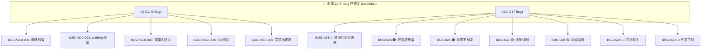

# Text Unifier V2.0.2 回归测试指令（发布验证版）

| 项目 | 内容 |
| :--- | :--- |
| **应用名称** | 文档终版确定器（Text Unifier） |
| **版本号** | V2.0.2 |
| **测试阶段** | 发布前回归验证 |
| **测试日期** | 2026-05-11 |

---

## 一、修复状态一览



---

## 二、Phase 0：编译验证（3 项）

> 修复后首先执行的编译验证。**全部通过后才能进入功能回归。**

| # | 验证项 | 命令 | 预期结果 | ✅ |
| :--- | :--- | :--- | :--- | :--- |
| C01 | Rust 单元测试 | `cd src-tauri && cargo test` | **25/25 全部通过** | ☐ |
| C02 | TypeScript 类型检查 | `npx tsc --noEmit` | **零错误** | ☐ |
| C03 | Vite 构建 | `npm run build` | **构建成功** | ☐ |

---

## 三、Phase 1：修复定向回归（24 项）

### 3.1 BUG-024 回归 — 排版勾选状态保持 ✅

| # | 步骤 | 操作 | 预期结果 | ✅ |
| :--- | :--- | :--- | :--- | :--- |
| R01 | 准备 | 导入 2 文件，分析完成，取消勾选段落 P2、P5 | P2、P5 淡化显示 | ☐ |
| R02 | 排版保持 | 点击「文档排版」 | P2、P5 仍为淡化状态 | ☐ |
| R03 | 多次排版 | 再排版 2 次 | 第 2、3 次后 P2、P5 仍然淡化 | ☐ |
| R04 | 导出一致 | 导出文件 | 不含 P2、P5 内容 | ☐ |
| R05 | 还原保持 | 排版 → 还原 | 还原后勾选状态正确 | ☐ |
| R06 | 复杂操作 | 取消 P3, 勾选 P5, 排版 | P3 淡化, P5 正常 | ☐ |

### 3.2 BUG-025 回归 — 还原后无残留 ✅

| # | 步骤 | 操作 | 预期结果 | ✅ |
| :--- | :--- | :--- | :--- | :--- |
| R07 | 准备 | 含缩进文本（排版后增加段落） | — | ☐ |
| R08 | 排版 | 点击「文档排版」 | 段落数增加 | ☐ |
| R09 | 还原清洁 | 点击「还原」 | 预览恢复 | ☐ |
| R10 | Map 检查 | Console 检查 `paragraphCheckedMap` | 无 `fmt_*` 键 | ☐ |
| R11 | 再排版 | 还原后再排版 | 正常执行 | ☐ |

### 3.3 BUG-026 回归 — 排序触发分析 ✅

| # | 步骤 | 操作 | 预期结果 | ✅ |
| :--- | :--- | :--- | :--- | :--- |
| R12 | 准备 | F1("A,B"), F2("A,C")，F1 排第一 | — | ☐ |
| R13 | 拖拽 | 拖 F2 到 F1 上方 | 显示 loading | ☐ |
| R14 | 验证主文件 | 分析完成 | F2 为主文件，「★ 主文件」移转 | ☐ |
| R15 | 验证段落 | 检查预览 | F2 的 A 和 C 均完整保留 | ☐ |
| R16 | 勾选保留 | 拖拽前取消某段 | 拖拽后该段仍取消 | ☐ |

### 3.4 BUG-027 回归 — 诗歌保护 ✅

| # | 步骤 | 操作 | 预期结果 | ✅ |
| :--- | :--- | :--- | :--- | :--- |
| R17 | 含逗号诗 | 排版含逗号短诗 | 换行保留 | ☐ |
| R18 | 含逗号普通句 | 排版每行含逗号的长句 | 合并（非诗歌） | ☐ |
| R19 | Rust 测试 | `cargo test` | 25/25 包含原有诗歌测试 | ☐ |

### 3.5 BUG-028 回归 — SHA-256 哈希 ✅

| # | 步骤 | 操作 | 预期结果 | ✅ |
| :--- | :--- | :--- | :--- | :--- |
| R20 | 哈希格式 | 分析完成 | 所有 content_hash 为 64 位 hex | ☐ |
| R21 | 排版后哈希 | 排版后检查 | 新内容使用同格式 SHA-256 | ☐ |

### 3.6 BUG-029 + BUG-030 回归 ✅

| # | 步骤 | 操作 | 预期结果 | ✅ |
| :--- | :--- | :--- | :--- | :--- |
| R22 | 构建检查 | `npx tsc --noEmit` | 无 import 相关错误 | ☐ |
| R23 | 列表无空格 | `"1.项目A\n2.项目B\n3.项目C"` 排版 | 列表换行保留 | ☐ |
| R24 | 列表有空格 | `"1. 项目A\n2. 项目B\n3. 项目C"` 排版 | 列表换行保留 | ☐ |

---

## 四、Phase 2：全功能回归（37 项）

> V2.0 初测定义的 37 项回归清单（R01-R37），涵盖 RQ-01~03 + V1.0 核心回归。
> 通过 Phase 1 后执行此阶段。

| 测试域 | 项数 | 覆盖范围 |
| :--- | :---: | :--- |
| RQ-01 文件排序 | R01-R08（8 项） | 拖拽、占位线、单文件禁拖、键盘排序 |
| RQ-02 段落勾选 | R09-R16（8 项） | 默认勾选、淡化、还原、Shift 多选、三态联动 |
| RQ-03 文档排版 | R17-R30（14 项） | 合并、保留、缩进、列表、诗歌、还原、幂等 |
| V1.0 核心回归 | R31-R37（7 项） | 去重、导出、悬停、重置、非 txt 拒绝 |

---

## 五、发布判定标准

### 5.1 判定矩阵

```
V2.0.2 发布判定
━━━━━━━━━━━━━━━━━━━━━━━━━━━━━━━━━━━━━━━━━━━━━━━━━━━

Phase 0: 编译验证 (3/3)
  C01 cargo test 25/25    → [PASS]  ← 已通过
  C02 tsc --noEmit 零错误  → [PASS]  ← 已通过
  C03 npm run build 成功   → [PASS]  ← 已通过

Phase 1: 修复定向回归 (24 项)
  BUG-024 (R01-R06): ___/6 通过    → [PASS/FAIL]
  BUG-025 (R07-R11): ___/5 通过    → [PASS/FAIL]
  BUG-026 (R12-R16): ___/5 通过    → [PASS/FAIL]
  BUG-027 (R17-R19): ___/3 通过    → [PASS/FAIL]
  BUG-028 (R20-R21): ___/2 通过    → [PASS/FAIL]
  BUG-029/030 (R22-R24): ___/3 通过 → [PASS/FAIL]

Phase 2: 全功能回归 (37 项)
  R01-R08: ___/8 通过              → [PASS/FAIL]
  R09-R16: ___/8 通过              → [PASS/FAIL]
  R17-R30: ___/14 通过             → [PASS/FAIL]
  R31-R37: ___/7 通过              → [PASS/FAIL]

最终判定
━━━━━━━━━━━━━━━━━━━━━━━━━━━━━━━━━━━━━━━━━━━━━━━━━━━
  [ ] ✅ 全部通过 → V2.0.2 RELEASE
  [ ] 🔄 Phase 1 失败 → 排查修复后重测
  [ ] ❌ P0 残留 → 阻塞发布
```

### 5.2 判定规则

```
通过标准:
  Phase 0: 100% ✅ → 进入 Phase 1
  Phase 1: 100% ✅ → 进入 Phase 2
  Phase 2: ≥ 95% 且无 P0/P1 失败 → RELEASE

失败处理:
  任何 Phase 1 项失败 → 排查修复后重测该模块
  Phase 2 ≤ 90% 或含 P0/P1 → 记录新 Bug，不发布
```

---

## 六、测试环境与数据

### 6.1 环境准备

```bash
# 1. 运行单元测试
cd src-tauri && cargo test

# 2. 类型检查
cd .. && npx tsc --noEmit

# 3. 启动 Tauri 开发模式
npm run tauri dev
```

### 6.2 测试数据

| 测试场景 | 数据 | 用途 |
| :--- | :--- | :--- |
| 基本去重 | `test_data/functional/01_basic_duplicate/` | RQ-02/03 基础测试 |
| 多文件重复 | `test_data/functional/08_multi_file_duplicate/` | 排序触发分析 |
| 空白变体 | `test_data/functional/02_whitespace_variation/` | 排版列表保护 |
| 全量重复 | `test_data/functional/07_all_duplicates/` | 勾选联动测试 |

### 6.3 特殊测试文本

含逗号诗歌：
```
春眠不觉晓，
处处闻啼鸟。
夜来风雨声，
花落知多少。
```

含无空格列表：
```
1.项目启动
2.需求分析
3.系统设计
4.编码实现
```

---

## 七、回归测试报告模板

```markdown
# V2.0.2 回归测试结果

## Phase 0: 编译验证
- C01 cargo test: ___/25 通过 → [PASS/FAIL]
- C02 tsc --noEmit: [零错误/有错误]
- C03 npm run build: [成功/失败]

## Phase 1: 修复定向回归
- BUG-024: ___/6 通过 → [PASS/FAIL]
- BUG-025: ___/5 通过 → [PASS/FAIL]
- BUG-026: ___/5 通过 → [PASS/FAIL]
- BUG-027: ___/3 通过 → [PASS/FAIL]
- BUG-028: ___/2 通过 → [PASS/FAIL]
- BUG-029/030: ___/3 通过 → [PASS/FAIL]

## Phase 2: 全功能回归
- R01-R08: ___/8 通过
- R09-R16: ___/8 通过
- R17-R30: ___/14 通过
- R31-R37: ___/7 通过
- 全回归: ___/37 通过 (___%)

## 新发现 Bug
- 数量: ___ 个
- 详情: （编号 + 简述）

## 最终判定
- [ ] ✅ V2.0.2 RELEASE
- [ ] 🔄 需要修复
- [ ] ❌ 阻塞发布

测试人: __________  日期: __________
```

---

*指令生成日期：2026-05-11*
*关联文档：01_全维度测试用例_V2.0.2.md / 02_Bug报告_V2.0.2.md / 03_复测测试报告_V2.0.2.md*
