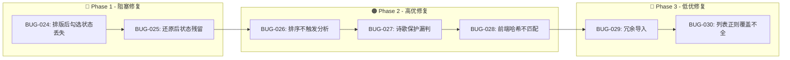

# Text Unifier V2.0 回归测试指令

| 项目 | 内容 |
| :--- | :--- |
| **应用名称** | 文档终版确定器（Text Unifier） |
| **版本号** | V2.0 |
| **测试阶段** | 回归测试（Bug 修复验证） |
| **测试日期** | 2026-05-09 |

---

## 一、修复优先级矩阵



---

## 二、Phase 1 回归测试（P0 + P1 Bug 验证）

### 2.1 BUG-024 修复验证：「排版后段落勾选状态丢失」

#### 修复范围
- **文件**: `src/store/useStore.ts`
- **函数**: `formatDocumentAction()`
- **修改**: 将 `rebuiltCheckedMap` 构建逻辑从 `content_hash` 匹配改为 `paragraphId` 匹配

#### 验证步骤

| 步骤 | 操作 | 预期结果 | ✅ |
| :--- | :--- | :--- | :--- |
| 1 | 导入 2 个有重复内容的 .txt 文件，等待分析完成 | 状态栏显示「分析完成」 | ☐ |
| 2 | 在右侧预览区取消勾选 **段落 P2**、**P5** | P2、P5 淡化显示，显示「已排除」徽章 | ☐ |
| 3 | 点击「文档排版」按钮 | 排版完成，按钮恢复可用 | ☐ |
| 4 | 观察段落 P2、P5 的状态 | **关键验证**: P2、P5 仍为淡化状态（勾选状态未丢失） | ☐ |
| 5 | 导出文件 | 导出的文件中不应包含 P2、P5 的内容 | ☐ |
| 6 | 点击「还原」 | P2、P5 仍为淡化状态 | ☐ |
| 7 | 勾选段落 P3，取消勾选段落 P4，再次排版 | P3 正常，P4 淡化；排版后状态不变 | ☐ |
| 8 | 重复步骤 4-5 三次 | 勾选状态始终正确保持 | ☐ |

#### 验证通过标准
- ✅ BUG-024 修复后，排版操作前后所有段落的勾选状态完全一致
- ✅ 导出内容与勾选状态一致

---

### 2.2 BUG-025 修复验证：「还原后残留 fmt_* 勾选状态」

#### 修复范围
- **文件**: `src/store/useStore.ts`
- **函数**: `revertFormatting()`
- **修改**: 从基于当前 `paragraphCheckedMap` 复制改为基于快照段落重建 Map

#### 验证步骤

| 步骤 | 操作 | 预期结果 | ✅ |
| :--- | :--- | :--- | :--- |
| 1 | 准备含缩进开头的文本，使排版后段落数增加 | — | ☐ |
| 2 | 执行排版 | 段落数增加（产生 fmt_* 段落） | ☐ |
| 3 | 打开浏览器开发者工具 Console | — | ☐ |
| 4 | 输入 `window.__STORE__.getState().paragraphCheckedMap` | 显示 Map 包含 fmt_0, fmt_1 等键 | ☐ |
| 5 | 点击「还原」按钮 | 预览恢复到排版前 | ☐ |
| 6 | 再次检查 `paragraphCheckedMap` | **关键验证**: Map 中**不应**包含 fmt_0, fmt_1 等键 | ☐ |
| 7 | 对还原后的段落重新排版 | 正常执行，无异常 | ☐ |
| 8 | 再次还原 | 再次恢复到原始状态 | ☐ |

#### 验证通过标准
- ✅ 还原后 `paragraphCheckedMap` 中无无效键存在
- ✅ 还原后可正常再次排版

---

## 三、Phase 2 回归测试（P1 + P2 Bug 验证）

### 3.1 BUG-026 修复验证：「拖拽排序后触发自动重新分析」

#### 修复范围
- **文件**: `src/App.tsx` 或新增 `useEffect`
- **逻辑**: 在 `reorderFiles` 完成后自动调用 `scanFiles`

#### 验证步骤

| 步骤 | 操作 | 预期结果 | ✅ |
| :--- | :--- | :--- | :--- |
| 1 | 导入文件 F1（内容: "A,B"）和 F2（内容: "A,C"），F1 排第一 | 预览以 F1 为主文件 | ☐ |
| 2 | 点击「全选」勾选所有段落 | — | ☐ |
| 3 | 将 F2 拖拽到 F1 上方 | 文件列表顺序变为 [F2, F1] | ☐ |
| 4 | 观察界面 | **关键验证**: 显示「正在分析文件中...」loading 动画 | ☐ |
| 5 | 分析完成后，观察预览 | **关键验证**: 预览更新，F2 的 "A" 和 "C" 都完整保留，仅 "B" 新增 | ☐ |
| 6 | 确认主文件标记已移至 F2 | F2 行尾显示「★ 主文件」 | ☐ |
| 7 | 验证拖拽前的段落勾选状态已保留 | 之前「全选」的段落全部保持勾选 | ☐ |
| 8 | 再次拖拽恢复原顺序 | 再次自动分析，主文件变回 F1 | ☐ |

#### 验证通过标准
- ✅ 拖拽排序后**自动**触发重新分析（显示 loading）
- ✅ 分析结果反映新文件顺序
- ✅ 已勾选状态在分析后保留

---

### 3.2 BUG-027 修复验证：「含标点诗歌保护」

#### 修复范围
- **文件**: `src-tauri/src/document_formatter.rs`
- **函数**: `is_protected_block()`
- **修改**: 中文逗号/分号检测从 `any()` 改为比例阈值

#### 验证步骤

| 步骤 | 操作 | 预期结果 | ✅ |
| :--- | :--- | :--- | :--- |
| 1 | 准备含中文逗号的短句文本（4 行）: | — | ☐ |
|    | `春眠不觉晓，` | | |
|    | `处处闻啼鸟。` | | |
|    | `夜来风雨声，` | | |
|    | `花落知多少。` | | |
| 2 | 导入该文本，点击「文档排版」 | **关键验证**: 换行保留（protected_blocks > 0） | ☐ |
| 3 | 准备现代诗文本（每行短、含逗号、无句号）: | — | ☐ |
|    | `这是一个短行` | | |
|    | `每行都很短` | | |
|    | `虽然含逗号` | | |
|    | `但仍然是诗` | | |
| 4 | 排版上述文本 | **关键验证**: 含逗号但行均短 + 无句号 → 仍受保护 | ☐ |
| 5 | 准备非诗歌文本（含逗号的普通长句）: | — | ☐ |
|    | `首先，我们需要分析需求文档，然后确定技术方案，接着开始编码实现。` | | |
|    | `在编码过程中，我们需要遵守编码规范，确保代码质量。` | | |
| 6 | 排版上述文本 | **关键验证**: 普通长句不受保护，正确合并 | ☐ |
| 7 | 运行 Rust 单元测试 | `cargo test` 全部通过 | ☐ |

#### 验证通过标准
- ✅ 含中文逗号的诗歌/短句保留换行
- ✅ 含中文逗号的普通长句正确合并
- ✅ 全部现有单元测试仍通过

---

### 3.3 BUG-028 修复验证：「前端哈希一致性」

#### 修复范围
- **文件**: `src/store/useStore.ts`
- **函数**: `computeContentHash()`
- **修改**: 使用 `crypto.subtle.digest('SHA-256')` 替代简易哈希

#### 验证步骤

| 步骤 | 操作 | 预期结果 | ✅ |
| :--- | :--- | :--- | :--- |
| 1 | 导入文件分析完成 | 所有段落 content_hash 为 64 位十六进制 | ☐ |
| 2 | 点击「文档排版」 | 排版后段落 content_hash 也是 64 位十六进制 | ☐ |
| 3 | 检查哈希格式 | `content_hash` 全部以 64 字符 hex 格式呈现（非 `hash_` 前缀） | ☐ |
| 4 | 导出后对比排版前后的段落哈希 | 同一个段落排版前后的哈希不同（内容变了） | ☐ |
| 5 | 重复 3 次排版+还原 | 每次重新计算哈希，无异常 | ☐ |

#### 验证通过标准
- ✅ 所有段落 content_hash 使用统一格式（64 位 hex）
- ✅ 排版后段落哈希重新计算正确

---

## 四、全回归测试清单

在 Phase 1 + 2 修复完成后，执行以下全回归测试：

### 4.1 RQ-01 文件拖拽排序回归

| # | 测试项 | 预期 | ✅ |
| :--- | :--- | :--- | :--- |
| R01 | 拖拽手柄可见，悬停变 grab 光标 | AC-01-01 | ☐ |
| R02 | 基本拖拽重排 | AC-01-02 | ☐ |
| R03 | 拖拽占位虚线反馈 | AC-01-03 | ☐ |
| R04 | 排序后自动分析并正确输出 | AC-01-04 + BUG-026 | ☐ |
| R05 | 排序后勾选状态保留 | AC-01-05 | ☐ |
| R06 | 单文件禁止拖拽 | AC-01-06 | ☐ |
| R07 | 键盘排序 | AC-01-01 扩展 | ☐ |
| R08 | 拖出列表取消 | PRD §4 | ☐ |

### 4.2 RQ-02 段落勾选回归

| # | 测试项 | 预期 | ✅ |
| :--- | :--- | :--- | :--- |
| R09 | 默认全勾选 | AC-02-01 | ☐ |
| R10 | 取消勾选淡化 | AC-02-02 | ☐ |
| R11 | 重新勾选恢复 | AC-02-03 | ☐ |
| R12 | 全选/取消全选 | AC-02-04 | ☐ |
| R13 | Shift 多选 | AC-02-05 | ☐ |
| R14 | 重复组三态联动 | AC-02-06 | ☐ |
| R15 | 导出过滤一致性 | AC-02-07 | ☐ |
| R16 | 全部排除时空状态 | PRD §4 | ☐ |

### 4.3 RQ-03 文档排版回归

| # | 测试项 | 预期 | ✅ |
| :--- | :--- | :--- | :--- |
| R17 | 按钮可见可点 | AC-03-01 | ☐ |
| R18 | 段内硬回车合并 | AC-03-02 | ☐ |
| R19 | 段落分隔保留 | AC-03-03 | ☐ |
| R20 | 多空行归一 | AC-03-04 | ☐ |
| R21 | 缩进分段 | AC-03-05 | ☐ |
| R22 | 列表保护 | AC-03-06 | ☐ |
| R23 | 排版后勾选状态保持 | **BUG-024 回归** | ☐ |
| R24 | 还原功能 | AC-03-08 + BUG-025 | ☐ |
| R25 | 多次排版 | AC-03-09 | ☐ |
| R26 | 仅影响已勾选段落 | AC-03-10 | ☐ |
| R27 | 内容零修改 | AC-03-07 | ☐ |
| R28 | 诗歌保护（含标点） | BUG-027 回归 | ☐ |
| R29 | 幂等性 | PRD §2.4 | ☐ |
| R30 | 空文件不崩溃 | PRD §4 | ☐ |

### 4.4 V1.0/V1.1 核心回归

| # | 测试项 | 预期 | ✅ |
| :--- | :--- | :--- | :--- |
| R31 | 多文件去重 | 跨文件重复去除 | ☐ |
| R32 | 文件内重复保留 | V1.1 AC-D01 | ☐ |
| R33 | 导出功能 | 弹出保存对话框 | ☐ |
| R34 | 悬停溯源 | 显示 Tooltip | ☐ |
| R35 | 重置会话 | 回到初始状态 | ☐ |
| R36 | 非 .txt 拒绝 | BUG-010 回归 | ☐ |
| R37 | Rust 单元测试 | `cargo test` 全部 23 项通过 | ☐ |

---

## 五、回归测试判定标准

### 5.1 阶段通过/失败标准

```
Phase 1 回归:
  - BUG-024 修复验证: 8 步骤全部 ✅ → PASS
  - BUG-025 修复验证: 8 步骤全部 ✅ → PASS
  
Phase 2 回归:
  - BUG-026 修复验证: 8 步骤全部 ✅ → PASS
  - BUG-027 修复验证: 7 步骤全部 ✅ → PASS
  - BUG-028 修复验证: 5 步骤全部 ✅ → PASS

全回归:
  - R01-R37 全部通过 → RELEASE READY
  - ≤3 项失败且非 P0/P1 → 审查后决定
  - ≥4 项失败或含 P0/P1 → 进入下一轮修复
```

### 5.2 版本发布判定矩阵

| 条件 | 判定 | 操作 |
| :--- | :--- | :--- |
| Phase 1 ❌ | **阻塞发布** | 继续修复 BUG-024/025 |
| Phase 1 ✅, Phase 2 ❌ | **不可发布** | 修复 Phase 2 Bug |
| Phase 1 ✅, Phase 2 ✅, 全回归 ≥ 90% | **条件发布** | 审查未通过项 |
| 全回归 100% ✅ | **V2.0 RELEASE** | 打 Tag、发布 |

---

## 六、测试环境准备

### 6.1 构建测试版本

```bash
# 1. 应用所有 Bug 修复
# 2. 运行 Rust 单元测试
cd src-tauri
cargo test

# 3. 运行 TypeScript 类型检查
cd ..
npx tsc --noEmit

# 4. 构建前端
npm run build

# 5. 启动 Tauri 开发环境
npm run tauri dev
```

### 6.2 测试数据准备

```bash
# 使用已有的功能测试数据
cd test_data/functional

# 关键测试场景：
# 01_basic_duplicate/    - 基本去重
# 02_whitespace_variation/ - 空白变体
# 07_all_duplicates/     - 全部重复
# 08_multi_file_duplicate/ - 多文件重复
```

### 6.3 测试工具

| 工具 | 用途 |
| :--- | :--- |
| **Rust `cargo test`** | 后端单元测试（23 项） |
| **Python `run_test_and_merge.py`** | V1.1 算法验证脚本 |
| **Chrome DevTools** | 前端 Store 状态检查 |
| **Tauri Console** | IPC 调用日志查看 |

---

## 七、回归测试报告模板

修复完成后，在以下模板中记录回归结果：

```markdown
# 回归测试结果

## 修复列表
- [ ] BUG-024: 排版后勾选状态丢失
- [ ] BUG-025: 还原后状态残留
- [ ] BUG-026: 排序不触发分析
- [ ] BUG-027: 诗歌保护漏判
- [ ] BUG-028: 前端哈希不匹配

## Phase 1 验证
- BUG-024: ___/8 步骤通过 → [PASS/FAIL]
- BUG-025: ___/8 步骤通过 → [PASS/FAIL]

## Phase 2 验证
- BUG-026: ___/8 步骤通过 → [PASS/FAIL]
- BUG-027: ___/7 步骤通过 → [PASS/FAIL]
- BUG-028: ___/5 步骤通过 → [PASS/FAIL]

## 全回归
- R01-R37: ___/37 通过
- 通过率: ___%
- 新发现 Bug: ___ 个

## 最终判定
- [ ] ✅ 可发布 V2.0
- [ ] 🔄 需第二轮修复
- [ ] ❌ 阻塞发布

测试人: __________  日期: __________
```

---

## 八、常见问题（FAQ）

### Q1: 回归测试发现新 Bug 怎么办？
> 记录新 Bug，按严重等级插入修复队列。
> 不影响已通过测试的修复可继续，新 P0/P1 Bug 需阻塞发布。

### Q2: 修复后还有哪些已知限制？
> 详见初测测试报告 §7，均为 V2.1 计划项，不影响 V2.0 发布。

### Q3: 首次修复后如何确定是否进入第二轮？
> 使用「版本发布判定矩阵」：
> - Phase 1 ❌ → 必须继续
> - 全回归通过率 < 90% 或含 P0/P1 → 必须继续
> - 全回归通过率 ≥ 90% 且无 P0/P1 → 可条件发布

---

*指令生成日期：2026-05-09*
*关联文档：01_全维度测试用例.md / 02_Bug报告.md / 03_初测测试报告.md*
