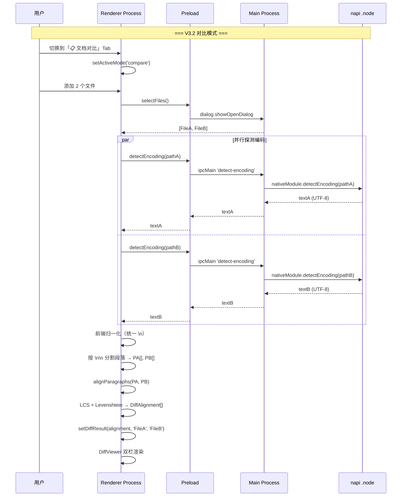

# 文档终版确定器（Text Unifier）V3.2 接口规范文档

| 项目名称 | 文档终版确定器（Text Unifier） |
| :--- | :--- |
| **版本号** | V3.2 |
| **文档类型** | 接口规范文档（接口定义、入参/出参、调用规则） |
| **基线版本** | V3.1 接口规范文档 |
| **关联文档** | `系统架构设计文档_V3.2.md` / `数据库设计文档_V3.2.md` |

---

## 重要声明

V3.2 **无任何 IPC 层变更、无任何 Rust napi 变更、无任何 Electron Main Process 变更**。所有 V3.1 的 IPC handler（6 个）和 napi 函数（4 个）100% 保留。

V3.2 的全部新功能（文件芯片栏、全窗口拖拽、预览可编辑、撤回栈、LCS 段落对比）均为 **纯前端 TypeScript** 实现，运行在 Electron Renderer Process 中。

本文档对 V3.1 接口进行**确认性复述**，并补充 V3.2 新增的纯前端接口定义。

---

## 第一部分：IPC 接口（100% 继承 V3.1）

### 1.1 IPC 接口清单（不变）

| 接口名称 | IPC 通道名 | 底层 | 功能 |
| :--- | :--- | :--- | :--- |
| `scanFiles` | `scan-files` | napi `scan_files()` | 扫描分析（兼容路径） |
| `detectEncoding` | `detect-encoding` | napi `detect_encoding()` | 编码探测并返回解码文本 |
| `scanPreprocessedTexts` | `scan-preprocessed-texts` | napi `scan_preprocessed_texts()` | 预处理文本的归一化+去重 |
| `formatDocument` | `format-document` | napi `format_document()` | 文档排版（兼容） |
| `exportFile` | `export-file` | dialog + fs | 导出 |
| `selectFiles` | `select-files` | dialog + fs | 文件选择 |

### 1.2 前端 IPC 层（`src/utils/ipc.ts` — 不变）

> 与 V3.1 完全一致。V3.2 未新增任何 IPC 调用需求。

### 1.3 对比模式的 IPC 使用

对比模式复用已有 IPC：

```text
文档对比流程中的 IPC 调用：
  1. detectEncoding(filePath)  ×2  → 编码探测两个文件
  2. 无需 scanPreprocessedTexts（对比不做去重合并）
  3. 无需 formatDocument（对比不使用排版引擎）
  4. 归一化、LCS 对齐、渲染均为纯前端
```

### 1.4 Electron Main Process（`electron/main.ts` — 不变）

> V3.2 无任何 handler 新增或修改。

### 1.5 Electron Preload（`electron/preload.ts` — 不变）

> V3.2 无任何 API 新增或修改。

---

## 第二部分：Rust napi 接口（100% 继承 V3.1）

### 2.1 napi 函数清单（不变）

| napi 函数 | 输入 | 输出 | 变更 |
| :--- | :--- | :--- | :--- |
| `scan_files(paths)` | `Vec<String>` | `AnalysisReport` | 不变 |
| `detect_encoding(file_path)` | `String` | `String` | 不变 |
| `scan_preprocessed_texts(texts, names, sizes)` | `Vec<String>, Vec<String>, Vec<u32>` | `AnalysisReport` | 不变 |
| `format_document(text)` | `String` | `FormatResult` | 不变 |

### 2.2 Rust 源文件（`native/src/` — 全部零改动）

```
native/src/lib.rs                  ← 零改动
native/src/file_processor.rs       ← 零改动
native/src/text_normalizer.rs      ← 零改动
native/src/paragraph_index.rs      ← 零改动
native/src/document_formatter.rs   ← 零改动
native/src/duplicate_resolver.rs   ← 零改动
```

---

## 第三部分：纯前端接口（V3.2 新增）

以下所有接口运行在 Electron Renderer Process（TypeScript），不经过 IPC 或 napi。

### 3.1 撤回栈 API（`src/store/undoStack.ts`）

#### `class UndoStack`

| 方法 | 入参 | 出参 | 说明 |
| :--- | :--- | :--- | :--- |
| `constructor(maxDepth)` | `maxDepth: number`（默认 5） | — | 初始化栈 |
| `push(snapshot)` | `snapshot: Snapshot` | `void` | 入栈；丢弃 pointer 之后的快照；满 5 步 shift() |
| `undo()` | — | `Snapshot \| null` | pointer-- → 返回快照 |
| `redo()` | — | `Snapshot \| null` | pointer++ → 返回快照 |
| `clear()` | — | `void` | 清空栈 |
| `get canUndo()` | — | `boolean` | pointer > 0 |
| `get canRedo()` | — | `boolean` | pointer < stack.length - 1 |
| `get depth()` | — | `number` | 当前栈深度 |

#### `interface Snapshot`

```typescript
interface Snapshot {
    id: string;                               // crypto.randomUUID()
    paragraphs: PreviewParagraph[];           // 深拷贝
    checkedMap: Record<string, boolean>;      // paragraphId → isChecked
    reason?: string;                          // "应用处理" | "手动编辑" | "勾选切换" | "章节操作"
    timestamp: number;                        // Date.now()
}
```

**调用规则**：

| 规则编号 | 规则内容 |
| :--- | :--- |
| **R-01** | 快照保存使用 `structuredClone()` 深拷贝，确保后续操作不污染已保存快照。 |
| **R-02** | 新操作入栈时，`pointer` 之后的所有快照被丢弃（新分支覆盖旧"未来"）。 |
| **R-03** | 满 5 步后 `shift()` 丢弃最早快照（FIFO）。 |
| **R-04** | `undo()`/`redo()` 返回的快照也是 `structuredClone()` 副本，防止外部修改。 |

---

### 3.2 段落对齐 API（`src/utils/diffUtils.ts`）

#### `alignParagraphs(left, right)`

| 项目 | 内容 |
| :--- | :--- |
| **功能** | 对两个段落的数组执行 LCS 对齐 + Levenshtein 相似度判定 |
| **输入** | `left: string[]`, `right: string[]`（归一化后的段落文本数组） |
| **输出** | `DiffAlignment[]` |
| **复杂度** | O(m×n)，m/n 为段落数 |

#### `computeLCS(a, b)`

| 项目 | 内容 |
| :--- | :--- |
| **功能** | 标准 LCS 最长公共子序列算法（DP 表 + 回溯） |
| **输入** | `a: string[]`, `b: string[]` |
| **输出** | `{ leftIdx: number, rightIdx: number }[]`（匹配对） |

#### `levenshtein(a, b)`

| 项目 | 内容 |
| :--- | :--- |
| **功能** | Levenshtein 编辑距离 |
| **输入** | `a: string`, `b: string` |
| **输出** | `number`（编辑距离，越小越相似） |

#### `wordDiff(a, b)`

| 项目 | 内容 |
| :--- | :--- |
| **功能** | 逐词差异比较，返回标记数组 |
| **输入** | `a: string`, `b: string` |
| **输出** | `DiffToken[]`（`{ text, isDiff }`） |

#### 类型定义

```typescript
interface DiffAlignment {
    type: 'match' | 'leftOnly' | 'rightOnly' | 'diff';
    leftText?: string;
    rightText?: string;
    diffTokens?: DiffToken[];
}

interface DiffToken {
    text: string;
    isDiff: boolean;
}
```

**调用规则**：

| 规则编号 | 规则内容 |
| :--- | :--- |
| **R-05** | `alignParagraphs` 首先执行精确 LCS 匹配，完全相同的段落归类为 `match`。 |
| **R-06** | 相邻的 `leftOnly` + `rightOnly` 对，计算相似度（1 - levenshtein/maxLen）。相似度 > 0.6 时合并为 `diff` 类型并生成 `diffTokens`。 |
| **R-07** | `wordDiff` 使用中文分词（按标点/空白/英文单词边界分割），标记差异词为 `isDiff: true`。 |

---

### 3.3 拖拽遮罩 API（`src/components/DragOverlay.tsx`）

#### 全局事件监听 Hook

```typescript
function useGlobalDragDrop(
    onFilesDrop: (files: File[]) => void
): {
    isVisible: boolean;
    isRejecting: boolean;
}
```

**调用规则**：

| 规则编号 | 规则内容 |
| :--- | :--- |
| **R-08** | 监听 `document` 级别的 `dragenter`/`dragleave`/`drop` 事件。 |
| **R-09** | 使用计数器（非 toggle）防止子元素 `dragleave` 误触发。计数器归零才隐藏遮罩。 |
| **R-10** | `dragenter` 时检测 `event.dataTransfer.files`，有非 `.txt` 文件时 `isRejecting = true`（遮罩变红）。 |
| **R-11** | `drop` 时过滤非 `.txt` 文件，调用 `onFilesDrop` 回调。去除 `files` 的 `FileSystemFileEntry` 路径信息。 |

---

### 3.4 文件芯片拖拽（`src/components/FileChipBar.tsx`）

> 使用 `@dnd-kit/core` + `@dnd-kit/sortable` 的 `horizontalListSortingStrategy`（策略从垂直切换为水平）。

**调用规则**：

| 规则编号 | 规则内容 |
| :--- | :--- |
| **R-12** | 横向拖拽排序：`horizontalListSortingStrategy`，芯片支持通过鼠标拖拽左右调整位置。 |
| **R-13** | 排序结果第 1 个文件自动标记为 ★ 主文件，触发重新分析（同 V3.0 RQ-01 语义）。 |
| **R-14** | 超过容器宽度时 `overflow-x: auto` 横向滚动，不换行。 |

---

## 第四部分：接口使用差异（V3.1 vs V3.2）

### 4.1 合并去重模式调用路径

```text
V3.1 路径:
  selectFiles → forEach file: detectEncoding + novelProcessor Phase 1
  → scanPreprocessedTexts → 用户点击「应用处理」→ novelProcessor Phase 4
  → exportFile

V3.2 路径（推荐 — 不变）:
  UploadButton/DragOverlay → addFiles
  → forEach file: detectEncoding + novelProcessor Phase 1
  → scanPreprocessedTexts → 用户点击「应用处理」→ novelProcessor Phase 4
  → pushSnapshot(应用处理)  ← 🆕 自动入栈
  → exportFile
```

### 4.2 对比模式调用路径（全新）

```text
切换「📋 文档对比」Tab → 添加 2 个文件
  → detectEncoding(fileA) → textA
  → detectEncoding(fileB) → textB
  → 前端归一化（复用 TextNormalizer 逻辑或简单 \n 统一）
  → 按 \n\n 分割段落
  → alignParagraphs(PA, PB) → DiffAlignment[]
  → DiffViewer 渲染双栏
  → 用户仅在 UI 中审阅差异，不导出
```

### 4.3 编辑模式调用路径（全新）

```text
用户点击「✏️ 编辑」→ PreviewPanel 切换为 contentEditable 模式
  → 用户修改段落文字
  → onInput debounce 500ms → updateParagraphText(id, newText)
  → pushSnapshot("手动编辑")  ← 自动入栈

用户 Ctrl+Z → undo() → 恢复预览
用户 Ctrl+Y → redo() → 重做
```

---

## 第五部分：调用时序图（V3.2 对比模式）



---

## 第六部分：设计合理性自检

### 6.1 接口完整性

| 检查项 | 结论 | 说明 |
| :--- | :--- | :--- |
| **所有 PRD 功能有对应实现** | ✅ | RQ-01→04 纯前端；RQ-05 复用已有 IPC + 前端 LCS |
| **无新 IPC 需求** | ✅ | V3.1 的 6 个 IPC 完全覆盖 V3.2 需求 |
| **无新 napi 需求** | ✅ | V3.1 的 4 个 napi 函数完全覆盖 |

### 6.2 前端纯接口复杂度

| 接口 | 行数（估） | 复杂度 | 说明 |
| :--- | :---: | :--- | :--- |
| `UndoStack` | ~70 | 低 | 数组操作 |
| `alignParagraphs` | ~100 | 中 | 经典 LCS DP 算法 |
| `useGlobalDragDrop` | ~60 | 低 | document 事件监听 |
| `DiffViewer` | ~150 | 中 | 双栏同步滚动 + 颜色渲染 |

### 6.3 安全性

| 检查项 | 结论 | 说明 |
| :--- | :--- | :--- |
| **contextIsolation** | ✅ 不变 | 强制启用 |
| **无新增 IPC 攻击面** | ✅ | IPC handler 数量和签名不变 |
| **DragOverlay 文件过滤** | ✅ | 仅 `.txt` 文件通过，非 `.txt` 遮罩变红提示 |

### 6.4 性能

| 检查项 | 结论 | 说明 |
| :--- | :--- | :--- |
| **LCS 5000 段落** | ✅ <100ms | O(m×n) DP，JS 足够快 |
| **structuredClone 快照** | ✅ <10ms/次 | 10MB 深拷贝 |
| **debounce 编辑保存** | ✅ 500ms | 不影响编辑流畅度 |

### 6.5 V3.1 → V3.2 兼容

| 检查项 | 结论 | 说明 |
| :--- | :--- | :--- |
| **IPC 完全兼容** | ✅ | 零变更 |
| **napi 完全兼容** | ✅ | 零变更 |
| **Main Process 完全兼容** | ✅ | `electron/main.ts` 零改动 |
| **Preload 完全兼容** | ✅ | `electron/preload.ts` 零改动 |

---

> **文档版本**: V3.2 | **编写日期**: 2026-05-12
