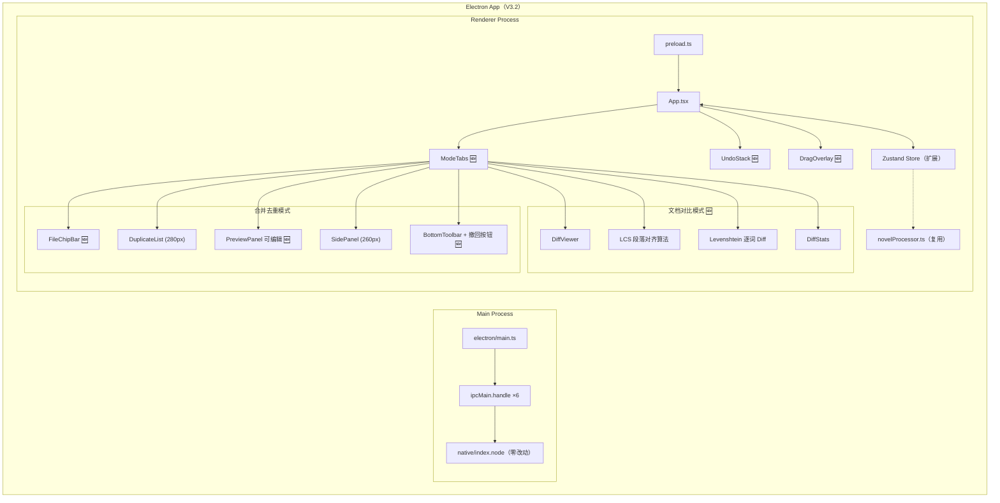
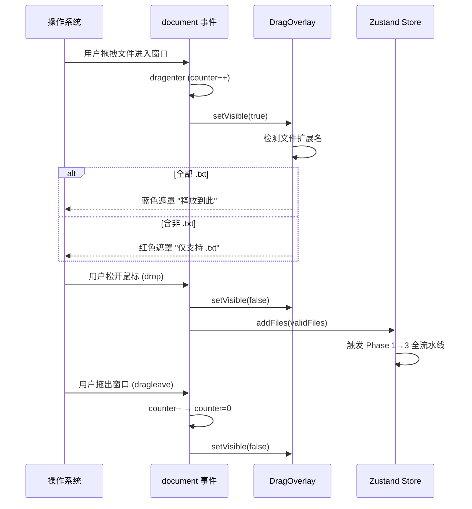

# 文档终版确定器（Text Unifier）V3.2 系统架构设计文档

| 项目名称 | 文档终版确定器（Text Unifier） |
| :--- | :--- |
| **版本号** | V3.2 |
| **文档类型** | 系统架构设计文档（含技术选型、模块划分、交互流程） |
| **基线版本** | V3.1（Electron + napi-rs + 小说清洗引擎） |
| **关联文档** | `PRD_V3.2_产品需求文档.md` / `PRD_V3.2_交互原型.md` |

---

## 重要声明

V3.2 在 V3.1 基础上聚焦 **三大方向**：① 界面布局重设计（文件区轻量化为浮动芯片、预览区主位化）；② 预览编辑与 5 步撤回栈；③ 新增文档对比模式。所有 V3.1 功能 100% 保留。Rust napi 引擎零改动。

---

## 第一部分：技术选型

### 1. 技术选型总览

| 类别 | V3.1 方案 | V3.2 变更 | 选型理由 |
| :--- | :--- | :--- | :--- |
| **桌面框架** | Electron v31 + napi-rs | **不变** | Win7+ 全覆盖 |
| **前端框架** | React 18 + TypeScript | **不变** | 100% 复用 |
| **状态管理** | Zustand 4 | **扩展**（+模式切换 +撤回栈 +编辑态 +对比数据） | 轻量扩展 |
| **样式方案** | Tailwind CSS 3.x | **不变** | 新增组件复用原子类 |
| **拖拽排序** | `@dnd-kit` | **不变**（策略从 vertical 切换为 horizontal） | `horizontalListSortingStrategy` 内置 |
| **全窗口拖拽** | — | **原生 HTML5 Drag & Drop API**（`dragenter`/`dragleave`/`drop`） | 零依赖，document 级别监听 |
| **段落对齐算法** | — | **LCS（最长公共子序列）** | 经典算法，O(m×n)，段落级够用 |
| **差异高亮** | — | **Levenshtein 距离 + 逐词 diff** | 相似度 >60% 判定为 diff 类型 |
| **预览编辑** | — | **contentEditable** | 原生可编辑，保留段落级别结构 |
| **撤回栈** | — | **自实现 UndoStack**（5 步 FIFO） | 轻量，深拷贝快照 |
| **后端语言** | Rust（napi-rs） | **零改动** | 无需新 napi 函数 |
| **数据持久化** | IndexedDB（Chromium） | **扩展**（新增 `activeMode` 偏好） | 最小化 |

### 2. 技术选型对比分析

#### 2.1 全窗口拖拽：HTML5 Drag & Drop 原生 vs react-dnd

| 维度 | HTML5 原生（选用） | react-dnd |
| :--- | :--- | :--- |
| document 级监听 | ✅ `document.addEventListener('dragenter')` | ⚠️ 需 useDragLayer |
| 遮罩覆盖整个窗口 | ✅ `fixed inset-0 z-50` | ⚠️ 复杂 portal 配置 |
| 文件扩展名检测 | ✅ `event.dataTransfer.files` | ✅ 同样可用 |
| 体积 | 0 | ~15KB |
| **结论** | **✅ 选用** | 过度设计 |

#### 2.2 预览编辑方案：contentEditable vs textarea vs Monaco Editor

| 维度 | contentEditable（选用） | textarea | Monaco Editor |
| :--- | :--- | :--- | :--- |
| 段落级 Checkbox 内嵌 | ✅ 可行（Checkbox + div） | ❌ 无法内嵌 Checkbox | ⚠️ 需自定义 decorator |
| 体积 | 0 | 0 | ~5MB |
| 纯文本编辑 | ✅ | ✅ | ✅ |
| 复杂度 | 中 | 低 | 高 |
| **结论** | **✅ 选用**（保留段落 Checkbox 交互） | ❌ Checkbox 无法共存 | ❌ 过度设计 |

---

## 第二部分：系统架构图

### 1. V3.2 双模式架构



### 2. ASCII 架构图

```text
+-------------------------------------------------------------------------------+
|                         Electron App (V3.2)                                     |
|                                                                                |
|  +-- Main Process -------------+  +-- Renderer Process ----------------------+ |
|  | electron/main.ts (不变)      |  |                                           | |
|  | ipcMain.handle ×6 (不变)     |  |  App.tsx (重构)                           | |
|  | native/index.node (零改动)   |  |  ├─ ModeTabs 🆕  [合并去重|文档对比]     | |
|  +------------------------------+  |  ├─ DragOverlay 🆕 (全窗口蓝色遮罩)      | |
|                                    |  │                                         | |
|  +-- Rust napi (零改动) ---------+ |  │  ┌─ 合并去重模式 ──────────────────┐  | |
|  | lib.rs                          | |  │  │ FileChipBar 🆕                 │  | |
|  | ├─ scan_files                   | |  │  │ (横向芯片标签, 36px)           │  | |
|  | ├─ detect_encoding              | |  │  │ DuplicateList (280px)          │  | |
|  | ├─ scan_preprocessed_texts      | |  │  │ PreviewPanel 🆕 (可编辑)       │  | |
|  | └─ format_document              | |  │  │ SidePanel (260px: 清洗/章节/排版)│  | |
|  | file_processor.rs     (零改动)  | |  │  └────────────────────────────────┘  | |
|  | text_normalizer.rs    (零改动)  | |  │                                         | |
|  | paragraph_index.rs    (零改动)  | |  │  ┌─ 文档对比模式 🆕 ──────────────┐  | |
|  | document_formatter.rs (零改动)  | |  │  │ DiffViewer (双栏同步滚动)       │  | |
|  | duplicate_resolver.rs (零改动)  | |  │  │ LCS 段落对齐 + Levenshtein diff │  | |
|  +---------------------------------+ |  │  │ DiffStats (共有/左独有/右独有)  │  | |
|                                      |  │  └────────────────────────────────┘  | |
|                                      |  │                                         | |
|                                      |  ├─ UndoStack 🆕 (5 步深拷贝快照)        | |
|                                      |  ├─ Zustand Store (扩展)                  | |
|                                      |  └─ novelProcessor.ts (复用)              | |
|                                      +-------------------------------------------+ |
+-------------------------------------------------------------------------------+
```

---

## 第三部分：模块详细设计

### 3.1 新增模块

#### 3.1.1 `ModeTabs` — 模式切换条

```
文件路径: src/components/ModeTabs.tsx
行数: ~40 行
```

**职责**：提供「🔗 合并去重」和「📋 文档对比」两个 Tab 切换。切换时清空撤回栈，重置对比数据。

| 属性 | 类型 | 说明 |
| :--- | :--- | :--- |
| `activeMode` | `'merge' \| 'compare'` | 当前模式 |
| `onChange` | `(m: 'merge' \| 'compare') => void` | 切换回调 |

#### 3.1.2 `DragOverlay` — 全窗口拖拽遮罩

```
文件路径: src/components/DragOverlay.tsx
行数: ~80 行
```

**职责**：监听 `document` 级别的 `dragenter`/`dragleave`/`drop` 事件。

**实现策略**：

```typescript
// 全局事件监听（在 App.tsx useEffect 中注册）
useEffect(() => {
    let dragCounter = 0;

    const onDragEnter = (e: DragEvent) => {
        e.preventDefault();
        dragCounter++;
        setDragOverlayVisible(true);
        // 检测文件扩展名
        const hasNonTxt = Array.from(e.dataTransfer?.files || []).some(
            f => !f.name.toLowerCase().endsWith('.txt')
        );
        setIsRejecting(hasNonTxt);
    };

    const onDragLeave = (e: DragEvent) => {
        dragCounter--;
        if (dragCounter <= 0) {
            dragCounter = 0;
            setDragOverlayVisible(false);
        }
    };

    const onDrop = (e: DragEvent) => {
        e.preventDefault();
        dragCounter = 0;
        setDragOverlayVisible(false);
        // 处理文件...
    };

    document.addEventListener('dragenter', onDragEnter);
    document.addEventListener('dragleave', onDragLeave);
    document.addEventListener('drop', onDrop);

    return () => { /* cleanup */ };
}, []);
```

**关键设计**：使用计数器（而非 toggle）避免子元素 `dragleave` 误触发隐藏。

**样式**：
- 正常：`fixed inset-0 z-50 bg-blue-500/20 backdrop-blur-sm` → 居中白色卡片 "📁 释放到此添加 TXT 文件"
- 拒绝：`bg-red-500/20` → 卡片红色边框 + "仅支持 .txt 文件"

#### 3.1.3 `FileChipBar` — 浮动文件标签栏

```
文件路径: src/components/FileChipBar.tsx
行数: ~120 行
依赖: @dnd-kit/core + @dnd-kit/sortable (horizontalListSortingStrategy)
```

**替代**：`FileSortList`（垂直列表 → 水平芯片）

**组件结构**：

```text
FileChipBar
├── DndContext（horizontalListSortingStrategy）
│   └── SortableContext
│       └── FileChip (×N)
│           ├── DragHandle (↕ 光标)
│           ├── FileIcon (📄)
│           ├── FileName (截断至 20 字，超出显示 "...")
│           ├── FileSize (如 "257 KB")
│           ├── EncodingBadge (UTF-8=绿 / GBK=黄)
│           ├── MainBadge (★ 仅第1个)
│           └── RemoveButton (× 关闭)
└── AddButton ("+ 添加" 虚线按钮)
```

**样式规格**：
- Bar 容器：`h-9 overflow-x-auto scrollbar-thin`
- 芯片：`inline-flex items-center px-2.5 py-1 rounded-full text-xs bg-blue-50 border border-blue-200 whitespace-nowrap`
- 主文件芯片：`border-blue-400 ring-1 ring-blue-300`
- 删除按钮：`hover:text-red-500 cursor-pointer`
- 添加按钮：`ml-2 px-3 py-1 rounded-full text-xs bg-gray-100 border border-dashed border-gray-300 hover:border-blue-400`

#### 3.1.4 `UndoStack` — 5 步撤回栈（纯数据结构）

```
文件路径: src/store/undoStack.ts
行数: ~70 行
```

**数据结构**：

```typescript
export interface Snapshot {
    id: string;                              // UUID
    paragraphs: PreviewParagraph[];          // 深拷贝
    checkedMap: Record<string, boolean>;     // 深拷贝
    reason?: string;                         // 操作描述
    timestamp: number;
}

export class UndoStack {
    private stack: Snapshot[] = [];
    private pointer: number = -1;
    private maxDepth: number;

    constructor(maxDepth = 5) { this.maxDepth = maxDepth; }

    push(snapshot: Snapshot): void {
        // 丢弃 pointer 之后的"未来"快照
        this.stack = this.stack.slice(0, this.pointer + 1);
        this.stack.push(snapshot);
        if (this.stack.length > this.maxDepth) {
            this.stack.shift();  // FIFO 丢弃最早
        }
        this.pointer = this.stack.length - 1;
    }

    undo(): Snapshot | null {
        if (this.pointer <= 0) return null;
        this.pointer--;
        return structuredClone(this.stack[this.pointer]);
    }

    redo(): Snapshot | null {
        if (this.pointer >= this.stack.length - 1) return null;
        this.pointer++;
        return structuredClone(this.stack[this.pointer]);
    }

    clear(): void {
        this.stack = [];
        this.pointer = -1;
    }

    get canUndo(): boolean { return this.pointer > 0; }
    get canRedo(): boolean { return this.pointer < this.stack.length - 1; }
    get depth(): number { return this.stack.length; }
    get currentIndex(): number { return this.pointer; }
}
```

**快照保存触发时机**：

| 操作 | 触发时机 | reason 值 |
| :--- | :--- | :--- |
| 点击「应用处理」 | 排版完成后立即 | `"应用处理"` |
| 用户手动编辑 | 输入停止 500ms 后（debounce） | `"手动编辑"` |
| 勾选/取消勾选段落 | 每次 `paragraphCheckedMap` 变更后 | `"勾选切换"` |
| 章节分割/重排 | 操作完成后 | `"章节操作"` |

**快照清空时机**：`activeMode` 切换 / 新文件导入 / 点击重新开始

#### 3.1.5 `DiffViewer` — 文档对比双栏视图

```
文件路径: src/components/DiffViewer.tsx
行数: ~150 行
```

**子组件**：

| 组件 | 职责 |
| :--- | :--- |
| `DiffLeftPanel` | 左栏段落渲染（红色=左独有，绿色=相同，灰色=差异） |
| `DiffRightPanel` | 右栏段落渲染（蓝色=右独有，绿色=相同，灰色=差异） |
| `DiffParagraph` | 单段渲染，支持逐词标红（diff 类型时） |
| `DiffStats` | 底部统计栏：共有/左独有/右独有/差异段落数 |

**同步滚动实现**：

```typescript
const leftRef = useRef<HTMLDivElement>(null);
const rightRef = useRef<HTMLDivElement>(null);
const syncing = useRef(false);

const onLeftScroll = () => {
    if (syncing.current) return;
    syncing.current = true;
    if (rightRef.current && leftRef.current) {
        rightRef.current.scrollTop = leftRef.current.scrollTop;
    }
    requestAnimationFrame(() => { syncing.current = false; });
};
// 右栏同理
```

#### 3.1.6 `LCS 对齐算法` — 纯前端

```
文件路径: src/utils/diffUtils.ts
行数: ~100 行
```

**核心算法**：

```typescript
export interface DiffAlignment {
    type: 'match' | 'leftOnly' | 'rightOnly' | 'diff';
    leftText?: string;
    rightText?: string;
    diffTokens?: { text: string; isDiff: boolean }[];
}

/**
 * LCS 段落对齐 + Levenshtein 相似度判定
 */
export function alignParagraphs(left: string[], right: string[]): DiffAlignment[] {
    // Step 1: LCS 最长公共子序列
    const lcs = computeLCS(left, right);

    // Step 2: 构建对齐表
    const alignment: DiffAlignment[] = [];
    let li = 0, ri = 0;

    for (const match of lcs) {
        // 左独有段落（在匹配项之前）
        while (li < match.leftIdx) {
            alignment.push({ type: 'leftOnly', leftText: left[li] });
            li++;
        }
        // 右独有段落（在匹配项之前）
        while (ri < match.rightIdx) {
            alignment.push({ type: 'rightOnly', rightText: right[ri] });
            ri++;
        }

        // 匹配段落：完全相同
        alignment.push({ type: 'match', leftText: left[li], rightText: right[ri] });
        li++; ri++;
    }

    // 剩余独有段落
    while (li < left.length) {
        alignment.push({ type: 'leftOnly', leftText: left[li] });
        li++;
    }
    while (ri < right.length) {
        alignment.push({ type: 'rightOnly', rightText: right[ri] });
        ri++;
    }

    // Step 3: 相邻的 leftOnly + rightOnly → 检测是否为 diff（相似但不同）
    return mergeSimilarToDiff(alignment);
}

function mergeSimilarToDiff(aligned: DiffAlignment[]): DiffAlignment[] {
    const result: DiffAlignment[] = [];
    let i = 0;
    while (i < aligned.length) {
        if (aligned[i].type === 'leftOnly' && aligned[i+1]?.type === 'rightOnly') {
            const similarity = 1 - levenshtein(aligned[i].leftText!, aligned[i+1].rightText!)
                / Math.max(aligned[i].leftText!.length, aligned[i+1].rightText!.length);
            if (similarity > 0.6) {
                // 判定为 diff，生成逐词标记
                result.push({
                    type: 'diff',
                    leftText: aligned[i].leftText,
                    rightText: aligned[i+1].rightText,
                    diffTokens: wordDiff(aligned[i].leftText!, aligned[i+1].rightText!),
                });
                i += 2;
                continue;
            }
        }
        result.push(aligned[i]);
        i++;
    }
    return result;
}
```

**性能预估**：LCS O(m×n)，假设 5000 段落 → 25M 次比较，JS 执行 <100ms。

#### 3.1.7 `UploadButton` — 紧凑上传按钮

```
文件路径: src/components/UploadButton.tsx
行数: ~30 行
```

> 替代 `FileDropZone` 的点击上传入口。styled 紧凑按钮，触发 Electron `dialog.showOpenDialog`。

### 3.2 变更模块

#### 3.2.1 `PreviewPanel` — 预览面板重构

| 变更项 | V3.1 | V3.2 |
| :--- | :--- | :--- |
| 渲染方式 | 只读段落 + Checkbox | **可编辑模式**：`contentEditable` div + Checkbox |
| 编辑入口 | 无 | 「✏️ 编辑」切换按钮 |
| 宽度 | flex-1 | **min-w-[55%]** |
| 溯源 Tooltip | 已有 | 格式优化：显示完整来源列表 |
| 文本变更监听 | 无 | `onInput` debounce 500ms → pushSnapshot |

**编辑模式实现**：

```typescript
// PreviewPanel.tsx — V3.2 编辑模式
const [isEditing, setIsEditing] = useState(false);

return (
    <div className="min-w-[55%] flex flex-col">
        <div className="flex items-center justify-between mb-2">
            <h3>最终文档预览</h3>
            <button onClick={() => setIsEditing(!isEditing)}>
                {isEditing ? '📖 阅读' : '✏️ 编辑'}
            </button>
        </div>
        <div className="flex-1 overflow-y-auto">
            {paragraphs.map(para => (
                <div key={para.id} className={para.isChecked ? '' : 'opacity-30'}>
                    <input type="checkbox" checked={para.isChecked} />
                    <div
                        contentEditable={isEditing}
                        suppressContentEditableWarning
                        onInput={debounce(handleEditSave, 500)}
                        className="inline-block"
                    >
                        {para.text}
                    </div>
                    {/* Tooltip: 来源信息 */}
                </div>
            ))}
        </div>
    </div>
);
```

#### 3.2.2 `BottomToolbar` — 底部工具栏增强

```text
V3.1: [全选][取消全选] 已排除 n/m 段 [还原排版] [应用处理] [导出]
V3.2: [全选][取消全选] 已排除 n/m 段 | ↶ 撤回 ↷ 重做 | [应用处理] [导出]
```

新增 `UndoRedoButtons`：

| 按钮 | 禁用条件 | 快捷键 |
| :--- | :--- | :--- |
| ↶ 撤回 | `!canUndo` | `Ctrl+Z` |
| ↷ 重做 | `!canRedo` | `Ctrl+Y` |

#### 3.2.3 `DuplicateList` — 宽度缩小

```text
V3.1: w-[380px] → V3.2: w-[280px]（可拖拽调整）
```

### 3.3 废弃组件

| 废弃组件 | 替代组件 | 原因 |
| :--- | :--- | :--- |
| `FileSortList.tsx` | `FileChipBar.tsx` | 垂直列表 → 水平芯片 |
| `FileDropZone.tsx` | `UploadButton.tsx` + `DragOverlay.tsx` | 大面积虚线框 → 按钮 + 全窗口遮罩 |
| `FormatButton.tsx` | 并入 `BottomToolbar` | 排版按钮合并到工具栏 |

### 3.4 零改动模块（100% 复用）

```
native/src/                  全部 7 个 .rs 文件（零改动）
src/utils/novelProcessor.ts  （复用）
src/utils/regexPatterns.ts   （复用）
src/utils/ipc.ts             （无变更，V3.1 接口满足 V3.2 需求）
src/components/CleanPanel.tsx （复用）
src/components/ChapterPanel.tsx（复用）
src/components/FormatPanel.tsx （复用，移入 SidePanel）
src/components/SidePanel.tsx  （复用）
src/components/DuplicateItem.tsx（复用）
src/components/ExportButton.tsx（复用）
src/components/Tooltip.tsx    （复用）
electron/main.ts              （无变更）
electron/preload.ts           （无变更）
```

---

## 第四部分：交互流程设计

### 4.1 全窗口拖拽上传流程



### 4.2 撤回/重做流程

```text
[用户操作导致预览变更]
      │
      ├─ 应用处理 / 手动编辑 / 勾选切换 / 章节操作
      │
      v
[pushSnapshot(reason)]
   ├─ 深拷贝 previewParagraphs + paragraphCheckedMap
   ├─ 写入 UndoStack
   │    ├─ pointer 后的快照被丢弃（新分支）
   │    └─ 栈满 5 步后 shift() 最早快照
   │
   v
[canUndo / canRedo 重新计算]
   │
   ▼
[Ctrl+Z] → undo() → pointer--
     → structuredClone(stack[pointer])
     → 恢复 previewParagraphs + paragraphCheckedMap
     → UI 刷新

[Ctrl+Y] → redo() → pointer++
     → structuredClone(stack[pointer])
     → 恢复 → UI 刷新
```

### 4.3 文档对比流程

```text
[用户切换到「📋 文档对比」Tab]
          │
          ▼
[显示对比模式空状态]
  "请添加 2 个 TXT 文件进行对比"
          │
          ▼
[用户通过 UploadButton 或 DragOverlay 添加文件]
          │
    ┌─────┴─────┐
    │ 恰好 2 个  │ ≠ 2 个
    ▼            ▼
[执行对比]   [Toast "对比模式仅支持 2 个文件"]
    │
    ▼
[逐文件归一化]
  ├─ detectEncoding → Rust 编码探测
  └─ TextNormalizer 归一化（统一换行/空格）
          │
          ▼
[按 \n\n 分割段落数组 PA[], PB[]]
          │
          ▼
[alignParagraphs(PA, PB)]
  ├─ LCS 最长公共子序列
  ├─ 完全匹配 → type: 'match'
  ├─ 左独有    → type: 'leftOnly'
  ├─ 右独有    → type: 'rightOnly'
  └─ 相似 >60% → type: 'diff' + wordDiff()
          │
          ▼
[DiffViewer 双栏渲染]
  绿色=相同  红色=左独有  蓝色=右独有  灰色=差异(标红)
          │
          ▼
[DiffStats 更新统计]
  共有 N 段 | 左独有 M 段 | 右独有 K 段 | 差异 D 段
```

---

## 第五部分：组件树（V3.2 完整版）

```text
App
├── TitleBar                                    ← 不变
├── ModeTabs 🆕                                  ← 模式切换
│   └── UploadButton 🆕                          ← 📁 添加文件
├── DragOverlay 🆕                               ← 全窗口遮罩（fixed z-50）
├── FileChipBar 🆕                               ← 重构（替代 FileSortList）
│   ├── FileChip (×N) 🆕
│   │   ├── DragHandle
│   │   ├── FileIcon + FileName (20字截断)
│   │   ├── FileSize + EncodingBadge
│   │   ├── MainBadge (★)
│   │   └── RemoveButton (×)
│   └── AddChipButton 🆕
│
├── [合并去重模式] MainContent
│   ├── DuplicateList (280px)                    ← 缩小宽度
│   │   └── DuplicateItem (×N)                  ← 不变
│   ├── PreviewPanel (min-w-[55%])              ← 主位化 + 可编辑
│   │   ├── EditToggle 🆕                        ← ✏️ 编辑/📖 阅读
│   │   ├── PreviewParagraph (×N)               ← 可编辑版
│   │   │   ├── Checkbox
│   │   │   ├── ContentEditableDiv 🆕
│   │   │   └── SourceTooltip (增强)
│   │   └── EmptyState
│   └── SidePanel (260px)                        ← 宽度微缩
│       ├── CleanPanel (复用)
│       ├── ChapterPanel (复用)
│       └── FormatPanel (复用)
│
├── [对比模式] DiffView 🆕
│   ├── DiffLeftPanel 🆕
│   │   └── DiffParagraph (×N) 🆕
│   ├── DiffRightPanel 🆕
│   │   └── DiffParagraph (×N) 🆕
│   └── DiffStats 🆕
│
├── BottomToolbar                                ← 增强
│   ├── SelectAllButton
│   ├── SelectionCounter
│   ├── UndoButton 🆕                             ← ↶ 撤回
│   ├── RedoButton 🆕                             ← ↷ 重做
│   ├── ApplyButton
│   └── ExportButton
│
└── StatusBar                                    ← 增强
    ├── StatusText
    ├── ParagraphCount
    ├── ChapterCount
    └── UndoStepIndicator 🆕                      ← "步 3/5"
```

---

## 第六部分：设计合理性自检

### 6.1 算法效率

| 检查项 | 结论 | 说明 |
| :--- | :--- | :--- |
| **LCS 段落对齐** | ✅ O(m×n)，5000 段 <100ms | 段落级（非字符级），数据量小 |
| **Levenshtein 逐词 diff** | ✅ O(p×q)，单段 <1ms | 仅对相邻 leftOnly+rightOnly 对执行 |
| **深拷贝快照** | ✅ `structuredClone()` 原生 API | 10MB 文本深拷贝 ~10ms |
| **contentEditable 渲染** | ✅ | 段落级 contentEditable，增量更新 |
| **同步滚动** | ✅ | `requestAnimationFrame` 节流，60fps |

### 6.2 内存占用

| 场景 | V3.1 峰值 | V3.2 峰值 | 增量 |
| :--- | :--- | :--- | :--- |
| 应用空闲 | ~130MB | ~130MB | 0 |
| 10MB × 5 文件处理 | ~210MB | ~220MB（+5 步快照 ~10MB） | +10MB |
| 对比模式（10MB × 2） | — | ~180MB（双栏渲染） | 新增 |

### 6.3 用户体验

| 检查项 | 结论 | 说明 |
| :--- | :--- | :--- |
| **拖拽遮罩全局监听** | ✅ | `document` 级事件 + 计数器防误触发 |
| **撤回即时响应** | ✅ | `structuredClone` 恢复，<16ms |
| **编辑 debounce** | ✅ | 500ms 防抖，平衡响应性与快照频率 |
| **双栏同步滚动** | ✅ | `requestAnimationFrame` + 互斥 flag 防循环 |

### 6.4 Rust 变更

| 检查项 | 结论 | 说明 |
| :--- | :--- | :--- |
| **napi 模块** | ✅ 零改动 | V3.1 napi 接口满足 V3.2 所有需求 |
| **核心算法** | ✅ 零改动 | `native/src/` 全部 7 个 `.rs` 文件不动 |
| **Main Process** | ✅ 零改动 | `electron/main.ts` / `preload.ts` 不变 |

### 6.5 V3.1 → V3.2 兼容

| 检查项 | 结论 | 说明 |
| :--- | :--- | :--- |
| **V3.1 组件复用** | ✅ | SidePanel/CleanPanel/ChapterPanel/FormatPanel/DuplicateItem 等 100% 复用 |
| **V3.1 IPC 复用** | ✅ | 所有 IPC handler 不变 |
| **废弃组件安全移除** | ✅ | FileSortList / FileDropZone / FormatButton 可安全删除 |

### 6.6 功能覆盖

| PRD 需求 | 实现模块 | 状态 |
| :--- | :---: | :---: |
| RQ-01 文件列表收缩 | `FileChipBar` | ✅ |
| RQ-02 按钮 + 全窗口拖拽 | `UploadButton` + `DragOverlay` | ✅ |
| RQ-03 预览可编辑 + 撤回 | `PreviewPanel` 编辑模式 + `UndoStack` | ✅ |
| RQ-04 预览主位化 + 溯源 | `PreviewPanel` min-w-[55%] + `SourceTooltip` | ✅ |
| RQ-05 文档对比 | `DiffViewer` + `diffUtils.ts` LCS 算法 | ✅ |

---

> **文档版本**: V3.2 | **编写日期**: 2026-05-12 | **下一步**: 参见《数据库设计文档_V3.2.md》与《接口规范文档_V3.2.md》
