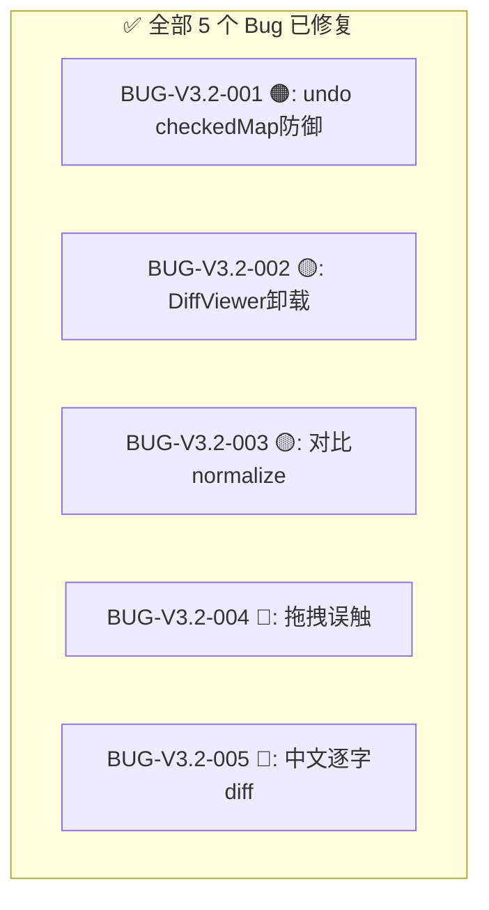

# Text Unifier V3.2.1 回归测试指令

| 项目 | 内容 |
| :--- | :--- |
| **应用名称** | 文档终版确定器（Text Unifier） |
| **版本号** | V3.2.1 |
| **测试阶段** | 发布前回归验证 |

---

## 一、修复状态一览



---

## 二、Phase 0：编译验证

| # | 命令 | 预期 | ✅ |
| :--- | :--- | :--- | :---: |
| C01 | `npx tsc --noEmit` | 零错误 | ☐ |
| C02 | `npm run build` | 成功 | ☐ |
| C03 | `cd native && cargo test` | 零改动 | ✅ |

---

## 三、Phase 1：修复定向回归（15 项）

### BUG-V3.2-001（4 项）

| # | 操作 | 预期 | ✅ |
| :--- | :--- | :--- | :---: |
| R01 | 取消 2 段 → 应用处理 → Ctrl+Z | 勾选状态恢复 | ☐ |
| R02 | 空栈 Ctrl+Z | 不崩溃 | ☐ |
| R03 | 撤回→新操作→不能重做 | 重做按钮禁用 | ☐ |
| R04 | 连续撤回 5 次 | 每次状态正确 | ☐ |

### BUG-V3.2-002（3 项）

| # | 操作 | 预期 | ✅ |
| :--- | :--- | :--- | :---: |
| R05 | 对比模式加载中快速切回合并 | 无 console warning | ☐ |
| R06 | 对比模式正常完成 | 结果正确 | ☐ |
| R07 | 对比中删除文件 | 不报错 | ☐ |

### BUG-V3.2-003（3 项）

| # | 操作 | 预期 | ✅ |
| :--- | :--- | :--- | :---: |
| R08 | 含 BOM 的相同内容文件 | match（绿色） | ☐ |
| R09 | 含多余空格的相同内容文件 | match（绿色） | ☐ |
| R10 | 含控制字符的文件 | 控制字符过滤后 match | ☐ |

### BUG-V3.2-004（1 项）

| # | 操作 | 预期 | ✅ |
| :--- | :--- | :--- | :---: |
| R11 | 轻轻单击芯片 | 不触发排序 | ☐ |

### BUG-V3.2-005（4 项）

| # | 操作 | 预期 | ✅ |
| :--- | :--- | :--- | :---: |
| R12 | `"轻轻地说"` vs `"温柔地说"` 对比 | `轻轻`/`温柔` 标红 | ☐ |
| R13 | `"Hello World"` vs `"Hi World"` 对比 | `Hello`/`Hi` 标红 | ☐ |
| R14 | 完全相同的中文段落 | 无差异标记 | ☐ |
| R15 | 完全不同的英文段落 | 全部标记为差异 | ☐ |

---

## 四、发布判定

```
V3.2.1 发布判定
━━━━━━━━━━━━━━━━━━━━━━━━━━━━━━━━━━━━━━━━━━━━━━━━━━━

Phase 0: C01-C02 ___/2 → [PASS/FAIL]
Phase 1: R01-R15 ___/15 → [PASS/FAIL]

判定:
  [ ] ✅ Phase 1 全部通过 → V3.2.1 RELEASE
  [ ] 🔄 有失败项 → 排查后重测
```

---

## 五、环境准备

```bash
npx tsc --noEmit
npm run build
npm run dev
```
