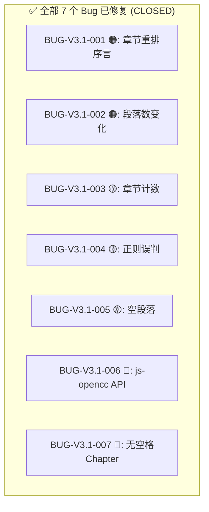

# Text Unifier V3.1.1 回归测试指令（发布验证版）

| 项目 | 内容 |
| :--- | :--- |
| **应用名称** | 文档终版确定器（Text Unifier） |
| **版本号** | V3.1.1 |
| **测试阶段** | 发布前回归验证 |
| **测试日期** | 2026-05-11 |

---

## 一、修复状态一览



---

## 二、Phase 0：编译验证（3 项）

| # | 验证项 | 命令 | 预期 | ✅ |
| :--- | :--- | :--- | :--- | :---: |
| C01 | Rust 测试 | `cd native && cargo test` | **25/25 通过** | ✅ |
| C02 | TypeScript | `npx tsc --noEmit` | **零错误** | ✅ |
| C03 | Vite 构建 | `npm run build` | **成功** | ✅ |

---

## 三、Phase 1：修复定向回归（20 项）

### 3.1 BUG-V3.1-001 回归（5 项）

| # | 步骤 | 操作 | 预期 | ✅ |
| :--- | :--- | :--- | :--- | :---: |
| R01 | 有序言 | 重排 `"序\n第3章\nC\n第1章\nA"` | 序言保留 + 章节升序 | ☐ |
| R02 | 无序言 | 重排 `"第3章\nC\n第1章\nA"` | `"第1章\nA\n第3章\nC"` | ☐ |
| R03 | 无章节 | 重排 `"普通正文"` | 抛 Error | ☐ |
| R04 | 单章节 | 重排 `"第1章\nA"` | 不变 | ☐ |
| R05 | 混合格式 | 重排 `"Chapter5\nE\n第1章\nA"` | 按数字排序 | ☐ |

### 3.2 BUG-V3.1-002 回归（4 项）

| # | 步骤 | 操作 | 预期 | ✅ |
| :--- | :--- | :--- | :--- | :---: |
| R06 | 合并减少 | 智能换行 ON，处理可合并文本 | 段落减少，不崩溃 | ☐ |
| R07 | 拆分增多 | 长段落拆分 ON | 段落增加 | ☐ |
| R08 | 勾选保持 | 取消 2 段 → 合并场景 | 取消段落原文保留 | ☐ |
| R09 | 导出一致性 | 导出合并后文本 | 内容与预览一致 | ☐ |

### 3.3 BUG-V3.1-003 回归（2 项）

| # | 步骤 | 操作 | 预期 | ✅ |
| :--- | :--- | :--- | :--- | :---: |
| R10 | 章节计数 | 含章节文本 → 应用处理 | ChapterPanel 显示正确计数 | ☐ |
| R11 | 章节重排后 | 章节重排后查看计数 | 计数同步更新 | ☐ |

### 3.4 BUG-V3.1-004 回归（3 项）

| # | 步骤 | 操作 | 预期 | ✅ |
| :--- | :--- | :--- | :--- | :---: |
| R12 | 防误判 | `"第五章第三节课程"` isChapterTitle | **false** | ☐ |
| R13 | 正常识别 | `"第1章 开始"` | **true** | ☐ |
| R14 | Chapter 识别 | `"Chapter 5"` | **true** | ☐ |

### 3.5 BUG-V3.1-005 回归（3 项）

| # | 步骤 | 操作 | 预期 | ✅ |
| :--- | :--- | :--- | :--- | :---: |
| R15 | 段间广告 | 垃圾过滤 ON → 应用 | 广告清除，无空段 | ☐ |
| R16 | 多处广告 | 多位置广告 | 全部清除，空行归一 | ☐ |
| R17 | 无广告 | 正常文本 | 不变 | ☐ |

### 3.6 BUG-V3.1-007 回归（3 项）

| # | 步骤 | 操作 | 预期 | ✅ |
| :--- | :--- | :--- | :--- | :---: |
| R18 | Chapter 有空格 | `"Chapter 5"` → extractChapterOrder | `5` | ☐ |
| R19 | Chapter 无空格 | `"Chapter5"` → extractChapterOrder | `5` | ☐ |
| R20 | Chapter 无空格罗马 | `"ChapterV"` → extractChapterOrder | `5` | ☐ |

---

## 四、全回归清单

### 4.1 V3.1 核心功能回归（15 项）

| # | 测试项 | 预期 | ✅ |
| :--- | :--- | :--- | :---: |
| R21 | 繁→简 | `"繁體"` → `"繁体"` | ☐ |
| R22 | 简→繁 | `"简体"` → `"簡體"` | ☐ |
| R23 | 章节识别中文数字 | `"第十二章"` → 序号 12 | ☐ |
| R24 | 章节分割 | `"第1章内容"` → 拆分 | ☐ |
| R25 | 垃圾过滤-怠惰下载器 | 清除 | ☐ |
| R26 | 垃圾过滤-分隔符(5+个=) | 清除 | ☐ |
| R27 | 内容筛选-单关键词 | 含关键词行移除 | ☐ |
| R28 | 内容筛选-长度豁免 | 超阈值行保留 | ☐ |
| R29 | 智能换行(合并) | 硬回车→空格 | ☐ |
| R30 | 段落缩进 | 段首加`\t` | ☐ |
| R31 | 相邻行去重 | 重复行移除 | ☐ |
| R32 | 全流水线一键处理 | 广告清除+章节格式化+缩进 | ☐ |
| R33 | 处理后勾选保持 | 已取消段落不恢复 | ☐ |
| R34 | 还原排版 | 恢复到处理前 | ☐ |
| R35 | 导出 | 保存成功 | ☐ |

### 4.2 V2.0/V3.0 回归（10 项）

| # | 测试项 | 预期 | ✅ |
| :--- | :--- | :--- | :---: |
| R36 | 文件拖拽排序 | 列表重排 | ☐ |
| R37 | 段落勾选取消 | 段落淡化 | ☐ |
| R38 | 全选/取消全选 | 一键操作 | ☐ |
| R39 | Shift 多选 | 批量切换 | ☐ |
| R40 | 重复组三态联动 | 左右同步 | ☐ |
| R41 | SidePanel ≥1400px | 三面板显示 | ☐ |
| R42 | SidePanel <1024px | drawer 模式 | ☐ |
| R43 | 状态栏章节数 | 显示章节数 | ☐ |
| R44 | Rust 测试 | 25/25 通过 | ☐ |
| R45 | TypeScript 检查 | 零错误 | ☐ |

---

## 五、发布判定标准

```
V3.1.1 发布判定
━━━━━━━━━━━━━━━━━━━━━━━━━━━━━━━━━━━━━━━━━━━━━━━━━━━

Phase 1 (20 项):
  R01-R20: ___/20 通过 → [PASS/FAIL]

全回归 (45 项):
  R01-R45: ___/45 通过 → ___%

判定:
  [ ] ✅ Phase 1 全部通过 + 全回归 ≥ 90% → V3.1.1 RELEASE
  [ ] 🔄 Phase 1 失败 → 继续修复
  [ ] ❌ 发现新 P0/P1 → 阻塞发布
```

---

## 六、测试环境

```bash
# 编译检查
cd native && cargo test
npx tsc --noEmit
npm run build
npm run dev
```

---

## 七、报告模板

```markdown
# V3.1.1 回归结果

## Phase 1
- BUG-001: ___/5 → [PASS/FAIL]
- BUG-002: ___/4 → [PASS/FAIL]
- BUG-003: ___/2 → [PASS/FAIL]
- BUG-004: ___/3 → [PASS/FAIL]
- BUG-005: ___/3 → [PASS/FAIL]
- BUG-007: ___/3 → [PASS/FAIL]

## 全回归: ___/45 通过 (___%)

## 判定: [RELEASE/继续修复/阻塞]
```

---

*指令生成日期：2026-05-11*
