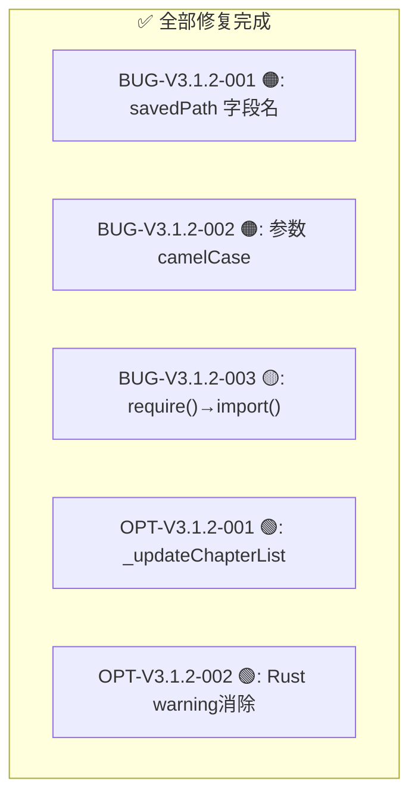

# Text Unifier V3.1.2 回归测试指令

| 项目 | 内容 |
| :--- | :--- |
| **应用名称** | 文档终版确定器（Text Unifier） |
| **版本号** | V3.1.2 |
| **测试阶段** | 发布前回归验证 |
| **测试日期** | 2026-05-11 |

---

## 一、修复状态一览



### 修复影响文件

| 文件 | 涉及的 Bug/优化 |
| :--- | :--- |
| `src/types/index.ts` | BUG-001 |
| `src/components/ExportButton.tsx` | BUG-001 |
| `src/utils/ipc.ts` | BUG-001 |
| `electron/preload.d.ts` | BUG-001 |
| `src/store/useStore.ts` | BUG-002, BUG-003, OPT-001 |
| `native/src/file_processor.rs` | OPT-002 |
| `native/Cargo.toml` | 版本号递增 |

---

## 二、Phase 0：编译验证（3 项）

| # | 验证项 | 命令 | 预期 | ✅ |
| :--- | :--- | :--- | :--- | :---: |
| C01 | Rust 测试 + warning | `cd native && cargo test 2>&1` | **25/25 通过 + 0 warning** | ☐ |
| C02 | TypeScript 类型检查 | `npx tsc --noEmit` | **零错误** | ☐ |
| C03 | Vite 构建 | `npm run build` | **成功** | ☐ |

---

## 三、Phase 1：修复定向回归（15 项）

### 3.1 BUG-V3.1.2-001：savedPath 字段名

| # | 步骤 | 操作 | 预期结果 | ✅ |
| :--- | :--- | :--- | :--- | :---: |
| R01 | 编译检查 | `npx tsc --noEmit` | 无 `saved_path` 相关类型错误 | ☐ |
| R02 | 导出运行 | 导入文件 → 分析完成 → 点击导出 → 选择保存位置 | Toast 显示「导出成功！已保存至: ...」 | ☐ |
| R03 | 运行时返回值 | 导出后 Console 检查返回值 | `{ savedPath: string }` 包含正确路径 | ☐ |
| R04 | preload 类型匹配 | 检查 `electron/preload.d.ts` | `exportFile` 声明 `{ savedPath: string }` | ☐ |

### 3.2 BUG-V3.1.2-002：参数 camelCase

| # | 步骤 | 操作 | 预期结果 | ✅ |
| :--- | :--- | :--- | :--- | :---: |
| R05 | 编译检查 | `npx tsc --noEmit` | 无 `file_name`/`file_size` 相关类型错误 | ☐ |
| R06 | 代码审查 | 检查 `useStore.ts` `setAnalysisResult` | 参数类型 `{ fileName; fileSize; modified }` | ☐ |

### 3.3 BUG-V3.1.2-003：require() → import()

| # | 步骤 | 操作 | 预期结果 | ✅ |
| :--- | :--- | :--- | :--- | :---: |
| R07 | 章节分割 | 含 `"第1章内容"` 文本 → 点击「章节分割」 | 正常执行，无 `require is not defined` 错误 | ☐ |
| R08 | 章节重排 | 含章节文本 → 点击「章节重排」 | 正常执行 | ☐ |
| R09 | 应用处理 | 含章节文本 → 点击「应用处理」 | 正常执行 | ☐ |
| R10 | 多次章节分割 | 连续点击 3 次章节分割 | 每次都正常，首次加载后缓存命中 | ☐ |
| R11 | 编译检查 | `npx tsc --noEmit` | 签名 `() => Promise<void>` 无类型错误 | ☐ |

### 3.4 OPT 回归

| # | 步骤 | 操作 | 预期结果 | ✅ |
| :--- | :--- | :--- | :--- | :---: |
| R12 | Rust 编译 | `cargo clippy` | **零 warning** | ☐ |
| R13 | Rust 测试 | `cargo test` | 25/25 全部通过 | ☐ |
| R14 | _updateChapterList 存在 | 检查 `useStore.ts` 接口 | 有 `_updateChapterList: () => void` | ☐ |
| R15 | 章节列表应用后更新 | 含章节文本 → 应用处理 | chapterList 正确刷新 | ☐ |

---

## 四、全回归清单（25 项）

| # | 模块 | 测试项 | ✅ |
| :--- | :--- | :--- | :---: |
| R16 | 导出 | 正常导出含段落 | ☐ |
| R17 | 导出 | 取消全部段落后导出（按钮禁用） | ☐ |
| R18 | 章节分割 | 无内联章节 → 不变 | ☐ |
| R19 | 章节分割 | 内联章节 → 正确拆分 | ☐ |
| R20 | 章节重排 | 乱序章节 → 升序 | ☐ |
| R21 | 章节重排 | 无章节文本 → Toast 提示 | ☐ |
| R22 | 繁→简转换 | 全流水线 | ☐ |
| R23 | 垃圾过滤 | 全流水线 | ☐ |
| R24 | 智能换行 | 全流水线 | ☐ |
| R25 | 段落缩进 | 全流水线 | ☐ |
| R26 | 相邻行去重 | 全流水线 | ☐ |
| R27 | 处理后勾选保持 | 取消段落后应用处理 | ☐ |
| R28 | 还原排版 | 应用处理→还原 | ☐ |
| R29 | 文件拖拽排序 | 列表重排 | ☐ |
| R30 | 段落勾选取消 | 段落淡化 | ☐ |
| R31 | 全选/取消全选 | 一键操作 | ☐ |
| R32 | Shift 多选 | 批量切换 | ☐ |
| R33 | 重复组三态联动 | 左右同步 | ☐ |
| R34 | SidePanel ≥1400px | 三面板显示 | ☐ |
| R35 | SidePanel <1024px | drawer 模式 | ☐ |
| R36 | 状态栏章节数 | 显示「章节数：N」 | ☐ |
| R37 | Rust cargo test | 25/25 + 0 warning | ☐ |
| R38 | tsc --noEmit | 零错误 | ☐ |
| R39 | npm run build | 成功 | ☐ |
| R40 | 重复导出 3 次 | 每次都正常 | ☐ |

---

## 五、发布判定标准

```
V3.1.2 发布判定
━━━━━━━━━━━━━━━━━━━━━━━━━━━━━━━━━━━━━━━━━━━━━━━━━━━

Phase 0 (3 项):
  C01-C03: ___/3 → [PASS/FAIL]

Phase 1 (15 项):
  R01-R15: ___/15 → [PASS/FAIL]

全回归 (40 项):
  R01-R40: ___/40 通过 → ___%

判定:
  [ ] ✅ 全部通过 → V3.1.2 RELEASE
  [ ] 🔄 Phase 1 失败 → 排查修复
  [ ] ❌ 发现 P0 → 阻塞发布
```

---

## 六、测试环境准备

```bash
# 1. Rust 验证
cd native && cargo clippy && cargo test

# 2. 前端验证
cd .. && npx tsc --noEmit && npm run build

# 3. 运行
npm run dev
```

---

## 七、报告模板

```markdown
# V3.1.2 回归结果

## Phase 0
- C01 cargo test: ___/25 + [0 warning/has warning]
- C02 tsc: [零错误/有错误]
- C03 build: [成功/失败]

## Phase 1
- BUG-001 (R01-R04): ___/4 → [PASS/FAIL]
- BUG-002 (R05-R06): ___/2 → [PASS/FAIL]
- BUG-003 (R07-R11): ___/5 → [PASS/FAIL]
- OPT (R12-R15): ___/4 → [PASS/FAIL]

## 全回归: ___/40 通过 (___%)

## 判定: [RELEASE/继续修复/阻塞]

测试人: __________  日期: __________
```
