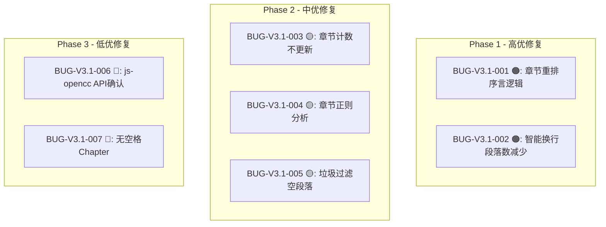

# Text Unifier V3.1 回归测试指令

| 项目 | 内容 |
| :--- | :--- |
| **应用名称** | 文档终版确定器（Text Unifier） |
| **版本号** | V3.1 |
| **测试阶段** | 初测 → 修复 → 回归 |
| **测试日期** | 2026-05-11 |

---

## 一、修复优先级



| 阶段 | Bug ID | 修复难度 | 预计时间 |
| :--- | :--- | :---: | :---: |
| Phase 1 (P1) | BUG-V3.1-001, 002 | 🟡 中 | 2 小时 |
| Phase 2 (P2) | BUG-V3.1-003, 004, 005 | 🟢 低 | 1 小时 |
| Phase 3 (P3) | BUG-V3.1-006, 007 | 🟢 低 | 20 分钟 |

---

## 二、Phase 1 回归：章节重排 + 智能换行

### 2.1 BUG-V3.1-001 修复验证

| 步骤 | 操作 | 预期结果 | ✅ |
| :--- | :--- | :--- | :---: |
| 1 | 构建验证 | `cargo test 25/25` + `tsc --noEmit` 零错误 | ☐ |
| 2 | 准备文本：`"序言内容\n第3章 测试\nC内容\n第1章 开始\nA内容"` | — | ☐ |
| 3 | 调用 `reorderChaptersByTitle(text)` | — | ☐ |
| 4 | 检查结果开头包含 `"序言内容"` | **序言保留在重排结果最前方** | ☐ |
| 5 | 检查章节顺序 | `"第1章 开始"` → `"第3章 测试"`（升序） | ☐ |
| 6 | 无序言文本重排 | `"第3章\n第1章"` → `"第1章\n第3章"` | ☐ |
| 7 | 无章节文本重排 | 抛出 Error `"未识别到有效章节标题"` | ☐ |

### 2.2 BUG-V3.1-002 修复验证

| 步骤 | 操作 | 预期结果 | ✅ |
| :--- | :--- | :--- | :---: |
| 1 | 准备合并后会发生段落数减少的文本 | — | ☐ |
| 2 | 点击「应用处理」（mergeLinesSmart=true） | 排版完成，不崩溃 | ☐ |
| 3 | 检查预览段落数 | 段落数正确，无错位 | ☐ |
| 4 | 检查已取消勾选的段落 | 未勾选段落不受排版影响 | ☐ |
| 5 | 导出文件 | 导出内容与预览一致 | ☐ |

---

## 三、Phase 2 回归：UI 同步 + 过滤

### 3.1 BUG-V3.1-003 修复验证

| 步骤 | 操作 | 预期结果 | ✅ |
| :--- | :--- | :--- | :---: |
| 1 | 导入含章节标题的小说文本 | — | ☐ |
| 2 | 确认章节格式化为 ON | — | ☐ |
| 3 | 点击「应用处理」 | 处理完成 | ☐ |
| 4 | 观察 `ChapterPanel` 中的章节计数 | **显示正确的章节数** | ☐ |
| 5 | 观察状态栏 | 显示「章节数：N」 | ☐ |

### 3.2 BUG-V3.1-005 修复验证

| 步骤 | 操作 | 预期结果 | ✅ |
| :--- | :--- | :--- | :---: |
| 1 | 准备含广告水印的文本：`"正文A\n本文是使用怠惰小说下载器下载的\n正文B"` | — | ☐ |
| 2 | 垃圾过滤=ON，点击「应用处理」 | — | ☐ |
| 3 | 检查预览 | 广告水印行清除，**无多余空行** | ☐ |
| 4 | 检查正文 A 和正文 B 之间 | 段落分隔正常（1 个空行） | ☐ |

---

## 四、全回归清单

### 4.1 V3.1 新增功能回归

| # | 测试项 | 预期 | ✅ |
| :--- | :--- | :--- | :---: |
| R01 | 繁→简 | `"繁體中文"` → `"繁体中文"` | ☐ |
| R02 | 简→繁 | `"简体中文"` → `"簡體中文"` | ☐ |
| R03 | 不变模式 | 原文不修改 | ☐ |
| R04 | 章节识别: 阿拉伯数字 | `"第12章"` 识别 | ☐ |
| R05 | 章节识别: 中文数字 | `"第十二章"` → 序号 12 | ☐ |
| R06 | 章节识别: 英文 | `"Chapter 5"` → 序号 5 | ☐ |
| R07 | 章节识别: 罗马数字 | `"Chapter VIII"` → 序号 8 | ☐ |
| R08 | 章节分割 | `"第1章内容"` → 拆分为标题+内容 | ☐ |
| R09 | 章节重排 | 乱序 → 正序 + 序言保留 | ☐ |
| R10 | 垃圾过滤: 怠惰下载器 | 被清除 | ☐ |
| R11 | 垃圾过滤: 版权声明 | 被清除 | ☐ |
| R12 | 垃圾过滤: 分隔符行(5+个=) | 被清除 | ☐ |
| R13 | 垃圾过滤: 正常内容不误删 | 保留 | ☐ |
| R14 | 内容筛选: 单关键词 | 含关键词行移除 | ☐ |
| R15 | 内容筛选: 长度豁免 | 超阈值行保留 | ☐ |
| R16 | 智能换行: 段落内合并 | 硬回车→空格 | ☐ |
| R17 | 段落缩进 | 段首加 `\t` | ☐ |
| R18 | 相邻行去重 | `["A","A","B"]` → `["A","B"]` | ☐ |
| R19 | 全流水线：广告清除+章节格式化+缩进 | 一键完成 | ☐ |
| R20 | 处理后勾选状态保持 | 已取消段落不恢复 | ☐ |
| R21 | 章节分割独立操作 | 仅分割，不重排 | ☐ |
| R22 | 章节重排独立操作 | 仅重排，不分割 | ☐ |

### 4.2 IPC 回归

| # | 测试项 | 预期 | ✅ |
| :--- | :--- | :--- | :---: |
| R23 | detectEncoding 正常 | 返回 UTF-8 文本 | ☐ |
| R24 | detectEncoding 文件不存在 | 返回错误 | ☐ |
| R25 | scanPreprocessedTexts 正常 | 返回 AnalysisReport | ☐ |
| R26 | scanPreprocessedTexts 空数组 | 返回错误 | ☐ |
| R27 | Rust 单元测试 | 25/25 通过 | ☐ |

### 4.3 V2.0/V3.0 核心回归

| # | 测试项 | 预期 | ✅ |
| :--- | :--- | :--- | :---: |
| R28 | 文件拖拽排序 | 列表重排 | ☐ |
| R29 | 段落勾选-取消 | 段落后淡化 | ☐ |
| R30 | 段落勾选-全选/取消全选 | 一键操作 | ☐ |
| R31 | Shift 多选 | 批量切换 | ☐ |
| R32 | 重复组三态联动 | 左侧↔右侧同步 | ☐ |
| R33 | 还原排版 | 恢复到处理前 | ☐ |
| R34 | 导出文件 | 保存成功 | ☐ |
| R35 | SidePanel ≥1400px 布局 | 显示三面板 | ☐ |
| R36 | SidePanel <1024px 布局 | 悬浮按钮+drawer | ☐ |
| R37 | 状态栏章节数 | 显示「章节数：N」 | ☐ |

---

## 五、发布判定标准

```
V3.1 发布判定矩阵
━━━━━━━━━━━━━━━━━━━━━━━━━━━━━━━━━━━━━━━━━━━━━━━━━━━

Phase 1 修复后:
  BUG-V3.1-001 已验证       → [PASS/FAIL]
  BUG-V3.1-002 已验证       → [PASS/FAIL]
  全回归 R01-R37: ___/37 通过 → ___%

判定:
  [ ] ✅ 全部通过 → V3.1 RELEASE
  [ ] 🔄 Phase 1 失败 → 继续修复
  [ ] ❌ P0 发现 → 阻塞发布

    推荐标准:
    - Phase 1: 100% PASS
    - 全回归: ≥ 90% 且无 P0/P1 失败
    - Rust 测试: 25/25
    - TypeScript: 零错误
```

---

## 六、测试环境准备

```bash
# 1. 运行 Rust 测试
cd native && cargo test

# 2. 类型检查
cd .. && npx tsc --noEmit

# 3. 构建
npm run build

# 4. 启动 Electron
npm run dev
```

---

## 七、回归测试报告模板

```markdown
# V3.1 回归测试结果

## Phase 1 验证
- BUG-V3.1-001: ___/7 步骤通过 → [PASS/FAIL]
- BUG-V3.1-002: ___/5 步骤通过 → [PASS/FAIL]

## Phase 2 验证
- BUG-V3.1-003: ___/5 步骤通过 → [PASS/FAIL]
- BUG-V3.1-005: ___/4 步骤通过 → [PASS/FAIL]

## 全回归
- V3.1 新增 (R01-R22): ___/22 通过
- IPC 回归 (R23-R27): ___/5 通过
- V2.0/V3.0 回归 (R28-R37): ___/10 通过
- 全回归总计: ___/37 通过 (___%)

## 新发现 Bug
- 数量: ___ 个
- P0/P1: ___ 个

## 最终判定
- [ ] ✅ V3.1 RELEASE
- [ ] 🔄 需要修复
- [ ] ❌ 阻塞发布

测试人: __________  日期: __________
```

---

*指令生成日期：2026-05-11*
*关联文档：01_全维度测试用例_V3.1.md / 02_Bug报告_V3.1.md / 03_初测测试报告_V3.1.md*
