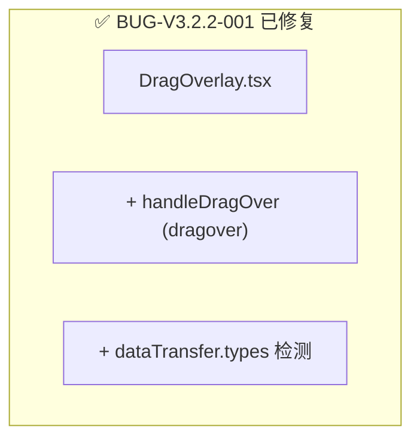

# Text Unifier V3.2.2 回归测试指令

| 项目 | 内容 |
| :--- | :--- |
| **应用名称** | 文档终版确定器（Text Unifier） |
| **版本号** | V3.2.2 |
| **测试阶段** | 发布前回归验证 |

---

## 一、修复状态



### 修复影响文件

| 文件 | 变更 |
| :--- | :--- |
| `src/components/DragOverlay.tsx` | +`handleDragOver`、`dragover` 监听、`dataTransfer.types` 检测 |
| `src/App.tsx` | 版本号 v3.2.1 → v3.2.2 |

---

## 二、Phase 0：编译验证

| # | 命令 | 预期 | ✅ |
| :--- | :--- | :--- | :---: |
| C01 | `npx tsc --noEmit` | 零错误 | ☐ |
| C02 | `npm run build` | 成功 | ☐ |

---

## 三、Phase 1：定向回归（10 项）

### BUG-V3.2.2-001 验证

| # | 操作 | 预期 | ✅ |
| :--- | :--- | :--- | :---: |
| R01 | 从资源管理器拖拽 1 个 .txt 到窗口 | 遮罩显示 → 松开后文件加载分析完成 | ☐ |
| R02 | 同时拖拽 3 个 .txt | 3 个文件全部加载 | ☐ |
| R03 | 拖拽 .exe 文件 | 遮罩变红提示「仅支持 .txt」 | ☐ |
| R04 | 混合拖入（2 .txt + 1 .exe） | 仅 .txt 加载 | ☐ |
| R05 | 拖入后拖出窗口 | 遮罩消失，无文件加载 | ☐ |
| R06 | 从浏览器拖入选中文本 | 遮罩不出现（`dataTransfer.types` 过滤） | ☐ |
| R07 | 快速连续拖入拖出 | 遮罩稳定不闪烁 | ☐ |
| R08 | 已有分析结果后拖入新文件 | 旧结果覆盖重新分析 | ☐ |
| R09 | 拖入大文件（50MB） | 正常 loading+分析 | ☐ |
| R10 | 拖入+点击按钮混合操作 | 两种方式都正常 | ☐ |

---

## 四、全回归清单（20 项）

| # | 模块 | 测试项 | ✅ |
| :--- | :--- | :--- | :---: |
| R11 | 芯片栏 | 添加文件、芯片展示 | ☐ |
| R12 | 芯片栏 | 横向拖拽排序 | ☐ |
| R13 | 芯片栏 | 删除文件 | ☐ |
| R14 | 上传按钮 | 点击选择文件 | ☐ |
| R15 | 预览编辑 | 编辑文字+保存 | ☐ |
| R16 | 撤回 | Ctrl+Z/Y 正常 | ☐ |
| R17 | 撤回 | 撤回恢复勾选状态 | ☐ |
| R18 | 对比模式 | LCS 对齐+颜色标记 | ☐ |
| R19 | 对比模式 | 同步滚动+统计 | ☐ |
| R20 | V3.1 核心 | 繁简转换/章节/过滤 | ☐ |
| R21 | V2.0 核心 | 段落勾选/Shift多选 | ☐ |
| R22 | 导出 | 导出成功 | ☐ |
| R23 | tsc 检查 | 零错误 | ☐ |
| R24 | build 检查 | 构建成功 | ☐ |

---

## 五、发布判定

```
V3.2.2 发布判定
━━━━━━━━━━━━━━━━━━━━━━━━━━━━━━━━━━━━━━━━━━━━━━━━━━━

Phase 0: C01-C02 ___/2 → [PASS/FAIL]
Phase 1: R01-R10 ___/10 → [PASS/FAIL]
全回归:  R11-R24 ___/14 → [PASS/FAIL]

判定:
  [ ] ✅ Phase 1 全部通过 → V3.2.2 RELEASE
  [ ] 🔄 Phase 1 失败 → 排查修复
```

---

## 六、环境准备

```bash
npx tsc --noEmit
npm run build
npm run dev
```
