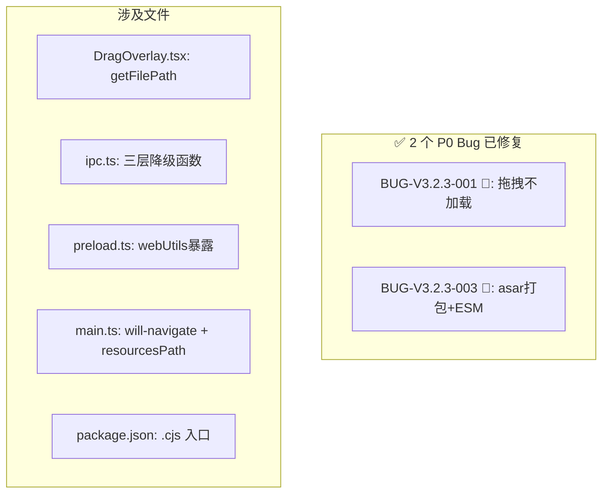

# Text Unifier V3.2.3 回归测试指令

| 项目 | 内容 |
| :--- | :--- |
| **应用名称** | 文档终版确定器（Text Unifier） |
| **版本号** | V3.2.3 |
| **测试阶段** | 发布前回归验证 |

---

## 一、修复状态一览



---

## 二、Phase 0：编译验证

| # | 命令 | 预期 | ✅ |
| :--- | :--- | :--- | :---: |
| C01 | `npx tsc --noEmit` | 零错误 | ☐ |
| C02 | `npm run build` | 成功，dist-electron 含 .cjs | ☐ |
| C03 | `cd native && cargo test` | 25/25（零改动） | ✅ |

---

## 三、Phase 1：拖拽功能定向回归（10 项）

| # | 操作 | 预期 | ✅ |
| :--- | :--- | :--- | :---: |
| R01 | 从资源管理器拖入 1 个 .txt | 遮罩显示 → 松开 → 文件加载到芯片栏 → 自动分析 | ☐ |
| R02 | 同时拖入 5 个 .txt | 全部加载，芯片栏显示 5 个芯片 | ☐ |
| R03 | 拖入非 .txt（.exe） | 遮罩变红提示，文件不加载 | ☐ |
| R04 | 混合拖入（2 .txt + 1 .exe） | 仅 .txt 加载 | ☐ |
| R05 | 拖入→拖出（取消） | 遮罩消失，无文件加载 | ☐ |
| R06 | 从浏览器拖入选中的文本（非文件） | 遮罩不出现 | ☐ |
| R07 | 已有分析结果后拖入新文件 | 旧结果重置，重新分析 | ☐ |
| R08 | 拖入大文件（50MB） | 遮罩→loading→分析完成 | ☐ |
| R09 | 快速连续拖入拖出 | 遮罩稳定不闪烁 | ☐ |
| R10 | 从桌面、文件夹分别拖入测试 | 不同来源路径正确解析 | ☐ |

---

## 四、Phase 2：构建部署回归（7 项）

| # | 操作 | 预期 | ✅ |
| :--- | :--- | :--- | :---: |
| R11 | `npx tsc --noEmit` | 零错误 | ☐ |
| R12 | `npm run build` | 前端构建成功，`dist-electron/*.cjs` 生成 | ☐ |
| R13 | 检查 `dist-electron/main.cjs` | 使用 `process.resourcesPath` 加载 native | ☐ |
| R14 | 检查 `dist-electron/preload.cjs` | 存在且在 main.cjs 中正确引用 | ☐ |
| R15 | 检查 `scripts/rename-electron-output.cjs` | 存在且打包脚本引用正确 | ☐ |
| R16 | electron-builder 打包 | 打包成功无错误 | ☐ |
| R17 | 便携版安装并首次启动 | 启动正常，无 crash | ☐ |

---

## 五、UX 改进回归（6 项）

| # | 模块 | 测试项 | ✅ |
| :--- | :--- | :--- | :---: |
| R18 | 芯片栏-文件名悬停 | 长文件名截断后悬停显示完整名 | ☐ |
| R19 | 芯片栏-文件名悬停 | 短文件名无截断时 title 正常 | ☐ |
| R20 | 对比模式-左栏 | leftOnly=红底+文本, rightOnly=空白 | ☐ |
| R21 | 对比模式-右栏 | rightOnly=蓝底+文本, leftOnly=空白 | ☐ |
| R22 | 对比模式-双栏 | match=双绿, diff=双灰 | ☐ |
| R23 | 对比模式-对齐 | 行号精确对齐，颜色不串栏 | ☐ |

## 六、全回归清单（15 项）

> 注意：UX 改进回归（R18-R23）已在「五、UX 改进回归」中列出，此处为其余全回归项。

| # | 模块 | 测试项 | ✅ |
| :--- | :--- | :--- | :---: |
| R24 | 上传按钮 | 点击选择 .txt 正常 | ☐ |
| R25 | 芯片栏 | 拖拽排序、主文件标记 | ☐ |
| R26 | 预览编辑 | 编辑 + Ctrl+Z/Y 撤回 | ☐ |
| R27 | 撤回栈 | 勾选状态随撤回恢复 | ☐ |
| R28 | 对比模式 | LCS 对齐 + 颜色(含双栏) + 同步滚动 | ☐ |
| R29 | 对比模式 | 中文逐字 diff | ☐ |
| R30 | V3.1 核心 | 繁简转换 | ☐ |
| R31 | V3.1 核心 | 章节格式化/重排 | ☐ |
| R32 | V3.1 核心 | 垃圾过滤/内容筛选 | ☐ |
| R33 | V2.0 核心 | 段落勾选/全选/Shift多选 | ☐ |
| R34 | V2.0 核心 | 三态联动/导出 | ☐ |
| R35 | Rust 测试 | `cargo test` 25/25 | ☐ |
| R36 | TS 检查 | `tsc --noEmit` 零错误 | ☐ |
| R37 | 前端构建 | `npm run build` 成功 | ☐ |
| R38 | 完整操作链路 | 拖入→分析→勾选→处理→编辑→撤回→导出 | ☐ |

---

## 七、发布判定

```
V3.2.3 发布判定
━━━━━━━━━━━━━━━━━━━━━━━━━━━━━━━━━━━━━━━━━━━━━━━━━━━

Phase 0: C01-C02 ___/2 → [PASS/FAIL]
Phase 1: R01-R10 ___/10 → [PASS/FAIL]
Phase 2: R11-R17 ___/7 → [PASS/FAIL]
UX:      R18-R23 ___/6 → [PASS/FAIL]
全回归:  R24-R38 ___/15 → [PASS/FAIL]

判定:
  [ ] ✅ Phase 1 + Phase 2 + UX 全部通过 → V3.2.3 RELEASE
  [ ] 🔄 有失败项 → 排查后重测
```

---

## 八、环境准备

```bash
# 编译验证
npx tsc --noEmit
npm run build

# 开发模式测试拖拽
npm run dev

# Rust 验证
cd native && cargo test
```
