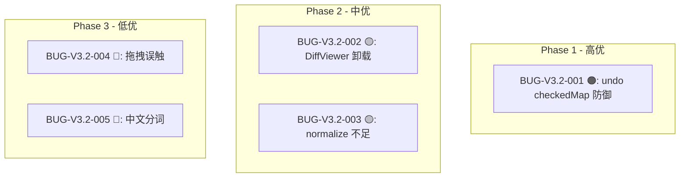

# Text Unifier V3.2 回归测试指令

| 项目 | 内容 |
| :--- | :--- |
| **应用名称** | 文档终版确定器（Text Unifier） |
| **版本号** | V3.2 |
| **测试阶段** | 发布前回归验证 |

---

## 一、修复优先级



| 阶段 | 预计时间 |
| :--- | :---: |
| Phase 1 (BUG-001) | ~10 分钟 |
| Phase 2 (BUG-002+003) | ~1 小时 |
| Phase 3 (BUG-004+005) | ~30 分钟 |

---

## 二、Phase 0：编译验证

| # | 命令 | 预期 | ✅ |
| :--- | :--- | :--- | :---: |
| C01 | `cargo test` | 零改动 | ✅ |
| C02 | `npx tsc --noEmit` | 零错误 | ☐ |
| C03 | `npm run build` | 成功 | ☐ |

---

## 三、Phase 1：修复定向回归（7 项）

### BUG-V3.2-001 验证

| # | 操作 | 预期 | ✅ |
| :--- | :--- | :--- | :---: |
| R01 | 导入文件分析完成 | — | ☐ |
| R02 | 点击「应用处理」 | 自动入栈 | ☐ |
| R03 | 切换段落勾选 | 自动入栈 | ☐ |
| R04 | Ctrl+Z 撤回 2 次 | 预览和勾选状态都恢复 | ☐ |
| R05 | Ctrl+Y 重做 | 恢复正常 | ☐ |
| R06 | 连续操作 6 次后检查栈深度 | ≤5 步 | ☐ |
| R07 | 撤回栈为空时 Ctrl+Z | 不崩溃，无变化 | ☐ |

### BUG-V3.2-002 验证

| # | 操作 | 预期 | ✅ |
| :--- | :--- | :--- | :---: |
| R08 | 对比模式加载时快速切回合并 | 无 console warning | ☐ |
| R09 | 对比模式正常加载完成 | 对比结果显示正常 | ☐ |

### BUG-V3.2-003 验证

| # | 操作 | 预期 | ✅ |
| :--- | :--- | :--- | :---: |
| R10 | 准备 2 个文件，内容相同但含 `\t` 差异 | 相同段落正确 match（绿色） | ☐ |

### BUG-V3.2-004 验证

| # | 操作 | 预期 | ✅ |
| :--- | :--- | :--- | :---: |
| R11 | 2 个芯片，轻轻单击（非拖拽） | 不触发拖拽排序 | ☐ |

---

## 四、全回归清单

### 4.1 V3.2 核心功能（22 项）

| # | 模块 | 测试项 | ✅ |
| :--- | :--- | :--- | :---: |
| R12 | 芯片栏 | 添加 5 个文件，全部以芯片展示 | ☐ |
| R13 | 芯片栏 | 拖拽排序 → 主文件更新 → 触发重分析 | ☐ |
| R14 | 芯片栏 | 删除中间文件 → 列表更新 | ☐ |
| R15 | 拖拽遮罩 | 拖入 .txt → 蓝遮罩 → 松开触发分析 | ☐ |
| R16 | 拖拽遮罩 | 拖入 .txt+.exe → 红遮罩 | ☐ |
| R17 | 编辑 | 点击编辑 → 修改文字 → 保存 | ☐ |
| R18 | 编辑 | Ctrl+Z 撤回编辑 | ☐ |
| R19 | 撤回 | 应用处理入栈 | ☐ |
| R20 | 撤回 | 勾切入栈 | ☐ |
| R21 | 溯源 | 悬停段落显示 Tooltip 来源 | ☐ |
| R22 | 对比 | 「文档对比」Tab 切换正常 | ☐ |
| R23 | 对比 | 2 文件段落对齐 | ☐ |
| R24 | 对比 | 相同绿色、左红右蓝、差异灰色 | ☐ |
| R25 | 对比 | 同步滚动 | ☐ |
| R26 | 对比 | 统计信息正确 | ☐ |
| R27 | 对比 | 3 文件提示 | ☐ |

### 4.2 V3.1/V3.0 回归（8 项）

| # | 模块 | 测试项 | ✅ |
| :--- | :--- | :--- | :---: |
| R28 | 繁简转换 | 全流水线正常 | ☐ |
| R29 | 章节格式化 | 全流水线正常 | ☐ |
| R30 | 章节重排 | 全流水线正常 | ☐ |
| R31 | 垃圾过滤 | 全流水线正常 | ☐ |
| R32 | 内容筛选 | 全流水线正常 | ☐ |
| R33 | 段落勾选 | 取消/恢复/Shift多选 | ☐ |
| R34 | 导出 | 导出成功 | ☐ |
| R35 | 类型检查 | tsc --noEmit 零错误 | ☐ |

---

## 五、发布判定

```
V3.2 发布判定
━━━━━━━━━━━━━━━━━━━━━━━━━━━━━━━━━━━━━━━━━━━━━━━━━━━

Phase 0: C01-C03 ___/3 → [PASS/FAIL]
Phase 1: R01-R11 ___/11 → [PASS/FAIL]
全回归:  R12-R35 ___/24 → [PASS/FAIL]

判定:
  [ ] ✅ Phase 1 全部通过 → V3.2 RELEASE
  [ ] 🔄 Phase 1 失败 → 修复后重测
  [ ] ❌ P0 出现 → 阻塞发布
```

---

## 六、环境准备

```bash
cd native && cargo test
npx tsc --noEmit
npm run build
npm run dev
```
